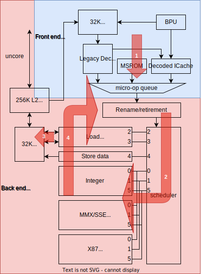

2023.12.01

# A Top-Down Method for Performance Analysis and Counters Architecture

## Introduction

> Modern processors expose hundreds of performance events,
> any of which may or may not relate to the bottlenecks of a particular workload.

Q: [TODO]有没有什么方法/工具能利用起所有的performance events？

## Background

Ivy Bridge的微架构图很有意思，重画了一遍：

## Top-Down Analysis

### Top Level breakdown

这是咋分类的？
没看懂它的分类依据啊！

## Counter Architecture

如何判断性能计数器的开销高低？
文章没有详细说，只是给了几个开销高的引用。

> low-cost hardware

> Neither at-retirement tagging is required as in IBM POWER [6],
> nor complex structures with latency counters as in Accurate CPI Stacks proposals[1][8][9].

## Results

### Case Study 1: Matrix-Multiply

multiply2 => multiply3性能提升，IPC下降。
这反映出IPC或是占比并不是评价性能的唯一指标。
看绝对时间，或者看各部分的耗时、而不是占比。
