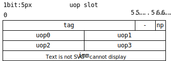
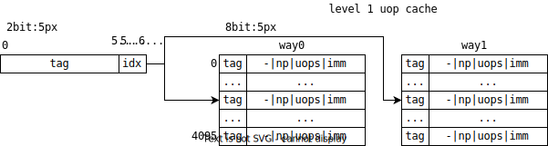
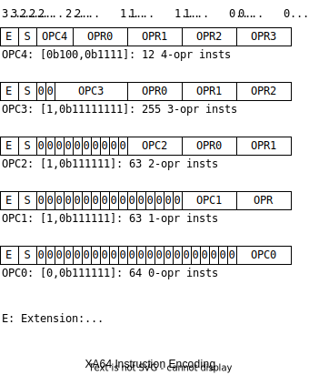

# XA64 MANUAL

## Uop slot



* v: 1 bit: valid
* un: 3 bits: uops number
* npc: 4 bits: next pc offset
* uop4/5 overrlap with iimm

## Ucache

### L1 uache

Granularity: entry (1B in macroop addr)

2-way associated 4K entries, size=`2*4K*32B`=256KB

Able to hold 2 pages (8KB) inst's microops at most.



### L2 ucache

Granularity: entry (1B in macroop addr)

4-way associated 64K entries, size=`4*64K*32B`=8MB

64 pages

### ucache memory area

Granularity: one macroop page

256MB

2048 macroop pages

### ucahce controller

(inspired by CAM)

TODO:

64-way associated 32 entries, to index 2048 macroop pages.

## Mnemonic

```
<op>.<ext> <dst> <src0> <src1>
```

## Encoding

### Operand Extension

One instruction contains one 5-bit field,
representing the operand extension and size.

* Extension (2 bits)
  * Zero
  * Signed
  * Merge (without modification other bits)

### Operand Size

2 bits

* 8 bits: Short
* 16 bits: Word
* 32 bits: Double word
* 64 bits: Quadruple word

### arithmetic flags

There is bit in encoding,
presenting whether arithmetic flags need to be calculated. 

### general registers

6 bits

* 1 bit: 0 low, 1 high
* 5 bits: index to 32 general registers

### Immediate

Immediate is saved along with uops in uop slot.

Immediate is access by 6-bit field

* 1 bit: 0 direct, 1 indirect
* 1 bit: sign
* 4 bits: indirect

  ```
  [0b0000]:          reserved
  [0b0001]:          1 64-bit imm
  [0b0010, 0b0011]: 2 32-bit imm
  [0b0100, 0b0111]: 4 16-bit imm
  [0b1000, 0b1111]: 8  8-bit imm
  ```

### Instructions List

direct immediate
indirect immediate



`0x00000000` is invalid instruction.

TODO:

* pc related insts

#### 4

mul2
mul2_f
mul2_i
mul2_if
shliadd

#### 3

add
add_f
add_i
add_if
adc
adc_f
adc_i
adc_if
ld
ld_i
and
and_f
and_i
and_if
rotl
rotl_f # TODO: flags
rotli
rotli_f
rotr
rotr_f
rotri
rotri_f
shl
shl_f
shli
shli_f
shr
shr_f
shri
shri_f
mul
mul_f
mul_i
mul_if
or
or_f
or_i
or_if
st
sar
sar_f
sar_i
sar_if
sub
sub_f
sub_i
sub_if
sbb
sbb_f
sbb_i
sbb_if
xor
xor_f
xor_i
xor_if
shl2
shl2_f # TODO: flags
shl2_i
shl2_if # TODO: flags
cmpxchg
cmpxchg_f # TODO: flags

#### 2

bswap
clz
clz_f # TODO: flags
ctz
ctz_f # TODO: flags
mov
mov_i
neg
neg_f # TODO: flags
not
not_f # TODO: flags
ld
st

#### 1

#### 0

invalid
nop
