**以下的讨论若无说明均是QEMU用户态**

**结论**：用户态的memory_regions不是系统态的那个数据结构`memory_regions`，仅仅就是一个名字而已。

2020.07.31

这个QnA来源于一个奇怪的bug：

qemu给wine的某个lib.so分配内存时发现4G空间里都没有连续的可以容纳这个lib.so的空间。而涉及遍历打印页标志位的函数`walk_memory_regions`配合`dump_region`和memory相关。我十分好奇在简单的用户态模拟中guest内存就是加guest_base即可，那memory region存在的意义是啥？

## QEMU用户态有guest_base，那memory region存在的意义

**猜测**：32位qemu可能就没办法简单的用guest_base解决32位guest内存的问题？

2020.08.03

## `walk_memory_regions`是如何遍历guest内存的

`walk_memory_regions`的代码框架图如下，

整个便利算法围绕这`l1_map`这个变量，应该是对应guest的页表，`v_l1_xxx`和`v_l2_xxx`的`v`大概就是virtual的简写，表示虚拟页表。这几个数据结构的关系如下图，

如此看来这个算法十分简单，就是**遍历一个x86里32位页表里所有的页。对每个页执行一下`fn`操作。**目前为止还没看到`memory_regions`直接相关的数据结构，猜测可能在`fn`即`dump_region`函数里，因为这个函数的参数是单纯的x86虚地址（GVA），所以将x86虚地址（GVA）转换成（HVA）的过程应该会在该函数中实现，即`memory_regions`直接相关的数据结构应该会在该函数中使用到。所以接下来来看`dump_region`函数。

### dump_region如何将GVA转换为HVA

讲道理用户态里`HVA = GVA + guest_base`，也就是[QEMU用户态有guest_base，那memory region存在的意义](#QEMU用户态有guest_base，那memory region存在的意义)疑问的来源。

`dump_region`并没将GVA转为HVA。它所需的信息都来自调用者查询到的PageDesc。这样看来qemu用户态并没有去用memory_regions的数据结构？只是名字相同是个巧合？

### 用户态QEMU什么时候申请页什么时候回收页

#### Linux什么时候申请页什么时候回收页