标记：<span style="background:red; font-weight:bold; color:white">架构相关</span>，<span style="background:green; font-weight:bold; color:white">架构无关</span>


<div style="font-size:3em; text-align:right;">2019.11.12</div>
上周四组会明确指出目前的工程方向是以QEMU的用户级模拟（linux-user）基础，去除其生成中间的过程，像X86toMips一样直接从X86到Mips。在我看来要完成这个工作，首先要熟悉QEMU linux-user的代码框架，然后才能分析如何去简化QEMU的翻译过程。所以首先去厘清QEMU linux-user的代码吧。8月份有做简单的调研，见[logs.md](logs.md)，可以供自己参考。

# 读代码前的准备

用clion打开之前用compiledb处理好的qemu，发现`i386/cpu_loop.c`里有未能找到定义而提示错误的函数，且git fetch发现已经落后了200+个commits，所以想清除掉之前make install的内容。

## 清除之前的make insall

苦于qemu的Makefile没有提供make uninstall之类的，所以找到了stack overflow的一个问答[What's the opposite of 'make install', i.e. how do you uninstall a library in Linux?](https://stackoverflow.com/questions/1439950/whats-the-opposite-of-make-install-i-e-how-do-you-uninstall-a-library-in-li)，给出了**补救方案**和**预防方案**来卸载作者没有给出make uninstall选项的源代码。

我选择放弃~~**补救方案**，`make -n install`，打印出install执行的步骤，然后手工删掉安装的文件即可。尝试这个方法发现显示出来的不全啊，Makefile里install的语句一大堆，这个方法暂时放弃了，以后注意预防这个make install问题好了。~~下面有人评论说，这样太繁琐，这正是<span style="font-size:1.5em;font-weight:bold;">包管理器</span>被发明出来的原因，所以需要一个良好的**预防方案**，<span style="font-size:1.5em;font-weight:bold;">checkinstall</span>，

```shell
sudo apt install checkinstall
# 每次就不要用make install了，而是sudo checkinstall
# 这个回答还提到了可以用这个方法来删除用make install安装的包，那就不管咯，感觉我以后的安装应该是会覆盖的之前的，之后就用包管理器吧！
```

下面的评论有提到，最高票的答案不一定是最好的答案啊！我表示十分赞同！

## 更新QEMU

**我使用的是4.1.0版本**。是直接参考[logs.md](logs.md)即可，不需要建build目录在根目录下搞即可，不赘述。（中间遇到了SRC_PATH和BUILD_DIR not found的问题，我直接无视了，好像行的通？）之前存在的clion里`i386/cpu_loop.c`里有未能找到定义而提示错误的函数还是一样。ლ(╹◡╹ლ)

# 代码框架

<div style="font-size:3em; text-align:right;">2019.11.13</div>
## `cpu_loop`

做完了`cpu_loop`的代码框架图，回去对照[logs.md](logs.md)里的结构图（贴在下面了），我才发现之前的自己已经把linux-user的大体框架搞清楚了的。


`cpu_loop`（i386）的代码框架图<span style="background:red; font-weight:bold; color:white">架构相关</span>，


所以现在我要做的事很清楚了，**弄清细节**，尤其是QEMU哪些部分是架构相关的，哪些部分是架构无关的，这对理解处理器设计的共性很有帮助！

<div style="font-size:3em; text-align:right;">2019.11.18</div>
# 系统调用

## `do_syscall`

由[代码框架](#代码框架)可知函数`abi_long do_syscall`来处理系统调用。QEMU将这个函数放置在`linux-user/syscall.c`中可见QEMU希望对系统调用的处理是<span style="background:green; font-weight:bold; color:white">架构无关</span>的，`do_syscall`框架图如下，


所以接下来需要搞清楚的问题很明显了，需要知道这些switch case里是如何处理系统调用的，有两种可能，

1. 翻译成TCG执行（这样的话，要变成x86tomips的框架就有点麻烦了）；
2. QEMU解释执行（这样的话，直接把do_syscall的接口对齐x86tomips里的translate_int的接口就好了）。

## 如何修改x86-qemu-mips的系统调用的思考

**太长不看**：我决定选用QEMU对系统调用的处理方法（`cpu_exec`遇到中断则返回处理中断），放弃X86toMips对系统调用的处理方法（`translate_int`）。

目前版本的x86-qemu-mips（git SHA1 ID: fff3667068ff762899fbe6f63723c56d456b0c44）既有QEMU的那一套处理系统调用的方法，也有X86toMips那一套系统调用的方法。这两套处理方法如下（目前版本实际使用的X86toMips的系统调用的处理代码，QEMU的系统调用处理代码是“死代码”），

* **X86toMips处理系统调用的方法**

  **太长不看**：X86toMips是将“解释执行嵌在了动态翻译里”。

  动态翻译时（`-t`选项）X86toMips是通过`translate_int`函数来处理系统调用，流程大致如下：

  * 先在TB里插入保存上下文的语句（保存寄存器和返回地址）；
  * 然后在TB里插入一条跳转指令，这条跳转指令会跳到X86toMips提供的函数`interpret_int`里，位于`syscall/sc_syscall.cpp: 806~813`，完成解释执行系统调用的工作；
  * 最后在TB里插入还原上下文的语句。

  需要回顾X86toMips对系统调用的处理代码的分析，需要区分**静态翻译**，**动态翻译**，**解释执行**可以参考[X86toMips调研.md](../X86toMips/X86toMips调研.md)中的“X86toMips对系统调用的处理”。

* **QEMU处理系统调用的方法**

  **太长不看**：纯粹的解释执行。

  上上面的`cpu_loop`的框架图可以看出当`cpu_exec`执行TB时遇到了中断指令的话就会返回中断号，然后后续代码来处理中断，若中断号是`0x80`则会调用`do_syscall`。上面的`do_syscall`的代码框架图里巨大的switch case就是QEMU解释执行系统的地方。目前之研究了write的case，看来是纯的解释执行。所以可以大胆的猜想QEMU的对系统调用是纯粹的解释执行，即完全不会涉及TCG也不会涉及TB。这个猜想可以由实验来验证或者打破。

我自己更倾向于采用QEMU处理系统调用的方法。因为毕竟QEMU是一个比X86toMips拓展性更强的翻译框架，所以我担心QEMU会切换程序内存空间或者翻译程序和执行TB的程序是俩不同的进程，那么X86toMips的处理方式就会出现根本不在同一地址空间无法寻址无法跳转的问题了。

且，我们现在要做的是动态翻译，还不需要考虑静态翻译，所以要如何把解释执行的代码合理地“打包”进TB现在还不用考虑。

<div style="font-size:3em; text-align:right;">2019.11.19</div>
## 研读QEMU的系统调用的处理方法

目前看来是要搞清楚`cpu_loop.c: 94 trapnr = cpu_exec(cs)`这个函数。

### `cpu_exec`

`cpu_exec`这个函数的代码框架图如下，<span style="background:green; font-weight:bold; color:white">架构无关</span>


✔️🤔<span style="color:red;">cflags的含义？</span>**答**：通过grep`CF_INVALID`找到了cflags的定义和其相关宏数值定义在`include/exec/exec-all.h: 350~361`，`cflags`是compiler flags的简写，是`TranslationBlock`结构的成员变量。有空时可以把`TranslationBlock`结构研究研究。

<div style="font-size:3em; text-align:right;">2019.11.20</div>
在我的x86电脑上测试了一下QEMU的这一段代码，用GDB发现了与预期的不太一样的控制流变化。本来期待QEMU遇到系统调用（特殊的interrupt）时cpu_tb_exec返回的额外信息是TB_EXIT_REQUESTED，然后回到第一层循环执行`cpu_handle_excption`函数。**然而**事实是`cpu_tb_exec`还没正常退出，控制流就如上图<span style="font-size:1.5em;font-weight:bold;color:red;">红线</span>所示，**出乎意料地跳**到被我忽略的代码里去了，如下，

```c
if (sigsetjmp(cpu->jmp_env, 0) != 0) {
```

<span style="font-weight:bold; color:red;">✔️🤔猜想是QEMU在翻译TB时遇到中断指令就会在翻译的指令里“埋”入一条setjmp的指令。接下来就想办法搞清楚这个意想不到的控制流跳转吧！</span>**答**：是间接地“埋入”了`longjmp`函数。将系统调用翻译成TCG时QEMU埋入`helper_raise_exception`函数，这个会调用`longjmp`函数，跳转到`qemu/accel/tcg/cpu-exec.c: 689`，即所谓的“出乎意料”的跳转。

<div style="font-size:3em; text-align:right;">2019.11.22</div>
猜测`tb_find`若发现tb没有翻译，则会进行翻译，所以在此去详细看看`tb_find`函数，

### `tb_find`

<span style="background:green; font-weight:bold; color:white">架构无关</span>

上面的代码反映出两个**TB的特性**：

#### TB的两个特性：jmp-TB查找表，TB chain

1. 存在**jmp地址-TB地址查找表**，存在`CPUState`的`tb_jmp_cache`里；

2. **TB之间的连接关系**（TB chain）由`TranslationBlock`的`jmp_list_head`、`jmp_list_next`和`jmp_dest`实现，见`include/exec/exec-all.h：386~402`注释，下面为精炼的注释传达的信息，

   1. ```c
      uintptr_t jmp_list_head; // incoming jumps
      ```
      
   2. ```c
      uintptr_t jmp_list_next[2]; // two sibling TB lists // 通过看accel/tcg/cpu-exec.c: 381 行tb_add_jump的语句tb->jmp_list_next[n] = tb_next->jmp_list_head;可以知道jmp_list_next里存的是**后继TB的jmp_list_head**，因为最多可能有2个后继TB，所以这里这个链表数组大小为2.
      ```
   
   3. ```c
      uintptr_t jmp_dest[2]; // destination TB of each outgoing jump, tagged pointers, The LSB is set when the TB is being invalidated // 因为地址是4字节对齐，所以最低两位可以保存额外信息，若最低位（LSB）为1则表示TB无效。
      ```

**注**：在bing里搜索qemu translation block相关资料时发现了2009年的[QEMU internals](https://lugatgt.org/content/qemu_internals/downloads/slides.pdf)（看了一下QEMU的git仓库2009年大概是0.11或0.10版本的QEMU）讲述了QEMU的总体设计框架，其中有讲到Basic block chaining，虽然版本久远但有可以帮助理解现在版本的QEMU，将一张QEMU执行TB框架图放在下面，


#### TB的两个特性[结束]

回到主题上来，由`tb_find`的代码框架图可知确实是`tb_find`若发现tb没有翻译，则会进行翻译，这是通过`tb_gen_code`函数完成的，接下来仔细看看这个`tb_gen_code`函数，

### `tb_gen_code`

总体看来`tb_gen_code`的框架是<span style="background:green; font-weight:bold; color:white">架构无关</span>的，但是实际从这里开始调用<span style="background:red; font-weight:bold; color:white">架构相关</span>的函数了，


这里看的出来进行了tb的分配，从guest代码生产中间表示（TCG），然后由中间表示生产host代码。因此想要了解QEMU是如何将setjmp指令埋入翻译好的指令，需要去详细了解`gen_intermediate_code`里是如何处理x86的系统调用的，然后`tcg_gen_code`又是如何配合TCG处理系统调用的。**注**：x86-qemu-mips改了的这里。

<div style="font-size:3em; text-align:right;">2019.11.25</div>
#### guest=>TCG: `translate_insn`=`i386_tr_translate_insn`

上图中的`translator_loop`很明显地看出每次循环反汇编一条x86指令。“反汇编一条x86指令”这个动作由`translate_insn`函数完成，这个函数是<span style="background:green; font-weight:bold; color:white">架构无关</span>，但其指向的函数`i386_tr_translate_insn`是<span style="background:red; font-weight:bold; color:white">架构相关</span>，其代码框架如下，


感觉QEMU是吃了C语言没有“类”的亏，`DisasContext`是`DisasContextBase`的子类，`DisasContextBase`是`DisasContext`的基类。

接下来详细看看`gen_exception`和`gen_interrupt`函数。

##### `gen_exception`和`gen_interrupt`

在看的过程中遇到了`gen_update_cc_op`函数，所以我去简要调研了一下QEMU中对eflags的处理。

###### QEMU对eflags的处理简要调研

eflags是x86的概念，QEMU的TCG抽象出来的符号位的通用概念被成为conditional codes（简称cc）。

按照`target/i386/cpu.h: 806~812`对`CCop`的注释，QEMU只会保存`cc_op`，然后在需要cc时根据`cc_op`和`cc_op`作用的`cc_src`来算出需要的cc。

**保存`cc_op`的场景**

QEMU在反汇编i386指令生成TCG时，对于会操作eflags的指令（比如算数逻辑操作，处理的代码位于`target/i386/translate.c: 4666~4725`）用`set_cc_op (line: 234)`来保存`cc_op`到`DisasContext`结构的`cc_op`里，并将`cc_op_dirty`置true表示写入了`cc_op`。

这里自然而然会产生下面的问题：

1. `DisasContext`里只有一个`cc_op`，所以`set_cc_op`函数肯定需要考虑如何清理老的`cc_op`：

   由常量数组`cc_op_live`完成（`target/i386/translate.c: 242~255`）。`cc_op_live`记录的是每个`cc_op`是否需要用到`cpu_cc_dst`, `cpu_cc_src`, `cpu_cc_src2`, `cc_srcT`。将不再需要的变量清理掉即可。

2. 🤔从上面的问题衍生而来，在`set_cc_op`函数里并没有看到用`cc_op_live`来设置新的`cc_op`需要的`cpu_cc_dst`, `cpu_cc_src`, `cpu_cc_src2`, `cc_srcT`，那么这些设置代码在哪？

   猜测，需要的时候再设置。

**使用`cc_op`的场景**

当指令需要用到cc时（比如x86的cmov指令）会调用`target/i386/translate.c: 2269~2296: gen_prepare_cc`来计算cc，这个函数里就会用到`cc_op`。暂时没有详细去看这个函数。

###### QEMU对eflags的处理简要调研[结束]

接下来接着看`gen_exception`和`gen_interrupt`函数，

**注**：`gen_exception`和`gen_interrupt`类似，就看`gen_exception`好了。

其中`gen_helper_raise_exception`是个通过复杂宏定义的函数。🤔这有必要研究研究嵌套的宏函数的展开顺序！

`include/exec/helper-head.h: 65`提到了

> We can't use glue() here because it falls foul of C preprocessor recursive expansion rules.

是什么意思？

唯一的一处定义`dh_retvar_decl_void`在此，但是是空的。没有影响，只是为了好看而已，仔细看`include/exec/helper-gen.h:24`行尾展开`dh_retvar_decl_void`是没有逗号的。

`gen_helper_raise_exception`的宏大体涉及到的宏函数如下，


`gen_helper_raise_exception`的宏全部展开后如下，（**注**：可以尝试一下用`gcc -E`来自动展开宏，不过QEMU的include关系很多是靠Makefile建立的，所以需要在configure时加参数才行）

```c
static inline void gen_helper_raise_exception(TCGv_ptr arg1, TCGv_i32 arg2)
{
    TCGTemp *args[2] = {tcgv_ptr_temp(arg1), tcgv_i32_temp(arg2)};
    tcg_gen_callN(helper_raise_exception, ((void *)0), 2, args)
}
```

最后完成梳理的`gen_exception`如下，<span style="background:red; font-weight:bold; color:white">架构相关</span>

从上图看出，`tcg_gen_callN`是一个很长的处理过程，其中还调用了实质的helper函数`raise_interrupt2`，接下来就看这俩函数。

<div style="font-size:3em; text-align:right;">2019.11.26</div>
##### `tcg_gen_callN`

在`tcg_gen_callN`函数里发现了有趣的地方，这个函数开头的注释写的是将64位函数参数转化为32位函数参数并处理对其和尾端，~~这样看来莫非中间语言TCG是一个32位的指令集？~~

在看`TCGOp`的定义时`tcg/tcg.h: 616~634`参数最大数量的宏`MAX_OPC_PARAM`的注释`tcg/tcg.h: 48~50`，

> A Call op needs up to 4 + 2N parameters on 32-bit archs, and up to 4 + N parameters on 64-bit archs (N = number of input arguments + output arguments).

这样看来更应该**把TCG理解成一个64位的指令集**才更合理吧！

且要注意的是TCG的target和QEMU的target并不指向同一机器，参考TCG的[README](../../../../Codes/qemu/tcg/README)第2部分Definitions，

* TCG的target是指用TCG生成的机器码的平台，**TCG是原本C语言编译的中间语言**，QEMU里的TCG保留了这些术语；

  举个例子`tcg/tcg.c: 1751`出现的宏`TCG_TARGET_REG_BITS`对应的是我的笔记本REG_BITS即64位。

* QEMU的target是被模拟的平台；

所以`tcg_gen_callN`函数的开头的注释便能够理解了，比如`tcg/tcg.c: 1756~1757`，

```c
            op->args[pi++] = temp_arg(ret);
            op->args[pi++] = temp_arg(ret + 1);
```

当TCG的目标平台是32位时则需要把TCG参数分成2个32位参数存进TCG目标平台，这自然而然形成了这样的代码`ret`是指向64位参数的低32位的指针，`ret+1`是指向64位参数的高32位的指针。

总的来说`tcg_gen_callN`函数完成了以下动作，<span style="background:green; font-weight:bold; color:white">架构无关</span>，


##### `helper_raise_exception`（`raise_interrupt2`）

目前想要搞清楚的问题是`cpu_exec`里那个“出乎意料的跳转”。目前已经看到了如何把调用`helper_raise_exception`的TCG指令放入了`tcg_ctx_ops`里，且`helper_raise_exception`实际为`target/i386/excp_helper.c: 88~108:raise_interrupt2`其返回类型为宏定义`QEMU_NORETURN`，很有可能那个“出乎意料的跳转”就是`raise_interrupt2`的no return的效果。

<span style="background:red; font-weight:bold; color:white">架构相关</span>

exception和interrupt都会调用到`target/i386/excp_helper.c: 88~108: raise_interrupt2`函数其中第3个参数`int is_int`是0则是exception，1则是interrupt。其主要操作如下，


最后调用到了`siglongjmp`，这个函数会跳到最近一次执行的`sigsetjmp`处去，即`qemu/accel/tcg/cpu-exec.c: 689`。`setjmp`和`longjmp`的详细用法和功能可以参考manual page，下面是抽象出来的图，


2020.8.21 v：以下笔记来自[xqm的check笔记](../x86-qemu-mips/check.md)，

以`movl %ebx,(%eax) #8918`为例，

#### TCG=>host: `tcg_gen_code`



2020.8.21 ^

2021.06.08: qemu-master (5.2.92) 存/取TCG指令被放到了`tcg_reg_alloc_op`=>`tcg_out_op`中一起处理，后者位于`tcg/i386/tcg-target.c.inc`文件。`tcg_out_ldst_finalize`来生成系统态的访存慢路径。参考博士论文《Acceleration of memory accesses in dynamic binary
translation》。

## 研读QEMU的系统调用的处理方法[结束]

现在的问题是QEMU执行翻译好的代码时遇到了系统调用需要调用helper函数跳出`cpu_exec`然后再来处理系统调用，而不是就在遇到系统调用的地方调用helper函数直接处理系统调用？X86toMips采用的方法是后者。

用汇编hello做实验发现int指令也是QEMU的TB的标志，所以用helper函数跳出`cpu_exec`和用helper函数直接处理系统调用然后TB结束回感觉没差别啊？

<div style="font-size:3em; text-align:right;">2019.12.5</div>
🤔QEMU里guest转TCG时用到的TCG临时变量如何翻译成native代码的？临时变量数组在`tcg/tcg.h: 666 TCGContext`结构里。

这个问题看TCG如何翻译成native的代码就好了，在`tb_gen_code`函数里调用的`tcg_gen_code`完成。

# ✔️🤔`CPUState`，`CPUArchState`，`CPUX86State`之间的关系？

**答**：

```c
// target/i386/cpu.h: 1781~1782
typedef CPUX86State CPUArchState;
typedef X86CPU ArchCPU;
// 在其他架构里都有类似的声明，比如target/nios2/cpu.h: 240~241
typedef CPUNios2State CPUArchState;
typedef Nios2CPU ArchCPU;
```

可见`CPUArchState`和`ArchState`是<span style="background:green; font-weight:bold; color:white">架构无关</span>的类型，**等价于**，其<span style="background:red; font-weight:bold; color:white">架构相关</span>的**别名**`CPUX86State`和`X86State`。

`X86State`像是多继承了`CPUState`和`CPUX86State`，UML图如下，


# QEMU-i386操作寄存器的方式-CPUArchState

在[二进制翻译调研报告（LLBT相关）.md](../二进制翻译调研报告（LLBT相关）.md)里用qemu打印出了汇编hello程序的TCG，在此做个拓展，以便验证一些猜想（免去花费长时间去看TCG）。✔️**猜想**：QEMU没有映射x86寄存器，而是每次去和CPUX86State里的寄存器变量打交道，

```shell
qemu-ARCH -d help # 可以显示qemu-ARCH支持的输出内容
# 下面表格用到了的是out_asm、op
```

| 源代码                                                       | 未优化的QEMU IR（op）                                        | out_asm                                                      |
| :----------------------------------------------------------- | ------------------------------------------------------------ | ------------------------------------------------------------ |
| .section .data<br/>	output:	.ascii  "Hello World\n"<br/>.section .text<br/>.globl \_start<br/>_start: |                                                              |                                                              |
|                                                              |                                                              | PROLOGUE略                                                   |
| **注**：右边的代码用于统计信息见`include/exec/gen-icount.h: gen_tb_start`（by刘先喆） | ld_i32 tmp11,env,\$0xfffffffffffffff0<br/>movi_i32 tmp12,\$0x0<br/>brcond_i32 tmp11,tmp12,lt,$L0 | mov    -0x14(%r14),%ebp<br/>test   %ebp,%ebp<br/>jl     0x562e2d6ce105 |
| movl	$4, %eax                                             | movi_i32 tmp0,\$0x4<br/>mov_i32 eax,tmp0                     | movl   $0x4,(%r14)                                           |
| movl	$1, %ebx                                             | movi_i32 tmp0,\$0x1<br/>mov_i32 ebx,tmp0gen_helper_          | movl   $0x1,0xc(%r14)                                        |
| movl	$output, %ecx                                        | movi_i32 tmp0,\$0x8049096<br/>mov_i32 ecx,tmp0               | movl   $0x8049096,0x4(%r14)                                  |
| movl	$12, %edx                                            | movi_i32 tmp0,\$0xc<br/>mov_i32 edx,tmp0                     | movl   $0xc,0x8(%r14)                                        |
| int	$0x80                                                 | movi_i32 tmp3,\$0x8048088<br/>st_i32 tmp3,env,\$0x20<br/>movi_i32 tmp11,\$0x2<br/>movi_i32 tmp12,\$0x80<br/>call raise_interrupt,\$0x0,\$0,env,tmp12,tmp11<br/>set_label \$L0<br/>exit_tb \$0x5597a136a043 | movl   0x8048088,0x20(%r14)<br/>mov    %r14,%rdi<br/>mov 0x80,%esi<br/>mov 0x2,%edx<br/>callq 0x562e2d3a4870<br/>lea -0xc9(%rip),%rax<br/>jmpq   0x562e2d6ce018 |
|                                                              | ld_i32 tmp11,env,\$0xfffffffffffffff0<br/>movi_i32 tmp12,\$0x0<br/>brcond_i32 tmp11,tmp12,lt,\$L0 | mov    -0x14(%r14),%ebp<br/>test   %ebp,%ebp<br/>jl     0x562e2d6ce1f5 |
| movl	$1, %eax                                             | movi_i32 tmp0,\$0x1<br/>mov_i32 eax,tmp0                     | movl   $0x1,(%r14)                                           |
| movl	$0, %ebx                                             | movi_i32 tmp0,\$0x0<br/>mov_i32 ebx,tmp0                     | movl   $0x0,0xc(%r14)                                        |
| int	$0x80                                                 | movi_i32 tmp3,\$0x8048094<br/>st_i32 tmp3,env,\$0x20<br/>movi_i32 tmp11,\$0x2<br/>movi_i32 tmp12,\$0x80<br/>call raise_interrupt,\$0x0,\$0,env,tmp12,tmp11<br/>set_label \$L0<br/>exit_tb \$0x5597a136a183 | movl   0x8048094,0x20(%r14)<br/>mov    %r14,%rdi<br/>mov    0x80,%esi<br/>mov    0x2,%edx<br/>callq  0x562e2d3a4870<br/>lea    -0xb9(%rip),%rax<br/>jmpq   0x562e2d6ce018 |

这里可以很明显的看出，r14寄存器存的是指向`CPUArchState env`的指针，且`target_ulong regs[CPU_NB_REG]`变量刚好位于`CPUX86State`开头，一个寄存器32bit，完美对齐。所以QEMU确实没有映射x86寄存器，而是每次去和CPUX86State里的寄存器变量打交道。上面的猜想这样看来是正确。

**所以，QEMU在切换上下文时不再需要像X86toMips将映射寄存器的内容保存进env变量里！**

# QEMU多进程和系统调用

<div style="font-size:3em; text-align:right;">2019.12.11</div>
## `do_fork`

用汇编写的fork程序，可以正常运行，QEMU通过`do_fork`实现模拟fork函数，代码框架如下，<span style="background:green; font-weight:bold; color:white">架构无关</span>，


## 测试进程间通讯

`mq_overview`的man page十分详细地介绍了message queue的用法，包括相关的系统调用。以下关于mq的信息均来自相关man page。

参考[How do I use mqueue in a c program on a Linux based system?](https://stackoverflow.com/questions/3056307/how-do-i-use-mqueue-in-a-c-program-on-a-linux-based-system)

**注**：

* `mq_open`的name参数必须是以`/`开头的字符串。来自`mq_overview`的man page
* 若`mq_open`里使用了`O_CREAT`标志，则必须提供`mode`和`attr`，其中`mode`的可选值参考open(2)的man page。来自`mq_overview`的man page。

### 相关的系统调用

来源`mq_overview`的man page，

> **Library interfaces and system calls**
>
> In most cases the `mq_*()` library interfaces listed above are implemented on top of underlying system calls of the same  name. Deviations from this scheme are indicated in the following table:
>
> | Library interface  |    System call     |
> | :----------------: | :----------------: |
> |    mq_close(3)     |      close(2)      |
> |   mq_getattr(3)    |  mq_getsetattr(2)  |
> |    mq_notify(3)    |    mq_notify(2)    |
> |     mq_open(3)     |     mq_open(2)     |
> |   mq_receive(3)    | mq_timedreceive(2) |
> |     mq_send(3)     |  mq_timedsend(2)   |
> |   mq_setattr(3)    |  mq_getsetattr(2)  |
> | mq_timedreceive(3) | mq_timedreceive(2) |
> |  mq_timedsend(3)   |  mq_timedsend(2)   |
> |    mq_unlink(3)    |    mq_unlink(2)    |

