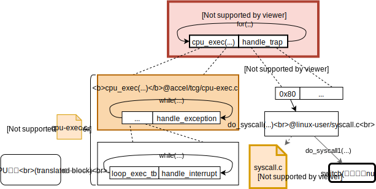

<div style="text-align:right; font-size:3em;">2021.11.18</div>

* 精确prot管理CONFIG_PRECISE_PROT

<div style="text-align:right; font-size:3em;">2021.11.01</div>

* break方案，若无共享可写页，立刻还原所有私有页
* interp方案，lazy，不还原

<div style="text-align:right; font-size:3em;">2021.10.26</div>

# 共享可写大页问题

* 断点方案CONFIG_SHDWRT_BREAK
  * 需要out-of-bound地址=>in-bound地址的转换，用于处理out-of-bound报错
    * frag_map是映射in-bound=>out-of-bound，因此需要重新设计。
* 解释方案CONFIG_SHDWRT_INTERP
* VTLB方案CONFIG_SHDWRT_VTLB

CONFIG_SHDWRT_DBGMSG控制是否输出debug信息

# QEMU目前版本4.1.0

# 2019.8.19

## QEMU调研的开端

来自[qemu wiki致入门开发者](https://wiki.qemu.org/Documentation/GettingStartedDevelopers)的一句话，

> - QEMU does not have a high level design description document - only the source code tells the full story.

这一篇[Can I examine Qemu tcg ir code? If so how?](https://stackoverflow.com/questions/53732130/can-i-examine-qemu-tcg-ir-code-if-so-how)提到了QEMU的中间代码叫tiny code generator(TCG)，以及输出tcg的方法`-d op`。这边回答里还提到了另一篇关于qemu总体架构的回答[QEMU - Code Flow [ Instruction cache and TCG](https://stackoverflow.com/questions/20675226/qemu-code-flow-instruction-cache-and-tcg)如下图，


## QEMU源码里的文档

### [Tiny Code Generator (TCG)](/home/xieby1/Codes/qemu/tcg/README)

目前不支持浮点？？？那是如何做到模拟浮点计算的？？？

1. Introduction
2. Definitions
4. Intermediate representation
   1. **Introduction**
   2. Assumptions
   3. Code Optimizations
   4. **Instruction Reference**此处有详细的TCG IR的格式和含义的说明
5. Backend
   1. …
6. Recommended Coding rules for best performance

## 尝试用QEMU直接运行程序（非全系统模拟）

知道QEMU有全系统模拟和用户程序模拟两种模式，但是不知道该如何搜索使用仅仅模拟用户程序的方法。

上Wikipedia上看到“QEMU can also do emulation for user-level processes”。

于是搜索关键词“qemu emulation user-level process”，找到用qemu-user这个程序。

`man qemu-user`得知“The qemu-user emulator can run binaries for other architectures but with the same operating system as the current one.”

`qemu-user`使用例子，

```bash
# -d op表示输出没有优化的IR，可以用qemu-i386 -d help查看可以输出的内容；
# -D hellloIR表示输出到文件helloIR里。
qemu-i386 -d op -D helloIR ./hello
```

# 2019.8.20

## QEMU user emulator

在QEMU根目录下用grep查找qemu-x86_64没结果，查找qemu-system-找到了makefile.target里的内容。其写法为`QEMU_PROG=qemu-system-$(TARGET_NAME)$(EXESUF)`。遂用指令`grep qemu-\$\(TARGET_NAME -r ./`查找。

**注：grep用的是Basic Regular Exprssions (BRE)，所以可以用[RegExr: Learn, Build, & Test RegEx](https://regexr.com/)之类的工具验证。**

在makefile.target内找到了`QEMU_PROG=qemu-$(TARGET_NAME)`。于是开始看qemu的makefile来找qemu-user的代码位置。

qemu使用makefile指导编译的项目，但我想用clion看qemu源码，参考官方教程[Managing Makefile Projects](https://www.jetbrains.com/help/clion/managing-makefile-projects.html#Managing_Makefile_projects.xml)。

### 设置clion

创建一个compilation databse

```bash
sudo pip3 install compiledb
# 在qemu源码的根目录下
./configure
compiledb make
# compiledb make要求要configure，这和我在build文件夹的configure操作有冲突。索性搞了两个份qemu的源码，一份用来clion看代码，另一份用来编译和debug。
```

然后就可以了。

### 编译QEMU user

```bash
git clone https://git.qemu.org/git/qemu.git
cd qemu
git submodule init
git submodule update --recursive
```

✔️<span style="color:red;">**Q:** 如何编译出qemu-i386?</span>

```bash
# 在qemu源码的根目录下
mkdir build
cd build
# configure --help可以获取帮助！
../configure --enable-debug --enable-debug-info --target-list="i386-linux-user x86_64-linux-user"
make
# 在执行安装前，我把apt安装的qemu删掉了，免得引起“误会”
make install
qemu-i386 --version
# 显示如下
#	qemu-i386 version 4.1.0
#	Copyright (c) 2003-2019 Fabrice Bellard and the QEMU Project developers
# 编译成功！
```

### Debug QEMU

之前一直不知道在哪里break。在编译的configure里添加`--enable-debug-info`再编译就可以break到函数的名字了！

```bash
gdb
# 函数路径可以用which qemu-i386或者whereis qemu-i386查找
(gdb) file /usr/local/bin/qemu-i386
(gdb) break main
# hello程序是用汇编写的helloworld，很小很简单，添加到附录里了。
(gdb) run ~/Desktop/hello
```

### QEMU user源代码

在`qemu_root_dir/linux-user`

### QEMU user总体结构图

**为什么要理清QEMU user的结构图？**因为想知道为什么QEMU-user（对用户程序的模拟）只能在同一系统间进行。（目前QEMU支持linux和bsd操作系统内的用户程序模拟，即linux-mips下可以模拟linux-x86的用户程序但是无法模拟bsd-mips的用户程序。）因此这个问题衍生为用户程序对操作系统的依赖有多大？更精确一些的话，用户程序能有产生哪些行为，所有这些行为需要模拟器在何种程度上进行模拟？

思考之后，认为有两条路可以尝试解决这个疑惑。一是去看各个指令集架构的汇编，看它们能为程序提供哪些行为。二是去看QEMU的源码里是怎么做的。我觉的看汇编，工作量太大，且这个思考已经被无数模拟器的开发者思考过了，所以我决定直接去QEMU的源码里寻找答案。

于是对`qemu-user`（实际阅读的是`qemu-i386`）的源码进行阅读后，有了下面这张结构图。



从我所看到的、所领悟到的内容来看，`qemu-user`的`cpu_exec(...)`函数应该就是处理翻译执行工作的；handle_trap是我自己给一大片switch代码取得名字，这一部分是处理用户程序对操作系统的依赖，即系统调用。目前从我的视角来看（我的视角可能会有死角），用户程序可能的行为就如上图所示的范围里了。但是心里还一直在想，<span style="color:red;font-weight:bold">qemu如何处理shared library？</span>讲道理，qemu只需要和原程序的行为一样到对应的文件夹里去寻找即可，没找到按照原文件报错即可。

**注**：感觉系统调用（syscall1函数）是除了translated block以外体力活很大的地方。系统调用的知识在《Linux/UNIX系统编程手册（上册）》的第3章有比较详细的讲到，忘记了可以回去查阅。

# 2019.8.21

### QEMU和shared library (shared object)

详细参考[How do I load a shared object in C++?](https://stackoverflow.com/questions/1142103/how-do-i-load-a-shared-object-in-c)和函数`dlopen`的manual page。

# 附录

## 汇编hello world (32位版本)

### 源码

**源码来自**：2018年春季汇编语言第三讲编程初步 25页

```assembly
#hello.S
.section .data
	output:	.ascii  "Hello World\n"
.section .text
.globl _start
_start:
/* output  like printf */
	movl	$4, %eax
	movl	$1, %ebx
	movl	$output, %ecx
	movl	$12, %edx
	int	$0x80
/* exit */
	movl	$1, %eax
	movl	$0, %ebx
	int	$0x80
```

### 编译方法

**来自**：2018年春季汇编语言第三讲编程初步 51页

```bash
# 64位环境编译32位程序
as --32 -o hello.o hello.S
ld -m elf_i386 -o hello hello.o 
```

## QEMU里的术语

| 缩   | 全                  | 缩   | 全               |
| ---- | ------------------- | ---- | ---------------- |
| TCG  | Tiny Code Generator | TB   | Translated Block |

