2020.5.9

QEMU的wiki页面：[tcg-multithread](https://wiki.qemu.org/Features/tcg-multithread)

## `lv.c`

**qemu-system代码框架**

为了厘清MTTCG的启动过程，梳理了一边qemu-system启动过程的代码框架图，

上图中的`qemu_thread_create`启用一个线程执行`qemu_tcg_cpu_thread_fn`标志这**一个**MTTCG CPU开始运作。

我猜测rr是round robin的缩写。

### `qemu_tcg_cpu_thread_fn`

副标题：**MTTCG CPU线程启动的代码框架**

2020.5.20：**加载bios的过程**参考博客[BIOS execution in QEMU: where it all starts – martin.uy](https://martin.uy/blog/bios-execution-in-qemu-where-it-all-starts/)，加载bios的代码框架如下，

2020.5.20：qemu-system框架图的`cpu_reset`将选择BSP CPU（负责执行bios的cpu——BootStrap Processor）的`cs:eip`设置为`0xf000: 0xfff0`，即bios的入口地址。但是为什么要执行两次`cpu_rest`我还不太清楚。CPU启动过程参考《Inter 64 and IA-32 Architecture Software Developer's Manual》的Volume 3 Chapter 8.4。

由qemu-system框架图可知，若要启动MTTCG则让`qemu_thread_create`调用`qemu_tcg_cpu_thread_fn`即可，

2020.5.11

下面将多线程TCG和单线程TCG的运行框架图以对比的形式呈现在下面，

当进入`tcg_cpu_exec`函数开始执行时，会调用`cpu_exec`函数，这样就基本和用户态指令的路线相同了；目前看到的不同是中断/异常处理时和用户态略有区别，把`cpu_exec`的代码框架图放置在下面，

当运行时遇到中断/异常通过siglongjmp跳出后，会在`cpu_handle_exception`和`cpu_handle_interrupt`里完成异常/中断处理。（用户态qemu会在cpu_loop里完成处理。）

2020.5.12

参考`docs/devel/multiple-iothreads.txt`，可知

* `IOThreads`是为了减轻qemu在多核多线程处理器里运行时main loop的IO瓶颈；
* qemu的全局锁为了让vCPU和main loop线性地（非并行地）执行一些qemu的代码，因为历史原因诸多qemu代码没有考虑多线程执行的安全性；

参考`docs/devel/multi-thread-tcg.txt`，

**MTTCG设计宗旨**：

> In the general case of running translated code there should be no inter-vCPU dependencies and all vCPUs should be able to run at full speed. Synchronisation will only be required while accessing internal shared data structures or when the emulated architecture requires a coherent representation of the emulated machine state.

即除了必要的同步外，vCPU线程要能够没有任何牵连地全速运行。

需要考虑多线程访问的数据结构

* `CPUState.tb_jmp_cache`虽然是每个cpu自己拥有，但是当需要无效无效一个tb时`do_tb_phys_invalidate`需要在每个cpu上查找，或当执行`tb_flush`会在一个cpu上冲掉所有cpu上的cache；
* `tb_ctx.htable`所有cpu共有，在`tb_jmp_cache`查不到就回来这里查；

2020.5.22

## 并发TLB读写

采用async_run_on_cpu保障@cputlb.c

这个函数的调用backtrace见[check.md](../x86-qemu-mips/check.md)，

* tcg_out_qemu_ld/st @ tcg-target.inc.c // 给ld/st贴上标签，翻译完成一个tb后再来添加tlb未命中的代码，再去这些标签处改跳转地址。

贴标签的位置在tcg_gen_code @tcg.c里调用

* tcg_out_ldst_finalize
  * tcg_out_qemu_ld/st_slow_path @tcg_ldst.inc.c
    * 生产本地码在运行时调用qemu_ld/st_helpers @tcg-target.inc.c，会根据操作数类型，选择一个helper，比如
      * helper_ret_ldub_mmu @cputlb.c
        * full_ldub_mmu
          * load/store_helper

当遇到TLB miss时就会调用tlb_fill

* tlb_fill
  * x86_cpu_tlb_fill @excp_helper.c
    * handle_mmu_fault
      * tlb_set_page_with_attrs @cputlb.c // *Called from TCG-generated code, which is under an RCU read-side critical section.* /// walk页表，用GVA找到了GPA
        * tlb_set_page_with_attrs ///建立GPA到HVA的映射，GPA + CPUTLBEntry.addend = HVA
          * address_space_translate_for_iotlb ///在memory region找HVA，具体的没看

2020.5.28

## 指令Prefix: LOCK

引用qemu linux user笔记里翻译一系列指令到TCG的框架

在`switch(指令操作码（opcode）)`之前现有一个switch处理了prefix，这是之前没有关注过的内容。`prefixes`变量是`disas_insn`的局部变量。当需要翻译的指令是`bts`时就会执行如下的case，**注**：以word大小，little edian为例即`w_le`后缀，**注2**：i386bts指令实际调用`l_le`，

这里helper函数的调用采用的是和处理系统调用的helper函数一致的方法。`helper_tomic_fetch_orw_le`函数会在运行本地码的过程中被调用到，来帮助完成一个原子操作，函数名用宏拼接的粗略过程和代码框架如下，

gcc内置原子函数的编程文档见[gcc官网的文档内置原子操作](https://gcc.gnu.org/onlinedocs/gcc-10.1.0/gcc/_005f_005fatomic-Builtins.html)这一章。

2020.5.28

接下来就是看直接使用`helper_atomic_fetch_or`函数的可行性了。这里虽然用到了TCG相关的类型`TCGMemOpIdx`，不过这个就是两个包装过的立即数`TCGMemOp`和`Idx`。`TCGMemOp`自己写个简单的解码即可，`Idx`我看到牛根写的`helper_softmmu_load/store`函数里已经用到了。不过问题就是牛根为啥要重写一个`helper_softmmu_load/store`而不是直接复用qemu的呢，莫非有坑？大概是mmu的操作都是后缀`_mmu`的函数，而这样的函数太多了，用一个函数集中起来更方便？

