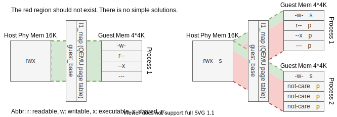
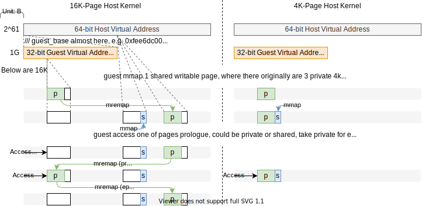

本文档和[WINE/qemu-wine.md](../WINE/qemu-wine.md)共同记录用qemu用户态运行wine的笔记。本文档记录qemu的部分。

<div style="text-align:right; font-size:3em;">2020.08.19</div>

## qemu中的各类设计

### 页属性的管理

这里提及的页属性包括两部分，mmap系统调用的prot和flags。前者是操作权限（读、写、执行），后者是控制其他程序的可见性。因为这些属性所标记的对象的最小单位是页，所以当host页大于guest页时就会出现粒度不够的问题（host页小于guest页不会有问题，小页可以很简单地拼成大页，反过来不行）。

#### 页属性的读取和设置

理论上，在同一个进程里，qemu只需要将一个host页包含的guest页属性合并一起开启，qemu自己维护页属性，控制对页的操作即可。qemu实际上也是如此实现的，用`page_get_flags`和`page_set_flags`读取和设置prot。

但是，当遇到多进程需要共享内存时，页粒度就会产生问题，并不能简单地解决。例子如下，16K页的操作系统里用QEMU运行4K页的程序，



红色的映射将本不应该共享的页共享了，没有直接且简单的方法接解决这个问题。有没有代价低一些的方法呢？见[大页内核共享可写碎片的解决方案](#大页内核共享可写碎片的解决方案)

<div style="text-align:right; font-size:3em;">2020.08.21</div>

#### 用页属性来控制访问

页属性的目的是提供控制访问（access control）的依据，这里的访问指的读、写、执行。下面3种程序执行环境中，页属性的访问控制由不同的件（ware）完成，

1. 在host操作系统里直接执行host程序时，页访问控制是由**硬件MMU**完成；
2. 在qemu系统态模拟的操作系统里执行guest程序时，页访问控制由qemu的**软件mmu**（即softmmu）完成；
3. 在qemu里用户态，qemu将guest的页属性映射到了host的页属性里，页访问控制由host的**硬件MMU**完成。

情况3中，qemu完全没有干涉页的访问控制，通过方式均能作证，

* 测试程序[4x4k_pages_access_prot.c](../../../../../Codes/test/lib/mmap/4x4k_pages_access_prot.c)，在4k页x86-linux里无法写第4个页，16k页mips-linux里可以正常写；

* 上述测试程序的mov指令和对应生成的tcg

  ```assembly
  # x86汇编
  movl   $0x3549,(%eax)
  # tcg
  mov_i32 tmp2,eax
  movi_i32 tmp0,$0x3549
  emu_st_i32 tmp0,tmp2,leul,0
  ```

* 详细代码，参考[qemu linux-user的笔记](linux-user.md)关于*TCG=>host: tcg_gen_code*这一部分。一条mov寄存器到内存的指令由`tcg_out_qemu_st_direct`函数完成，没有涉及页的访问控制；


<div style="text-align:right; font-size:3em;">2020.08.31</div>

#### 大页内核共享可写碎片的解决方案

##### 当前的设计

通过捕捉访问随便页产的sigsegv信号，在**host指令**前执行prologue；借鉴debug打断点的思路，在**host指令**后插入不影响用户上下文且产生某种信号的指令（不能用sigtrap这会影响debugger正常工作，可以用sigill比如x86里的ud0/1/2，可以用sigsegv比如mips里的sb zero 0(zero)），捕捉该信号即在**host指令**后执行epilogue。

该方法可以做到各个体系结构的同用。唯一的不足是在CISC架构里，需要知晓**host指令**的长度才能在**host指令**后插入产生信号的指令，即需要进行简单的译码。

**设计思路框图如下**，

**注**：目前只实现了mmap和防存，这应该是能支持起来很大一部分应用的需求了

###### DONE

按照优先级排序：

1. 修改frag_map相关数据结构：frag_map改为链表，prots改为动态分配内存（host页大小是可变的，比如运行4k内核运行16k内核，所以prots的长度是不能在编译时确定），以及函数结构的优化
2. 完成内存映射相关系统调用的支持：mmap和碎片有交集, munmap, mremap, mprotect, mlock&munlock, msync（参考的是`man mmap`的SEE ALSO）
3. prologue/epilogue添加CISC的支持，需要一个简单的解码器来判断指令的长度



**注**：下述的prologue和epilogue里为了方便，将访问碎片页的那条机器指令简写为**指令x**。*访问*包括*读*、*写*、*执行*，*碎片页*包含*私有碎片*和*共享可读碎片*。

###### prologue

在访问碎片页时，会因为没有权限而产生SIGSEGV信号，由此可以在信号处理函数里执行prologue。prologue执行完成后会回到未成功执行的访问碎片页的执行重新执行（做个简单的实验就会知道，signal处理函数不对SIGSEGV做任何处理，那么会无限报SIGSEGV）。利用这个特性，便能保证prologue一定是在指令x成功执行前执行的。

prologue的实质工作是把待访问的页移动到正确的区域（说是移动，其实就是重新映射，将物理页映射到正确的虚地址去）。

为了能够在指令x执行后执行epilogue，还需要在prologue里做足够的准备。总的思路很简单，让指令x单步执行。第一个想到的就是参考debugger（例如gdb）如何做到的break。将待break的指令换成能产生SIGTRAP信号的指令即可，x86里int3，mips里break。但是这里不能用SIGTRAP，因为会影响debugger的正常工作。现在在mips里采用的方案是将指令x的下一条改为`sb zero 0(zero)`（往0地址处写一个byte的0），由此执行完成指令x后在执行指令x的下一条指令时会产生SIGSEGV信号，且这条指令不会对用户程序的上下文产生影响（寄存器、内存）。捕捉到这个信号即可开始执行epilogue。

###### epilogue

epilogue的实质工作是把已被访问过的页移动到guest用户空间外（重新映射）。

当然咯，需要将指令x的下条指令还原。

###### 需要主要的问题

2020.9.10

* 若访问碎片的指令在共享库里，一般是不可写的，那么需要临时将指令所在页改为可写。完成后再还原。**Q**：这样做会影响文件系统里的共享库吗？**A**：不会，参考man里MAP_PRIVATE的含义：*Create a private copy-on-write mapping.  Updates to the  mapping are  not  visible  to other processes mapping the same file, and re not carried through to the underlying file.*
* 若访问碎片的指令在延迟槽里：通过反汇编判断是否是延迟槽指令，若是则打两个断点，若不是则正常打断点。这个打断点的逻辑抽象成了独立的函数库[libbreak](https://github.com/xieby1/libbreak)承担。

##### 舍弃的设计

和当前设计的不同在于需要通过捕捉访问碎片页产生的sigsegv信号，来重新翻译TB来实现在**guest指令**前后执行prologue和epilogue。这个方法最大的问题在于不能保证完全恢复已执行的TB已产生的效果：

* 出问题的**guest指令**所在的TB里，该**guest指令**前边的指令已经被执行，后边的指令完全没被执行。这个目前可以解决：因为qemu维护了host指令到guest指令的映射（为了实现精确异常，通过`accel/tcg/translate-all.c: cpu_restore_state`完成映射），所以重新翻译从**guest指令**作为新TB的入口即可；
* 出问题的**guest指令**变成多条**host指令**，但实际出错的**host指令**之前不一定是第一条，也就是说<span style="background:red; color:white;">该**guest指令**的一部分已经生效了</span>，这个问题无法解决。

除了上面这个无法解决的问题以外，还有许多麻烦：

* 需要修改翻译TB的逻辑，这是个大工程
* ...

###### 当时为何如此设计

但是的第一想法是模仿softmmu，共享可写页通过用户态mmu访问，邻居页改权限访问。因此有了要重新生成TB的想法。现在看来当前的设计是更好且更方便的。

---

<div style="text-align:center;">⇃逝去的历史⇂</div>

---

<div style="text-align:right; font-size:3em;">2020.08.25</div>

###### 是否要备份邻居页

备份的优势：

* 用户读写指令走mini-softmmu

备份的劣势（反过来即不备份的优势）：

* 若邻居页非空，需要复制邻居页到备份页

不备份~~的劣势~~：

* 读写指令**前**需要mprotect改权限，**后**需要mprotect恢复权限，这个**后**能做到吗？应该是可行的，看`tcg/i386/tcg-target.inc.c: tcg_out_qemu_st`函数（这个函数是生成的），在`tcg_out_qemu_st_direct`的前后添加俩helper，一个负责查表开启权限，一个负责关闭权限即可。

**结论**：那就不备份吧

<div style="text-align:right; font-size:3em;">2020.08.26</div>

###### 在哪里修改ld/st的翻译

两个地方可选

* host=>tcg

  优势：调用helper函数方便，

* tcg=>guest

**结论**：host=>tcg，注意一定是要改在tcg的部分，这样可以在多guest/host端通用。

---

<div style="text-align:center;">↿遗忘这些历史吧↾</div>

---