<div style="font-size:3em; text-align:right;">2019.10.30</div>
《[X86toMips调研.md](./X86toMips调研.md)》内容很多，使得需要记录当前研究内容的标题都从h3开始了，为了精简标题级数，用这个新的文档来记录。

# 目前的情况

X86toMips的函数`static/static.cpp: 200～213： write_trans_result_to_s2d_file`未实现，调用这个函数的注释里写道`// 5. write trans result to s2d`，我觉得这个函数目的是生成MIPS ELF文件。目前简单补全了`write_trans_result_to_s2d_file`让其能够输出MIPS汇编，能够用x86的汇编hello（其中包含int 0x80）输出其翻译之后的MIPS汇编。接下来希望能够手写一个MIPS ELF文件来装下翻译x86-hello出来的MIPS汇编。但是令人感到意外的是MIPS汇编包含了竟然包含了跳转到X86toMips解释执行的代码的汇编，于是想要手写MIPS ELF且把这些被调用函数都包含进去的话，难度非常大！经过一晚的思考目前有下面的3条路可选，



所以结论就是去修改`translate_int`的代码逻辑咯！

# 静态翻译系统调用int 0x80

X86和MIPS系统调用传参ABI，**注**：同一个系统调用在不同架构的系统调用号不一样，例如系统调用`exit`的系统调用号在x86-linux里是1在mips-linux是58且mips里还要加偏移（n64的偏移为5000，所以实际的系统调用号为5058）详细见《[X86toMips调研.md](./X86toMips调研.md)》的“接下来尝试手动生成一个MIPS的ELF文件”这一部分，

|      | 系统调用号 | 参数1 | 参数2 | 参数3 | 参数4 | 参数5 | 参数6 |
| ---- | ---------- | ----- | ----- | ----- | ----- | ----- | ----- |
| X86  | eax        | ebx   | ecx   | edx   | esi   | edi   | ebp   |
| 映射 | v0         | s3    | v1    | at    | s6    | s7    | s5    |
| MIPS | v0         | a0    | a1    | a2    | a3    |       |       |

系统调用号eax就是映射到v0的，不用挪了。要先保存a0~a3的内容，然后把s3、s4、at、s6的内容挪到a0~a3里去，一个讨巧的做法：（**注**：ABORT：最完美的做法是查看a0~a3目前是否有被使用，若有被使用才有必要保存其值！）

* 交换s3、s4、at、s6和a0~a3
* syscall（调用a0~a3）的内容，期望MIPS-linux不会破坏原a0~a3的值（目前暂存在s3、s4、at、s6）
* 调用结束交换s3、s4、at、s6和a0~a3

写了一个[python脚本](#python脚本：完成x86到mips的系统调用号的映射)完成x86到mips的系统调用号的映射。

## 关于系统调用号映射表和静态分析的思考

若能静态分析出系统调用号，则直接静态翻译时就把X86的系统调用号改为Mips的系统调用号。若不能静态分析出系统调用号（比如是用户输入的系统调用号），则需把系统调用号映射表（数组syscallMap）添加到ELF文件中且还要附带一个映射函数（v0=syscallMap[v0]）则可能让一条指令一下膨胀成了几十条指令。

**不仅从系统调用号中需要静态分析，还有许多地方（包括下面的[关于地址和静态分析的思考](#关于地址和静态分析的思考)），要生成优化的代码的话，一定需要大量的静态分析。这样考量一下，我觉得自己从头开始写静态翻译是个费力不讨巧的活路！一定要使用像REV.NG那样的框架（后端让LLVM来优化）！**

## 关于地址和静态分析的思考

一个操作数（立即数、寄存器、内存）究竟是否是一个地址？这个问题是从让程序来翻译x86-hello里的`movl	$output, %ecx`想到的。思考了很久的答案是：**终究**是要看这个操作数是否用于了寻址（load/store/jump的对象）。这个答案是符合编程直觉的，但并不是完美的。

* 符合编程直觉的：被用于寻址了显然就是地址。但你可能想这很轻易就能反驳我。*你拿x86-hello做例子，`$output`就是地址，但是程序没有一个访存的语句。*所以我在上面的答案里加了“**终究**”二字。”`$output`是个字符串的地址，被传给了系统调用`write`，虽然在代码里看不见output被用于寻址，但是在系统调用`write`的某个地方一定是要访问这个字符串的，即寻址了。
* 但并不是完美的：当你理解了答案里“**终究**”二字的意义后，我想告诉你这个答案也并非是完美的。*比如一个性情古怪的加密专家他设计了一个反破解程序，需要用执行到某一处时程序计数器pc的值和程序只读数据段的一个值做比较，若相等的话程序才能继续正常的运行，否则就视为黑客对程序做了某种程度的破解，立刻终止程序运行。*在这个情景里，程序只读数据段的一个值完全没有被用于访存操作，所以上面的答案告诉我们，它不是一个地址，仅仅只是一个普通的数据。然而我们却清清楚楚地知道它是个地址值，因为你从这个古怪的程序员设计意图中了解它是个地址。当然在这个情景中，你也很清楚的知道有必要把程序只读数据段的这个值变为目标平台（Mips）的地址。但是，我完全可以假设*另一个性情更加古怪的程序员，他的程序和前面那个性情古怪的反加密程序功能刚好相反，他这个程序必须要pc的值和程序只读数据段的一个值做比较，若**不**相等的话程序才能继续正常的运行……*在这个情景里你可能有些犹豫了，但为了保证程序正常的运行，只能把它当作一个普通的数据。所以，我很希望不和这个性情古怪的加密专家打交道，不过值得庆幸的是在这个世界上这样的性情古怪的加密专家应该很少很少。尽管不完美，但首先能处理好大众对二进制翻译的需求才是最重要的吧。

<div style="font-size:3em; text-align:right;">2019.10.31</div>
## 总结

### 新增：静态翻译能够输出MIPS二进制代码

**Commit ID**: `ed0eedbde83eff568f756aa6f59a3dc61a86dc85`

静态翻译目前能够输出MIPS二进制码到`dbt.translated`文件中。详细代码修改见fixStatic分支的这一次commit。修改内容：

* 用的是x86-hello做实验，原本的代码反编译时不能及时停下来，即没有检测是否超出了elf文件的.text section。于是**新增**了代码块（TB）结束的判断，**新增**了代码块类型命名为TB_TYPE_END，对应于读到了.text末尾使得代码块结束的情况。

* 原本的代码并没实现`SBT_FILE::write_trans_result_to_s2d_file()`函数，**初步实现**该函数，让静态翻译能够把翻译出的代码以二进制的形式输出到当前目录下的dbt.translated文件中。可以用

  ```bash
  sudo objdump -D -b binary -m mips ./dbt.translated
  ```

  这条指令反汇编输出的二进制文件，得到可阅读的MISP汇编代码。

### 新增：静态翻译系统调用

**Commit ID**: `9da52566167b2a0f587c8347e74dab120cbfe03a`

原本的代码是用解释执行的方式来应对系统调用（int 0x80）。**新增**了将系统调用静态翻译成MIPS的机器码的功能。虽然建立了X86到MIPS的系统调用号的映射，但[关于系统调用号映射表和静态分析的思考](#关于系统调用号映射表和静态分析的思考)里提到了实现系统调用号的困难所在，所以目前系统调用号的转换还**未实现**由程序自动完成，需要手动去修改机器码里的系统调用号。

目前手工修改一下自动生成的MIPS机器码便能运行，之后把手工修改的过程变为程序自动生成即可。修改出来的汇编见附录[手工修改的hello.S](#手工修改的hello.S)。

## MIPS汇编里的宏指令

这个问题是由在MIPS指令手册 [MIPS_Architecture_for_Programmers_Volume_II-A_the_MIPS64_Instructio_Set_Volume_II-A_MD00087-2B-MIPS64BIS-AFP-03.02.pdf](../../BOOKS/Assembly/MIPS_Architecture_for_Programmers_Volume_II-A_the_MIPS64_Instructio_Set_Volume_II-A_MD00087-2B-MIPS64BIS-AFP-03.02.pdf) 里找不到li（load immediate）这条指令产生的。

**答**：所有的MIPS指令和汇编器可以识别的宏指令在《[See MIPS Run ](../../BOOKS/Linux/2006.See_MIPS_Run.2nd_Edition_Oct.Morgan_Kaufmann.pdf)》的189~209页可以找到。例如，

```assembly
# 0<=j<=6535
li d,j =>
ori d,$zero,j
# -32768<=j<0
li d,j =>
addiu d,$zero,j
# j是32-bit整形
li d,j =>
lui d,hi16(j)
ori d,d,lo16(j)
```

🤔那么在汇编器的某个文档里应该就是这些宏指令的最原始来源了吧？能不能找到这样的手册呢？

尝试找一找as文档会不会有这些宏指令的定义，[GNU](https://www.gnu.org/)->[GNU文档](https://www.gnu.org/doc/doc.html)->[GNU手册](https://www.gnu.org/manual/manual.html)->[Binutils](https://www.gnu.org/software/binutils/manual/)->[Using as](https://sourceware.org/binutils/docs/as/)->[9.27.2 High-level assembly macros](https://sourceware.org/binutils/docs/as/MIPS-Macros.html#MIPS-Macros)->找到了！

> MIPS assemblers have traditionally provided a wider range of instructions than the MIPS architecture itself. These extra instructions are usually referred to as “macro” instructions [2](https://sourceware.org/binutils/docs/as/MIPS-Macros.html#FOOT2).

看起来只是一个简单性的使用手册，没有详细的“macro” instructions列表吗？

在binutils的源码里的`binutils/gas/doc/c-mips.texi`看到了上面的手册，感觉网页是用这里的`.texi`文件自动生成的。在`binutils/gas/testsuite/gas/mips/`看到了很多指令的测试文件，包括li。感觉“macro” instructions列表就在binutils的源码里了！（为什么感觉会在binutils源码里而不是在gas源码里的。因为我觉得mips指令的定义应该不只是gas会用到，其他的binutils的分析工具也会用的，所以GNU的这些大神们肯定会把mips指令的定义放在一个公共区域里，让所有的工具能够“公平地”使用mips指令的定义。）**找到了！**在`binutils/include/opcode/mips.h`里。

<div style="font-size:3em; text-align:right;">2019.10.30</div>
详细定义在`binutils/opcodes/mips-opc.c`。比如li，在452~454行，依照注释是先出现先分析，（大概就是`ori d, $zero, j`会被分析成`li d, j`而不是`ori d, $zero, j`的原因吧）

> These instructions appear first so that the disassembler will find   them first. The assemblers uses a hash table based on the instruction name anyhow.

```c
{"li",			"t,j",		0x24000000, 0xffe00000, WR_1,			INSN2_ALIAS,	I1,		0,	0 }, /* addiu */
{"li",			"t,i",		0x34000000, 0xffe00000, WR_1,			INSN2_ALIAS,	I1,		0,	0 }, /* ori */
{"li",			"t,I",		0,    (int) M_LI,	INSN_MACRO,		0,		I1,		0,	0 },
```

<div style="font-size:3em; text-align:right;">2019.11.5</div>
对于系统调用而言，静态翻译和解释执行在运行正确性上有什么区别吗？静态翻译就只是映射一下寄存器就好的事，而X86toMips解释执行用到了巨量的重复代码，为什么X86toMips要采用解释执行而不是静态翻译？**答**：大概是动态翻译还没完全完成，所以直接用了解释执行的代码。

# 运行SPEC2000

昨天尝试用X86toMips运行SPEC2000的浮点里的swim测试，发现没有实现`openat`系统调用，所以今天

* 简单实现了一下动态翻译的系统调用见`fixToRunSPEC`分支，

  🤔<span style="color:red;">仍然没解决的问题是load_ireg_from_addr和load_ireg_from_addrx有什么区别？ADDR类型和ADDRX类型有什么区别（明明都是unsigned long嘛），为什强制类型转换前者没事，后者编译时显示丢失精度？</span>

  目前能正常运行汇编hello，但是运行spec的swim程序会出现“assertion failed in <mda_process> optimization/mda.cpp:360”。

* 还尝试简化了一下系统调用解释执行（就是直接映射系统调用号然后调用unistd.h的syscall函数）见`fixToRunSPECInterpret`函数。

  🤔<span style="color:red;">原本的代码是给每个系统调用都加了一个壳，现在我是直接映射系统调用号，有什么区别吗？有什么我没能注意到的小细节吗？</span>目前能正常运行汇编hello，但是运行c语言helloworld会出segment fault。

<div style="font-size:3em; text-align:right;">2019.11.7</div>

**注**：接下来的工作都是在动态翻译上进行的，即需要

🤔✔️<span style="color:red;">`fixToRunSPEC`分支里出现的MDA错误是什么？</span>**答**：在`translator/tr_opnd_process.cpp: 1275`看到了是misaligned data access。

用gdb在optimization/mda.cpp:360处设置断点，然后运行。最先显示的不是断点而是程序收到了信号，在code_cache()里收到的，

> Program received signal SIGBUS, Bus error.

继续执行，才会到断点的地方。**猜想**：MDA使用信号实现的，在执行MIPS汇编时遇到了非对齐的访存，就会发出信号，转到处理MDA的函数来进行相应的处理。现在就去仔细看看MDA相关的代码吧。

# X86toMips寄存器用途记录

## X86的通用寄存器的映射

`translator/reg_alloc.cpp: 9~12: ra_alloc_gpr`配合着`include/ir1.h: 453~460`的对X86寄存器编号的宏定义可以看出，

| MIPS | 2    | 3    | 1    | 19   | 20   | 21   | 22   | 23   |
| ---- | ---- | ---- | ---- | ---- | ---- | ---- | ---- | ---- |
| 别名 | v0   | v1   | AT   | s3   | s4   | s5   | s6   | s7   |
| X86  | eax  | ecx  | edx  | ebx  | esp  | ebp  | esi  | edi  |

# 附录

## python脚本：完成x86到mips的系统调用号的映射

```python
pathToStrace = "/home/xieby1/Codes/strace/"
mipsSyscallent_n64 = open(pathToStrace+"linux/mips/syscallent-n64.h", "r")
i386Syscallent = open(pathToStrace+"linux/i386/syscallent.h", "r")

mipsLines = mipsSyscallent_n64.readlines()
i386Lines = i386Syscallent.readlines()

maps = []

import re

for i386Line in i386Lines:
    i386Match = re.search(r"\"(\w+)\"", i386Line)
    if i386Match:
        i386Syscall = i386Match.group(0)[1:-1]
    else:
        continue

    mipsSyscallFounded = False
    for mipsLine in mipsLines:
        mipsMatch = re.search(i386Syscall, mipsLine)
        if mipsMatch:
            mipsSyscallFounded = True
            BASE_NR_numMatch = re.search(r"\w*\s*\+\s*\d*", mipsLine) # to find [BASE_NR +   <num>]
            if BASE_NR_numMatch:
                mipsSyscallNumMatch = re.search(r"\d+", BASE_NR_numMatch.group(0)) # to find <num>
                if mipsSyscallNumMatch:
                    mipsSyscallNum = mipsSyscallNumMatch.group(0)
                    maps.append(mipsSyscallNum)
            break

    if not mipsSyscallFounded:
        print(i386Syscall + ", ") # python3 version: print(i386Syscall, end=", ")
        maps.append(-1)

print(maps)
```

输出，

```python
waitpid, break, oldstat, stime, oldfstat, stty, gtty, nice, ftime, prof, mpx, ulimit, oldolduname, sgetmask, ssetmask, oldlstat, uselib, readdir, profil, ioperm, socketcall, olduname, iopl, idle, vm86old, ipc, modify_ldt, bdflush, _llseek, vm86, vfork, ugetrlimit, mmap2, truncate64, ftruncate64, stat64, lstat64, fstat64, lchown32, getuid32, getgid32, geteuid32, getegid32, setreuid32, setregid32, getgroups32, setgroups32, fchown32, setresuid32, getresuid32, setresgid32, getresgid32, chown32, setuid32, setgid32, setfsuid32, setfsgid32, fcntl64, sendfile64, get_thread_area, statfs64, fstatfs64, fadvise64_64, fstatat64, arch_prctl, ['213', '58', '56', '0', '1', '2', '3', -1, '83', '84', '85', '57', '78', '7', '131', '88', '92', -1, -1, '8', '38', '160', '161', '103', '100', -1, '99', '37', -1, '33', '130', -1, -1, '20', -1, -1, '25', '60', '80', '81', '82', '31', '21', '98', -1, '12', '104', '102', '276', '105', '106', '158', '161', '71', '15', '70', -1, '107', -1, -1, '93', '156', '133', '32', '108', '109', '110', '13', -1, -1, '111', '112', '128', '125', '165', '155', '95', '96', '94', '159', '113', '114', '22', '86', -1, '87', -1, '162', '164', -1, '9', '11', '74', '75', '89', '91', '137', '138', -1, '134', '135', -1, -1, '101', '36', '35', '4', '6', '5', -1, -1, '150', -1, -1, '59', '163', '97', -1, '72', '211', '55', '166', '61', -1, '154', '10', '14', '167', '168', '169', '170', '172', '119', '79', -1, '136', '132', '176', '120', '121', -1, '76', '22', '71', '25', '18', '19', '122', '73', '152', '146', '147', '148', '149', '139', '140', '141', '142', '23', '143', '144', '145', '34', '24', '115', '116', -1, '171', '7', '173', '117', '118', '153', '211', '13', '14', '125', '126', '127', '128', '16', '17', '90', '77', '123', '124', '129', '39', '174', '175', -1, -1, -1, -1, -1, -1, -1, -1, -1, -1, -1, -1, -1, -1, -1, -1, -1, -1, -1, -1, -1, -1, -1, -1, -1, -1, -1, '151', '26', '27', '308', -1, '178', '179', '180', '181', '182', '183', '184', '185', '186', '187', '188', '189', '190', '191', '192', -1, '194', '195', '196', '242', -1, '200', '201', '202', '203', '204', '215', '205', '206', '207', '208', '209', '210', '212', '216', '217', '218', '219', '220', '221', '222', '223', '224', -1, -1, '225', '226', -1, '236', '227', '228', '229', '230', '231', '232', '233', '234', '235', '270', '237', '239', '240', '241', '273', '274', '243', '244', '245', '246', '247', '248', '249', '250', '251', -1, '253', '254', '253', '256', '257', '258', '259', '260', '261', '262', '268', '269', '263', '264', '265', '266', '267', '271', '272', '275', '276', '280', '278', '279', '282', '281', '283', '284', '285', '286', '287', '288', '289', '290', '291', '292', '294', '295', '296', '297', '298', '299', '300', '301', '302', '303', '304', '305', '306', '307', '309', '310', '311', '312', '313', '314', '315', '316', '40', '52', '48', '41', '49', '293', '54', '53', '50', '51', '43', '45', '44', '46', '47', '317', '318', '319', '320', '321', '322', '323', '324', '325', '326', -1, '328', '327', '62', '64', '28', '30', '29', '65', '66', '67', '68', '69']
```

## 手工修改的hello.S

```assembly
# 反汇编X86toMips生产的机器码，然后手动修改成如下状态。
.section .data
        output: .ascii  "Hello World\n"
        syscallMap: .word 213, 58, 56, 0, 1, 2, 3, -1, 83, 84, 85, 57, 78, 7, 131, 88, 92, -1, -1, 8, 38, 160, 161, 103, 100, -1, 99, 37, -1, 33, 130, -1, -1, 20, -1, -1, 25, 60, 80, 81, 82, 31, 21, 98, -1, 12, 104, 102, 276, 105, 106, 158, 161, 71, 15, 70, -1, 107, -1, -1, 93, 156, 133, 32, 108, 109, 110, 13, -1, -1, 111, 112, 128, 125, 165, 155, 95, 96, 94, 159, 113, 114, 22, 86, -1, 87, -1, 162, 164, -1, 9, 11, 74, 75, 89, 91, 137, 138, -1, 134, 135, -1, -1, 101, 36, 35, 4, 6, 5, -1, -1, 150, -1, -1, 59, 163, 97, -1, 72, 211, 55, 166, 61, -1, 154, 10, 14, 167, 168, 169, 170, 172, 119, 79, -1, 136, 132, 176, 120, 121, -1, 76, 22, 71, 25, 18, 19, 122, 73, 152, 146, 147, 148, 149, 139, 140, 141, 142, 23, 143, 144, 145, 34, 24, 115, 116, -1, 171, 7, 173, 117, 118, 153, 211, 13, 14, 125, 126, 127, 128, 16, 17, 90, 77, 123, 124, 129, 39, 174, 175, -1, -1, -1, -1, -1, -1, -1, -1, -1, -1, -1, -1, -1, -1, -1, -1, -1, -1, -1, -1, -1, -1, -1, -1, -1, -1, -1, 151, 26, 27, 308, -1, 178, 179, 180, 181, 182, 183, 184, 185, 186, 187, 188, 189, 190, 191, 192, -1, 194, 195, 196, 242, -1, 200, 201, 202, 203, 204, 215, 205, 206, 207, 208, 209, 210, 212, 216, 217, 218, 219, 220, 221, 222, 223, 224, -1, -1, 225, 226, -1, 236, 227, 228, 229, 230, 231, 232, 233, 234, 235, 270, 237, 239, 240, 241, 273, 274, 243, 244, 245, 246, 247, 248, 249, 250, 251, -1, 253, 254, 253, 256, 257, 258, 259, 260, 261, 262, 268, 269, 263, 264, 265, 266, 267, 271, 272, 275, 276, 280, 278, 279, 282, 281, 283, 284, 285, 286, 287, 288, 289, 290, 291, 292, 294, 295, 296, 297, 298, 299, 300, 301, 302, 303, 304, 305, 306, 307, 309, 310, 311, 312, 313, 314, 315, 316, 40, 52, 48, 41, 49, 293, 54, 53, 50, 51, 43, 45, 44, 46, 47, 317, 318, 319, 320, 321, 322, 323, 324, 325, 326, -1, 328, 327, 62, 64, 28, 30, 29, 65, 66, 67, 68, 69
.section .text
.globl _start
_start:
la      $v0,syscallMap
lw      $v0,16($v0)
addiu   $v0,$v0,5000
li	$s3,0x1
la	$v1,output
li	$at,0xc
xor	$s3,$s3,$a0
xor	$a0,$s3,$a0
xor	$s3,$s3,$a0
xor	$v1,$v1,$a1
xor	$a1,$v1,$a1
xor	$v1,$v1,$a1
xor	$at,$at,$a2
xor	$a2,$at,$a2
xor	$at,$at,$a2
xor	$s6,$s6,$a3
xor	$a3,$s6,$a3
xor	$s6,$s6,$a3
syscall
xor	$s3,$s3,$a0
xor	$a0,$s3,$a0
xor	$s3,$s3,$a0
xor	$v1,$v1,$a1
xor	$a1,$v1,$a1
xor	$v1,$v1,$a1
xor	$at,$at,$a2
xor	$a2,$at,$a2
xor	$at,$at,$a2
xor	$s6,$s6,$a3
xor	$a3,$s6,$a3
xor	$s6,$s6,$a3
la      $v0,syscallMap
lw      $v0,4($v0)
addiu   $v0,$v0,5000
li	$s3,0x0
xor	$s3,$s3,$a0
xor	$a0,$s3,$a0
xor	$s3,$s3,$a0
xor	$v1,$v1,$a1
xor	$a1,$v1,$a1
xor	$v1,$v1,$a1
xor	$at,$at,$a2
xor	$a2,$at,$a2
xor	$at,$at,$a2
xor	$s6,$s6,$a3
xor	$a3,$s6,$a3
xor	$s6,$s6,$a3
syscall
xor	$s3,$s3,$a0
xor	$a0,$s3,$a0
xor	$s3,$s3,$a0
xor	$v1,$v1,$a1
xor	$a1,$v1,$a1
xor	$v1,$v1,$a1
xor	$at,$at,$a2
xor	$a2,$at,$a2
xor	$at,$at,$a2
xor	$s6,$s6,$a3
xor	$a3,$s6,$a3
xor	$s6,$s6,$a3
```

