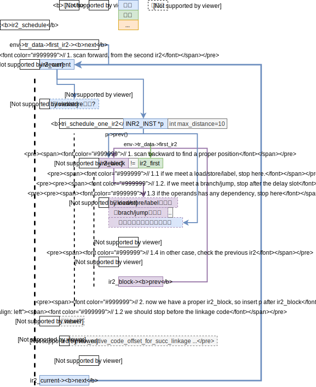

<div style="font-size: 3em; text-align:right;">2019.9.23</div>
# 武成岗

武成岗的[计算所主页](http://sourcedb.ict.cas.cn/cn/jssrck/200909/t20090917_2496741.html)

# EATBit: Effective Automated Test for Binary Translation with High Code Coverage

用随机生成测试集的方式来测试BT。本文第2章有介绍随机生成测试集应用在测试编译器的历史，极具参考意义。遗憾的是本文没有提到他们写的x86tomips的文章。

# X86toMips

看Makefile可知默认的运行平台是龙芯的是龙芯3a（`-march=loongson3a`），因此可以直接在龙芯的机器上编译，或是用交叉编译器。

## 交叉编译

在[龙芯开源社区](http://www.loongnix.org/index.php/首页)-入门里的[所有开源项目](http://www.loongnix.org/index.php/项目)-工具链里的[GCC](http://www.loongnix.org/index.php/GCC)-linux交叉编译里的 gs464核linux交叉编译器（gcc-7.3.1）。

然后，在X86toMips的根目录下搜索“Makefile”，发现有`./tests/Makefile`，`./distorm/Makefile`，`./Makefile`更改CXX和CC变量值为交叉编译器的g++和gcc的路径即可。.

## 在邹旭的龙芯机器上运行

```bash
$ ./dbt64 ../helloworldx86-64 
unrecognizable cpu type: ICT Loongson-3 V0.8  FPU V0.1
```

想看龙芯交叉编译器的manual页的关于`-march=`的说明，却发现根本就是的ARM的版本，都不该一下的，太懒了吧。在邹旭机器上的gcc的manual也是直接用的ARM的manual，太懒了吧。

**查看报unrecognizable cpu type的地方**

用gdb跟踪可以发现是`main/options.cpp: 88`在检查CPU的类型。亲自检视CPU的类型，

```bash
$ cat /proc/cpuinfo
cpu model		: ICT Loongson-3 V0.8  FPU V0.1
model name		: ICT Loongson-3A R2 (Loongson-3A2000) @ 1000MHz
```

所以也应该是3A系类呗，所以在91行添加了语句，

```cpp
strcmp(value, "ICT Loongson-3 V0.8  FPU V0.1\n")==0 || // 这是邹旭的电脑的型号，ICT Loongson-3A R2 (Loongson-3A2000) @ 1000MHz，看样子也是3a。
```

然后重新编译。然后运行，

```bash
$ ./dbt32 ../helloworldx86-64 
dbt: cannot execute: not for x86
```

大概是因为我的helloworld是64位的？

为了能够在x86上编译出32位的程序安装32位的库，

```bash
# 我的x86-64电脑上
sudo apt install gcc-multilib
```

## 代码阅读

总体控制流参照`docs/framework2.vsd`。总体控制流在`main/main.cpp: main`中清晰可见，**注**：下面的list并非一天完成，是每次看到部分都添加上去，主要来自源文件的注释，

1. system initialize
2. parse options
3. load x86 binaries
   1. load x86 main program `@loader/loader.cpp: 1049 ldi_load_x86_binary`
      1. open program
      2. check main program
      3. mmap main program
      4. close file
   2. initialize x86 heap
   3. initialize x86 stack
   4. more steps for dynamically linked x86 program
      1. find elf interp full name
      2. load x86 interpreter
      3. run the program interpreter to load the shared libraries
   5. return the program entry (`<_start>` or `<main>`)
4. adjust options after loader
5. run!
   1. 反编译或者，`@main/exec.cpp: 31 disasemble`
      1. get current tb (to be executed)
      2. execute the current tb
         1. disasm
         2. dump
      3. prepare for the next tb
   2. 静态翻译或者，
   3. 执行

### 3. load x86 binaries

```cpp
ADDRX entry = ld_loader_exec(argc-consumed_argc, argv+consumed_argc);
```

loader的代码位于`loader/loader.cpp`

这个代码的注释风格特别不错，用“@”符号指出了函数所完成的操作，不知道是不是根据某个文档框架的语法规则写的？

<div style="font-size:3em; text-align:right;">2019.9.24</div>
### 4. adjust options after loader

若最开始的翻译块（Translate Block）需要翻译（变量`_translate`），则在此设置好了翻译开始及结束的位置。

可以看到x86二进制文件的信息储存在`include/loader.h： 56 BIN_INFO`类中。

<div style="font-size: 1.5em; color:red;">🤔如何界定翻译块的范围？</div>
<span style="font-size: 1.5em; color:red;">🤔以函数为范围来翻译的？所以需要有识别函数的技术？</span>`main/options.cpp: 520`内容为`FUNC_INFO *p_func = BIN_INFO::get(0)->find_func_info(_translate_func);`

<div style="font-size:3em; text-align:right;">2019.10.8</div>
### `optimization/`

#### ir2_optimization

**一句话总结**：对ir2的优化，让尽可能的先发射load/store指令，**从源码来看没有地方用到过这个优化**。（grep tri_ir2_optimization这个函数即可知道，用GDB也确认过了，break

到``。）

MIPS汇编的操作码定义在`include/ir2.h`中。

在`optimization/ir2_optimization.cpp: 179`看到如果开启了ir2_optimization选项（在dbt64 --help里可以看到选项），才会执行`ir2_schedule`函数。

看了`ir2_schedule`的代码，总体完成的事是把load/store指令尽可能的提前？（不越过其他load/store/branch/jump指令，不超过有和自己有依赖关系的指令。）大体框架如下，



#### flag_pattern

详细设计框架见X86toMips的《Flag_Pattern设计文档》（写的比较详细），这里就不在赘述了。



2019.10.9

`optimization/flag_pattern.cpp`

<span style="font-size:3em; color:red;">🤔</span><span style="font-size:1em; color:red;">Q:代码中多次用到了get_eflag_use即IR1_INST实例中的`_eflag_use`变量。猜想这个变量的意义是该条IR1指令是否使用了eflag寄存器。这个变量在哪里被设置的？（同理猜想`_eflag_def`是否写了eflag寄存器）</span>

* 初步猜想：可能是distorm完成eflag的解析，在distorm转IR1时设置的_eflag_use。

  然而并不是，用gdb，
  
  ```bash
  gdb dbt64
  (gdb) b IR1_INST::disam
  (gdb) r PATH_TO_SOME_X86_ELF
  (gdb) disp (IR1_OPCODE)_opcode
  (gdb) disp _eflag_use
  # 经过多条指令都没发现_eflag_use和_eflag_def有变化，其中包括了我看到了add和and指令。
  ```

2019.10.10

在`optimization/flag_pattern.cpp: 517`判断保存源或目的操作数，为什么模拟x86标志位需要保存操作数呢？看《Flag_Pattern设计文档》有提到，

```assembly
# x86汇编
CMP %eax %ebx
...
JZ label
# 可以变为MIPS汇编
BNE ra rb label
```

~~由此，上面的`CMP`会pending，即等待后面的指令（JZ）和它融合。这一点，这代码`optimization/flag_pattern.cpp: 534`似乎是一致的。~~我也没看明白。

从《Flag_Pattern设计文档》的2.3.1总体框架图得知，优化是在IR1翻译到IR2的过程中完成的。上面的步骤只是在收集信息。

实际的优化在`translator/`下，均以translate_INST命名，比如`cmp`语句在`translator/tr_arith.cpp`中。

**注**：《Flag_Pattern设计文档》提到的convert_cmp函数并不存在，应该是改为了translate_cmp。Convert_Instruction也不存在。通过gdb在convert_cmp处打断`b translator/tr_arith.cpp:130`发现根本没调用这个函数？？？

下面是`b translator/tr_arith.cpp: 228 translate_imul`函数的调用栈，

```
#0  translate_imul (pir1=0xdbc341d8) at translator/tr_arith.cpp:232
#1  0x00000000d012006c in translate_imul_byhand_32 (pir1=0xdbc341d8)
    at translator/tr_arith_byhand.cpp:821
#2  0x00000000d0120160 in translate_imul_byhand (pir1=0xdbc341d8)
    at translator/tr_arith_byhand.cpp:833
#3  0x00000000d010f9d0 in IR1_INST::translate (this=0xdbc341d8)
    at translator/translate.cpp:603
#4  0x00000000d010fdcc in TB::ir2_generate (this=0xd03198b0 <TB::_tb_array+19152>)
    at translator/translate.cpp:658
#5  0x00000000d0112020 in TB::translate (this=0xd03198b0 <TB::_tb_array+19152>)
    at translator/translate.cpp:1029
#6  0x00000000d00b85d4 in TB::exec (this=0xd03198b0 <TB::_tb_array+19152>)
    at main/exec.cpp:84
#7  0x00000000d00b8120 in exec (start_addr=134514480, end_addr=4294967295)
    at main/exec.cpp:26
#8  0x00000000d00b8f18 in main (argc=2, argv=0xffffffb228) at main/main.cpp:75
```

##### translate_cmp

2019.10.11

**目标**：弄清`translator/tr_arith.cpp: 130~145 translate_cmp`的功能。

追踪翻译cmp语句的代码，在`translator/tr_arith.cpp0: 135 ra_alloc_itemp`里`translator/reg_alloc.cpp: 91~96`，p是指针的意思吗？~~93行的1024是指一个TB最大只能容纳1024个IR2吗。~~**最大支持1024个临时寄存器！**

从`include/translate.h: 1048~1049`可以看出itemp的意思为Integer TEMPorary register，（ftemp的f为Floating-point）。

所以函数ra_alloc_itemp完成了给ra寄存器分配了一个临时寄存器的工作。

想要知道`translator/tr_arith.cpp: 136 fp_save_src_opnd`的功能，这里函数的参数是IR1_INST *pir1, IR2_OPND src0, IR2_OPND src1，src0和src1是IR2表示，而pir1是IR1表示。src0和src1是在132和133行从pir1中读取出来的，因此想知道新生成的IR2操作数对应的MIPS寄存器是什么或者是个立即数吗？是不是和IR1中操作数是寄存器或是立即数相关？是不是应该看看load_ireg_from_ir1函数？先用GDB看看fp_save_src_opnd函数的里各个变量的情况吧，

```bash
# 在dbt5_ut目录下
(gdb) b optimization/flag_pattern.cpp:fp_save_src_opnd(IR1_INST*, IR2_OPND, IR2_OPND)
(gdb) r arith/cmp -f fp
# 经过几次continue看到了某一次没有从optimization/flag_pattern.cpp: 727行返回
(gdb) p (IR1_OPCODE)pir1->_opcode
# 指令类型 x86_cmp
(gdb) p src0和1->_reg_num
# 操作数的寄存器号 2和0
(gdb) p *item
# flag pattern的信息{head = 0xdbc2e1b8, tails = {0xdbc2e1e0, 0x0, 0x0}, dest_reg_num = 0, src0_reg_num = -1, src1_reg_num = -1, skipped_flags = 9 '\t'}
```

2019.10.12


然后再看`translator/tr_arith.cpp:132 load_ireg_from_ir1`是不是有把IR1指令的X86寄存器操作书映射到IR2的MIPS寄存器上去，如我的想的一样在其定义上面的注释里`translator/tr_opnd_process.cpp: 809 load_ireg_from_ir1`描述了这个函数的功能。这里还提到了两个没在文档中提到的概念temp register和mapped register。目前我看了x86指令的操作数来源于通用寄存器的情况。（**注**：x86里只有8个通用寄存器）这里打代码把8个通用寄存器一一映射到了MIPS的寄存器中（**注**：MIPS有32个通用寄存器），映射数组{2,3,1,19,20,21,22,23}。举个例子，把x86的7号通用寄存器映射到了MIPS的23号通用寄存器上。

x86的寄存器操作数可能有8低位、8高位、16位、32位和64位这五种情况。需要根据指令的含义进行扩展。看源码里写的64位是不用扩展的（`translator/tr_opnd_process.cpp: 328 // 2. 64 bits gpr needs no extension`），所以是不是可以从这里看出这个dbt只支持64位的龙芯电脑？（即只能用dbt64？）

<span style="font-size:3em;">😃</span>一个很有趣的函数`translate_cmp`-`generate_eflag_calculation`-`generate_pf`-`load_ireg_from_addr`-`load_ireg_from_imm64`。这个函数把一个64位的存入一个指定的寄存器中。看起来很简单的功能，但是这个函数的过程相当的冗长！期间多次调用了`load_ireg_from_imm32`，其中多比较16位立即数并调用左移指令和ori（立即数或指令）。<span style="color:red">这是为什么呢？✔️猜想是龙芯只能支持16的立即数。</span>可以参考《计算机体系结构》63页的MIPS指令编码格式32位MIPS指令分为R型、I型和J型（Regeister, Immediate, Jump）其中I型的立即数长度为16bit，和[《龙芯 3A3000/3B3000 处理器用户手册 下册》](../../BOOKS/Assembly/Loongson3A3000_3B3000user2.pdf)19页对ori指令的描述。详细问了李亚伟师兄，指令编码的问题需要向IP组的人请教。那请及时总结一下问题！**想问IP组的问题：如何把一个64位立即数存进寄存器里？** **A**：可以用伪汇编代码，不过编译器展开后也是用多条指令拼凑出来的。指令编码格式参见[《MIPS® Architecture For Programmers Volume II-A: The MIPS64® Instruction Set》](../../BOOKS/Assembly/MIPS_Architecture_for_Programmers_Volume_II-A_the_MIPS64_Instructio_Set_Volume_II-A_MD00087-2B-MIPS64BIS-AFP-03.02.pdf)。

generate_pf函数，生成parity flag的代码，详细6个flag的意义可以参考https://stackoverflow.com/questions/43841172/how-cmp-assembly-instruction-sets-flags-x86-64-gnu-linux，把这个回答的关键部分复制如下，

```
CF - 1 if unsigned op2 > unsigned op1
OF - 1 if sign bit of OP1 != sign bit of result
SF - 1 if MSB (aka sign bit) of result = 1
ZF - 1 if Result = 0 (i.e. op1=op2)
AF - 1 if Carry in the low nibble of result
PF - 1 if Parity of Least significant byte is even
```

所以pf是只管最低位的。注意AT&T格式下，操作数顺序的问题，上面的回答中也提到了这个问题，（我就是没注意到操作数顺序问题，所以一直在测试程序上出错，测试程序如下，

```c
#include<stdio.h>

int main(void)
{
        int a = 0x2;
        int b = 0x0;
        int res = 1;
        asm(
                // 注意AT&T格式操作数顺序
                // cmp %2, %1表示比较%1-%2的结果 
                "cmp %2, %1\n\t"
                "jp even\n\t"
                "odd: \n\t"
                "dec %0\n\t"
                "even:\n\t"
                :"+r"(res)
                :"r"(a),"r"(b)
           );
        if(res)
                printf("even\n");
        else
                printf("odd\n");
}
```

最后，每个申请的临时寄存器都有被释放掉（虽然现在这个半成品代码还没写释放的代码，所以临时寄存器数量不超，那就可以正常运行）。

整个translate_cmp的流程图总结到了translate_cmp的小标题下，完成于2019.10.12日23点。该休息了。

## 程序运行

### 关于之前dbt64运行报错`dbt: cannot execute: not for x86`

问题详细是：`dbt5_ut`里的测试文件dbt64就都可以跑，但是自己随便写的helloworld就跑不了。

* 32位helloworld显示，

  ```
  [  0.008] [32088]  assertion failed in <sci_mmap_fixed_within_one_mips_page> syscall/sc_mmap.cpp:486 mprotect error: Cannot allocate memory
  Aborted (core dumped)
  ```

* 64位helloworld显示，

  ```
  dbt: cannot execute: not for x86
  ```

今天终于找到了一部分原因！在`dbt5_ut/`的各个测试集的目录中的makefile，比如`dbt5_ut/arith/Makefile`调用了`../Makefile.sub`文件。这个文件中写明了编译参数为，

```bash
-g -m32 -static -Wall -I../headers
```

**所以dbt64是在64位loongson机器上运行的意思？，dbt只能运行32位程序？**

### ✔️运行Whetstone

<u>**Double Precision Benchmark**</u>

**x86的表现**，

```bash
gcc -g -m32 -static ./whetstone.c -lm -o whetstone
Loops: 300000, Iterations: 1, Duration: 14 sec.
C Converted Double Precision Whetstones: 2142.9 MIPS
```

**loongson上dbt64的表现**，4.67%

```bash
dbt64 whetstone
# dbt64 whetstone -f fp -f bt # 开启flag pattern和by-hand translation的结果和没开一样
Loops: 20000, Iterations: 1, Duration: 20 sec.
C Converted Double Precision Whetstones: 100.0 MIPS
```

**loongson上gcc编译的表现**，13.33%

```bash
gcc -g -static whetstone.c -o whetstoneLoongson -lm
Loops: 20000, Iterations: 1, Duration: 7 sec.
C Converted Double Precision Whetstones: 285.7 MIPS
```

### ❌运行Dhrystone

**解决编译问题**

直接编译会提示没有定义HZ和重复定义了times()，

于是在`dhry.h`里添加定义，

```c
// 阅读dhry.h的值是60,不知道有没有问题，先这样写着吧
#define HZ 60
```

在`dhry_1.c`注释掉了48行，

```c
extern  int     times ();
```

---

看了clinpack.c的源码的注释，现在算是明白`dhry.h`一开始的注释的意思了！`-D`是加在编译器里的选项！而不是要我到源码里去定义！格式为`-D name`或`-D name=definition`，详细见gcc的manual。

**x86的表现**，

```bash
gcc -g -m32 -static dhry_1.c dhry_2.c -o dhrystone
./dhrystone
# 输入100000000（1e8)
# 详细输出略
Microseconds for one run through Dhrystone:    0.1 
Dhrystones per Second:                      6726457.5
```

**loongson上dbt64出错**，

```bash
[  8.813] [6406]  assertion failed in <get_dest_opnd_implicit> ir1/ir1.cpp:2191 the implicit dest operand information is not available for CDQ
Aborted (core dumped)
```

**loongson上gcc的表现**，8.69%

```bash
gcc -g -static dhry_1.c dhry_2.c -o dhrystoneLoongson
./dhrystone
# 输入10000000（1e7)
# 详细输出略
Microseconds for one run through Dhrystone:    1.7 
Dhrystones per Second:                      584795.3
```

### ❌Linpack

按照源码开头的注释的提示，

> You must specify one of -DSP or -DDP to compile correctly.
>
> You must specify one of -DROLL or -DUNROLL to compile correctly.

```bash
gcc -D DP -D ROLL -static -m32 ./clinpack.c -o clinpack -lm
```

仍然还有一处错误，在899行getrusage类型冲突。感觉这种语法好奇怪，是C语言中的古文吗，感觉Dhrystone里是不是也是这样的错误？查看了下getrusage的man page，只要include了sys/time.h>和<sys/resource.h>就好，所以直接注释掉了899行的这一句，即可成功编译。执行次数在42行修改。

x86的表现，

```bash
./clinpack
# 详细结果略
Rolled Double  Precision 551749 Kflops ; 10000 Reps
```

loongson上dbt64输出结果存在问题，手机计时38秒（单精度也出错）

```bash
Rolled Double  Precision -2147483648 Kflops ; 1000 Reps
```

loongson上gcc编译运行的表现，50秒

```bash
gcc -D DP -D ROLL -static ./clinpack.c -o clinpackLoongson -lm
./clinpackLoongson
Rolled Double  Precision 30085 Kflops ; 1000 Reps 
```

### ❌静态翻译

2019.10.10

尝试静态翻译whetstone，失败。总结

```bash
dbt64 -s whetstone
# 很多信息略
[  0.006] [4294]  assertion failed in <translate> static/static.cpp:22
```

<div style="font-size:3em; text-align:right;">2019.10.9</div>
## GDB调试

### 打印IR1的操作码

被这个问题困扰了一会，现在看来主要还是因为不熟悉**枚举类型**的用法！

看`ir1/ir1.cpp: 1846`有用到_opcode和枚举类型`OPCODE`的一个变量的比较。详细看`opcode()`函数的定义可知，

```c++
(IR1_OPCODE)_opcode
```

<div style="font-size:1em; color:red;">🤔1801行如何把distorm的opcode转为IR1的_opcode我还不太懂，主要是opmap_distorm_to_ir1这很长的字符串的意义是啥不知道。</div>
<div style="font-size:3em; text-align:right;">2019.10.14</div>
## 疑惑

### 🤔临时寄存器的分配算法

**起因**：这个问题最开始是产生于在看translate_cmp代码时，看到了分配itemp的函数（ra_alloc_itemp）时想到这个代码如何把至多1024个临时寄存器映射到仅有的32个寄存器里去的？且回收itemp的函数完全是空的，这样没有问题吗？

**解决过程**：想去找itemp的寄存器如何生成代码的。

1. 首先觉得可能的地方是`ir2/ir2.cpp: 914 dump`调用了IR2_INST::to_string调用了IR2_OPND::to_string。其中若IR2_OPND是临时寄存器的话，将生成字符串`\033[3%dmitmp%d\033[m`，俩参数为base_reg_num()%6+1, base_reg_num()。查了一下`\033[`是用于控制linux终端字符的格式的，所以这个dump大概是用终端来输出的，且这里的临时寄存器并没有涉及分配的算法，而是直接输出的itmp加临时寄存器号。测试了一下这里的代码的输出格式，

   ```c
   #include<stdio.h>
   int main(void)
   {
           printf("imm(\033[1mitmp1024\033[m)\n");
           printf("imm(\033[2mitmp1024\033[m)\n");
           printf("imm(\033[3mitmp1024\033[m)\n");
           printf("imm(\033[4mitmp1024\033[m)\n");
           printf("imm(\033[5mitmp1024\033[m)\n");
           printf("imm(\033[6mitmp1024\033[m)\n");
           return 0;
   }
   ```

   效果如下，依次为`\033[1m`到`\033[6m`（**注**：终端的edit里的复制html，在typora里blink效果失效了，就是一闪一闪的效果），

   <div>
       <pre><b>itmp1024</b>, 编码\033[1mitmp1024\033[m
   <font color="#9F9F9D">itmp1024, 编码\033[2mitmp1024\033[m</font>
   <i>itmp1024</i>, 编码\033[3mitmp1024\033[m
   <u style="text-decoration-style:single">itmp1024</u>, 编码\033[4mitmp1024\033[m
   <blink>itmp1024</blink>, 编码\033[5mitmp1024\033[m
   itmp1024, 编码\033[6mitmp1024\033[m
   </pre>
   </div>

2. 然后看到了`ir2/ir2.cpp: 933~951 IR2_INST::append`把该条指令加入到当前tr_data里。很好奇env这个环境的详细实现，于是去看了代码（声明位于`include/main.h: 64`）其语法第一次见很是奇怪，（**注**：实际执行的是下面代码的第4行）

   ```c++
   #ifdef _NEVER_DEFINED_ 
   register ENV *env;  // to cheat sourceinsight
   #else
   register ENV *env asm("s2");  // sourceinsight cannot recognize such variable
   #endif
   ```

   其中register是建议编译器使用寄存器保存这个变量，而后面的asm是干嘛的？用clang来分析语法树，

   ./main.h.env.test.h代码如下
   ```c++
   class ENV;
   register ENV *env asm("rax");
   ```

   ```bash
   clang++ -Xclang -ast-dump -fsyntax-only ./main.h.env.test.h
   ```

   输出结果如下
   <div>
       <pre>clang: <font color="#AD7FA8"><b>warning: </b></font>treating &apos;c-header&apos; input as &apos;c++-header&apos; when in C++ mode, this behavior is deprecated [-Wdeprecated]
   <b>./main.h.env.test.h:5:23: </b><font color="#EF2929"><b>error: </b></font><b>unknown register name &apos;s2&apos; in asm</b>
   register ENV *env asm(&quot;s2&quot;);  // sourceinsight cannot recognize such variable
   <font color="#8AE234"><b>                      ^</b></font>
   <font color="#8AE234"><b>TranslationUnitDecl</b></font><font color="#C4A000"> 0x557e50f914b8</font> &lt;<font color="#C4A000">&lt;invalid sloc&gt;</font>&gt; <font color="#C4A000">&lt;invalid sloc&gt;</font>
   <font color="#3465A4">|-</font><font color="#8AE234"><b>TypedefDecl</b></font><font color="#C4A000"> 0x557e50f91a70</font> &lt;<font color="#C4A000">&lt;invalid sloc&gt;</font>&gt; <font color="#C4A000">&lt;invalid sloc&gt;</font> implicit<font color="#34E2E2"><b> __int128_t</b></font> <font color="#4E9A06">&apos;__int128&apos;</font>
   <font color="#3465A4">| `-</font><font color="#4E9A06">BuiltinType</font><font color="#C4A000"> 0x557e50f91750</font> <font color="#4E9A06">&apos;__int128&apos;</font>
   <font color="#3465A4">|-</font><font color="#8AE234"><b>TypedefDecl</b></font><font color="#C4A000"> 0x557e50f91ae0</font> &lt;<font color="#C4A000">&lt;invalid sloc&gt;</font>&gt; <font color="#C4A000">&lt;invalid sloc&gt;</font> implicit<font color="#34E2E2"><b> __uint128_t</b></font> <font color="#4E9A06">&apos;unsigned __int128&apos;</font>
   <font color="#3465A4">| `-</font><font color="#4E9A06">BuiltinType</font><font color="#C4A000"> 0x557e50f91770</font> <font color="#4E9A06">&apos;unsigned __int128&apos;</font>
   <font color="#3465A4">|-</font><font color="#8AE234"><b>TypedefDecl</b></font><font color="#C4A000"> 0x557e50f91e28</font> &lt;<font color="#C4A000">&lt;invalid sloc&gt;</font>&gt; <font color="#C4A000">&lt;invalid sloc&gt;</font> implicit<font color="#34E2E2"><b> __NSConstantString</b></font> <font color="#4E9A06">&apos;__NSConstantString_tag&apos;</font>
   <font color="#3465A4">| `-</font><font color="#4E9A06">RecordType</font><font color="#C4A000"> 0x557e50f91bd0</font> <font color="#4E9A06">&apos;__NSConstantString_tag&apos;</font>
   <font color="#3465A4">|   `-</font><font color="#8AE234"><b>CXXRecord</b></font><font color="#C4A000"> 0x557e50f91b38</font><font color="#34E2E2"><b> &apos;__NSConstantString_tag&apos;</b></font>
   <font color="#3465A4">|-</font><font color="#8AE234"><b>TypedefDecl</b></font><font color="#C4A000"> 0x557e50f91ec0</font> &lt;<font color="#C4A000">&lt;invalid sloc&gt;</font>&gt; <font color="#C4A000">&lt;invalid sloc&gt;</font> implicit<font color="#34E2E2"><b> __builtin_ms_va_list</b></font> <font color="#4E9A06">&apos;char *&apos;</font>
   <font color="#3465A4">| `-</font><font color="#4E9A06">PointerType</font><font color="#C4A000"> 0x557e50f91e80</font> <font color="#4E9A06">&apos;char *&apos;</font>
   <font color="#3465A4">|   `-</font><font color="#4E9A06">BuiltinType</font><font color="#C4A000"> 0x557e50f91550</font> <font color="#4E9A06">&apos;char&apos;</font>
   <font color="#3465A4">|-</font><font color="#8AE234"><b>TypedefDecl</b></font><font color="#C4A000"> 0x557e50fc8d38</font> &lt;<font color="#C4A000">&lt;invalid sloc&gt;</font>&gt; <font color="#C4A000">&lt;invalid sloc&gt;</font> implicit<font color="#34E2E2"><b> __builtin_va_list</b></font> <font color="#4E9A06">&apos;__va_list_tag [1]&apos;</font>
   <font color="#3465A4">| `-</font><font color="#4E9A06">ConstantArrayType</font><font color="#C4A000"> 0x557e50fc8ce0</font> <font color="#4E9A06">&apos;__va_list_tag [1]&apos;</font> 1 
   <font color="#3465A4">|   `-</font><font color="#4E9A06">RecordType</font><font color="#C4A000"> 0x557e50f91fb0</font> <font color="#4E9A06">&apos;__va_list_tag&apos;</font>
   <font color="#3465A4">|     `-</font><font color="#8AE234"><b>CXXRecord</b></font><font color="#C4A000"> 0x557e50f91f18</font><font color="#34E2E2"><b> &apos;__va_list_tag&apos;</b></font>
   <font color="#3465A4">|-</font><font color="#8AE234"><b>CXXRecordDecl</b></font><font color="#C4A000"> 0x557e50fc8d90</font> &lt;<font color="#C4A000">./main.h.env.test.h:1:1</font>, <font color="#C4A000">col:7</font>&gt; <font color="#C4A000">col:7</font> referenced class<font color="#34E2E2"><b> ENV</b></font>
   <font color="#3465A4">`-</font><font color="#8AE234"><b>VarDecl</b></font><font color="#C4A000"> 0x557e50fc8f38</font> &lt;<font color="#C4A000">line:5:1</font>, <font color="#C4A000">col:15</font>&gt; <font color="#C4A000">col:15</font><font color="#34E2E2"><b> env</b></font> <font color="#4E9A06">&apos;ENV *&apos;</font> register
   <font color="#3465A4">  `-</font><font color="#729FCF"><b>AsmLabelAttr</b></font><font color="#C4A000"> 0x557e50fc8f98</font> &lt;<font color="#C4A000">col:23</font>&gt; &quot;s2&quot;
   1 error generated.</pre>
   </div>

   可见asm关键字指明了env使用s2寄存器。

   <span style="font-size:1em; color:red;">✔️🤔s2是什么寄存器？MIPS的寄存器的汇编代码别名可以在哪里看到？</span>询问李亚伟师兄得知了可以在Linux-mips内核代码里看到，他把这个头文件[mipsreg.h](../../BOOKS/Assembly/mipsreg.h)通过龙芯邮箱发给了我 。所以s2对应的是**第18号寄存器**。

   然后去查看ENV类的成员tr_data，其类型为类TRANSLATION_DATA。其中TRANSLATION_DATA类位于`include/translate.h: 1024~1064`包含一个列表用来记录已经翻译成IR2，first_ir2和last_ir2（已经记录到 [重要类关系图.drawio](pictures/重要类关系图.drawio) ）。在这个文件的1071行出现了一个叫做tr_ir2_assemble的函数，~~很有可能~~的确是将IR2转换为MIPS汇编的函数，其定义位于`translator/translate.cpp: 273~311`。这段代码遍历了一遍IR2列表（first_ir2），调用了IR2_INST的assemble函数，将汇编结果存储在了制定位置。

   IR2_INST::assemble函数（位于`ir2/ir2_assemble.cpp: 731~771`已经记录到 [重要类关系图.drawio](pictures/重要类关系图.drawio)）。从gm_format_table这个数组看出第二项（即GM_MIPS_OPCODE_FORMAT类的uint32 mode成员变量）即没填入操作数的汇编指令。例：add的操作数为零的话（对应于`ir2/ir2_assemble.cpp: 137`，见 [MIPS_Architecture_for_Programmers_Volume_II-A_the_MIPS64_Instructio_Set_Volume_II-A_MD00087-2B-MIPS64BIS-AFP-03.02.pdf](../../BOOKS/Assembly/MIPS_Architecture_for_Programmers_Volume_II-A_the_MIPS64_Instructio_Set_Volume_II-A_MD00087-2B-MIPS64BIS-AFP-03.02.pdf)的49页），即是`0x00000020`。

   正常的寄存器操作数的类型（比如add指令）会走`ir2/ir2_assemble.cpp: 763`这个case，于是进入set_operand_into_instruction函数（位于`ir2/ir2_assemble.cpp: 684~728`，就是直接把IR2_INST的操作数写到指令对应的位置去了而已，没有看到处理临时寄存器的代码

   🤔有点意思，那处理临时寄存器的代码在哪里呢？

3. 没办法了。那就从dbt运行过程着手吧。搜索tr_ir2_assemble函数，在TB::translate函数`translator/translate.cpp: 1004~1056`里发现了它。


### ✔️append_ir2的参数顺序和MIPS指令编码的参数顺序一致吗？

**注**：总体可以参考[临时寄存器的分配算法](#临时寄存器的分配算法)里对gm_format_table的思考。

**答**：不一致，但是append_ir2的参数顺序和MIPS汇编的参数顺序一致。

**起因**：IR2_INST* append_ir2(IR2_OPCODE opcode, IR2_OPND opnd0, const IR2_OPND opnd1, const IR2_OPND opnd2)函数里的opnd0, 1, 2哪个才是目的操作数？

**解决**：这里提到了3个概念，

1. append_ir2的参数顺序

   即append_ir2的签名里的参数的顺序，即opnd0，opnd1，opnd2（**注**：此签名对应R型指令）

2. MIPS指令编码的参数顺序，**注**：可以参考MIPS指令手册，X86toMips里的编码位于`ir2/ir2_assemble.cpp: 109~680`，

   以R-型指令为例，

   ```
      3 3 2 2 2 2 2 2 2 2 2 2 1 1 1 1 1 1 1 1 1 1 0 0 0 0 0 0 0 0 0 0
      1 0 9 8 7 6 5 4 3 2 1 0 9 8 7 6 5 4 3 2 1 0 9 8 7 6 5 4 3 2 1 0
     +-----------+---------+---------+---------+---------+-----------+
   R |  OPCODE   |   RS1   |   RS2   |   RD    |   SA    |    OPX    |
     +-----------+---------+---------+---------+---------+-----------+
   ```

3. MIPS汇编的参数顺序

   以ADD为例，ADD rd, rs, rt（rs和rt分别对应上表的RS1和RS2）

<div style="font-size:3em; text-align:right;">2019.10.15</div>
## 静态翻译

用dbt静态翻译汇编helloworld程序，源码和编译方法见 [QEMU的笔记](../QEMU/logs.md) ，会出现错误，最终目标是希望能修补这个错误，

```bash
dbt -s returnIntx86
```

<div>
    <pre>main_file name: hellox86
Will map this file, size: 0x274
first loadable seg map_base: 0x8048000, vaddr: 0x8048000
text segment: 0x8048000------0x8048096
map base: 0x8048000
******add TU entry of main, init, fini******

entry_addr: 0x8048074

******Found symtab: 0x80480a4******
******symtab finished******
tu_addr add finished, tu_addr_num : 3
[  0.004] [19764] <font color="#CC0000"> assertion failed in &lt;translate&gt; static/static.cpp:221 </font>
Aborted (core dumped)</pre>
</div>

用gdb在`SBT_FILE::translate`处打断点，发现`_text_start = 0x8048000`和`_text_end = 0x8048096`都没问题，但是，`tu_addr = {0xbb000000, 0xcd000000, 0xba080490}`问题很大。于是应该去看看`find_tu_addr_from_symtab_and_plt`函数。

### `find_tu_addr_from_symtab_and_plt`

`static/static.cpp: 163~190`

这个函数写的太蠢了，竟然一定想要找到`main`, `_init`, `_fini`这三个函数，并且这三个函数的相对`_start`是写死的。让我先把static整体的执行思路（即`SBT_FILE::translate`函数的流程）看完在来想如何改这个代码吧。

<span style="font-size:3em;">😃</span>一个有趣的地方：在`find_tu_addr_from_symtab_and_plt`里看到了宏read_ADDRX其对应的函数位于`include/main.h: 98~106`，功能为从一个非对齐内存读数，

```c++
static inline uint64 read_uint64(void* addr) {
    uint64 value;
    __asm__(
        "ldr    %0, (%1)  \n\t"
        "ldl    %0, 7(%1) \n\t"
        :"=&r"(value) :"r"(addr) :
    );
    return value;
}
```

ldr和ldl就是组合起来读取一个未对齐的内存地址的值。可是问题是ldl的常量是7而不是8？ 简单的说是因为ldr和ldl的语义，用区间表示即（**大尾端**），
$$
一个未对齐的内存地址范围 = \left[ldl_{EffAddr},对齐边界左\right]\cup\left[对齐边界右,ldr_{EffAddr}\right]
$$
因为都是闭区间，读得是64bits的数即8bytes，所以
$$
ldr_{EffAddr}-ldl_{EffAddr}=7
$$
详细见[MIPS_Architecture_for_Programmers_Volume_II-A_the_MIPS64_Instructio_Set_Volume_II-A_MD00087-2B-MIPS64BIS-AFP-03.02.pdf](../../BOOKS/Assembly/MIPS_Architecture_for_Programmers_Volume_II-A_the_MIPS64_Instructio_Set_Volume_II-A_MD00087-2B-MIPS64BIS-AFP-03.02.pdf) 的195页。

<span style="font-size:3em;">✒️1</span>将`static/static.cpp:173~183`注释掉，只把`_start`的地址写入tu_addr，即添加，

```c++
    ADDRX _start_map_address = convert_vaddr_to_actual_map_addr(_start);
    tu_addr.push_back(_start_map_address);
```

编译运行dbt来静态翻译hellox86，结果如下，

<div>
    <pre>dbt -s ./hellox86 
main_file name: ./hellox86
Will map this file, size: 0x274
first loadable seg map_base: 0x8048000, vaddr: 0x8048000
text segment: 0x8048000------0x8048096
map base: 0x8048000
******add TU entry of main, init, fini******

entry_addr: 0x8048074

******Found symtab: 0x80480a4******
******symtab finished******
tu_addr add finished, tu_addr_num : 1


tu_addr disasm finished, build_tu_num : 2, will begin translate!

[  0.005] [29291] <font color="#CC0000"> assertion failed in &lt;translate&gt; static/sbt_translate.cpp:15 </font>
Aborted (core dumped)</pre>
</div>

检查TU的FU_TOP_PROPAGATED位并没有被置1。grep发现只有`static/tu.cpp: 373~400 TU::top_propagate`的374行对这个标志位进行操作。grep发现唯一调用这个函数的是在`/translator/translate.cpp: 1010`且是不会执行的（用了`#if 0`）？？！！

~~<span style="font-size:3em;">✒️2</span>~~干脆把`static/sbt_translate.cpp:15`注释掉好了。

感觉还是应该搞清楚top propagate是什么才行。

### ✔️TOP是什么？

为了搞清楚top propagate，有必要知道top的意义。grep搜索看到了env里有set_top函数。

在`include/env.h:538~556`有很多关于top的函数，且注释说是FPR functions。

在`include/env.h:46`看到了FPR类的定义，其声明在`include/ir1.h：264`，且ENV类开头`include/env.h:448`声明了一个FPR数组，长度为8，所以FPR应该是x86的浮点寄存器。

看着`include/env.h:546～547`是对top在0到7之间的循环加减操作，

```c++
void dec_top() {set_top( (top()-1)&7 );}
void inc_top() {set_top( (top()+1)&7 );}
```

突然觉得这就像是一个队列一样的结构。突然想起在`docs/`文件夹下有看到shadow stack和floating point stack（但当时只查了shadow stack的作用（大概是再建立一个栈用于和原栈比对，保护免受栈溢出之类的攻击）没查到floating point stack相关的内容。这个top会不会就是这个被我忽略的floating point stack呢？

<div style="font-size:3em; text-align:right;">2019.10.16</div>
对，正如我所回忆起的东西，浮点栈应该是在汇编课上讲过的吧。详细内容参考 [intel-manual-325462-sdm-vol-1-2abcd-3abcd.pdf](../../BOOKS/Assembly/intel-manual-325462-sdm-vol-1-2abcd-3abcd.pdf) 的8.1.2x87 FPU Data Registers。

> The x87 FPU instructions treat the eight x87 FPU data registers as a register stack (see Figure 8-2). All addressing of the data registers is relative to the register on the top of the stack. The register number of the current top-of-stack register is stored in the TOP (stack TOP) field in the x87 FPU status word. Load operations decrement TOP by one and load a value into the new top-of-stack register, and store operations store the value from the current TOP register in memory and then increment TOP by one. (For the x87 FPU, a load operation is equivalent to a push and a store operation is equivalent to a pop.) Note that load and store operations are also available that do not push and pop the stack.

**注**：x86浮点处理部件的status寄存器中有很多位，TOP占3个bit，还有很多位，在我看来就是浮点部件的eflags寄存器。

### `TU::top_propagate`

`static/tu.cpp: 373~400`

通过`static/tu.cpp: 381`调用的top_calculation，找到其定义位于`ir1/tb.cpp: 613~664`其中有很多注释都提到了FPR，所以我关注的FU_TOP_PROPAGATED就是浮点处理器的状态寄存器的TOP域了。所以所FU应该是Floating Unit的缩写咯。

接下来下详细看`TU::top_propagate`这个函数。

在[dbt5总体设计文档.docx](../../../Codes/X86toMips/docs/dbt5总体设计文档.docx)的3.2.7优化模块找到了，

> | 子模块名   | 功能需求                                                     | 接口程序（表单）                                             |
> | ---------- | ------------------------------------------------------------ | ------------------------------------------------------------ |
> | 浮点栈优化 | 使用8个固定的浮点寄存器模拟x86的浮点栈，使得相连的基本块内对浮点寄存器的操作不必每次都从内存读入数据。 | get_ST<br/>store_ST_New<br/>store_STi<br/>load_ST_New<br/>load_STi<br/>adjust_Top |

总的看来，这个top_propagate的函数注释太少想要明确搞清楚每个变量的意义需要费些力气。所以从设计者的角度揣摩一下这个函数总体的设计思路，来推测这些函数的功能。

#### top_propagate设计推测

top_propagate是一个计算各个翻译块入口处top域的值和各个翻译块出口处top域的值，这大概是对应TB类里`_top_in`和`_top_out`这俩成员变量。对于一个翻译块，可以先独立的算出`_top_in`和`_top_out`的差，然后通过块之间顺序的关系来计算出每个块具体的值（**注**：块之间是单纯的线性顺序关系则所有块的`_top_in`和`_top_out`可以完全确定；若是有分叉且分叉后需要汇合，那么**汇合处的块**需要特别处理）。

独立的算出`_top_in`和`_top_out`的差的工作大概是`ir1/tb.cpp: 613~664 TB::top_calculation`的工作，由`ir1/tb.cpp: 661`的代码，

```c++
assertm(largest_fpr_num + _min_fpr_num <= 8, "fpu stack overflow!\n");
```

~~猜测此处的min应该是minus的缩写而不是minimal的缩写（因为做减法才能知道是否会溢出，所以这里的`_min_fpr_num`应该是负数）。由此看来，~~见下文对`_min_fpr_num`考察内容总结成的例子，便能一目了然，

~~`_min_fpr_num` = `_top_out` - `_top_in`~~

目前来说还是猜测，只要能够找到**类似上面这个表达式的代码**且能找到对**第一个翻译块**的处理的代码就能证明上面的推测是正确的。

##### 寻找证据

在`static/tu.cpp: 386`注释里提到，

> // 2. first find the entry_tb of this tu 

所以这个是在找**第一个翻译块**！然后392行的注释提到了从地一个翻译块开始传播，且提到了**TB前面的块可能不确定**，

> // 3. propagate top from entry_tb, propagation may stop at call_fallthru_tb or tb that is the succ of tb_has_uncertain_top_instr

395行的注释提到了不确定性的猜测，这个代码之后再来关注吧。

> // 4. guess top of fallthru from call or reverse, according to the guess_top_level_set

详细阅读传播的代码，位于`static/sbt_translate.cpp: 157~248 TB::top_propagate(TU* ptu, int8 top, void *vecor_ptr)`。猜测`_top_in`的值为-1表示这是地一个翻译块，0表示这个块还没初始化。从173和182行看出`_min_fpr_num`不是我所想的`_top_in`和`_top_out`的差值，`_top_increment`才是这个意思。那么`_min_fpr_num`究竟是什么意思呢？

###### _min_fpr_num的意思

有必要分析一下`ir1/tb.cpp: 613~665 TB::top_calculation`中计算的`_min_fpr_num`的意义。首先分析各个开头出现3个变量（`current_fpr_num`, `largest_fpr_num`, `smallest_touched_fpr`）的数据流来判断他们的意义。

**`current_fpr_num`的意义**，表示寄存器的净使用量，若为正则总体使用的寄存器数量增多，若为负则总体使用的寄存器数量减少，（下面是详细分析）

```c++
// current_fpr_num的数据流
for(TB里的每一条ir1)
	int current_fpr_num = 0;    // assume the input fpr number is 0
	current_fpr_num -= pir1->top_increment();
```

关于top_increment的意义，看它的源码`include/ir1.h: 707`为`return increase_of_fpu_instructions[opcode()-x86_fadd].top_increment;`这是能够从命名上看出大概意思为返回一条ir1执行后对top值的改变。但increase对于一个栈来所究竟是pop（top增）还是push（栈里的元素增）呢？在`ir1/ir1.cpp: 2311~2395`可以看到`FPU_NEED_MIN_FPR increase_of_fpu_instructions[]`的内容，其中`FPU_NEED_MIN_FPR`是个结构体，定义如下，

```c++
{
	int8 top_increment; //top increment
	int8 opnd_min_fpr_num[3]; // [i]: fpu inst has i operands /// 下文smallest_touched_fpr的意义中有分析
}
```

<span style="font-size:1em; color:red;">✔️🤔每一条指令都有好多种opcode，操作数因此也不同，X86toMips如何处理的？</span>**答**：opnd_min_fpr_num[i]的作用，表示能够确定的会用到的寄存器的数量，下文有详细提到搜索“表示能够确定的会用到的寄存器的数量”即可找到。

通过考察`FPU_NEED_MIN_FPR increase_of_fpu_instructions[]`典型的例子，

```c++
{ 1, {2, 1, 0}}, // x86_fcomp /// 会有一个pop操作
{ -1,{0, 0, 0}}, // x86_fld /// 会有一个push操作
```

所以可知`top_increment`表示top值的增量，也即是栈已使用寄存器的减少量。所以`current_fpr_num`表示寄存器的净使用量，若为正则总体使用的寄存器数量增多，若为负则总体使用的寄存器数量减少。

**`largest_fpr_num`的意义**，看其下面的数据流很显然是记录current_fpr_num的历史最大值，即寄存器的最大使用量，

```c++
// largest_fpr_num的数据流
for(TB里的每一条ir1)
	if (current_fpr_num > largest_fpr_num)
		largest_fpr_num = current_fpr_num;
```

**`smallest_touched_fpr`的意义**，该代码块涉及的寄存器号的最低值，

```c++
// largest_fpr_num的数据流
for(TB里的每一条ir1)
    /// 这是在更新本条ir1的current_fpr_num之前
    int touched_fpr = current_fpr_num - pir1->fpu_ST_max();
	if (touched_fpr < smallest_touched_fpr)
        smallest_touched_fpr = touched_fpr;
```

所以要去看看`IR1::fpu_ST_max`，位于`ir1/ir1.cpp: 2266~2289`，

<div style="font-size:3em; text-align:right;">2019.10.17</div>
```c++
// 1. read the minimum fpr num from array indexed with opcode and opnd_num.
int8 ir1_opnd_min_fpr_num = increase_of_fpu_instructions[opcode()-x86_fadd].opnd_min_fpr_num[opnd_num
```

这里是出现了opnd_min_fpr_num的使用，对于同一条指令可能有不同操作数数量的格式，比如fadd指令有立即数型和双操作数型两种（见 [intel-manual-325462-sdm-vol-1-2abcd-3abcd.pdf](../../BOOKS/Assembly/intel-manual-325462-sdm-vol-1-2abcd-3abcd.pdf) 的886页），~~opnd_min_fpr_num里的[i]项存的即是当指令有i个操作数时至少需要的寄存器数量~~，即结构体`FPU_NEED_MIN_FPR`里的注释`include/ir1.h: 578`所说“[i]: fpu inst has i operands ”。若一个指令不会有i个操作数的形式时，那么[i]的值便没意义，比如fadd的不会有0操作数型，所以对于fadd来说opnd_min_fpr_num[0]的值便没有意义。

```c++
// 2. scan each operand to calculate the maximum fpr num
```

继续思考猜测opnd_min_fpr_num的意思，看到这里，这里的代码要计算maximum fpr num（我都不好写中文，到底是寄存器号还是寄存器数量？这个写代码的人没有好好区分过reg num和 the number of regs的区别吧）。用的值是IR1_OPND1里的`_reg_num`，想到在浮点汇编里寄存器号是的是相对TOP的，体现在汇编里就是ST(i)，ST(0)表示栈顶即TOP所指，ST(1)表示TOP+1所指（突然知道了`fpu_ST_max`的ST的意思！）。所以opnd_min_fpr_num的意思是表示能够确定的会用到的寄存器的数量（通常是ST(i)的i+1，为什么要这样写，因为在计算opnd_fpr_max_num时的方法是`opnd(i)->base_reg_num()+1`，即用到了`ST(_reg_num)`寄存器！总的寄存器的数量为最大为`_reg_num+1`（中间可能存在用不的的寄存器）），举一些例子，

```c++
{ 1, {2, 0, 0}}, // x86_fyl2x
```

fyl2x指令只有零操作数型见 [intel-manual-325462-sdm-vol-1-2abcd-3abcd.pdf](../../BOOKS/Assembly/intel-manual-325462-sdm-vol-1-2abcd-3abcd.pdf)的997页，且只用到ST(0)和ST(1)所以能够确定的会用到的寄存器数量为ST(i)的i+1即2个。

```c++
{ 0, {2, 1, 0}}, // x86_fcom
```

fcom有零操作数和单操作数型见 [intel-manual-325462-sdm-vol-1-2abcd-3abcd.pdf](../../BOOKS/Assembly/intel-manual-325462-sdm-vol-1-2abcd-3abcd.pdf)的899页，零操作数型只会用到ST(0)和ST(1)所以能够确定的会用到的寄存器数量为2，单操作数型会用到ST(0)和用户制定的ST(i)所以确定的会用到寄存器数量为1，**注**：看来这里没有考虑立即数型，全部考虑的是寄存器操作数！！！

```c++
// 3. return the maximum one of the above two value
```

所以由此看来终于是了解了`ir1/ir1.cpp: 2266~2289 IR1_INST::fpu_ST_max的意思，返回该条IR1_INST实例涉及到的ST(i)的i的最大值。

所以`smallest_touched_fpr`是改代码块涉及的寄存器号的最低值。把对`_min_fpr_num`考察内容总结成如下的这个例子，



所以由此看来`_min_fpr_num`表示用到的最小寄存器号且是个相对值，相对于TB入口处TOP。而真正的`_top_out`和`_top_in`的差值应该是`current_fpr_num`。<span style="font-size:1em; color:red;">🤔但是为什么没有把current_fpr_num的值写入`_top_increment`？且`ir1/tb.cpp: 636~657 #if 0 #endif`里的语句为什么要被无效掉？</span>**答**：这应该是半成品，代码还没写完。通过grep发现修改`_top_increment`仅有`TB::init`和被`#if 0 #endif`的语句。所以按照`TU::top_propagate`框架图所示执行到`TB::top_propagate`要调用`top_increment`的值的时候肯定要出问题。<span style="font-size:3em">🔧</span>所以这里的`#if 0 #endif`代码一定要修改！

###### `_min_for_num`的意义完成

到这里也算是比较了解top_propagate的设计了所以证据也算是找到了它的头了，即对第一个TB的处理，第一个TB的top计算就在`static/tu.cpp: 373~400 TU::top_propagate: 393`调用了`static/sbt_translate.cpp: 157~248 TB::top_propagate: 182`用`top_in`加`top_increment`的到了`top_out`。接下来继续阅读`TU::top_propagate`的代码，应该就是关于如何传播top的代码了。


### 重新审视[✒️2]的报错

目前对代码的修改仅仅是[✒️1]。上文提到了这样的情况下静态翻译报错是因为，

> 检查TU的FU_TOP_PROPAGATED位并没有被置1。grep发现只有`static/tu.cpp: 373~400 TU::top_propagate`的374行对这个标志位进行操作。grep发现唯一调用这个函数的是在`/translator/translate.cpp: 1010`且是不会执行的（用了`#if 0`）？？！！

看了这么多静态翻译的代码，可以注意到重要的未完成的代码都是用的`#if 0 #endif`来注释的，所以grep关键字`#if 0`来寻找静态翻译里的未完成的代码。

~~<span style="font-size:3em;">✒️3</span>~~`translator/translate.cpp: 1006`改为了`#if 1`，让被无效的代码有效，其中包括了`ptu->top_propagate`能够执行。编译后仍然报相同的错，即FU_TOP_PROPAGATED位没有置上。用GDB跟着看看`ptu->top_propagate`，发现这函数所在的`TB::translate`根本没被调用到！！！看了`static/sbt_translate.cpp: 11~85 TU::translate`且代码后觉得动态翻译和静态翻译是分开，`TU::translate`是静态翻译的模块（因为位于static目录里），而`TB::translate`是动态翻译的模块（因为用GDB调试，发现静态翻译根本调用这个函数），所以目前看来要做最小的改动的话应该把top propagate相关的语句在`TU::translate`里被调用。因此还原[✒️3]，转而去修改`TU::translate`，

<span style="font-size:3em;">✒️4</span>注释掉了`static/sbt_translate.cpp: 15`，并在该行添加了`top_propagate();`。编译运行动态翻译正常，静态翻译hellox86报错如下，

```bash
dbt -s ../hellox86 
main_file name: ../hellox86
Will map this file, size: 0x274
first loadable seg map_base: 0x8048000, vaddr: 0x8048000
text segment: 0x8048000------0x8048096
map base: 0x8048000
******add TU entry of main, init, fini******

entry_addr: 0x8048074

******Found symtab: 0x80480a4******
******symtab finished******
tu_addr add finished, tu_addr_num : 1


tu_addr disasm finished, build_tu_num : 2, will begin translate!

TB at 0x8048074 failed to be translated because of INS
```

用GDB发现报错来源`static/sbt_translate.cpp: 661 `，

```gdb
#0  TB::ir2_generate (this=0xd0314de0 <TB::_tb_array>)
    at translator/translate.cpp:660
#1  0x00000000d00d0570 in TB::sbt_translate (this=0xd0314de0 <TB::_tb_array>, 
    ptu=0xd3b277a8 <TU::_tu_array+40>, tb_index_in_tu=0, 
    tb_native_code_buffer_start=1099350540304) at static/sbt_translate.cpp:112
#2  0x00000000d00cfe6c in TU::translate (this=0xd3b277a8 <TU::_tu_array+40>)
    at static/sbt_translate.cpp:26
#3  0x00000000d00d886c in SBT_FILE::translate (this=0xdbc11910)
    at static/static.cpp:235
#4  0x00000000d00b8d34 in static_translate (argc=1, argv=0xffffffb258)
    at main/main.cpp:46
#5  0x00000000d00b8f34 in main (argc=3, argv=0xffffffb248) at main/main.cpp:73

```

出错是因为静态翻译没能及时停下来，hellox86一共8条指令，出错时已经翻译到第10条了。接下来去看看TB的范围的界定是不是有问题，去看看distorm是不是有问题。

用GDB打印当前的TB的里ir1的数量`p this->ir1_num()`显示14，emmm......应该是8呀。于是去看目前版本的static框架图，


我觉得问题应该是在`TU::disasm`里，那就详细去看这个函数的代码。

<span style="font-size:3em;">✒️5</span>简单补全了`static/static.cpp: SBT_FILE::write_trans_result_to_s2d_file()`。使静态翻译能够把代码部分输出到`dbt.translated`文件中。（**注**：还需要配合GDB在运行的时候把`static/sbt_translate.cpp: TU:translate`在24行里的`ptb->_ir1_num`值改为8，用set指令即可。）（最终目标是生产完整的ELF文件！）

```c++
void SBT_FILE::write_trans_result_to_s2d_file(){
    /// 首先检查是否成功翻译
//    if(!BITS_ARE_SET(_flags, FU_TRANSLATED)) //这句话有问题，因为当前不在TU类的实例里，请以后修改的时候注意。
//        return;
    /// fcntl参考https://www.geeksforgeeks.org/input-output-system-calls-c-create-open-close-read-write/
    int native_binary_file = open("dbt.translated", O_RDWR | O_CREAT);

    /// hello里只有一个TU和一个TB，为了测试，先简单写了
    TU *ptu = TU::find_by_id(1);
    TB *ptb = ptu->tb(0);

    write(native_binary_file, (void *)ptb->native_code_addr(), ptb->native_code_length());
    close(native_binary_file);
}
```

为了查看生成的`dbt.translated`文件，需要用到反编译工具objdump，参考stack overflow上的问答[How do I dissamble raw 16-bit x86 machine code?](https://stackoverflow.com/questions/1737095/how-do-i-disassemble-raw-16-bit-x86-machine-code)，使用`objdump -D -b binary -m i8086 <file>`指令即可。在objdump的manual里可以知道用`objdump -i`指令可以查看支持的架构参数，用于`-m`这个参数。

```bash
sudo objdump -D -b binary -m mips ./dbt.translated > dbt.translated.objdump.txt
```

得到的反汇编内容如下，（共187条指令，除去保存上下文的指令一共59条指令）

```assembly
./dbt.translated:     file format binary


Disassembly of section .data:

00000000 <.data>:
   0:   04000234        li      v0,0x4			# mov    $0x4,%eax
   4:   01001334        li      s3,0x1			# mov    $0x1,%ebx
   8:   0408033c        lui     v1,0x804		# 连同下条指令
   c:   96906334        ori     v1,v1,0x9096	# mov    $0x8049096,%ecx
  10:   0c000134        li      at,0xc			# mov    $0xc,%edx
  14:   0408043c        lui     a0,0x804		# 连同下条指令
  18:   8a808434        ori     a0,a0,0x808a	# 拼出第一条int的返回地址
  ############################################### 保存现场
  1c:   580244ae        sw      a0,600(s2)		# +4 将第一条int的返回地址放进内存
  20:   000142ae        sw      v0,256(s2)		# +8
  24:   040143ae        sw      v1,260(s2)
  28:   080141ae        sw      at,264(s2)
  2c:   0c0153ae        sw      s3,268(s2)
  # 略
  3c:   1c0157ae        sw      s7,284(s2)
  40:   000044f6        sdc1    $f4,0(s2)
  # 略
  98:   90015ef6        sdc1    $f30,400(s2)	
  9c:   98015ff6        sdc1    $f31,408(s2)	
  a0:   00000534        li      a1,0x0				
  a4:   5c0245ae        sw      a1,604(s2)		
  a8:   e80150ae        sw      s0,488(s2)		# +144
  ac:   780251fe        sd      s1,632(s2)		# +148
  ############################################### 保存现场结束
  b0:   0cd01934        li      t9,0xd00c
  b4:   38cc1900        dsll    t9,t9,0x10
  b8:   d49d3937        ori     t9,t9,0x9dd4
  bc:   09f82003        jalr    t9
  c0:   00000000        nop
  c4:   10d01934        li      t9,0xd010
  c8:   38cc1900        dsll    t9,t9,0x10
  cc:   ec153937        ori     t9,t9,0x15ec
  d0:   09f82003        jalr    t9
  d4:   00000000        nop
  d8:   0cd01934        li      t9,0xd00c
  dc:   38cc1900        dsll    t9,t9,0x10
  e0:   049f3937        ori     t9,t9,0x9f04
  e4:   09f82003        jalr    t9
  e8:   00000000        nop
  ############################################### 还原现场
  ec:   20001834        li      t8,0x20			# +4
  f0:   0018b844        dmtc1   t8,$f3			# +8
  f4:   0001428e        lw      v0,256(s2)
  f8:   0401438e        lw      v1,260(s2)
 # 略
 16c:   90015ed6        ldc1    $f30,400(s2)
 170:   98015fd6        ldc1    $f31,408(s2)
 174:   780251de        ld      s1,632(s2)		# +140
 178:   e80140ae        sw      zero,488(s2)	# +144
 ################################################ 还原现场结束
 17c:   01000234        li      v0,0x1			# mov    $0x1,%eax
 180:   00001334        li      s3,0x0			# mov    $0x0,%ebx
 184:   0408063c        lui     a2,0x804		# 连同下条指令
 188:   9680c634        ori     a2,a2,0x8096	# 拼出第二条int的返回地址，虽然不存在
 ################################################ 保存现场
 18c:   580246ae        sw      a2,600(s2)		# +4 将第二条int的返回地址放进内存
 190:   000142ae        sw      v0,256(s2)		# +8	
 194:   040143ae        sw      v1,260(s2)		#
 # 略
 208:   90015ef6        sdc1    $f30,400(s2)
 20c:   98015ff6        sdc1    $f31,408(s2)
 210:   00000734        li      a3,0x0 		
 214:   5c0247ae        sw      a3,604(s2) 	
 218:   e80150ae        sw      s0,488(s2) 		# +144
 21c:   780251fe        sd      s1,632(s2) 		# +148
 ################################################ 保存现场结束
 #### 这段代码的生成详细见下面的章节X86toMips对系统调用的处理
 220:   0cd01934        li      t9,0xd00c
 224:   38cc1900        dsll    t9,t9,0x10
 228:   d49d3937        ori     t9,t9,0x9dd4
 22c:   09f82003        jalr    t9 # 跳转到sg_set_delayed_processing，大概是关信号？
 230:   00000000        nop
 234:   10d01934        li      t9,0xd010
 238:   38cc1900        dsll    t9,t9,0x10
 23c:   ec153937        ori     t9,t9,0x15ec
 240:   09f82003        jalr    t9 # 跳转到解释系统调用的函数interpret_int
 244:   00000000        nop
 248:   0cd01934        li      t9,0xd00c
 24c:   38cc1900        dsll    t9,t9,0x10
 250:   049f3937        ori     t9,t9,0x9f04
 254:   09f82003        jalr    t9 # 跳转到sg_set_instant_processing，大概是开信号？
 258:   00000000        nop
 ################################################ 还原现场
 25c:   20001834        li      t8,0x20			# +4
 260:   0018b844        dmtc1   t8,$f3			# +8
 264:   0001428e        lw      v0,256(s2)
 268:   0401438e        lw      v1,260(s2)
 # 略
 2dc:   90015ed6        ldc1    $f30,400(s2)
 2e0:   98015fd6        ldc1    $f31,408(s2)
 2e4:   780251de        ld      s1,632(s2)		# +140
 2e8:   e80140ae        sw      zero,488(s2)	# +144
 ################################################ 还原现场结束
 2ec:   00000000        nop
```

**注**：MIPS寄存器的通常用途（属于ABI范畴）见 [See_MIPS_Run](../../BOOKS/Linux/2006.See_MIPS_Run.2nd_Edition_Oct.Morgan_Kaufmann.pdf)这本书，通用寄存器见pfd的348页（书里标的327页），浮点寄存器见pdf的349页（书里标的328页）。

作为对比，将hello的objdump内容放置在下面（也放在了上面MIPS汇编的注释里），

```assembly
hello:     file format elf32-i386


Disassembly of section .text:

08048074 <_start>:
 8048074:       b8 04 00 00 00          mov    $0x4,%eax
 8048079:       bb 01 00 00 00          mov    $0x1,%ebx
 804807e:       b9 96 90 04 08          mov    $0x8049096,%ecx
 8048083:       ba 0c 00 00 00          mov    $0xc,%edx
 8048088:       cd 80                   int    $0x80
 804808a:       b8 01 00 00 00          mov    $0x1,%eax
 804808f:       bb 00 00 00 00          mov    $0x0,%ebx
 8048094:       cd 80                   int    $0x80
```

**ABORTED**：我觉得X86toMips应该有一个寄存器的映射表，有必要找找看，如果没有的话，有必要自己根据源码总结一下。

### 重新审视[✒️2]的报错完成，静态翻译能够输出代码，但还不能生产ELF

目前看来静态翻译输出的代码就是动态翻译出的代码。所以地址还需要自己想办法来替换；数据也需要自己来安排存放位置。

<div style="font-size:3em; text-align:right;">2019.10.27</div>
### 接下来尝试手动生成一个MIPS的ELF文件

#### X86-Linux中的int 0x80的二三事

* [What does “int 0x80” mean in assembly code?](https://stackoverflow.com/questions/1817577/what-does-int-0x80-mean-in-assembly-code)

  * [Linux System Calls](https://www.linuxjournal.com/article/4048)

    > Each IA32 interrupt or exception has a number, which is referred to in the IA32 literature as its *vector*. The NMI interrupt and the processor-detected exceptions have been assigned vectors in the range 0 through 31, inclusive. The vectors for maskable interrupts are determined by the hardware. External interrupt controllers put the vector on the bus during the interrupt-acknowledge cycle. Any vector in the range 32 through 255, inclusive, can be used for maskable interrupts or programmed exceptions.
    
    > **%eax** is the syscall number; **%ebx**, **%ecx**, **%edx**, **%esi**, **%edi** and **%ebp** are the six generic registers used as param0-5; and **%esp** cannot be used because it's overwritten by the kernel when it enters ring 0 (i.e., kernel mode).
    
    参考x86函abi手册，函数返回值（整形或指针）在%eax里。

<div style="font-size:3em; text-align:right;">2019.10.28</div>
#### Mips-Linux中的syscall的二三事

* 《 [2006.See_MIPS_Run.2nd_Edition](../../BOOKS/Linux/2006.See_MIPS_Run.2nd_Edition_Oct.Morgan_Kaufmann.pdf) 》的14.3 What Happens on a System Call。

  >That’s （代指通过syscall指令调用的内核的系统调用handler） just a single entry point: The application sets a numeric argument to select which of several hundred different syscall functions should be called. Syscall values are architecture-specific: The MIPS system call number for a function may not be the same as the x86 number for the same function.
  
  系统调用号放在v0寄存器，调用的4参数放在a0-a3。

---

奇怪的是翻译出来的代码里没有看到syscall这条指令。

#### 用MIPS汇编编写一个hello

想仿照之前的X86汇编用系统调用来写一个hello。从[Mips-Linux中的syscall的二三事](#Mips-Linux中的syscall的二三事)中知道，各个架构的系统调用方式不一样，且系统调用号也不一样。所以想知道Mips-linux下各个系统调用的号是多少。

**[How can I get a list of Linux system calls and number of args they take automatically?](https://stackoverflow.com/questions/6604007/how-can-i-get-a-list-of-linux-system-calls-and-number-of-args-they-take-automati)**

* 在[strace](https://github.com/strace/strace)的源码里`linux/ARCH/syscallent.h`可以找到所有架构的系统调用号对应的功能。

但是每个系统调用的所用的参数在哪看的到呢？

* 同样是在上面这个stack overflow的问答里有回答，在linux内核源代码里的`include/linux/syscalls.h`里（**注**：配合架构的ABI一起看）。

所以x86汇编hello的每一句的含义以及其含义的根据便都清楚了，添加了丰富注释的hello.S如下，

```assembly
#hello.S
.section .data
	output:	.ascii  "Hello World\n"
.section .text
.globl _start
_start:
/* output  like printf */
	movl	$4, %eax # i386的write系统调用号为4，调用sys_write函数
	# long sys_write(unsigned int fd, const char __user *buf, size_t count);
	movl	$1, %ebx # file descriptor为1表示standard output
	movl	$output, %ecx # const char __user *buf
	movl	$12, %edx # size_t count
	int	$0x80
/* exit */
	movl	$1, %eax # i386的exit系统调用号为1，调用sys_write函数
	# long sys_exit(int error_code);
	movl	$0, %ebx # int error_code
	int	$0x80
```

GNU汇编器gas的手册[Gas manual](http://sourceware.org/binutils/docs/as/)里来看gas的支持的语法，

*  [Gas manual](http://sourceware.org/binutils/docs/as/)
  * [9.27 MIPS Dependent Features](https://sourceware.org/binutils/docs/as/MIPS_002dDependent.html#MIPS_002dDependent)好像没什么有直接帮助的。

直接在MIPS机器上用gcc编一个简单的程序看看就知道了，

```bash
gcc -S helloworld.c -o helloworld.S
```

**寄存器**：`$<数字>`，`$<字母名字>`，**立即数**：`<数字>`，**指令参数顺序**：和MIPS指令手册一致

在《 [2006.See_MIPS_Run.2nd_Edition](../../BOOKS/Linux/2006.See_MIPS_Run.2nd_Edition_Oct.Morgan_Kaufmann.pdf) 》9.3 General Rules for Instructions有讲MIPS汇编的语法。

在上面x86汇编hello的基础改为Mips的汇编(N64)，

在刘先喆的帮助下，在龙芯电脑的`/usr/include/asm/unistd.h`找到了本机的系统调用号和系统调用函数的对应关系，这个和在strace源文件里`linux/ARCH/syscallent.h`的基本一致。**最重要的是**：一定要把base值给加上，在N64里是5000！

```assembly
#hello.S
.section .data
	output:	.ascii  "Hello World\n"
.section .text
.globl _start
_start:
/* output  like printf */
	li		$v0, 5001 # mips的write系统调用号为1，调用sys_write函数
	# long sys_write(unsigned int fd, const char __user *buf, size_t count);
	li		$a0, 1 # file descriptor为1表示standard output
	la		$a1, output # const char __user *buf
	li		$a2, 12 # size_t count
	syscall
/* exit */
	li		$v0, 5058 # mips的exit系统调用号为58，调用sys_write函数
	# long sys_exit(int error_code);
	li		$a0, 0 # int error_code
	syscall
```

#### X86toMips对系统调用的处理

2019.11.19：可以看的出来X86toMips还没完成动态/静态翻译系统调用工作，所以还是用的解释执行来完成动态/静态翻译。


静态翻译中用到了`signal/sg_signal.cpp:167~201`的函数`sg_set_delayed_processing`和`sg_set_instant_processing`，这俩是对env的成员`include/sg_signal.h: 16~21`SIGNAL_DATA这个类的实例进行操作，在这个类定义如下，

```
class SIGNAL_DATA {
public:
    SIGACTION_TABLE *sigaction_table;   // may share with other threads
    int sigpending_num;
    std::queue<x86_siginfo_t> *signal_queue; // thread private queue for pending signal events
};
```

看来是有考虑**多线程**的。

<span style="color:red;">🤔为什么要处理信号？应该怎么处理？</span>

<div style="font-size:3em; text-align:right;">2019.10.29</div>
**静态翻译？动态翻译？解释执行？**

在看`dbt5_ut/`的Makefile和Makefile.sub时看到-t选项，在`dbt -h`中看到，

> `-t <addr1,addr2>     Translate the instructions within the specified range <addr1 and addr2>, <addr1,addr2> is optional.`

回忆起昨天看到的`interpret_int`函数，回忆起有些`translate_xxx`（比如`translate_int`）函数在静态翻译时会调用到在动态翻译时却不会被调用到。

**但是！**✔️<span style="color:red;">🤔我发现在加上-t选项之后的动态翻译就调用了这些函数！为什么？</span> **答**2019.11.19：从[dbt测试结果.md](dbt测试结果.md)可知`-s`静态翻译，`-t`动态翻译，无参数解释执行。

#### 找一个能够全面解析MIPS ELF文件的软件

https://www.poftut.com/best-linux-hex-editors/

就用hexedit吧`yum`和`apt`就能装。

#### 将跳转地址和数据地址都调整正确

这句话说的很容易，在仔细去看动态翻译生成的汇编的时候才发现，目前需要想办法将env这个变量放进elf文件，还需要将`sg_set_delayed_processing`，`interpret_int`和`sg_set_instant_processing`这三个函数搞到elf文件里去。初步的想法是用gdb的x命令输出env变量的内容，然后复制到elf文件的数据section里去；用objdump查看上述三个函数的MIPS汇编码，然后插入到elf文件的代码section里去。

##### 解析MIPS里的hello的ELF文件

用hexedit显示hello如下，利用https://elfy.io/网站分析，ELF各个参数的含义见[Executable and Linking Format (ELF) Specification](http://refspecs.linuxbase.org/elf/elf.pdf)，ELF文件数据结构定义可参见`elf.h`（邹旭的龙芯电脑是在`/usr/include/elf.h`和`/usr/include/linux/elf/h`不知道有啥区别没），

```assembly
#############################################################
# Elf_Ehdr: Offset 0, Size 0x40
00000000   7F 45 4C 46  02 01 01 00  00 00 00 00  00 00 00 00  .ELF............
00000010   02 00 08 00  01 00 00 00  E0 00 00 20  01 00 00 00  ........... ....
00000020   40 00 00 00  00 00 00 00 # e_phoff ph的偏移0x40 
                                     68 01 00 00  00 00 00 00 # e_shoff sh的偏移为0x168
                                                               @.......h.......
00000030   00 00 00 20  40 00 
                              38 00 # e_phentsize ph的大小0x38
                                     02 00 # e_phnum ph的数量2
                                           40 00 # e_shentsize sh的大小0x40
                                                  07 00 # e_shnum sh的数量7
                                                        04 00  ... @.8...@.....
# Elf_Ehdr end
#############################################################
#############################################################
# Elf_Phdr 0: p_vaddr=p_paddr=0x120000000 p_filesz=p_memsz=0x120
00000040   01 00 00 00  05 00 00 00  00 00 00 00  00 00 00 00  ................
00000050   00 00 00 20  01 00 00 00  00 00 00 20  01 00 00 00  ... ....... ....
00000060   20 01 00 00  00 00 00 00  20 01 00 00  00 00 00 00   ....... .......
00000070   00 00 01 00  00 00 00 00                            
# Elf_Phdr 1: p_vaddr=p_paddr=0x120000120 p_filesz=p_memsz=0x10
                                     01 00 00 00  06 00 00 00  ................
00000080   20 01 00 00  00 00 00 00  20 01 01 20  01 00 00 00   ....... .. ....
00000090   20 01 01 20  01 00 00 00  10 00 00 00  00 00 00 00   .. ............
000000A0   10 00 00 00  00 00 00 00  00 00 01 00  00 00 00 00  ................
# Elf_Phdr end
#############################################################
#############################################################
# Section 1: .MIPS.options
000000B0   01 28 00 00  00 00 00 00  76 00 00 00  00 00 00 00  .(......v.......
000000C0   00 00 00 00  00 00 00 00  00 00 00 00  00 00 00 00  ................
000000D0   20 81 01 20  01 00 00 00  
# Section 1 end
#############################################################
                                     00 00 00 00  00 00 00 00   .. ............
#############################################################
# Section 2: .text
#          li v0,5001;  li a0,1;     lui a1,0x0;  lui at,0x2001;
000000E0   89 13 02 24  01 00 04 24  00 00 05 3C  01 20 01 3C  ...$...$...<. .<
# daddiu a1,a1,1; daddiu at,at,288; dsll32 a1,a1,0x0; daddu a1,a1,at;
000000F0   01 00 A5 64  20 01 21 64  3C 28 05 00  2D 28 A1 00  ...d .!d<(..-(..
#          li a2,12;    syscall;     li v0,5058;  li a0,0;
00000100   0C 00 06 24  0C 00 00 00  C2 13 02 24  00 00 04 24  ...$.......$...$
#          syscall;
00000110   0C 00 00 00  00 00 00 00  00 00 00 00  00 00 00 00  ................
# Section 2 end
#############################################################
#############################################################
# Section 3: .data
00000120   48 65 6C 6C  6F 20 57 6F  72 6C 64 0A  00 00 00 00  Hello World.....
# Section 3 end
#############################################################
#############################################################
# Section 4: .shstrtab (section header string table)
00000130   00 2E 73 79  6D 74 61 62  00 2E 73 74  72 74 61 62  ..symtab..strtab
00000140   00 2E 73 68  73 74 72 74  61 62 00 2E  4D 49 50 53  ..shstrtab..MIPS
00000150   2E 6F 70 74  69 6F 6E 73  00 2E 74 65  78 74 00 2E  .options..text..
00000160   64 61 74 61  00                                     data.
# Section 4 end
#############################################################
                           00 00 00                                 ...
#############################################################
# Elf_Shdr 0: [empty string]
                                     00 00 00 00  00 00 00 00          ........
00000170   00 00 00 00  00 00 00 00  00 00 00 00  00 00 00 00  ................
00000180   00 00 00 00  00 00 00 00  00 00 00 00  00 00 00 00  ................
00000190   00 00 00 00  00 00 00 00  00 00 00 00  00 00 00 00  ................
000001A0   00 00 00 00  00 00 00 00  
# Elf_Shdr 1: .MIPS.options, sh_addr 0x1200000b0, sh_offset 0xb0, sh_size 0x28
                                     1B 00 00 00  0D 00 00 70  ...............p
000001B0   02 00 00 08  00 00 00 00  B0 00 00 20  01 00 00 00  ........... ....
000001C0   B0 00 00 00  00 00 00 00  28 00 00 00  00 00 00 00  ........(.......
000001D0   00 00 00 00  00 00 00 00  08 00 00 00  00 00 00 00  ................
000001E0   01 00 00 00  00 00 00 00  
# Elf_Shdr 2 .text, sh_addr 0x1200000e0, sh_offset 0xe0, sh_size 0x40
                                     29 00 00 00  01 00 00 00  ........).......
000001F0   06 00 00 00  00 00 00 00  E0 00 00 20  01 00 00 00  ........... ....
00000200   E0 00 00 00  00 00 00 00  40 00 00 00  00 00 00 00  ........@.......
00000210   00 00 00 00  00 00 00 00  10 00 00 00  00 00 00 00  ................
00000220   00 00 00 00  00 00 00 00  
# Elf_Shdr 3 .data, sh_addr 0x120000120, sh_offset 0x120, sh_size 0x10
                                     2F 00 00 00  01 00 00 00  ......../.......
00000230   03 00 00 00  00 00 00 00  20 01 01 20  01 00 00 00  ........ .. ....
00000240   20 01 00 00  00 00 00 00  10 00 00 00  00 00 00 00   ...............
00000250   00 00 00 00  00 00 00 00  10 00 00 00  00 00 00 00  ................
00000260   00 00 00 00  00 00 00 00  
# Elf_Shdr 4 .shstrtab, sh_addr 0, sh_offset 0x130, sh_size 0x35
                                     11 00 00 00  03 00 00 00  ................
00000270   00 00 00 00  00 00 00 00  00 00 00 00  00 00 00 00  ................
00000280   30 01 00 00  00 00 00 00  35 00 00 00  00 00 00 00  0.......5.......
00000290   00 00 00 00  00 00 00 00  01 00 00 00  00 00 00 00  ................
000002A0   00 00 00 00  00 00 00 00  
# Elf_Shdr 5 .symtab, sh_addr 0, sh_offset 0x328, sh_size 0x180
                                     01 00 00 00  02 00 00 00  ................
000002B0   00 00 00 00  00 00 00 00  00 00 00 00  00 00 00 00  ................
000002C0   28 03 00 00  00 00 00 00  80 01 00 00  00 00 00 00  (...............
000002D0   06 00 00 00  08 00 00 00  08 00 00 00  00 00 00 00  ................
000002E0   18 00 00 00  00 00 00 00  
# 
# Elf_Shdr 6 .strtab, sh_addr 0, sh_offset 0x4a8, sh_size 0x4f
                                     09 00 00 00  03 00 00 00  ................
000002F0   00 00 00 00  00 00 00 00  00 00 00 00  00 00 00 00  ................
00000300   A8 04 00 00  00 00 00 00  4F 00 00 00  00 00 00 00  ........O.......
00000310   00 00 00 00  00 00 00 00  01 00 00 00  00 00 00 00  ................
00000320   00 00 00 00  00 00 00 00  
# Elf_Shdr end
#############################################################
#############################################################
# Section 5: .symtab 每一项即一个Elf_Sym
# Elf_Sym 0: st_name->NULL, st_shndx->NULL, st_value 0
                                     00 00 00 00  00 00 00 00  ................
00000330   00 00 00 00  00 00 00 00  00 00 00 00  00 00 00 00  ................
# Elf_Sym 1: st_name->NULL, st_shndx->.MIPS.options, st_value 0x1200100b0
00000340   00 00 00 00  03 00 01 00  B0 00 00 20  01 00 00 00  ........... ....
00000350   00 00 00 00  00 00 00 00  
# Elf_Sym 2: st_name->NULL, st_shndx->.text, st_value 0x1200100e0
                                     00 00 00 00  03 00 02 00  ................
00000360   E0 00 00 20  01 00 00 00  00 00 00 00  00 00 00 00  ... ............
# Elf_Sym 3: st_name->NULL, st_shndx->.data, st_value 0x120010120
00000370   00 00 00 00  03 00 03 00  20 01 01 20  01 00 00 00  ........ .. ....
00000380   00 00 00 00  00 00 00 00  
# Elf_Sym 4: st_name->hello.o, st_shndx->Nonlisted, st_value 0
                                     01 00 00 00  04 00 F1 FF  ................
00000390   00 00 00 00  00 00 00 00  00 00 00 00  00 00 00 00  ................
# Elf_Sym 5: st_name->output, st_shndx->.data, st_value 0x120010120
000003A0   09 00 00 00  00 00 03 00  20 01 01 20  01 00 00 00  ........ .. ....
000003B0   00 00 00 00  00 00 00 00  
# Elf_Sym 6: st_name->NULL, st_shndx->Nonlisted, st_value 0
                                     00 00 00 00  04 00 F1 FF  ................
000003C0   00 00 00 00  00 00 00 00  00 00 00 00  00 00 00 00  ................
# Elf_Sym 7: st_name->_gp, st_shndx->Nonlisted, st_value 0x120010120
000003D0   10 00 00 00  00 00 F1 FF  20 81 01 20  01 00 00 00  ........ .. ....
000003E0   00 00 00 00  00 00 00 00  
# Elf_Sym 8: st_name->_fdata, st_shndx->.data, st_value 0x120010120
                                     14 00 00 00  10 00 03 00  ................
000003F0   20 01 01 20  01 00 00 00  00 00 00 00  00 00 00 00   .. ............
# Elf_Sym 9: st_name->__start, st_shndx->NULL, st_value 0
00000400   1B 00 00 00  10 00 00 00  00 00 00 00  00 00 00 00  ................
00000410   00 00 00 00  00 00 00 00  
# Elf_Sym 10: st_name->_ftext, st_shndx->.text, st_value 0x1200100e0
                                     23 00 00 00  10 00 02 00  ........#.......
00000420   E0 00 00 20  01 00 00 00  00 00 00 00  00 00 00 00  ... ............
# Elf_Sym 11: st_name->_start, st_shndx->.text, st_value 0x1200100e0
00000430   2A 00 00 00  11 00 02 00  E0 00 00 20  01 00 00 00  *.......... ....
00000440   00 00 00 00  00 00 00 00  
# Elf_Sym 12: st_name->__bss_start, st_shndx->.data, st_value 0x120010130
                                     31 00 00 00  10 00 03 00  ........1.......
00000450   30 01 01 20  01 00 00 00  00 00 00 00  00 00 00 00  0.. ............
# Elf_Sym 13: st_name->_edata, st_shndx->.data, st_value 0x120010130
00000460   3D 00 00 00  10 00 03 00  30 01 01 20  01 00 00 00  =.......0.. ....
00000470   00 00 00 00  00 00 00 00  
# Elf_Sym 14: st_name->_end, st_shndx->.data, st_value 0x120010130
                                     44 00 00 00  10 00 03 00  ........D.......
00000480   30 01 01 20  01 00 00 00  00 00 00 00  00 00 00 00  0.. ............
# Elf_Sym 15: st_name->_fbss, st_shndx->.data, st_value 0x120010130
00000490   49 00 00 00  10 00 03 00  30 01 01 20  01 00 00 00  I.......0.. ....
000004A0   00 00 00 00  00 00 00 00                            ........
# Section 5 end (.symtab)
#############################################################
#############################################################
# Section 6: .strtab
                                     00 68 65 6C  6C 6F 2E 6F          .hello.o
000004B0   00 6F 75 74  70 75 74 00  5F 67 70 00  5F 66 64 61  .output._gp._fda
000004C0   74 61 00 5F  5F 73 74 61  72 74 00 5F  66 74 65 78  ta.__start._ftex
000004D0   74 00 5F 73  74 61 72 74  00 5F 5F 62  73 73 5F 73  t._start.__bss_s
000004E0   74 61 72 74  00 5F 65 64  61 74 61 00  5F 65 6E 64  tart._edata._end
000004F0   00 5F 66 62  73 73 00                               ._fbss.
# Section 6 end
#############################################################
```


## 附录

### MIPS汇编编码格式

见胡伟武的《计算机体系结构》63页，

```
   3 3 2 2 2 2 2 2 2 2 2 2 1 1 1 1 1 1 1 1 1 1 0 0 0 0 0 0 0 0 0 0
   1 0 9 8 7 6 5 4 3 2 1 0 9 8 7 6 5 4 3 2 1 0 9 8 7 6 5 4 3 2 1 0
  +-----------+---------+---------+---------+---------+-----------+
R |  OPCODE   |   RS1   |   RS2   |   RD    |   SA    |    OPX    |
  +-----------------------------------------+---------+-----------+
I |  OPCODE   |   RS1   |   RS2   |          Immediate            |
  +---------------------+---------+-------------------------------+
J |  OPCODE   |                     Target                        |
  +-----------+---------------------------------------------------+
```

### X86toMips寄存器用途记录

整数通用寄存器

18 env变量 `include/main.h: 64`：`register ENV *env asm("s2");`

在`ir2/ir2.cpp: 8~13`看到的

```c++
const IR2_OPND zero_ir2_opnd(IR2_OPND_IREG, 0); // zero
const IR2_OPND env_ir2_opnd(IR2_OPND_IREG, 18); // s2
const IR2_OPND sp_ir2_opnd(IR2_OPND_IREG, 29); // sp
const IR2_OPND n1_ir2_opnd(IR2_OPND_IREG, 16); // s0
const IR2_OPND f32_ir2_opnd(IR2_OPND_FREG, 3);
const IR2_OPND fcsr_ir2_opnd(IR2_OPND_CREG, 31);
```