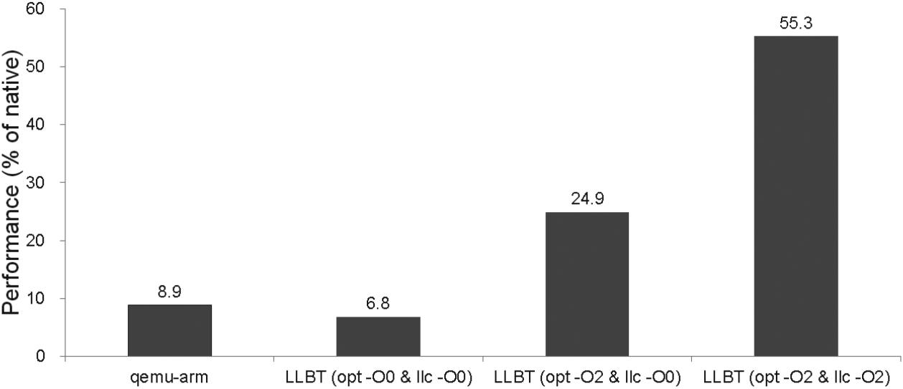

# LLBT调研

## [LLBT: An LLVM-based Static Binary Translator](../../../Essays/BT/LLBT/2012.llbt.bor-yeh.cases.pdf)@2012

0. ABSTRACT

   **Keywords**: Static binary translation, compiler, retargeting, intermediate representation

1. INTRODUCTION

   为什么存在code discovery和code location问题？为什么DBT很容易解决这俩问题？

   原文做了回答：

   * Code discovery

     ELF文件在数据和指令混在一起。变长指令集若把数据看做指令，则后续指令大概率全错。定长且对齐的指令集虽然在静态翻译时会把数据翻译成代码，不过执行时不会有问题。

   * Code location

     间接跳转需要正确地把地址映射到转后后的代码地址上去。

   LLBT解决code location的特色在于**不需要**解释器或者仿真器来处理间接跳转。原文如下，

   > LLBT effectively solves the code location problem. It
   > does not need an interpreter or emulator for handling
   > indirect branches.

2. RELATED WORK

   1. Static binary translators
   2. Dynamic binary translators
   3. LLVM

3. LLBT OVERVIEW

4. IMPLEMENTATION

   1. Code Discovery

      ARM指令集和Thumb指令集，能确定是哪套指令集最好，不能确定则既按照ARM翻译也按照Thumb翻译。

   2. Register Mapping

   3. Instruction Translation

   4. Handling Indirect Branches

      建立原指令地址到目标指令地址的映射表。每当需要间接跳转时，就用原指令地址从这个表中查找目标指令的地址。因此一个简单的映射表会占很大的空间。

      论文中还是用的表，把可能的转移目标地址制成映射表。<span style='color:red;font-weight:bold'>有没有办法不用映射表？而是计算可能的间接跳转地址（通过程序行为的分析），可不可以证明或者证伪？</span>比如把跳跃到当前时间的内存地址去？或者跳转到用户输入的值？可以证伪吗？

   5. Jump Table Recovery

   6. PC-relative Data Inlining

   7. Helper Function Replacement

      原指令集需要调用外部函数库（这里叫做helper function），比如没有浮点处理器，但是中间表示可以简单地表示出这些外部函数的功能。

5. EXPERIMENTAL RESULTS

   **Benchmark**: EEMBC and CoreMark

   1. SBT vs. DBT
   2. Startup Time
   3. Address Mapping Table

6. CONCLUSIONS

7. ACKNOWLEDGEMENTS

8. REFERENCES

## [A Retargetable Static Binary Translator for the ARM Architecture](../../../Essays/BT/LLBT/2014.llbt.bor-yeh.taco.pdf)@2014

1. INTRODUCTION

2. LLBT(AN LLVM-BASED STATIC BINARY TRANSLATOR)

   1. Overview

   2. Register Mapping

   3. Instruction Translation

   4. Handling Indirect Branches

   5. Helper Function Replacement

   6. <span style='color:green;font-weight:bold'>NEW !</span> Debugging Support and Verification

      什么是LLVM的metadata？

3. CODE DISCOVERY FOR ARM/THUMB INTERWORKING BINARIES

   1. ARM/Thumb Region Identification
   2. Discrimination between Data and Instructions
      1. PC-relative Data
      2. Jump Tables

4. <span style='color:green;font-weight:bold'>DETAILED !</span> EXPERIMENTAL RESULTS

   1. Binary Translation vs. Native Compilation

   2. SBT vs. DBT

   3. LLVM Optimization Analysis

      **感觉Instrunction Translation中提到的3点注意点和虚拟机的翻译并没什么太大区别。在这个地方可以一定程度的印证我的这个想法。**没有经过LLVM优化的代码的效率略低于QEMU的效率。<span style='color:red;font-weight:bold;'>所以我猜测自动验证工具是在未优化的IR上做的！</span>

      

   4. Start-up Time

   5. Space Overhead from Address Mapping Tables

   6. Code Size Measurement and Memory Overhead

   7. Translation Time

5. RELATED WORK

   1. Static Binary Translators
   2. Dynamic Binary Translators
   3. Static Binary Translators for Embedded Systems
   4. Dynamic Binary Translators for Embedded Systems

6. CONCLUSIONS

## [Automatic Validation for Static Binary Translation](../../../Essays/BT/LLBT/2013.auto_validation.jiunn-yeu.applc.pdf)@2013

1. Introduction
2. Background
   1. Overview of QEMU
   2. Overview of LLBT
3. Challenges of Automatic Validation
   * 堆和栈的存放地方不一样
   * 需要检查寄存器，若寄存器存的是地址，则值可能不一样则需要验证地址处的内容，当然也可能是地址。
   * <span style='color:red;font-weight:bold;'>我的想法是做一个LLVM IR的执行器，并与原程序进行对比验证，堆栈的重新分布交给LLVM opt做</span>。
   * 
4. Design and Implementation
   1. Allocating identical virtual memory
   2. Performance of validation
   3. Coarse instuction
   4. Quick validation
5. Experimental evaluation
   1. Bugs in LLBT discovered by the validator
   2. The number of times instrumentation code is executed
   3. Execution time
6. Conclusion

## [LLVM简介](http://www.aosabook.org/en/llvm.html)

1. A Quick Introduction to Classical Compiler Design
2. Existing Language Implementations
3. **LLVM's Code Representation: LLVM IR**
   1. Writing an LLVM IR Optimization
4. LLVM's Implementation of Three-Phase Design
   1. LLVM IR is a Complete Code Representation
   2. LLVM is a Collection of Libraries 
5. Design of the Retargetable LLVM Code Generator
   1. LLVM Target Description Files
6. Interesting Capabilities Provided by a Modular Design
7. Retrospective and Future Directions

## LLVM IR简介

源头依据[LLVM Language Reference Manual](https://llvm.org/docs/LangRef.html)，在这份manual的介绍中便提到下面三者等价，

* In-memory compiler IR
* on-disk bitcode representation
* human readable assembly language

且这篇manual介绍第三类表示和记法。

---

<span style='color:red;font-weight:bold;'>小插曲</span>：LLBT结构图中的IR是指LLBT自己的IR，这一点在2012年和2014年的文章中都有印，“internal IR”已加粗，

> An ARM input binary is disassembled to an assembly file, and then an IR converter translates these ARM assembly instructions into LLBT’s **internal IR**. Some analysis and optimization passes, such as identifying PC-relative data and recovering jump tables, will be performed by LLBT on its **internal IR** before generating the corresponding LLVM instructions.

LLBT结构图中的LLVM assembly才是LLVM IR这一点在上一节的[LLVM简介](http://www.aosabook.org/en/llvm.html)中得到印证，

> Beyond being implemented as a language, LLVM IR is actually defined in three isomorphic forms: the textual format above, an in-memory data structure inspected and modified by optimizations themselves, and an efficient and dense on-disk binary "bitcode" format. The LLVM Project also provides tools to convert the on-disk format from text to binary: `llvm-as` assembles the textual `.ll` file into a `.bc` file containing the bitcode goop and `llvm-dis` turns a `.bc` file into a `.ll` file.

---

```clang -emit-llvm -S```生成LLVM IR，```clang -emit-llvm```生成LLVM bitcode。

