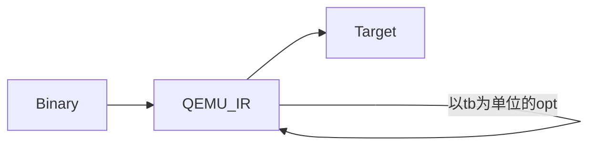

<div style="text-align:center;font-size:3em;">二进制翻译调研报告（LLBT相关）</div>
<span>谢本壹</span><span style="float:right">2019.8.14-2019.8.21  Week1</span>

---

<span style="font-size:1.5em">目录</span>

[TOC]

---

# LLBT -> LLVM + Binary Translation

## LLBT总体介绍——[LLBT: An LLVM-based Static Binary Translator](../../../Essays/BT/LLBT/2012.llbt.bor-yeh.cases.pdf)@2012


### 需要解决的问题

1. Code Discovery

   ARM指令集和Thumb指令集，能确定是哪套指令集最好，不能确定则既按照ARM翻译也按照Thumb翻译。

2. Register Mapping

3. Instruction Translation

   指令翻译分成3个部分，

   1. Conditional execution check
   2. Instruction body
   3. Conditional flags update

4. Handling Indirect Branches

   建立原指令地址到目标指令地址的映射表。每当需要间接跳转时，就用原指令地址从这个表中查找目标指令的地址。因此一个简单的映射表会占很大的空间。

5. Jump Table Recovery

6. PC-relative Data Inlining

7. Helper Function Replacement

   原指令集需要调用外部函数库（这里叫做helper function），比如没有浮点处理器，但是中间表示可以简单地表示出这些外部函数的功能。

```flow
st=>start: LLBT: An LLVM-based Static Binary Translator:>../../../Essays/BT/LLBT/2012.llbt.bor-yeh.cases.pdf
e=>end: A Retargetable Static Binary Translator for the ARM Architecture:>../../../Essays/BT/LLBT/2014.llbt.bor-yeh.taco.pdf
search=>operation: 在数据库中查找该作者写的其他引用率高的文章
test=>end: Automatic Validation for Static Binary Translation:>../../../Essays/BT/LLBT/2013.auto_validation.jiunn-yeu.applc.pdf

st->search->e(right)->test
```

## LLBT性能表现——[A Retargetable Static Binary Translator for the ARM Architecture](../../../Essays/BT/LLBT/2014.llbt.bor-yeh.taco.pdf)@2014

## 对LLBT正确性的自动验证——[Automatic Validation for Static Binary Translation](../../../Essays/BT/LLBT/2013.auto_validation.jiunn-yeu.applc.pdf)@2013


**感觉Instrunction Translation中提到的3点注意点和虚拟机的翻译并没什么太大区别。在这个地方可以一定程度的印证我的这个想法。**没有经过LLVM优化的代码的效率略低于QEMU的效率。


## LLBT调研总结

🤔**两个困难的问题**：code discovery和code location。

🤓**一个有趣的地方**：为什么LLBT里还有自己的IR和自己的优化器？为什么不直接用LLBT的IR和优化器？

# REV.NG

## [A jump-target identification method for multi-architecturestatic binary translation](/home/xieby1/Zotero/storage/PCYM7WHA/Di Federico and Agosta - 2016 - A Jump-target Identification)@2016


这篇文章对上面的code discovery和code location问题有详细的举例说明。

🤔**猜想&思考**：为什么LLBT里还有自己的IR和自己的优化器？为什么不直接用LLBT的IR和优化器？

> 可能LLBT调用的是现有的虚拟机项目，比如QEMU。
>
> |      | 将QEMU的IR转成LLVM IR                        | 不用QEMU的IR而是直接生成LLVM IR                              |
> | ---- | -------------------------------------------- | ------------------------------------------------------------ |
> | 优势 | 可以“免费”享受QEMU开发者对QEMU的各种升级优化 | 创新的工作？翻译时间短。                                     |
> | 劣势 | 市面已有类似的工作。翻译时间变长。           | 对QEMU源码进行阅读和修改，工作量大。需要自己维护自己的QEMU的版本。 |

🤓**一个有趣的地方**：为什么QEMU只能在同一操作系统间进行用户程序的模拟？

# QEMU

Quick EMUlator

读音参考[Wikipedia关于QEMU读音的讨论](https://en.wikipedia.org/w/index.php?title=Talk:QEMU&oldid=576629425#How_do_you_pronounce_it.3F)：👍Queue-Ee-Em-You

QEMU有自己定义的IR：(tb: translated block)



用命令查看源代码和QEMU生成的未经优化的IR的对比：

```bash
qemu-ARCH -d op DIR_TO_THE_BINARY
```

| 源代码                                                       | 未优化的QEMU IR                                              |
| :----------------------------------------------------------- | ------------------------------------------------------------ |
| .section .data<br/>	output:	.ascii  "Hello World\n"<br/>.section .text<br/>.globl \_start<br/>_start: |                                                              |
|                                                              | ld_i32 tmp11,env,\$0xfffffffffffffff0<br/>movi_i32 tmp12,\$0x0<br/>brcond_i32 tmp11,tmp12,lt,$L0 |
| movl	$4, %eax                                             | movi_i32 tmp0,\$0x4<br/>mov_i32 eax,tmp0                     |
| movl	$1, %ebx                                             | movi_i32 tmp0,\$0x1<br/>mov_i32 ebx,tmp0                     |
| movl	$output, %ecx                                        | movi_i32 tmp0,\$0x8049096<br/>mov_i32 ecx,tmp0               |
| movl	$12, %edx                                            | movi_i32 tmp0,\$0xc<br/>mov_i32 edx,tmp0                     |
| int	$0x80                                                 | movi_i32 tmp3,\$0x8048088<br/>st_i32 tmp3,env,\$0x20<br/>movi_i32 tmp11,\$0x2<br/>movi_i32 tmp12,\$0x80<br/>call raise_interrupt,\$0x0,\$0,env,tmp12,tmp11<br/>set_label \$L0<br/>exit_tb \$0x5597a136a043 |
|                                                              | ld_i32 tmp11,env,\$0xfffffffffffffff0<br/>movi_i32 tmp12,\$0x0<br/>brcond_i32 tmp11,tmp12,lt,\$L0 |
| movl	$1, %eax                                             | movi_i32 tmp0,\$0x1<br/>mov_i32 eax,tmp0                     |
| movl	$0, %ebx                                             | movi_i32 tmp0,\$0x0<br/>mov_i32 ebx,tmp0                     |
| int	$0x80                                                 | movi_i32 tmp3,\$0x8048094<br/>st_i32 tmp3,env,\$0x20<br/>movi_i32 tmp11,\$0x2<br/>movi_i32 tmp12,\$0x80<br/>call raise_interrupt,\$0x0,\$0,env,tmp12,tmp11<br/>set_label \$L0<br/>exit_tb \$0x5597a136a183 |

## QEMU-user

**简介**：QEMU有系统级模拟和用户级模拟。

* 系统级模拟需要下载系统镜像，需要设置硬件参数。能够模拟众多硬件架构（x86、ARM、MIPS…）、众多系统（BSD、Windows、Linux…）。
* 用户级模拟直接运行要模拟的程序即可。只能够在同一系统见进行模拟，比如可以在x86-Linux上模拟arm-Linux的用户程序，但是不能模拟x86-BSD系统。

QEMU

于是去阅读了QEMU-4.1.0（目前版本）的qemu-user的代码。总结出如下的结构图，


