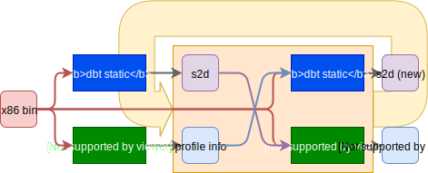

2020.3.13 dbt框架图：

想要通过读代码搞清楚dbt静态翻译的技术要点：

1. ✔️对于每一个可执行文件或so文件的发现代码的算法&处理的大体框架

   * `SBT_EXE::Get_Func_Info`将`main`、`_init`、`_fini`和符号表和plt所有的函数添加TU队列里。（so文件`SBT_SO`则没有`main`、`_init`、`_fini`）

   * 每个TU都调用`SBT_TU::Translate()`
     * `SBT_TU::Disassemble()`翻译TB，添加TB的后继块到待翻译TB队列，构筑控制流图
       * `SBT_TU::Disassemble_A_Block(...)`
         * `while(!End_Block)`
     * `SBT_TU::Eflag_Dispose()`
     * `SBT_TU::IntraBlock_Analyse()`
     * `SBT_TU::Ir1_To_Cgir()`把IR1转换成CGIR，是ORC编译器的中间表示
       * `SBT_BLOCK::Convert_To_Cgir()`代码超多1611~2471，仅一处调用`SBT_INSTR::Convert_To_Cgir()`，可见大多代码做各种辅助处理
         * `SBT_INSTR::Convert_To_Cgir()`代码超多1246~3614，
           * `switch(_op)`1362~3565
             * `SBT_TU::Convert_XXX()`
               * `Insert_Ir2_Instruction(...)`
     * 各种优化
     * `SBT_TU::TU_To_NativeCode（）`
   * 最后写文件

2. ✅根据 [[2006] [计算机研究与发展] 二进制翻译中的库函数处理_杨浩.pdf](../../../../Essays/BT/Chenggang Wu Group/[2006] [计算机研究与发展] 二进制翻译中的库函数处理_杨浩.pdf) 这篇文章的描述得知digital bridge的为静态翻译器和动态执行器协作，Profiling信息包含哪些内容？

   

   1. `xxx.dis.txt`禁用某些TB

      在代码中看到了`init_for_dis_block()`在读取`HOME/profile/`的文件，将地址值存放在了全局变量`Dis_block_pc`里。可以看出文件里放的是需要静态翻译的代码块的起始地址，地址间由空格或换行隔开。可以从translator.cpp里看到这个profiling文件用做的用途

3. 单纯只记录了eip的话，没必要多次迭代，`HOME/profile/`里可能有其他的profiling信息提供给静态翻译器

4. ✅查找一个可执行文件所有依赖的so文件的**方法**（是方法而不是算法，大概可以先看ELF PLT结构定义，再去找代码印证就好）

   应该就是模仿动态链接器找so的方法咯？

   在`Creat_Adjlist()`的`Get_Dep_File_Names(...)`完成找找寻一个文件直接依赖的so。因为so可能还依赖so，所以要迭代调用`Create_Adjlist`实现了一个搜索算法来找全一个文件所有依赖的so。

   于是引出接下来的问题，应该不会翻译so文件的所有代码吧，应该只是翻译需要的函数的代码吧？

5. ✅用什么数据结构记录的so所需要翻译的代码的？

   在没有更新的证据之前，目前看来`SBT_SO::Get_Func_inf()`将so文件符号表里所有的函数添加到了TU队列里。所以目前版本的so是全部被翻译了的。

6. ✅s2d文件的格式和作用，

   类似ELF的一种PIC（位置无关代码）文件格式，让动态执行器能够在执行时加载到内存。
   
   
2020.3.6

   
7. 如何解决跳转间接寻址的问题？

   so文件里没有这样的代码吧？因为看相对地址jmp指令都是立即数跳转的。当然也可以用间接跳转模拟出相对地址跳转啊！比如`jmp $eip`。

   在`SBT_TU::Convert_JMP()`没有看到对寄存器操作数和内存操作数的处理
   
   在反汇编TB块时因为要找下一个块，所以可以看出这个代码是如何处理间接跳转的。然而在`SBT_TU::Disassemble_A_Block`直接把jmp归为了T_JUMP_RELATIVE，完全忽略了间接跳转（直接）
   
8. orc和dbt-static耦合程度（要把ort替换成llvm的难度）

   * orc的cgir（底层中间表示）和后端（优化cgir，把cgir转成mips指令）2
   * orc cg定义的TN（操作数）`orc_include_hier/cg/op.h`，在`source/x86/c_file/c_file.cpp`生成了许多寄存器的全局变量，
   * orc提供的内存管理`orc_include_hier/common/util/cxx_memory.h`
   
9. SBT_BLOCK和BB的联系？

   `source/x86/c_block/c_block.h:124`注释。SBT_BLOCK装IR1，BB装CGIR。

   

****

