<div style="font-size:3em; text-align:right;">2019.12.18</div>
给x86-qemu-mips添加check功能的构想：

经过简单调研X86toMips的check功能，我想用现在的**x86-qemu-mips和QEMU进行对比check**，而不是把X86toMips的解释模块全部移植到x86-qemu-mips里然后用x86-qemu-mips和X86toMips的解释执行进行比较。所以目前有一下两个问题需要考虑：

1. 在X86toMips里有一个记录写内存的结构体`map<ADDRX, uint64>`，用于记录所以在TB里写内存的操作，粒度为字节。有了这个结构才能完成回退内存操作。但是这个结构需要解释执行来提供帮助才能支持。在x86-qemu-mips里，我们要么考虑回退QEMU的执行，要么考虑回退x86-qemu-mips的执行。简单地看了看QEMU的写内存指令，都被翻译成了native机器码，也不太想去修改QEMU的结构，所以可能不太方便在其中添加用于记录写内存操作的代码（所谓的instrument code）。所以我们考虑在x86-qemu-mips上进行修改：把X86toMips解释执行写内存的函数移到x86-qemu-mips里来，当且仅当开启check模式时才会解释执行写内存相关的指令，这样就能记录所有写内存的操作了，因此check系统的执行并比对一个TB块的流程是：
   * x86-qemu-mips执行TB（所有写内存指令解释执行，当中会记录所有写内存的操作）
   * 回退
   * QEMU执行TB
   * 比对x86-qemu-mips和QEMU的执行结果
2. QEMU对x86内存地址映射到MIPS内存地址的详细做法。因为QEMU里x86内存地址并**不等于**MIPS内存地址，所以在比对执行结果阶段势必需要一个转换过程。因此有必要详细搞清楚QEMU映射内存的地址的方法。

以上两个问题互相不重叠，邹旭做第1个，我做第2个。当然除了这两比较显著的问题，还有诸多小问题，等遇到的时候再一一解决吧。

# X86toMips

在全局搜索check，在`TB`、`IR1_INST`和`IR1_OPND`这3个类中存在`check()`这个函数。接下来一一看这3个类里的check函数，

## `TB::check()`

记录了TB开始执行前的`env`，记录了TB执行过程中写内存的操作。如此，便可以完成回退到执行TB前的机器状态。因此，X86toMips每个TB都执行两次，一次是解释执行（回退），另一次是翻译执行（不回退），然后比较这俩的执行结果是否一致。

😃这里有意思的部分是保存写内存操作的数据结构，用的是C++的map，定义为`map<ADDRX, uint64>`。仅仅从这个结构并不能看出其存的单位是多大（其实我最开始以为存的内容是64bits），直到我看到了对这个数据结构的操作，比如`vmm_discard_writing`里。将`uint64`的变量赋值给了`WRITE_RECORD`的变量。其中`WRITE_RECORD`是一个类包含了一个64bits的union结构和俩方法。🤔**既然能够将64bits的变量转换成这样一个类的实例，也就是说C++类的方法和变量是分开的？且类的实例所值的内容仅仅只包含类的变量？**有空的时候可以看看C++类的实例在内存的存放方式。

`TB::check`的代码框架图如下，



去找使用了`TB::check()`的地方，仅有唯一的一处`main/exec.cpp: 76`。其注释如下

>  // 3. either rollback&check, or try to translate and run native code, or interpret it

可以看出有如下执行的选择

* check执行，`check()`
* 正常执行，
  * 翻译，`translate() then run_native()`
  * 解释，`interpret()`

由于只有解释执行才会记录所有写内存的操作，所以接下来去看看写内存的指令是如何被解释执行的，

## `TB::interpret()`

位于`interpreter/interpret.cpp: 7~23`

很容易看出这个函数是去执行了每一条指令的解释函数，

### `IR1::interpret()`

位于`interpreter/interpret.cpp: 28~262`

这函数一开始便是一个很大的函数指针的数组（函数指针的数组这个语法我第一次见，看了好半天才反应过来），用于解释对应的指令。去看`interpret_mov`的实现即可，

#### `interpret_mov(IR1_INST *pir)`

位于`interpreter/it_mov.cpp: 43~47`。这个函数的工作很简单，就2步，

1. 取操作数，

2. 存入opnd(0)。

   这一步便用到了操作数种类（`opnd.type()`）这个变量，可能的种类：通用寄存器、段寄存器、多种内存。

   若是内存类型的变量的话，则会调用`write_x86_mem`这个函数。

##### `write_x86_mem`和`vmm_record_write`

这里便会调用`checker/check.cpp: vmm_record_write`函数来记录写内存的情况（记录粒度单位为字节）。

### x86内存地址映射到mips内存地址的方式

从翻译生成的MIPS代码上来看，翻译出来的mips地址和原程序x86地址相同。若要从代码上来支持这个论断的话，可以从计算`write_x86_mem`的地址参数的函数——`get_mem_addr()`入手，

#### `get_mem_addr()`

位于`interpreter/it_opnd_value.cpp: 278~288`

首先参考x86架构访存的模式，参考[GNU as汇编器对memory reference的说明](https://sourceware.org/binutils/docs/as/i386_002dMemory.html#i386_002dMemory)，访存模式(intel汇编)为，

```
section: [base + index*scale + disp]
```

在看`get_mem_addr`的计算地址的方式，

```c++
mem_addr = segment_base + base + simm + index*scale;
// 很明显且合理地猜测
// segment_base对应section，即x86的段寄存器
// simm对应disp
```

所以这样看来确实是**翻译出来的mips地址和原程序x86地址相同**。

## IR1_INST

## IR1_OPND

# QEMU内存地址映射的方法

首先调研一下`movl %ebx, (%eax)`如何翻译成tcg的写内存指令的，然后再看这样的tcg指令如何翻译成本地代码的，这样就能知道QEMU的内存映射的方法了。

**注**：`movl %ebx, (%eax)`指令的机器码及其意思，参考[x86-mov](https://www.felixcloutier.com/x86/mov)，[x86-64 instruction encoding](https://wiki.osdev.org/X86-64_Instruction_Encoding)：

`movl %ebx, (%eax)`是AT&T汇编格式，表示将ebx的值存入eax所指的内存地址去，其i386机器码为`0x8918`，

* `0x89`：`MOV r/m32, r32`的操作码（move r32 to r/m32），
* `0x18`即`0b00011000`：
  * Mod：`0b00`，表示r/m那个寄存器是m型，即内存地址
  * r/m：`0b0110`，表示ebx，且在mod00下没有disp
  * r：`0b000`，表示eax

<span style="color:red;">🤔Q: QEMU i386反汇编注释里表示操作数的记号，诸如`Gv`, `Ev`, `Iv`等是什么意思？**注**：`target/i386/translate.c`里很多很多这样的注释。</span>

## guest=>TCG

以`movl %ebx,(%eax) #8918`为例

`qemu/target/i386/translate.c: 5501~5509`对应`mov`这条指令的翻译过程，modrm是x86指令集的一些标志，参考[X86-64 Instruction Encoding: ModR/M and SIB bytes](https://wiki.osdev.org/X86-64_Instruction_Encoding#ModR.2FM_and_SIB_bytes)，看来ModR/M是访存模式的意思，直接寻址这对应Reg里的值，间接寻址则需要用Reg所指的Mem里的值，这大概就是ModR/M这个简写的来源吧。

> The ModR/M and SIB bytes are used to encode up to two operands of an instruction, each of which is a direct register or effective memory address.

* `mo_b_d`通过是否开启了modrm来判断操作数的大小。参考[X86-64 Instruction Encoding: Opcode](https://wiki.osdev.org/X86-64_Instruction_Encoding#Opcode)，opcode的最地位和ModRM.rm和SIB.base扩展相关。
* `x86_ldub_code`读x86源码的下一个字节。
* `gen_ldst_modrm(env, s, modrm, ot, reg)`完成生成写内存TCG的代码是
  * `ot`：放的写内存的粒度

<div style="font-size:3em; text-align:right;">2019.12.19</div>
x86机器指令`movl %ebx,(%eax) #8918`翻译成TCG的总体框架如下，


**2019.12.23**：

在这里看到了`gen_lea_modrm`函数，猜测这个函数的作用是将x86的间接地址，形如section: disp[bas, index, scale]这个可以在[gas的用户手册-memory references](https://sourceware.org/binutils/docs/as/i386_002dMemory.html#i386_002dMemory)里查阅到，转为为TCG，于是做实验看一条有复杂间接寻址的指令被转换成了那些TCG，

```assembly
# 测试的汇编指令
# AT&T风格的x86汇编
movl	%ecx, 4(%eax, %ebx, 8) # opcode 0x89

# 编译好后qemu-i386 -d op PATH_TO_TEST # QEMU的前端是一致，所以在MIPS或x86上实验都可以

# QEMU的中间表示
movi_i32 tmp11,$0x3 # load scale, 2^3=8
shl_i32 tmp2,ebx,tmp11 # index*scale
add_i32 tmp2,tmp2,eax # add base # base + index*scale
movi_i32 tmp11,$0x4 # load disp
add_i32 tmp2,tmp2,tmp11 # add disp # base + index*scale + disp
# indirect memroy reference compute complete!
mov_i32 tmp0,ecx # load source
qemu_st_i32 tmp0,tmp2,leul,0 # store source(tmp0) to a memory destination(tmp2)
```

✔️🤔上面的`leul`是什么意思？参见TCGMemOp的定义`tcg/tcg.h: 313~398`的380行，

```c
MO_LEUL = MO_LE | MO_UL // little endian, unsigned long
```

所以现在只要去看INDEX_op_mov_i32这条TCG指令如何翻译为本地码的就可以知道QEMU的内存映射的方法。

## TCG=>host（后端为X86）

😃一个有趣的地方：TCG操作码的枚举定义在`tcg/tcg.h: 210~215`，由宏函数很巧妙的完成，且只用到了`name`宏函数的变量，其他的变量可能在其他类似的宏定义中会用到（我的猜想：**这样的好处是只需要一份tcg-opc.h就能管理每一条tcg操作码的所有属性**）。

### `tcg_gen_code`

根据`QEMU/linux-user.md`里关于`tb_gen_code`的代码框架图可知，由TCG生成本地码的工作由函数`tcg_gen_code`完成，有关生成写内存指令的框架图如下，


2020.5.22: 今天知道了direct的是与系统模拟时要经过TLB相对的。

续上面的测试，看看该条写内存指令会变成哪些x86指令，

```assembly
# 测试的汇编指令
# AT&T风格的x86汇编
# 注：eax的值为0x80490a9，ebx的值为2
movl	%ecx, 4(%eax, %ebx, 8) # opcode 0x89

# 编译好后qemu-i386 -d out_asm PATH_TO_TEST # 注：此处使用的是X86后端

mov	$0x80490bd,%ebx # 地址值是个常量，被计算出来了
addr32 mov %ebp,%gs:(%ebx) # 注：这里的ebp里放的值就是翻译前代码的ecx的值，需要存入内存的值
```

由此可以**猜测**X86后端里的guest base寻址方式利用了X86指令的简介寻址，如下，（以后有时间再来详细研究）

```assembly
mov %src_reg, %x86_guest_base_reg: $x86_guest_base_offset( %dest_reg, %x86_guest_base_index, )
```

**总结**：确实用到了guest base！接下的重点是看MIPS后端里如何使用guest base的。

<div style="font-size:3em; text-align:right;">2019.12.30</div>
## TCG=>host（后端为MIPS）

`tcg_gen_code`的MIPS的结构和X86的结构是一样的，代码框架图如下，


✅🤔<span style="color:red;"><b>疑惑</b>：guest_base应该是`linux-user/main.c`里声明的guest_base，<del>并不是全局变量，</del>并没有声明为`extern`变量，如何能够在`mips/tcg-target.inc.c`里用到guest_base这个变量呢？</span>

**答**：这个详细需要看C语言关键字`static`和`extern`的用法，参考stack overflow的问答，**注**：要是能够做个实验试试能不能不声明`extern`也能访问其他文件的全局变量（若能的话，这边是clion的缺陷了，或者某个标准C的语言不推荐这样做），

* [What does “static” mean in C?](https://stackoverflow.com/questions/572547/what-does-static-mean-in-c)
  * 对于全局变量/函数来说，`static`使得该变量/函数只能在文件可见；
* [How to correctly use the extern keyword in C](https://stackoverflow.com/questions/496448/how-to-correctly-use-the-extern-keyword-in-c)
  * `extern`使得变量不会被初始化，链接器需要从其他的地方找到这个变量的声明；

# x86-qemu-mips的check功能的设计

写在前面的结论：既要记录QEMU的写内存操作，也要记录X86toMips的写内存操作。若只记录其中的一个写内存操作的话只能证明被记录者完成的操作是比较者的子集！

x86-qemu-mips的编译选项，

```shell
./configure --enable-debug --enable-debug-info  --enable-x86tomips --enable-loongson-check --disable-werror --target-list="i386-linux-user"
```

qemu的编译选项，

```shell
./configure --enable-debug --enable-debug-info --enable-loongson-check --disable-werror --target-list="i386-linux-user"
```

check server编译选项

```shell
gcc -g3 target/i386/X86toMIPS/checkServerMain.c -lrt -std=c99 # 可能需要-std=c99
```

于是设想的check架构，有3个程序，


一个check server和clients通讯的例子，


## 同时编译qemu-i386和x86-qemu-mips

这个由脚本调用两次./configure实现吧

### checkServer进程间通讯

有待思考的问题：

* 🤔如何确保check程序的main函数也能接收到`int argc, char **argv, char **envp`是不是要给编译器什么指令？确保传递给qemu和x86-qmeu-mips的这3个参数正确。

之前（2019.12.16）在测试x86-qemu-mips的系统调用时有用过message queue（消息队列），见笔记[x86-qmeu-mips的linux-user](./linux-user.md)，决定采用message queue来做进程间通讯。

2019.1.6 ~~Message Queue只能传输char类型的信息，不太方便，还是用MPI吧（高性能计算课上讲过的Message Passing Interface，这个可以传输自定义类型的数据，相对来说方便得多）。~~No！龙芯上编译open MPI可能也是个大问题，算法还是用Message Queue吧。

### QEMU记录写内存

tcg的写内存指令并不多

### X86toMips记录写内存

```c
// 采用如下的宏定义
#ifdef CONFIG_X86toMIPS_CHECK
// ...
#endif
```

目前看到写内存指令在`target/i386/X86toMIPS/translator/tr_opnd_process.c`里。

<div style="font-size:3em; text-align:right;">2019.12.31</div>
目前看来翻译写内存的指令有3个阶段，把记录代码（Instrument Codes）放在哪个阶段比较好？**结论**：放在`store_i/freg_to_ir1_mem`这个函数里，即下面讨论的第2个阶段，

1. ✅`target/i386/X86toMIPS/translator/tr_XXX.c: translate_XXX`

   也就是说在所有翻译和写内存相关的X86指令的地方植入记录代码，这样肯定是可以的，但工作量相对较大

2. ✔️`target/i386/X86toMIPS/translator/tr_opnd_process.c: store_i/freg_to_ir1_mem`

   也就是说在处理写内存的操作数的地方（写内存的大小，写非对齐的内存地址MDA）植入记录代码，这样要保证只有`tranlate_XXX`会用到这些函数才行。

   使用CLion的find usage功能，两个处理写内存的操作数的函数的**被调用关系**如下，

   * store_ireg_to_ir1_mem
     * store_ireg_to_ir1
       * `target/i386/X86toMIPS/translator` **258 usages**
         * tr_arith.c **29 usages**
         * tr_arith_byhand.c **23 usages**
         * 略，剩下还有10个文件
   * store_freg_to_ir1_mem
     * store_freg_to_ir1
       * `target/i386/X86toMIPS/translator` **28 usages**
         * tr_fldst.c **2 usages**
         * tr_mov.c **1 usage**
         * tr_smid.c **12 usages**
         * tr_simd.c **13 usages**

   所以看来只有`translate_XXX`会用到这两个处理写内存的操作数的函数，因此在这俩函数里添加记录代码（Instrument Codes）最合适。

3. ❌`target/i386/X86toMIPS/ir2/ir2.c: append_ir2`

   这个肯定行不通，因为在非翻译的地方都用到了append_ir2，比如上下文切换时。显然这个已经不是对应TB的行为了，不应该被记录。

#### 记录代码

<span style="font-size:1em;">**2019.1.2注**：下述操作只是用于用通用寄存器的写内存（`store_ireg_to_ir1_mem`），浮点寄存器写内存之后在来考虑吧（`store_freg_to_ir2_mem`）😁😁😁</span>。2019.1.3现在考虑好了，不改变下述代码，将浮点寄存器的数据移到通用寄存器中，再调用下面的代码，详细设计思路后面的`store_freg_to_ir1_mem`的框架图那里有，

```assembly
# 括号里的数字表示使用的临时寄存器的数量
L_IMM64 %temp_wrs_index_addr(2), $wrs_index_addr
lw %temp_wrs_index(1), %temp_wrs_index_addr(2)
ori %temp_bytes(3), %zero, $bytes
or %temp_v_opnd(4), %zero, %v_opnd
dsubu %temp_a_opnd(5), %a_opnd, %guest_base # substract guest base (MIPS address)
addiu $temp_a_opnd(5), $temp_a_opnd(5), $a_opnd._imm16 # add disp to x86 address
LOOP:
# branch if less than zero
blez %temp_bytes(3), $LOOPEND
nop
# record addr (i386 32-bit address)
sw %temp_a_opnd(5), %temp_wrs_index(1)
addiu %temp_a_opnd(5), %temp_a_opnd(5), 1
addiu %temp_wrs_index(1), %temp_wrs_index(1), 4
# record value (a byte)
sb %temp_v_opnd(4), %temp_wrs_index(1)
addiu %temp_wrs_index(1), %temp_wrs_index(1), 4
srl %temp_v_opnd(4), %temp_v_opnd(4), %temp_shift_bits_number
# update loop condition
addiu %temp_bytes(3), %temp_bytes(3), -1
B $LOOP
nop
LOOPEND:
sw %temp_wrs_index(1), %temp_wrs_index_addr(2)
```

<div style="font-size:3em; text-align:right;">2020.1.2</div>
上面的汇编改了好几次才正常运行，遇到几个有趣的地方记录如下（并非按遭遇问题的时间顺序记录）：

1. mips的地址是64位，i386的地址是32位，因此计算两个地址需要用不同的算数指令，比如上面对`temp_a_opnd(5)`即用到了`dsubu`（64位）也用到了`addiu`（32位）；
2. 为了实现x86汇编里的[memory references](https://sourceware.org/binutils/docs/as/i386_002dMemory.html#i386_002dMemory)，index、scale和section是用独立的代码实现好了的，而disp是用`IR2_OPND`的`_imm16`实现的，所以在保存地址时必须要加上disp；
3. 🤔<span style="color:red;">虽然目前能正常运行，但extension mode的具体用途还是有点迷糊，有机会一定要好好研究一下</span>；
4. X86toMips里可以直接用label还是很棒的，免去了我计算相对偏移的麻烦；

<div style="font-size:3em; text-align:right;">2020.1.3</div>
#### `store_ireg_to_ir1_mem`

这个函数将地址和数据都处理的很好了（不像`store_freg_to_ir1_mem`那样混乱），地址是`mem_opnd`，数据是`value_opnd`，所以只需要在末尾出添加一句记录代码即可，如下，代码框架图略，

```
append_ir2s_addWriteRecords(mem_opnd, value_opnd, (uint16)ir1_opnd_size(opnd1)/8);
```

#### `store_freg_to_ir1_mem`

因为**记录代码**里用的都是通用寄存器，所以要实现浮点写内存的话，

* 要么改**记录代码**，
* 要么将浮点寄存器的值转移到通用寄存器里，

我选择后者，因为在现有的`store_freg_to_ir1_mem`代码里为了处理非对齐的内存数据访问（MDA），为了使用`swl/swr`或`sdl/sdr`指令，已经将浮点寄存器的数据转移到了通用寄存器里。所以我只需要在非MDA的情况下加入<span style="background:#B0E3E6;">将浮点寄存器的数据转移到通用寄存器的语句</span>即可。

`store_freg_to_ir1_mem`代码框架图如下，**注**：<span style="background:#B0E3E6;">淡蓝色背景的部分代码是添加的将浮点寄存器的数据转移到通用寄存器的代码</span>


<div style="font-size:3em; text-align:right;">2020.1.8</div>
# check出现的问题&解决

## ✔️esp

2020.2.12**注**：esp和eip看代码找问题时梳理的代码框架图如下，


在不同x86机器上（我的电脑和56服务器）测试同一个文件`hello`发现，在_start处的esp就不同！所以有必要让x86-qemu-mips和qemu相同的esp在开始执行时相同。

<div style="font-size:2em; text-align:right;">2020.2.4</div>
目前追踪到了在target内存空间分配栈空间的地方，`x86-qemu-mips/linux-user/elfload.c: 1765: target_mmap`。guest_base不同我觉得还能理解，但是target空间的地址为什么还不一样啊？用pmap观察`target_mmap`函数前后可以发现新被分配的区域=guest_base+target_mmap的结果，如下

* qemu-i386

  ```
  guest_base = 0xfef6fc0000
guest_mmap =   0xff7f8000
  新分配的区域（通过pmap查看）000000fff67b8000 
  ```
  
* qemu-i386-x86tomips
  ```
  guest_base = 0xff76fc0000
guest_mmap =   0x7f7f8000
  新分配的区域（通过pmap查看）000000fff67b8000
  ```

<span style="font-size: 1.5em;">即新分配的栈空间在host里地址是相同的！？🤔🤔🤔</span>

<div style="font-size:2em; text-align:right;">2020.2.5</div>
guest_mmap分配的地址用的是`mmap_next_start`变量的值。这个变量在`main: 805`由`reserved_va`复制时产生分歧（`0xffffc00, ` `0x7fffc000`）。所以接下来有必要追踪`reserved_va`被赋值的过程。

**找到问题了！**`5743956119`commit里张福新改动了`MAX_RESERVED_VA`的值。将qemu和x86tomips的改宏定义在check时统一即可。

## ✔️eip

**x86-qemu-mips**

x86tomips的eip（env里存放的eip）指的地方不对。

**qemu**

eip只会在tb结束类指令（tb结束类指令有有哪些可以参考x86-qemu-mips里的定义`target/i386/X86toMIPS/ir1/ir1/c: ir1_is_tb_ending`）处更新：

* jmp类指令在`target/i386/translate.c`里搜索next_eip，
* 系统调用，`gen_jmp_im`
* ret，`gen_op_jmp_v`

eip在TB结束时指向的是TB的最后一条指令，

## ✔️mq_open invalid argument

来自man mq_open

> EINVAL O_CREAT   was  specified  in  oflag,  and  attr  was  not  NULL,  but attr->mq_maxmsg or  attr->mq_msqsize  was  invalid.   Both  of  these fields  must be greater than zero.  In a process that is unprivileged (does not have the CAP_SYS_RESOURCE capability), attr->mq_maxmsg must be less than or equal to the msg_max limit, and attr->mq_msgsize must be less than or equal to the msgsize_max limit.  In addition, even in a  privileged  process,  attr->mq_maxmsg  cannot  exceed the HARD_MAX limit.  (See mq_overview(7) for details of these limits.)

是mq_msgsize超出了范围，所以需要用sudo才能正常运行。现在将mq_msgsize设置小了，**于是在考虑传输写内存操作时需要注意多次传输的问题了**！！

<div style="font-size:3em; text-align:right;">2020.2.5</div>
## ✔️代码块分块大小同步

用目前版本的check跑helloworldx86，发现第一次出错在，

* x86tomips的eip = 8048bc1
* qemu的eip = 8048bcb

该代码片段如下：

```
 8048bc1:       83 c0 04                add    $0x4,%eax
 8048bc4:       8b 50 fc                mov    -0x4(%eax),%edx
 8048bc7:       85 d2                   test   %edx,%edx
 8048bc9:       75 f6                   jne    8048bc1 <__libc_start_main+0x61>
 8048bcb:       83 ec 0c                sub    $0xc,%esp
```

很明显是循环体出问题了。

<div style="font-size:3em; text-align:right;">2020.2.6</div>
> 张福新：除了esp差异，还有，
>
> 1. rep类指令的翻译x86tomips没有切分新的基本块导致的差异，这个我想是不是可以看看通过什么机制忽略掉，比如发现多出来的指令是rep类的指令；
> 2. syscall/int好像也是没分基本块；
> 3. 理论上太长的基本块被切开也会导致不同；
> 4. 发现过似乎有时候loader准备的env还是其他数组有差异导致程序初始化过程有点差异。

目前有两个想法来解决分块不同而带来的1~3的问题，

1. 延迟比较，等到eip都相同时再比较

   这个方法人工操作十分可行，但是对于自动判定时两个程序谁执行的更多，谁执行的更少很难判断，毕竟eip不一定是一直增加的。

2. 用checkServer来同步两个qemu和x86tomips的分块

   先

   在阅读了x86-qemu-mips的代码后我想采用如下方案

   1. x86tomips先分块（采用的是x86tomips-config.c: tr_disasm(tb)这个函数），
   2. x86tomips将分块的指令数`x86tomips_insns_num`通过checkServer发给qemu，
   3. qemu分块（采用translate-all.c: gen_intermediate_code(cpu, tb, max_insns)这个函数），将`x86tomips_max_insns`设置为`insns_num`，
   4. qemu将分块的指令数`qemu_insns_num`通过checkServer发送给x86tomips，
   5. x86tomips对比`qemu_insns_num`和`x86tomips_insns_num`，只会有小于或等于两种情况。若等于则表示分块大小一致，若小于，则x86tomips多执行一步mm_realloc即可保证分块大小一致。

<div style="font-size:3em; text-align:right;">2020.2.11</div>


目前完成了上面利用checkServer来同步代码分块的工作。过程中遇到诸多问题，也探究到很多解决问题的方法，已经以后有空的时候可以学习的编程的各种小技巧。

2020.2.16

代码同步的消息发送逻辑的时间线如下，和[check出现的问题-代码块同步](#✔️代码块同步)的构想一致，


当然，为了能够让分块同步有效，有必要让qemu和x86tomips每次只执行一个TB。qemu默认开启TB链，x86tomips默认关闭TB链。因此添加了qemu的启动参数`-d nochain`，为了栈的同步，也给x86tomips添加了同样的参数。

怪不得添加了`-d chain`也仍然发现qemu有链TB，原来是因为我把启动参数放错了位置，如下，

```shell
qemu-i386 -d nochain PATH_TO_X86_BIN X86_BIN_ARGS # 正确顺序
qemu-i386 PATH_TO_X86_BIN X86_BIN_ARGS -d nochain # 错误顺序
# -d nochain参数变成了X86_BIN的参数了，因此qemu并没有收到关闭TB的指示！
```

<div style="font-size:3em; text-align:right;">2020.2.12</div>
## ✅报错机制

消息队列（message queue）的报错信息靠`errno.h`来保存和输出错误信息，所以没比较自己去打印errno的数值（同一个错误的数值可能在不同的架构里不一样），应该使用`perror`（man 3 perror）来打印错误。

在网上找到消息队列的例子（[How do I use mqueue in a c program on a Linux based system?](https://stackoverflow.com/questions/3056307/how-do-i-use-mqueue-in-a-c-program-on-a-linux-based-system)）里用到的报错机制能够打印源码，值得研究学习，

```c
#define CHECK(x) \
    do { \
        if (!(x)) { \
            fprintf(stderr, "%s:%d: ", __func__, __LINE__); \
            perror(#x); \
            exit(-1); \
        } \
    } while (0) \
```

✅🤔**疑惑**：

1. ✔️为什么要用一个无用的循环？为了防止该宏插入在了一个else上边；
2. ✔️宏里的`#`操作符号是什么含义？参考[gcc online docs关于宏的页面](https://gcc.gnu.org/onlinedocs/cpp/Macros.html)，这符号叫做Stringizing，这是为什么这个报错代码能够打印源代码；
3. `__func__`和`__LINE__`是什么用法？

## 执行不同步

### ✔️块内循环

上面这个工作完成后，发现块内循环依然不同步，比如下面这个简单的例子，

```assembly
instructionBeforeTB
# TB starts
mov $99, %eax
LOOP:
dec %eax
jz $LOOP
# TB ends
instructionAfterTB
```

qemu执行完上述的TB后，已完成了99次循环，eip将指向`instructionAfterTB`，

x86tomips执行完上述的TB后，只完成了1次循环，eip将指向`dec %eax`。

**解决办法**目前想到2类，

1. 修改qemu让其变成一个TB只执行1次循环 或 修改x86tompis让其一次及完成循环，（修改x86tomips能够提高效率）
2. 修改check的逻辑，让check可以等待x86tomips完成循环后再比较（以后要增加了内存比较，这里还得暂存x86tomips的内存操作，check的逻辑就变得复杂了）。

我更倾向修改x86tomips或者修改check的逻辑。

<div style="font-size:3em; text-align:right;">2020.2.16</div>
我选择修改check的逻辑，不去改动x86tomips和qemu的代码。在check里添加了仅仅让x86tomips运行的模式（onlyX86tomipsMode），~~当发现qemu和x86tomips下一个块的eip不同时，就认为遇到了块内循环~~判断逻辑更新为和rep指令一致，见下面rep指令的判断逻辑。让qemu停下里等x86tomips，直到x86tomips追上qemu的进度时，再恢复qemu正常的执行。

**注**：这里有一个比较强的条件，在x86tomips单独执行时eip不能变（这才是块内循环的特征）。

x86tomips在单独执行时若块内循环的开始地址并不是块的开始地址，那么x86tomips将会分配新的TB。为此添加了新的消息类型`check_onlyX86tomips_mode`，由checkServer发给x86tomips。目前改为了`check_only_mode`，既可以发给qemu也可以发给x86tomips，用于跳过传输tb_size的过程，如下图，


### ✔️rep指令

**目前的做法**

在每次分配TB的时候，x86tomips会把新分配的TB的最后一条指令是否是rep告诉checkServer，由此checkServer就能让qemu进入only mode。但是目前是在qemu的`-d chain`参数写错位置的基础上来的，所以没问题。现在已经把`-d nochain`的参数调整正确了，qemu能单TB执行，于是出现了新的问题，qemu每次只会执行rep指令一次，所以现有通过分配新TB的时候来判断是否是rep就会失效（rep指令的TB块x86tomips只会分配一次，但是qemu下一次再到这个rep指令的地方，x86tomips就不会分配TB了），例子见静态编译的helloworld的mempcpy函数的0x806ae6c位置，第二次执行到该处的rep指令就会出问题。

**新的rep指令(qemu)和块内循环(x86tomips)的判断逻辑**

目前想到的比较好的解决办法每次qemu/x86tomips向checkServer发送`check_tb_end`消息是捎带改TB的大小（不是指令数，而是bytes），若下一条指令落在了改TB的范围内，

* 对于qemu即认为其遇到了rep指令，则进入only qemu mode，
* 对于x86tomips即认为其遇到了块内循环，则进入only x86tomips mode，

**注**：本来是打算让`check_tb_end`捎带上一条指令的eip的，但是发现太难获取这个值了，相对而言TB的大小更容易获取，且能够统一rep指令和块内循环的判断，何乐不为？

**风险**：因为执行不同步，所以如果独自分配的这个TB在以后的执行会再次用到的话，qemu和x86tomips的行为将会出现分歧！（qemu会请求分配块，而x86tomips会请求比较这个块的结果，亦或相反）这个问题，~~小概率事件，等遇到时再着手解决！~~将统一解决！

**风险解决方案**：添加消息类型`check_tb_start`在并捎带改分块的指令数

接下来的内容将写到[check手册](check_manual.md)里去