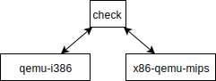

# x86-qemu-mips check手册

**注**：软链接版本的图片不能正常显示，需要用[原版](../xiebenyi/BT/x86-qemu-mips/check_manual.md)才能正常显示。

**最新更新**2020.2.25（历史更新见git历史）

* 更新syncCheckServer和checkEnd函数调用位置的说明

---

**目录**

[TOC]

## check简介

check对比执行**qemu-i386**和**x86tomips版的qemu-i386**（下文的x86tomips或x86-qemu-mips都指x86tomips版的qemu-i386），当发现二者的寄存器有不同时便会给出提示。

check功能由3个程序实现：

1. 带check插桩的qemu-i386
2. 带check插桩和x86-qemu-mips
3. check server

这个3个程序之间通过如下的通讯方式来交换对比执行信息，



## check使用手册

**注**：对编译选项做了修改，和主分支里编译x86-qemu-mips的方式不同，所以目前还没合并到主分支，所以需要先切换到check分支里去。

### 编译

为了同时编译出qemu-i386和x86-qemu-mips，将编译x86-qemu-mips的编译选项由原本的`--enable-x86tomips`改为了在target-list里添加`x86tomips-linux-user`。`--enable-loongson-check`表示是否添加check功能插桩在qemu代码里。因此编译check的configure**必要**参数如下，可以根据自己的需要添加其他参数比如`--disable-werror`，

```shell
configure --enable-loongson-check --target-list="i386-linux-user x86tomips-linux-user"
# configure --disable-werror --enable-loongson-check --target-list="i386-linux-user x86tomips-linux-user"
# configure --enable-debug --enable-debug-info --enable-loongson-check --disable-werror --target-list="i386-linux-user x86tomips-linux-user"
make
```

make执行完成后编译目录里会出现3个文件夹，

1. `i386-linux-user`，其中的`qemu-i386`是带check插桩的qemu-i386
2. `x86tomips-linux-user`，其中的`qemu-i386`是带check插桩的x86-qemu-mips
3. `loongson-check`，其中的`check`是check server

### 运行

#### QEMU的参数

`check`会把参数传给qemu-i386和x86-qemu-mips，所以qemu的运行参数都能用到这里，例如，

```shell
check ~/test/helloworld
```

#### check的参数

check的所有参数都是`-lsc <option>`的格式

可用参数可以用`check -lsc help`或`check -lsc h`打印，列举如下，

| 参数           | 描述                                                         |
| -------------- | ------------------------------------------------------------ |
| `-lsc h`       | 打印check的帮助                                              |
| `-lsc t`       | 执行过程中打印EIP寄存器                                      |
| `-lsc s=<num>` | 当遇到不同时不立刻停止，而是再执行执行`<num>`个TB，默认为-1表示不停止 |
| `-lsc x="..."` | 引号里的参数将只传给x86tomips                                |
| `-lsc q="..."` | 引号里的参数将只传给qemu                                     |

### 结果

`check`会打印出eip和比较到不同的TB时所有通用寄存器的状态。

## check编程手册

check通过linux系统提供的消息队列（message queue）来实现x86tomips/qemu和checkServer之间的通讯。

那为什么不选用更高级的通讯接口，比如openMP？为了轻量化，龙芯平台装高级的通讯结构需要太多自己配置的相关的库，这使得本来简单的check功能的使用者编译check变得十分复杂，所以选择了系统调用级别的消息通讯接口——消息队列。

### 消息队列的建立

为了避免消息混乱，消息队列均采用**只读**/**只写**队列，因此check框架里一共有4个消息队列，如下4个箭头，


1. check => x86-qemu-mips：对于check是**只写**队列，对于x86-qemu-mips是**只读**队列；
2. check => qemu-i386：对于check是**只写**队列，对于qemu-i386是**只读**队列；
3. x86-qemu-mips => check：对于x86-qemu-mips是**只写**队列，对于check是**只读**队列；
4. qemu-i386 => check：对于qemu-i386是**只写**队列，对于check是**只读**队列。

消息队列遵循先**创建**而后**连接**再后**使用**最后**销毁**的原则，因此消息队列的**创建**、**连接**、**使用**和**销毁**的顺序如下，

* 上图的`1`，check**创建**x86-qemu-mips/qemu-i386 => check的**只写**队列；
* （check通过fork和exec创建x86-qemu-mips/qemu-i386两个进程）
* 上图的`1'`，x86-qemu-mips/qemu-i386**创建**check=>x86-qemu-mips/qemu-i386的**只写**队列；
* 上图的`2`，x86-qemu-mips/qemu-i386**连接**x86-qemu-mips/qemu-i386 => check队列，属性为**只写**；
* （x86-qemu-mips/qemu-i386完成初始化，并通过刚刚**连接**上的队列给check发送`check_start`消息表示初始化完成）
* （check收到x86-qemu-mips/qemu-i386初始化完成的消息）
* 上图的`3`，check**连接**check => x86-qemu-mips/qemu-i386队列，属性为**只写**；
* （check通过刚刚**连接**上的队列给x86-qemu-mips/qemu-i386发送`check_continue`，表示连接完成，开始正常执行）
* （正常**使用**这个4个消息队列来传递信息）
* （当x86-qemu-mips/qemu-i386执行完成最后一个TB时，给check发送`check_end`）
* （当收到`check_end`或比较出错时，check给x86-qemu-mips/qemu-i386发送`check_quit`）
* x86-qemu-mips/qemu-i386和check**销毁**4个队列并退出

因为消息队列传输的数据仅仅是纯粹的字符串，为了让x86tomips/qemu和checkServer能够判断消息携带的数据类型，为了让多进程的消息彼此不会干扰，需要在消息队列的基础上自定义消息的格式。

### 消息的格式

`target/i386/X86toMIPS/include/check-common.h`

| Byte     | 0~1  | 2    | 3           | 4~... |
| -------- | ---- | ---- | ----------- | ----- |
| **含义** | PID  | 保留 | message tag | data  |

PID：目前版本还没有实装多进程的check功能

message tag：消息标签用于表示消息所携带的数据，即隐含消息的类型和大小，现在有如下类型的标签（**注**：此处均省略前缀`check_`，且标签的数据（data）若无说明则均为空），

* `undifined`：无实际用处，避免可能出现的未初始化标签的错误（全为0）；
* x86tomips/qemu发送给checkServer的消息：
  * `error`：暂时未使用，
  * `start`：x86tomips/qemu已完成check功能的初始化，
  * `end`：x86tomips/qemu已执行完所有的TB并准备退出，
  * `tb_start`：x86tomips/qemu已执行完成一个TB准备开始一轮比较信息的传输，
    * `standard_registers`：数据部分依次为8个通用寄存器和eip寄存器的值，
    * `fpu_state`：暂未实装，
  * `tb_end`：x86tomips/qemu完成一轮比较信息的传输，
  * `ready_to_alloc_tb`：x86tomips/qemu准备分配新的TB，
* checkServer发送给x86tomips/qemu的消息：
  * `continue`：一切正常继续下一个步骤，
  * `quit`：请退出，
  * `only_mode`：当前只有接收消息的在运行，
* 双向消息
  * `tb_size`：数据部分为TB块的大小，

只看上面的简介便能构造出一个可以比较汇编程序的check了，实际情况中有诸多特殊情况需要仔细地处理，接下来详细介绍特殊情况下的处理方式。

### 特殊情况的处理方式

#### 放置syncCheckServer的位置

syncCheckServer完成一轮比较信息的传输，每次TB执行完成后调用该函数即可。因此放在`accel/tcg/cpu-exec.c: cpu_loop_exec_tb`里即可。但是当出现中断/异常时，qemu的控制流会使用siglongjmp，考虑到这个情况，在`linux-user/i386/cpu_loop.c`里也调用了该函数。

#### 放置checkEnd的位置

这个问题等价于怎样判断一个程序是否准备退出了。

这个我没能给出一个完美的回答，只能说是遇到问题就去解决。目前是发现了两个地方：

1. 从汇编代码退出的方式知道系统调用exit时表示该程序准备退出了，在`linux-user/syscall.c`里exit的系统调用处调用checkEnd即可；
2. 因为在glibc 2.3以后`_exit()`都会调用exit_group而不是exit系统调用，详细见`_exit`的man page。因此需要在`linux-user/syscall.c`里exit_group的系统调用处调用checkEnd。

