# x86-qemu-mips做出的修改

## `tb_find`

在翻译TB时采用直接从x86翻译到mips（即X86toMips的方法，x86=>IR1=>IR2=>MIPS），而不经过TCG，

* 保留QEMU的`tb_alloc`，
* 将QEMU的`gen_intermediate_code`和`tcg_gen_code`替换为`target_x86_to_mips_host`，

<div>
    
    
</div>

<div style="font-size:3em; text-align:right;">2019.12.9</div>
# 编译x86-qemu-mips

在README里的Compile and Run基础上添加debug支持

```shell
# make clean， make distclean
./configure --enable-debug --enable-debug-info  --enable-x86tomips --disable-werror --target-list="i386-linux-user"
make
```

# 系统调用修改思路

## QEMU调用helper的方法

QEMU里有一套通用的在native环境（guest）下调用QEMU（host）函数的机制——`tcg_gen_callN`。native环境（guest）和QEMU（host）运行环境的诸多不同，最显著的不同是32/64和ABI，由这个函数`tcg_gen_callN`解决。

QEMU利用`tcg_gen_callN`调用`helper_raise_interrupt`函数，来实现跳出`cpu_exec`，然后到`cpu_loop`里通过中断处理代码（`linux-user/i386/cpu_loop.c: 98~241`根据中断号的switch case代码）完成系统调用，`helper_raise_interrupt`完成的任务如下，

* 保存中断处理代码需要的变量（跟踪helper代码，便可得下面这些变量）
  * 中断号`intno`，
  * `error_code=0`，
  * 是中断还是异常`is_int=1`，🤔**有必要调研一下在QEMU里（不是X86里）的中断和异常分别是什么意思**，
  * 中断指令的下一条指令地址`exception_next_eip`，
  * CPU可以执行IO`can_do_io=1`，
* `siglongjmp`，

## x86-qemu-mips与QEMU的不同

### native和BT环境切换

QEMU对寄存器的操作全是和CPUState数据结构在打交道，而没有映射寄存器，所以QEMU无需过多考虑native和BT环境切换保存寄存器的事。

x86-qemu-mips将x86的体系结构寄存器和QEMU的一些常用变量（DONE：整理牛根画的寄存器映射图的内容，见[寄存器映射总结](#寄存器映射总结)）映射到了mips的体系结构寄存器中，在native切到BT环境时，就要考虑保存这些映射的寄存器，以便给QEMU的运行腾出空间；在BT切到native时，需要恢复这些寄存器映射。

### 在native里调用BT环境里的函数

QEMU通过`tcg_gen_callN`实现。能够解决native和BT环境的32/64和ABI不同的问题。

x86-qemu-mips无。

## x86-qemu-mips调用helper的方法

**前言**：目标是尽可能多的沿用QEMU处理系统调用的方法。所以学习QEMU调用helper函数来保存中断处理代码需要的变量，然后用`siglongjmp`跳出`cpu_exec`循环，去中断处理代码里执行。

x86-qemu-mips缺少在native里调用函数的能力，所以有必要实现一个类似QEMU的`tcg_gen_callN`的功能。

调用BT环境（MIPS）的函数func(arg1, arg2, ...)需要两步，

1. 按照MIPS的ABI，在相应的MIPS寄存器和栈里准备好参数arg1, arg2, ...

   这一步很麻烦，即我们需要实现一个类似QEMU的`tcg_gen_callN`的功能，需要考虑：

   1. MIPS有o32, o64, n64共3种ABI，我们都得考虑实现；
   2. arg1, arg2, ...需要的寄存器和x86映射的寄存器可能会冲突（例如v0），所以有必要保存那些会冲突的寄存器映射；
   3. arg1, arg2, ...需要的寄存器和x86-qemu-mips的临时寄存器可能会冲突（例如a0~a3），x86-qemu-mips临时寄存器的算法听说写的还很不完善，那就需要将临时寄存器的代码搞清楚且修补存在问题的地方；
   4. 最后把arg1, arg2, ...放到MIPS ABI规定的地方，这一步十分简单；

2. jalr func，这一步很简单，append_ir2_opnd1(mips_jalr, func)即可。

综上所述，我选择不考虑参数，即将`helper_raise_interrupt`需要的参数都去掉形成一个新的函数`helper_raise_int`。直接在native环境保存这些需要传进去的参数。由此，有了现阶段对系统调用的实现，`translate_int`。`helper_raise_interrupt`需要3个参数：

1. `CPUX86State *env`，这是个全局变量，
2. 中断号`int intno`，直接在`translate_int`里存入env即可，
3. 中断指令的长度`int next_eip_addend`，总的来说是需要计算下一条指令的地址，直接在`translate_int`里存入env即可，

所以QEMU的`helper_raise_interrupt`里还没实现的加入到`helper_raise_int`的函数里即可：

* 参数设置，
  * `error_code=0`，
  * 是中断还是异常`is_int=1`，
  * CPU可以执行IO`can_do_io=1`，
* siglongjmp。

<div style="font-size:3em; text-align:right;">2019.12.10</div>
# 寄存器映射总结

来源于牛根发在slack聊天信息（2019.12.6），表格使用[table generator](https://www.tablesgenerator.com/html_tables)生成，

<table>
  <tr>
    <th></th>
    <th>0</th>
    <th>1</th>
    <th>2</th>
    <th>3</th>
  </tr>
  <tr>
    <td>0</td>
    <td>zero <span style="font-weight:bold">ZERO</span></td>
    <td>at <span style="font-weight:bold;color:rgb(203, 0, 0)">EDX</span></td>
    <td>v0 <span style="font-weight:bold;color:rgb(203, 0, 0)">EAX</span></td>
    <td>v1 <span style="font-weight:bold;color:rgb(203, 0, 0)">ECX</span></td>
  </tr>
  <tr>
    <td>4</td>
    <td>a0 <span style="font-weight:bold;color:rgb(49, 102, 255)">TMP</span></td>
    <td>a1 <span style="font-weight:bold;color:rgb(49, 102, 255)">TMP</span></td>
    <td>a2 <span style="font-weight:bold;color:rgb(49, 102, 255)">TMP</span></td>
    <td>a3 <span style="font-weight:bold;color:rgb(49, 102, 255)">TMP</span></td>
  </tr>
  <tr>
    <td>8</td>
    <td>a4 <span style="font-weight:bold;color:rgb(49, 102, 255)">TMP</span></td>
    <td>a5 <span style="font-weight:bold;color:rgb(49, 102, 255)">TMP</span></td>
    <td>a6 <span style="font-weight:bold;color:rgb(49, 102, 255)">TMP</span></td>
    <td>a7 <span style="font-weight:bold;color:rgb(49, 102, 255)">TMP</span></td>
  </tr>
  <tr>
    <td>12</td>
    <td>t0 <span style="font-weight:bold;color:rgb(49, 102, 255)">TMP</span></td>
    <td>t1 <span style="font-weight:bold;color:rgb(49, 102, 255)">TMP</span></td>
    <td>t2 <span style="font-weight:bold">GuestBase</span></td>
    <td>t3 <span style="font-weight:bold;color:rgb(192, 192, 192)">ForFutureUse</span></td>
  </tr>
  <tr>
    <td>16</td>
    <td><span style="color:white;background:black;">s0</span> <span style="font-weight:bold;color:rgb(101, 101, 101)">n1</span></td>
    <td><span style="color:white;background:black;">s1</span> <span style="font-weight:bold;color:rgb(203, 0, 0)">SS</span></td>
    <td><span style="color:white;background:black;">s2</span> <span style="font-weight:bold;color:rgb(255, 199, 2)">ENV</span></td>
    <td><span style="color:white;background:black;">s3</span> <span style="font-weight:bold;color:rgb(203, 0, 0)">EBX</span></td>
  </tr>
  <tr>
    <td>20</td>
    <td><span style="color:white;background:black;">s4</span> <span style="font-weight:bold;color:rgb(203, 0, 0)">ESP</span></td>
    <td><span style="color:white;background:black;">s5</span> <span style="font-weight:bold;color:rgb(203, 0, 0)">EBP</span></td>
    <td><span style="color:white;background:black;">s6</span> <span style="font-weight:bold;color:rgb(203, 0, 0)">ESI</span></td>
    <td><span style="color:white;background:black;">s7</span> <span style="font-weight:bold;color:rgb(203, 0, 0)">EDI</span></td>
  </tr>
  <tr>
    <td>24</td>
    <td>t8 <span style="font-weight:bold;color:rgb(0, 153, 1)">DBT</span></td>
    <td>t9 <span style="font-weight:bold;color:rgb(0, 153, 1)">DBT</span></td>
    <td>k0</td>
    <td>k1</td>
  </tr>
  <tr>
    <td>28</td>
    <td><span style="color:white;background:black;">gp</span> <span style="font-weight:bold;color:rgb(0, 210, 203)">TOP</span></td>
    <td>sp <span style="font-weight:bold">SP</span></td>
    <td><span style="color:white;background:black;">fp</span> <span style="font-weight:bold;color:rgb(203, 0, 0)">EFLAGS</span></td>
    <td><span style="color:white;background:black;">ra</span> <span style="font-weight:bold;color:rgb(0, 210, 203)">MDA</span>?</td>
  </tr>
</table>

**图例说明**：

* <span style="color:white;background:black;">mips-reg</span>：表示在上下问切换时需要保存和恢复的MIPS寄存器；这部分是QEMU的上下文，需要维护；
* <span style="font-weight:bold;color:rgb(49, 102, 255)">TMP</span>：表示临时寄存器，在翻译的时候可以通过 `ra_alloc_itemp()` 获取；
* <span style="font-weight:bold;color:rgb(203, 0, 0)">x86-reg</span>：表示对 x86 寄存器进行的寄存器映射；在上下文切换的时候从 `ENV` 载入、写入` ENV` 中，在翻译时需要访问 x86 这些寄存器时，可以直接访问相应的 MIPS 寄存器；
* <span style="font-weight:bold;color:rgb(255, 199, 2)">ENV</span>：表示 ENV 的地址；目前是 `lsenv->cpu_state`，即` CPUX86State`；
* <span style="font-weight:bold;color:rgb(0, 153, 1)">DBT内部使用</span>：二进制翻译器内部使用，在不同情况下有不同的用途，使用时需要注意；
* <span style="font-weight:bold;color:rgb(0, 210, 203)">浮点使用</span>；

**注**：由于在`context_switch_bt_to_native`时，需要用到从 QEMU 传进来的参数（存放在a0和 a1中）因此在构建这部分代码时不能使用`ra_alloc_itemp()`，否则会污染掉a0和a1，

- `load_ireg_from_imm64`有可能使用`ra_alloc_itemp()`，因此不推荐在`generate_context_switch_bt_to_native`中调用；
- `load_ireg_from_imm32`不会使用`ra_alloc_itemp()`，因此可以调用。

编写上下文切换的时候可以注意一下，不过似乎只是 native_to_bt 的时候没有这些问题。

<div style="font-size:3em; text-align:right;">2019.12.16</div>

因为今天张老师修好了涉及unaligned访问的相关代码，包括fpu load/store等问题，可以跑gcc编译的二进制文件了，所以测试了一下系统调用消息队列的事。

# 消息队列系统调用

（同QEMU的笔记）参考[How do I use mqueue in a c program on a Linux based system?](https://stackoverflow.com/questions/3056307/how-do-i-use-mqueue-in-a-c-program-on-a-linux-based-system)

**注**：编译时记得加上`-lrt`，表示链接时需要rt这个库。

|                          | client | x86-qemu-mips client |
| :----------------------: | :----: | :------------------: |
|        **server**        |   ✔️    |          ❌           |
| **x86-qemu-mips server** |   ✔️    |          ❌           |

