## QEMU生成tcg时函数中简写的意义

[Documentation/TCG/frontend-ops](https://wiki.qemu.org/Documentation/TCG/frontend-ops)

* `v`，例如`gen_op_mov_v_reg`

  `v`应该是指TCG variable（`TCGv`i386里默认为32整形），所以`gen_op_mov_v_reg`是指把一个寄存器的值移动到一个TCG变量里。

* `tl`，例如`tcg_gen_extract_tl`、`tcg_gen_mov_tl`

  大概是target length的简写。

  > The vast majority of the time, this will match the native size of the emulated target, so rather than force people to type *i32* or *i64* all the time, the shorthand *tl* is made available for all helpers. e.g. to perform a 32bit register move for a 32bit target, simply use *tcg_gen_mov_tl* rather than *tcg_gen_mov_i32*.
  

# 实现translate_xxx

<div style="font-size:3em; text-align:right;">2020.6.9</div>

## aaa

```c
case 0x37: /* aaa */
    if (CODE64(s))
    goto illegal_op;
    gen_update_cc_op(s);
    gen_helper_aaa(cpu_env);
    set_cc_op(s, CC_OP_EFLAGS);
    break;
```

cc_op在初始化是就设为了OP_CC_EFLAGS，所以可以忽略`gen_update_cc_op`和`set_cc_op(s, CC_OP_EFLAGS)`。

Q: tr_gen_call_to_helper1和tr_sys_gen_call_to_helper1的区别是啥？感觉没啥不同。**用户态里无法调用后者**。

<div style="font-size:3em; text-align:right;">2020.6.10</div>

## bound

```c
// target/i386/helper.h:71:
DEF_HELPER_3(boundw, void, env, tl, int)
// include/exec/helper-head.h:143:
#define DEF_HELPER_3(name, ret, t1, t2, t3) \
    DEF_HELPER_FLAGS_3(name, 0, ret, t1, t2, t3)
// include/exec/helper-gen.h:31:
#define DEF_HELPER_FLAGS_3(name, flags, ret, t1, t2, t3)                \
static inline void glue(gen_helper_, name)(dh_retvar_decl(ret)          \
    dh_arg_decl(t1, 1), dh_arg_decl(t2, 2), dh_arg_decl(t3, 3))         \
{                                                                       \
  TCGTemp *args[3] = { dh_arg(t1, 1), dh_arg(t2, 2), dh_arg(t3, 3) };   \
  tcg_gen_callN(HELPER(name), dh_retvar(ret), 3, args);                 \
}
// 关于dh_arg_decl(tl, 2)如何展开为TCGv_i32 arg2的
    // include/exec/helper-head.h:135:
    #define dh_arg_decl(t, n) glue(TCGv_, dh_alias(t)) glue(arg, n)
    // include/exec/helper-head.h:36:
    #define dh_alias(t) glue(dh_alias_, t)
    // include/exec/helper-head.h:55:
    #   define dh_alias_tl i32 // 这里为什么能够嵌套一个宏展开？
    // 所以dh_arg_decl(tl)变为了TCGv_i32

    
static inline void gen_helper_boundw( TCGv_ptr arg1, TCGv_i32 arg2, TCGv_i32 arg3)
{
    TCGTemp *args[3] = {tcgv_ptr_temp(arg1), tcgv_i32_temp(arg2), tcgv_i32_temp(arg3)};
    tcg_gen_callN(helper_boundw, ((void *)0), 3, args); 
}
```

现在通过在编译过程给编译器加"-E"选项完全展开qemu里所有宏，可以很方便的看出这些helper函数的声明和定义。

<div style="font-size:3em; text-align:right;">2020.6.11</div>

## CWD/CDQ/CQO与CBW/CWDE/CDQW

intel编程手册里给出的CWD/CDQ/CQO在详细对比了x86tomips实现的版本（只实现了CDQ），对比了qemu实现的版本，对比CBW/CWDE/CDQW的语义，我觉得下表左的操作写错了，应该改为

| CWD/CDQ/CQO                                                  | CBW/CWDE/CDQW                                                |
| ------------------------------------------------------------ | ------------------------------------------------------------ |
| IF OperandSize = 16 (* CWD instruction *)<br/>THEN<br/>DX ← SignExtend(AX);<br/>ELSE IF OperandSize = 32 (* CDQ instruction *)<br/>EDX ← SignExtend(EAX); FI;<br/>ELSE IF 64-Bit Mode and OperandSize = 64 (* CQO instruction*)<br/>RDX ← SignExtend(RAX); FI;<br/>FI; | IF OperandSize = 16 (* Instruction = CBW *)<br/>THEN<br/>AX ← SignExtend(AL);<br/>ELSE IF (OperandSize = 32, Instruction = CWDE)<br/>EAX ← SignExtend(AX); FI;<br/>ELSE (* 64-Bit Mode, OperandSize = 64, Instruction = CDQE*)<br/>RAX ← SignExtend(EAX);<br/>FI; |

按照CWD/CDQ/CQO在手册里的文字描述，应该改为

```diff
 IF OperandSize = 16 (* CWD instruction *)
 THEN
-DX ← SignExtend(AX);
+DX:AX ← SignExtend(AX);
 ELSE IF OperandSize = 32 (* CDQ instruction *)
-EDX ← SignExtend(EAX); FI;
+EDX:EAX ← SignExtend(EAX); FI;
 ELSE IF 64-Bit Mode and OperandSize = 64 (* CQO instruction*)
-RDX ← SignExtend(RAX); FI;
+RDX:RAX ← SignExtend(RAX); FI;
 FI;
```

## salc

为啥在intel编程手册vol2chap3~5里没有收录这调整指令？

在手册的vol3chap22.15 UNDEFINED OPCODES说是为了兼容之前老处理器，有一些指令不建议使用，SALC就是其中之一。其语义为：

> D6H - When not in 64-bit mode SALC - Set AL to Cary flag. IF (CF=1), AL=FF, ELSE, AL=0 (#UD in 64-bit
> mode)

当我准备往al寄存器写入数据时，我产生了一个疑惑

* store_ireg_to_ir1(value_opnd, &al_ir1_opnd, false);
* 向env的regs里写数

有啥区别？为啥前者会用ir1？简单看了源码，用ir1就是为了方便！缺点是只能将ir2寄存器存入x86寄存器，没有立即数操作。

## xlat/xlatb

```
IF AddressSize = 16
THEN
AL ← (DS:BX + ZeroExtend(AL));
ELSE IF (AddressSize = 32)
AL ← (DS:EBX + ZeroExtend(AL)); FI;
ELSE (AddressSize = 64)
AL ← (RBX + ZeroExtend(AL));
FI;
```

在intel编程手册里搜索‘colon’就能知道：**注**：@vol1chap3.7.1

* 拼接，例如`EDX:EAX`；
* 段选择，例如`DS:EAX`；

很好奇capstone会不会把隐含的操作数给准备好，比如xlatb隐含的操作数是`AL`和`DS:(E)BX+AL。实际用capstone源代码编译出来的cstool`工具测试了一下发现并没有包含隐含操作数。所以这些操作数需要自己来准备。

<div style="font-size:3em; text-align:right;">2020.6.15</div>

## MONITOR/MWAIT

参考qemu翻译的int的过程，`gen_jmp_im(s, pc_start - s->cs_base)`应该是在设eip的值，为了能够精确中断。我没仔细去看qemu和xqm分别在什么的地方更新的eip。因此，

* pc_start应该是该条指令的起始地址；
* s->cs_base是该指令所在代码段的段基址；

MWAIT里还用到了`s->pc - pc_start`这个是表示指令长度，所以

* `s->pc`表示下一条指令的起始地址。

<div style="font-size:3em; text-align:right;">2020.6.16</div>

## AMD的SVM

没啥

## AMD的3DNOW!

qemu是把3DNOW!放在SSE框架里来搞的。所以需要详细厘清qemu如何如何准备的参数，如何调用的helper。

helper放在数组`sse_op_table5`里，3DNOW!采用mmx寄存器，所以调用3DNOW!的helper的代码框架如下，



<div style="font-size:3em; text-align:right;">2020.6.17</div>

## VMOVSS

发现qemu并没有正确实现这条指令，而是把它当作MOVSS来执行。测试代码在`Codes/test/x86Inst/vmovss.s`里。和李欣宇交流后得知qemu有很多拓展指令没有实现。于是用shell脚本筛选出qemu不支持的指令（看`target/i386/translate.c`里是否支持）。

<div style="font-size:3em; text-align:right;">2020.6.18</div>

## MOVSLDUP/MOVSHDUP/MOVDDUP

需要从内存读128-bit数据，`load_ireg_from_ir1_mem`函数把128/64大小的ir1内存操作数都翻译成了`mips_ld`所以一次只能读64位的数据！读[127:64]应该是用`is_xmm_hi=1`表示。

因为没有调用helper函数，所以用户态和系统态的实现都在`tr_misc.c`里。用xqm i386-linux-user测试了MOVSLDUP没有问题。

<div style="font-size:3em; text-align:right;">2020.6.19</div>

## POPCNT

这个指令要修改eflags，和邹旭商量，我直接调用

```c
generate_eflag_calculation(IR2_OPND dest, IR2_OPND src0, IR2_OPND src1, IR1_INST *pir1, bool is_sx);
```

就好，空闲的参数用`zero_ir2_opnd`。

## LDDQU

实现很简单，因为没有调用helper，所以测试了一下i386-linux-user没有问题。