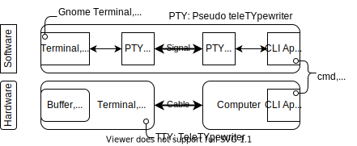

2021.07.12

[What's the difference between a console, a terminal, and a shell?](https://www.hanselman.com/blog/whats-the-difference-between-a-console-a-terminal-and-a-shell)

[Windows Command-Line: Introducing the Windows Pseudo Console (ConPTY)](https://devblogs.microsoft.com/commandline/windows-command-line-introducing-the-windows-pseudo-console-conpty)

2021.07.13

 我整理了一下这些概念的关系如下图

