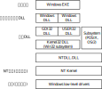
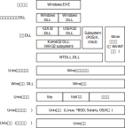
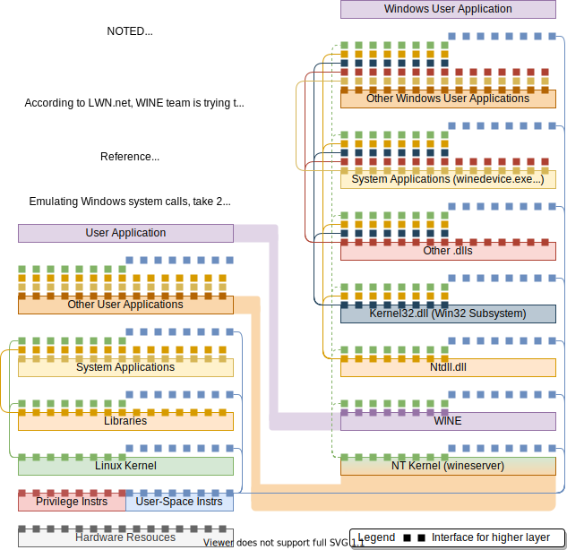
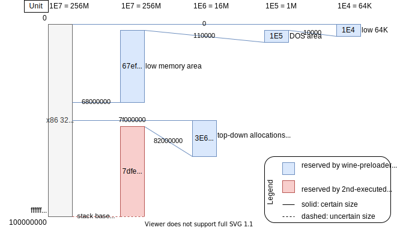

<div style="text-align:right; font-size:3em;">2020.7.14</div>

# wine中的各类设计

说道设计我觉得刘奇师兄博士论文的图画得Win NT架构图和Wine架构图真的很有必要再次引用到这里，



<div style="text-align:center;">左：Win NT的架构 | 右：Wine的架构</div>

每看过一段时间的wine源码再来看这张图都有新的理解。

* NT Kernel（左）对应Wine服务器（右），但wine服务器（wineserver）并不能单独起到NT kernel的作用还需要Wine可执行程序（wine）的支持。

2020.8.11新画的Win NT应用软件架构层次图，左为Linux用户程序的架构层次图，右为模拟出来的Windows用户程序的架构层次图，



## wine启动过程

代码框架图：2020.7.13



## 进程和内核（wineserver）通信

**注**：这里**进程**都是指在wine的环境下运行的windows进程。这里的**内核**都是指windows的内核。

目前我看到的**通信**，即`wineserver -d1`能打印出来的，都是wine实现的windows的“**系统调用**”。

这些“系统调用”的函数指针被集中放在全局变量`dlls/ntdll/unixlib.h: unix_funcs`里，**例**：`NtResumeThread`；

上面说的指针所指向的函数散落在`dlls/ntdll/unix/`的各个文件里，**例**：`NtResumeThread`在`dlls/ntdll/unix/thread.c`里；

这些“系统调用”由进程向wineserver请求，由wineserver实际执行，再有wineserver返回结果；这模拟了系统调用的过程：进程向内核发请求，内核执行，内核返回结果；

### 进程发送请求

<div style="text-align:right; font-size:3em;">2020.7.15</div>

参考[官方wineserver文档](https://wiki.winehq.org/Wineserver)的Help to create a server request：

```c
// @dlls/ntdll/unix/thread.c: NTSTATUS WINAPI NtResumeThread( HANDLE handle, ULONG *count )
SERVER_START_REQ( request_name )
{
    /* implicit variables: req, reply */
    req->input = 1;
    req->handle = wine_server_obj_handle( handle ); /* converts Windows HANDLE to a server obj_handle_t */
    if (wine_server_call( req ) != STATUS_SUCCESS)
    {
        /* SetLastError(), return error code, etc. */
    }
    do_something(reply->output);
}
SERVER_END_REQ;
```

其中变量`req`, `reply`的成员`u`是个包含了所有请求/返回类型的union，**例**：`req.resume_thread_request`, `reply.resume_thread_reply`。

如此操作，进程向wineserver发送了一个执行`resume_thread`“系统调用”的请求。然后得到的返回结果在`reply`中。

### wineserver接收请求&实际执行

wineserver的代码框架图：**注**：以`resume_thread`为例：



可以见到resume_thread涉及到两个线程<span style="background: #F8CECC;">请求“系统调用”的线程</span>和<span style="background: #FFE6CC">被resume的线程</span>。

2021.04.22

### trace

wineserver的trace属于集中式管理，和wine其他的trace属于分散式。trace输出函数位于，

* call_req_handler
  * trace_request
  * trace_reply

<div style="text-align:right; font-size:3em;">2020.08.04</div>

## 内存预留

内存预留由2步，由变量preload_info（wine_main_preload_info）做桥梁，

1. <span style="background:#DAE8FC;">preloader计算需要预留的空间</span>，
2. <span style="background:#F8CECC;">第二次启动wine时调用ntdll.so里<code>__wine_main</code>调用<code>virtual_init</code>函数完成内存预留</span>。

<div style="text-align:right; font-size:3em;">2020.08.05</div>

分配空间如下，



<span style="background:#DAE8FC;">蓝色部分的内存预留</span>是定死了的。

😀相较而言，比较有意思的是<span style="background:#F8CECC;">红色部分的内存预留</span>是有很多空洞的，这些空洞来自于被分配给动态链接库已经占用了某些地址。也就是说，<span style="background:#F8CECC;">红色部分的内存预留</span>并不是给固定地址的代码用的，是给地址不敏感的代码用的。😀因为要处理空洞，这个部分的预留算法也很有趣，利用mmap系统调用的`MAP_FIXED`标志，若成功表示没空洞；若失败表示有空洞，则二分采用递归重新尝试。这个算法对应`dlls/ntdll/unix/virtual.c: 206~282 `的代码。

<div style="text-align:right; font-size:3em;">2020.08.06</div>

wine维护了一个已保留的内存地址链表`dlls/ntdll/unix/virtual.c: 82: reserved_areas`，各种用宏实现。

<div style="text-align:right; font-size:3em;">2021.04.23</div>

## physDev设备栈（图形设备GDI）

**注**：参考Notes/Kernel/Windows/driver/logs.md 2021.01.12记录的*WINE的physdev stack*。

这里的设备只指图形设备GDI。设备栈其实是设备驱动栈。

设备栈和面向对象的继承思想一致。设备<=>对象。设备在栈里的上下关系<=>对象的子父关系。

设备成员变量定义用grep查找`\}.*_PDEVICE`。都是PHYSDEV的“子类”。

设备函数函数申明用grep查找`gdi_dc_funcs.*=`。设备栈中存在函数继承和函数覆盖(override)现象。栈上层设备继承&覆盖下层设备的函数。GET_DC_PHYSDEV

`push_dc_driver( PHYSDEV *dev, PHYSDEV physdev, const struct g      di_dc_funcs *funcs )`负责压栈。
用优先级（gdi_dc_funcs的priority变量）确定设备在栈里的顺序。
保证压入的设备一定位于栈顶，隐式的弹出超过当前优先级的设备。
没有显式弹栈的操作。

在添加优先级机制前的设备栈更容易理解。
压栈弹栈符合直觉，不含隐式操作。
优先级机制在2012.5.18的commit e94d3b4e0897d6c744595941bcfd724bdd47d3f9中添加。

### 打印机相关新增

**优先级**：

* psdrv, wingdidrv: GDI_PRIORITY_GRAPHICS_DRV=200，有pPutImage
* GDI_PRIORITY_DIB_DRV=300
* wingdidrv_compat: 308，无pPutImage

nullStrtchBlt

* dlls/gdi32/painting.c: WINAPI Ellipse
  * pEllipse
    * dibdrv_Ellipse
    * nulldrv_Ellipse

<div style="text-align:right; font-size:3em;">2021.05.19</div>

## 线程初始化

```c
// dlls/ntdll/thread.c
thread_init(void)
{
    TEB *teb;
    // ...
    /// signal_前缀表示在该函数在模拟信号处理过程，
    /// 从该函数用到了stack_t ss数据结构看出，signal stack
    signal_alloc_thread(&teb);
    // ...
    signal_init_thread(teb)
    {
        /// 将teb
        wine_ldt_init_fs(thread->fs, &fs_entry);
    }
}
```

