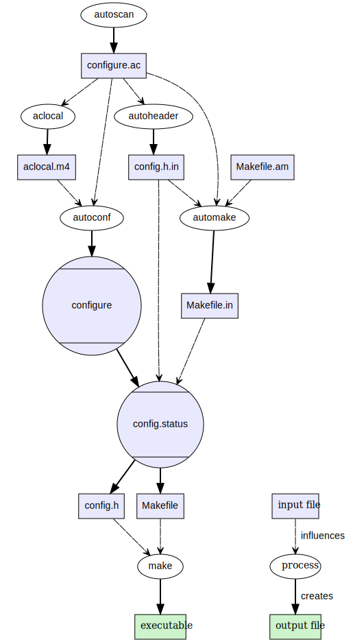

<div style="font-size:3em; text-align:right;">2019.9.15</div>
# 最终目标

1. x86的winegcc能够交叉编译出龙芯的可执行文件；
2. 将winegcc源码编译到龙芯去。

# x86的winegcc编译notepad.exe

**注**：notepad.exe是windows里的写字本程序。notepad.exe的源码包含在了wine的源码里，在`programs/notepad/`里。

想要试一试x86的winegcc能不能正常编译notepad.exe。于是去看notepad的Makefile。在`programs/notepad/Makefile`里，内容相当多，看开头的注释“# Automatically generated by make depend; DO NOT EDIT!!”，莫非make depend是一个自动生成Makefile的工具？

## ~~makedepend~~

~~输入makedepend，终端会提示安装xutils-dev
sudo apt install xutils-dev~~

将notepad的源码复制到了一个独立的一个文件夹里`~/Desktop/notepad/`。

<div style="font-size:3em; text-align:right;">2019.9.16</div>
在wine根目录下的`configure`里看到了，

```bash
# Guess values for system-dependent variables and create Makefiles.
# Generated by GNU Autoconf 2.69 for Wine 4.14.
```

GNU Autoconf应该是个工具。在wikipedia的[autoconf词条](https://en.wikipedia.org/wiki/Autoconf)里上看到了一张autoconf和automake的流程图，



从旁边的说明得知这是GNU Build System的编译一个项目的流程图。

去[GNU Build System的wikipedia页面](https://en.wikipedia.org/wiki/GNU_Build_System)查看，发现Makefile.in等文件都是有用处的，难怪之前只复制.h和.c文件，然后调用winemaker会出问题。

于是把notepad里所有的文件都复制进一个文件夹`~/Desktop/notepad/`，并添加了git管理，

```bash
$ winemaker .
Winemaker 0.8.4
Copyright 2000-2004 François Gouget <fgouget@codeweavers.com> for CodeWeavers
Copyright 2004 Dimitrie O. Paun
Copyright 2009-2012 André Hentschel
warning: in ".", renaming "Makefile" to "makefile.win"
Scanning the source directories...
Fixing the source files...
  dialog.c
  main.c
  notepad.rc
  dialog.h
  main.h
  notepad_res.h
Generating project files...
```

看输出信息，winemaker替换了原Makefile的信息，且修改了源码的内容。用git看，仅仅只是新增了makefile.win（应该是原来的Makefile），修改了Makefile。

突然想起来，原来的Makefile里调用了很多wine的库函数（见原Makefile），**所以不应该单独把notepad复制到另一个文件夹中。**

**应该在`programs/notepad/`里搞！**

仍然有问题，看新Makefile里没有关于../../include/的内容。所以winemaker并没有去读取原Makefile的内容。

最终发现有很多依赖的头文件很难搞，索性放弃这一条路。

# x86的winegcc编译窗口界面的helloworld

源码，

```c
#include <windows.h>
#include <stdio.h>
 
int WINAPI WinMain(HINSTANCE hlnstance,HINSTANCE hPrelnstance,LPSTR lpCmdLine,int nCmdShow)
{
	MessageBox(NULL,"hello,world!","HELLO",MB_OK|MB_ICONASTERISK);
    return 0;
}
```

在用`x86_64-w64-mingw32-gcc`编译能够用wine64启动。

~~用winegcc编译出来的是不是ELF文件，可能winegcc并不是把win的代码编译到linux上，而是在linux上把win的代码编译成win程序。~~

用winegcc编译出来两个文件，

1. winegccHelloWorld.exe，不是ELF文件，可以删掉不影响.so运行；

2. winegccHelloWorld.exe.so，是ELF文件，不能直接运行（显示“Segmentation fault (core dumped)”），需要如下方式运行，参考[CSDN博客利用winelib编译一个可在linux下运行的程序](https://blog.csdn.net/wwyyxx26/article/details/9853089)，

   ```bash
   wine64 winegccHelloWorld.exe.so
   ```

<div style="font-size: 1.5em; font-weight: bold; color:red;">🤔为什么直接运行.so文件会出错？</div>

猜想是wine64给应用程序准备好了它需要的函数（放在内存的适当的地方），或者说是wine64充当了loader的角色！（终于理解wine的源码为什么叫loader了）。