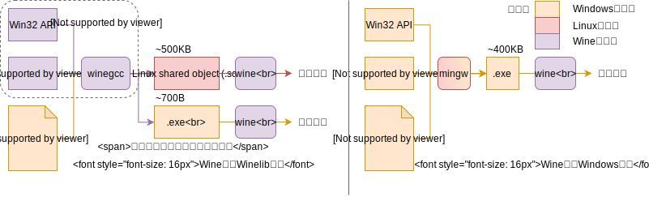

<div style="text-align:center;font-size:3em;font-weight:bold;">Winelib调研报告</div>
<span>谢本壹</span><span style="float:right">2019.9.16-2019.9.18 Week5</span>

---

<span style="font-size:1.5em">目录</span>

[TOC]

---

## Winelib简介

Winelib是一个工具库，它包含，

* Win32 API的实现，
* Windows的头文件实现，
* 编译工具，如winemaker（对应make），winegcc（对应gcc），winedbg（对应gdb），wrc（对应resource compiler）等。

## Winelib用法

用户直接接触winelib的部分是一系列编译工具如winemaker，winegcc，winedbg等。这些工具在编译源码时会调用到Win32 API和Windows头文件，接下来简要介绍这些工具，

### winemaker

对源文件做一些处理，比如改正大小写、将`\`改为`/`等，然后为项目生成makefile。

```bash
winemaker .
```

对于所有源文件都在同一目录的项目能很好的生产makefile，但是若源文件不在同一目录下的项目没法生成正确的makefile。

### winegcc

对gcc的一个包装，支持所有gcc的参数。其man page有列出其独特的参数。

```bash
winegcc winHelloWorld.c -o winHelloWorld
# 生成winHelloWorld.exe和winHelloWorld.exe.so
```



### winedbg

对gdb的一个包装。

## 移植的可能性

* winegcc是对gcc的一个包装，让winegcc调用mips的gcc即可生成mips的.so文件；
* wine作为一个加载器，本质上是对Linux的加载函数（比如dlopen）的加壳；
* 被调用的Win32 API和Windows头文件源码均由C语言实现。

所以移植是可能的。

### 移植难度

* 目标平台代码的量，inline asm，如何统计？

* 平台相关代码的量，例如，

  ```c
  enum target_cpu
  {
      CPU_x86, CPU_x86_64, CPU_POWERPC, CPU_ARM, CPU_ARM64
  };
  ```

## 关于代码分析的一些想法

面对一个陌生的大项目，如何开始了解并分析这个项目？一般来说是去看README文件，但是没有怎么办？由此产生了学习如何系统的来分析一个大项目的想法。

在看wine的代码的过程中，想要通过代码分析解决的问题，

|  序  | 需要分析的问题                   | 解决方案                                | 注                                                           |
| :--: | -------------------------------- | --------------------------------------- | ------------------------------------------------------------ |
|  1   | 代码体量，代码分布，主要编程语言 | `sloccount`和`scc`工具                  | 全文本输出。                                                 |
|  2   | 代码的框架                       | `llvm+graphvi`或`doxygen`输出call graph | 前者等价于用llvm编译整个项目然后用llvm的pass来分析的，makefile怎么改？后者是个写文档的软件，学习成本挺高。 |
|  3   | 代码的可移植性                   | 暂无                                    | 可以分析源码用到了多少inline asm？                           |

