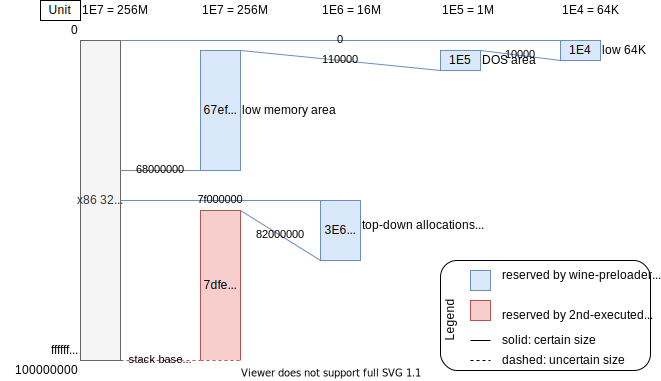

**前言**：以下工作，若无特别标注，均在龙芯上用qemu-i386运行wine（32位）然后执行win32程序。

<div style="text-align:right; font-size:3em;">2020.7.9</div>

## segment fault其一

**TLDR**：动态链接库不全。**注意**除了wine所需的动态链接库，还有wine相关的程序和动态链接库（比如这里的`ntdll.dll.so`）所需的动态链接库。

运行一段时间后除了segment fault无其他报错。仔细跟踪一番源码找到了segment fault错误的来源，`dlls/ntdll/ntdll.dll.so`依赖的动态链接库没有放到龙芯机器里去。但这里使用`ldd`分析`ntdll.dll.so`所需的依赖出现了问题，分析出的依赖全是64位的，可是需要的是32位。把32位的库放进龙芯机器，`ping`便可以执行了，虽然过程中有许多报错，很多`.dll`没找到的报错。

## 正常运行ping但仍有报错

**在x86_64电脑上用qemu-i386运行wine ping的输出信息**和**在3a4000电脑上用qemu-i386运行wine ping的输出信息**用patch的形式表达如下：

```diff
--- /home/xieby1/x86_64-qemu-wine-ping
+++ /home/xieby1/3a4000-qemu-wine-ping
@@ -1,13 +1,53 @@
-xieby1@xieby1-Lenovo-Y50-70:~/Codes/wine$ loader/wine ping
+xieby1@thtf-pc:~/Codes/wine$ loader/wine ping
# 2020.7.17: 下面两条报错大概是因为竞争产生，详细说明见关于报错 
+002c:err:virtual:virtual_map_section mapping 0x880000 1000 000000000 failed
+002c:err:wineboot:create_user_shared_data cannot map __wine_user_shared_data
# 2020.7.17: ==========================================
+0034:err:module:open_builtin_file failed to load .so lib "/home/xieby1/Codes/wine/dlls/ole32/ole32.dll.so"
+0034:err:module:import_dll Loading library ole32.dll (which is needed by L"C:\\windows\\system32\\shcore.dll") failed (error c000007a).
+0034:err:module:import_dll Library shcore.dll (which is needed by L"C:\\windows\\system32\\shlwapi.dll") not found
+0034:err:module:import_dll Library shlwapi.dll (which is needed by L"C:\\windows\\system32\\shell32.dll") not found
+0034:err:module:import_dll Library shell32.dll (which is needed by L"C:\\windows\\system32\\winemenubuilder.exe") not found
+0034:err:module:open_builtin_file failed to load .so lib "/home/xieby1/Codes/wine/dlls/ole32/ole32.dll.so"
+0034:err:module:import_dll Loading library ole32.dll (which is needed by L"C:\\windows\\system32\\shcore.dll") failed (error c000007a).
+0034:err:module:import_dll Library shcore.dll (which is needed by L"C:\\windows\\system32\\shlwapi.dll") not found
+0034:err:module:import_dll Library shlwapi.dll (which is needed by L"C:\\windows\\system32\\winemenubuilder.exe") not found
+0034:err:module:open_builtin_file failed to load .so lib "/home/xieby1/Codes/wine/dlls/ole32/ole32.dll.so"
+0034:err:module:import_dll Loading library ole32.dll (which is needed by L"C:\\windows\\system32\\winemenubuilder.exe") failed (error c000007a).
+0034:err:module:open_builtin_file failed to load .so lib "/home/xieby1/Codes/wine/dlls/ole32/ole32.dll.so"
+0034:err:module:import_dll Loading library ole32.dll (which is needed by L"C:\\windows\\system32\\windowscodecs.dll") failed (error c000007a).
+0034:err:module:open_builtin_file failed to load .so lib "/home/xieby1/Codes/wine/dlls/oleaut32/oleaut32.dll.so"
+0034:err:module:import_dll Loading library oleaut32.dll (which is needed by L"C:\\windows\\system32\\windowscodecs.dll") failed (error c000007a).
+0034:err:module:open_builtin_file failed to load .so lib "/home/xieby1/Codes/wine/dlls/ole32/ole32.dll.so"
+0034:err:module:import_dll Loading library ole32.dll (which is needed by L"C:\\windows\\system32\\propsys.dll") failed (error c000007a).
+0034:err:module:open_builtin_file failed to load .so lib "/home/xieby1/Codes/wine/dlls/oleaut32/oleaut32.dll.so"
+0034:err:module:import_dll Loading library oleaut32.dll (which is needed by L"C:\\windows\\system32\\propsys.dll") failed (error c000007a).
+0034:err:module:import_dll Library propsys.dll (which is needed by L"C:\\windows\\system32\\windowscodecs.dll") not found
+0034:err:module:open_builtin_file failed to load .so lib "/home/xieby1/Codes/wine/dlls/ole32/ole32.dll.so"
+0034:err:module:import_dll Loading library ole32.dll (which is needed by L"C:\\windows\\system32\\shcore.dll") failed (error c000007a).
+0034:err:module:import_dll Library shcore.dll (which is needed by L"C:\\windows\\system32\\shlwapi.dll") not found
+0034:err:module:import_dll Library shlwapi.dll (which is needed by L"C:\\windows\\system32\\windowscodecs.dll") not found
+0034:err:module:import_dll Library windowscodecs.dll (which is needed by L"C:\\windows\\system32\\winemenubuilder.exe") not found
+0034:err:module:LdrInitializeThunk Importing dlls for L"C:\\windows\\system32\\winemenubuilder.exe" failed, status c0000135
+Wine cannot find the FreeType font library.  To enable Wine to
+use TrueType fonts please install a version of FreeType greater than
+or equal to 2.0.5.
+http://www.freetype.org
+wine client error:70: wine client error:70: read: Bad address
+read: Bad address
+0070:err:seh:segv_handler Got unexpected trap -1
+0070:err:seh:NtRaiseException Exception frame is not in stack limits => unable to dispatch exception.
+wine client error:70: write: Bad file descriptor
+003c:err:service:process_send_command service protocol error - failed to read pipe r = 0  count = 0!
+003c:fixme:service:scmdatabase_autostart_services Auto-start service L"winebus" failed to start: 1053
 0080:err:ntoskrnl:ZwLoadDriver failed to create driver L"\\Registry\\Machine\\System\\CurrentControlSet\\Services\\wineusb": c0000142
 003c:fixme:service:scmdatabase_autostart_services Auto-start service L"wineusb" failed to start: 1114
+Wine cannot find the FreeType font library.  To enable Wine to
+use TrueType fonts please install a version of FreeType greater than
+or equal to 2.0.5.
+http://www.freetype.org
 Usage: ping [-n count] [-w timeout] [-l buffer_length] target_name
 
 Options:
     -n  Number of echo requests to send.
     -w  Timeout in milliseconds to wait for each reply.
     -l  Length of send buffer.
-xieby1@xieby1-Lenovo-Y50-70:~/Codes/wine$ 0088:err:seh:segv_handler Got unexpected trap -1
-0088:err:seh:NtRaiseException Unhandled exception code c000001d flags 0 addr 0x7bc88207
-wine client error:90: write: Bad file descriptor
+xieby1@thtf-pc:~/Codes/wine$ qemu: uncaught target signal 11 (Segmentation fault) - core dumped
^C
```

<div style="text-align:right; font-size:3em;">2020.7.10</div>

用gdb的add-symbol-file [-o]终于锁定了出错的地方，winNT的“系统调用“`NTResumeThread`，具体的调用路据如下：

<span style="color:red;">**ABORTED**</span>：将下面的图画成流程图

第二次执行wine（经过wine-preloader的各种操作后）在`dlls/ntdll/ntdll.so`

* `__wine_main`
  * `start_main_thread`
    *  `p__wine_set_unix_funcs`**就是winNT的”系统调用“暴露给unix的意思**，若想看winNT函数如何来的，大概可以从这里入手！

然后转到`dlls/ntdll/ntdll.dll.so`里的函数去执行

* `__wine_set_unix_funcs`
  * `__wine_process_init`
    * `init_user_process_params`
      * `run_wineboot`
        * `NtResumeThread`

然后wine会给wine-server发送请求（感觉就是用户程序给内核发送请求），让wine-server来执行`resume_thread`。在`wine/server/thread.c`里，

* `resume_thread`

<div style="text-align:right; font-size:3em;">2020.7.13</div>

## gdb连上了wine-server

wine-server默认为backguound的模式工作，即在后台（fork然后让父进程推出）。但是qemu的gdbstub不支持`set follow-fork-mode`所以现阶段，我完全没有任何办法通过gdb连上fork出来的进程。测试了一下用wine-server的foreground模式报错信息似乎（没有仔细去对照）是一样的，所以那就直接在前台用qemu运行一个wine-server再连上gdb就方便了！下面是gdb break到`req_resume_thread`时的backtrace：

<div>
    <pre>#0  <font color="#C4A000">req_resume_thread</font> (<font color="#06989A">req</font>=0xff3914b8, <font color="#06989A">reply</font>=0xfef5ac8c) at <font color="#4E9A06">thread.c</font>:1600
#1  <font color="#3465A4">0xfef9e589</font> in <font color="#C4A000">call_req_handler</font> (<font color="#06989A">thread</font>=0xff3913d0) at <font color="#4E9A06">request.c</font>:310
#2  <font color="#3465A4">0xfef9e6c6</font> in <font color="#C4A000">read_request</font> (<font color="#06989A">thread</font>=0xff3913d0) at <font color="#4E9A06">request.c</font>:344
#3  <font color="#3465A4">0xfefa592a</font> in <font color="#C4A000">thread_poll_event</font> (<font color="#06989A">fd</font>=0xff391590, <font color="#06989A">event</font>=1) at <font color="#4E9A06">thread.c</font>:369
#4  <font color="#3465A4">0xfef763b6</font> in <font color="#C4A000">fd_poll_event</font> (<font color="#06989A">fd</font>=0xff391590, <font color="#06989A">event</font>=1) at <font color="#4E9A06">fd.c</font>:519
#5  <font color="#3465A4">0xfef766af</font> in <font color="#C4A000">main_loop_epoll</font> () at <font color="#4E9A06">fd.c</font>:614
#6  <font color="#3465A4">0xfef76c33</font> in <font color="#C4A000">main_loop</font> () at <font color="#4E9A06">fd.c</font>:980
#7  <font color="#3465A4">0xfef81466</font> in <font color="#C4A000">main</font> (<font color="#06989A">argc</font>=2, <font color="#06989A">argv</font>=0xfef5b494) at <font color="#4E9A06">main.c</font>:148</pre>
</div>

<div style="text-align:right; font-size:3em;">2020.7.14</div>

## 在没有考虑语义的基础上定位报错

想要定位第一个报错的位置，这里一段的“报错”都指第一个报错，即`err:virtual:virtual_map_section mapping 0x880000 1000 000000000 failed`。

运行两个gdb，

1. 修改**wine**的源码让第二次启动wine时打开gdb端口1234，
2. 在前台运行**wineserver**且打开gdb端口1235，可以打开wineserver的debug_level，命令行`-d1`，也可以在合适的地方用gdb`set debug_level=1`，

通过打印出的“系统调用”，可以大致锁定报错的范围，在**wine**调用函数`NtResumeThread`后的两个`open_mapping`调用之间，（下面的第一个open_mapping的调用阶段没有输出，只有返回阶段，因为在break到`req_open_mapping`后才设置的`debug_level`）

```shell
002c: open_mapping() = 0 { handle=0024 }
002c: get_mapping_info( handle=0024, access=00000002 )
002c: get_mapping_info() = 0 { size=00001000, flags=08000000, shared_file=0000, image={} }
002c: get_handle_fd( handle=0024 )
002c: *fd* 0024 -> 21
002c: get_handle_fd() = 0 { type=1, cacheable=1, access=000f001f, options=00000020 }
002c: close_handle( handle=0024 )
002c: close_handle() = 0
002c: create_key( access=000f003f, options=00000001, objattr={rootdir=000c,attributes=00000000,sd={},name=L"Hardware\\Description\\System"}, class=L"" )
002c: create_key() = OBJECT_NAME_NOT_FOUND { hkey=0000, created=0 }
002c: create_key( access=000f003f, options=00000001, objattr={rootdir=000c,attributes=00000000,sd={},name=L"Hardware"}, class=L"" )
002c: create_key() = 0 { hkey=0024, created=1 }
002c: create_key( access=000f003f, options=00000001, objattr={rootdir=0024,attributes=00000000,sd={},name=L"Description"}, class=L"" )
002c: create_key() = 0 { hkey=0028, created=1 }
002c: close_handle( handle=0024 )
002c: close_handle() = 0
002c: create_key( access=000f003f, options=00000001, objattr={rootdir=0028,attributes=00000000,sd={},name=L"System"}, class=L"" )
002c: create_key() = 0 { hkey=0024, created=1 }
002c: close_handle( handle=0028 )
002c: close_handle() = 0
002c: set_key_value( hkey=0024, type=1, namelen=20, name=L"Identifier", data={41,00,54,00,20,00,63,00,6f,00,6d,00,70,00,61,00,74,00,69,00,62,00,6c,00,65,00,00,00} )
002c: set_key_value() = 0
002c: create_key( access=000f003f, options=00000001, objattr={rootdir=0024,attributes=00000000,sd={},name=L"FloatingPointProcessor"}, class=L"" )
002c: create_key() = 0 { hkey=0028, created=1 }
002c: create_key( access=000f003f, options=00000001, objattr={rootdir=0024,attributes=00000000,sd={},name=L"CentralProcessor"}, class=L"" )
002c: create_key() = 0 { hkey=002c, created=1 }
002c: create_key( access=000f003f, options=00000001, objattr={rootdir=002c,attributes=00000000,sd={},name=L"0"}, class=L"" )
002c: create_key() = 0 { hkey=0030, created=1 }
002c: set_key_value( hkey=0030, type=4, namelen=20, name=L"FeatureSet", data={bf,3f,69,00} )
002c: set_key_value() = 0
002c: set_key_value( hkey=0030, type=1, namelen=20, name=L"Identifier", data={78,00,38,00,36,00,20,00,46,00,61,00,6d,00,69,00,6c,00,79,00,20,00,36,00,20,00,4d,00,6f,00,64,00,65,00,6c,00,20,00,36,00,20,00,53,00,74,00,65,00,70,00,70,00,69,00,6e,00,67,00,20,00,33,00,00,00} )
002c: set_key_value() = 0
002c: set_key_value( hkey=0030, type=1, namelen=38, name=L"ProcessorNameString", data={51,00,45,00,4d,00,55,00,20,00,56,00,69,00,72,00,74,00,75,00,61,00,6c,00,20,00,43,00,50,00,55,00,20,00,76,00,65,00,72,00,73,00,69,00,6f,00,6e,00,20,00,32,00,2e,00,35,00,2b,00,00,00} )
002c: set_key_value() = 0
002c: set_key_value( hkey=0030, type=1, namelen=32, name=L"VendorIdentifier", data={47,00,65,00,6e,00,75,00,69,00,6e,00,65,00,49,00,6e,00,74,00,65,00,6c,00,00,00} )
002c: set_key_value() = 0
002c: set_key_value( hkey=0030, type=4, namelen=8, name=L"~MHz", data={e8,03,00,00} )
002c: set_key_value() = 0
002c: close_handle( handle=0030 )
002c: close_handle() = 0
002c: create_key( access=000f003f, options=00000001, objattr={rootdir=0028,attributes=00000000,sd={},name=L"0"}, class=L"" )
002c: create_key() = 0 { hkey=0030, created=1 }
002c: set_key_value( hkey=0030, type=1, namelen=20, name=L"Identifier", data={78,00,38,00,36,00,20,00,46,00,61,00,6d,00,69,00,6c,00,79,00,20,00,36,00,20,00,4d,00,6f,00,64,00,65,00,6c,00,20,00,36,00,20,00,53,00,74,00,65,00,70,00,70,00,69,00,6e,00,67,00,20,00,33,00,00,00} )
002c: set_key_value() = 0
002c: close_handle( handle=0030 )
002c: close_handle() = 0
002c: create_key( access=000f003f, options=00000001, objattr={rootdir=002c,attributes=00000000,sd={},name=L"1"}, class=L"" )
002c: create_key() = 0 { hkey=0030, created=1 }
002c: set_key_value( hkey=0030, type=4, namelen=20, name=L"FeatureSet", data={bf,3f,69,00} )
002c: set_key_value() = 0
002c: set_key_value( hkey=0030, type=1, namelen=20, name=L"Identifier", data={78,00,38,00,36,00,20,00,46,00,61,00,6d,00,69,00,6c,00,79,00,20,00,36,00,20,00,4d,00,6f,00,64,00,65,00,6c,00,20,00,36,00,20,00,53,00,74,00,65,00,70,00,70,00,69,00,6e,00,67,00,20,00,33,00,00,00} )
002c: set_key_value() = 0
002c: set_key_value( hkey=0030, type=1, namelen=38, name=L"ProcessorNameString", data={51,00,45,00,4d,00,55,00,20,00,56,00,69,00,72,00,74,00,75,00,61,00,6c,00,20,00,43,00,50,00,55,00,20,00,76,00,65,00,72,00,73,00,69,00,6f,00,6e,00,20,00,32,00,2e,00,35,00,2b,00,00,00} )
002c: set_key_value() = 0
002c: set_key_value( hkey=0030, type=1, namelen=32, name=L"VendorIdentifier", data={47,00,65,00,6e,00,75,00,69,00,6e,00,65,00,49,00,6e,00,74,00,65,00,6c,00,00,00} )
002c: set_key_value() = 0
002c: set_key_value( hkey=0030, type=4, namelen=8, name=L"~MHz", data={e8,03,00,00} )
002c: set_key_value() = 0
002c: close_handle( handle=0030 )
002c: close_handle() = 0
002c: create_key( access=000f003f, options=00000001, objattr={rootdir=0028,attributes=00000000,sd={},name=L"1"}, class=L"" )
002c: create_key() = 0 { hkey=0030, created=1 }
002c: set_key_value( hkey=0030, type=1, namelen=20, name=L"Identifier", data={78,00,38,00,36,00,20,00,46,00,61,00,6d,00,69,00,6c,00,79,00,20,00,36,00,20,00,4d,00,6f,00,64,00,65,00,6c,00,20,00,36,00,20,00,53,00,74,00,65,00,70,00,70,00,69,00,6e,00,67,00,20,00,33,00,00,00} )
002c: set_key_value() = 0
002c: close_handle( handle=0030 )
002c: close_handle() = 0
002c: create_key( access=000f003f, options=00000001, objattr={rootdir=002c,attributes=00000000,sd={},name=L"2"}, class=L"" )
002c: create_key() = 0 { hkey=0030, created=1 }
002c: set_key_value( hkey=0030, type=4, namelen=20, name=L"FeatureSet", data={bf,3f,69,00} )
002c: set_key_value() = 0
002c: set_key_value( hkey=0030, type=1, namelen=20, name=L"Identifier", data={78,00,38,00,36,00,20,00,46,00,61,00,6d,00,69,00,6c,00,79,00,20,00,36,00,20,00,4d,00,6f,00,64,00,65,00,6c,00,20,00,36,00,20,00,53,00,74,00,65,00,70,00,70,00,69,00,6e,00,67,00,20,00,33,00,00,00} )
002c: set_key_value() = 0
002c: set_key_value( hkey=0030, type=1, namelen=38, name=L"ProcessorNameString", data={51,00,45,00,4d,00,55,00,20,00,56,00,69,00,72,00,74,00,75,00,61,00,6c,00,20,00,43,00,50,00,55,00,20,00,76,00,65,00,72,00,73,00,69,00,6f,00,6e,00,20,00,32,00,2e,00,35,00,2b,00,00,00} )
002c: set_key_value() = 0
002c: set_key_value( hkey=0030, type=1, namelen=32, name=L"VendorIdentifier", data={47,00,65,00,6e,00,75,00,69,00,6e,00,65,00,49,00,6e,00,74,00,65,00,6c,00,00,00} )
002c: set_key_value() = 0
002c: set_key_value( hkey=0030, type=4, namelen=8, name=L"~MHz", data={e8,03,00,00} )
002c: set_key_value() = 0
002c: close_handle( handle=0030 )
002c: close_handle() = 0
002c: create_key( access=000f003f, options=00000001, objattr={rootdir=0028,attributes=00000000,sd={},name=L"2"}, class=L"" )
002c: create_key() = 0 { hkey=0030, created=1 }
002c: set_key_value( hkey=0030, type=1, namelen=20, name=L"Identifier", data={78,00,38,00,36,00,20,00,46,00,61,00,6d,00,69,00,6c,00,79,00,20,00,36,00,20,00,4d,00,6f,00,64,00,65,00,6c,00,20,00,36,00,20,00,53,00,74,00,65,00,70,00,70,00,69,00,6e,00,67,00,20,00,33,00,00,00} )
002c: set_key_value() = 0
002c: close_handle( handle=0030 )
002c: close_handle() = 0
002c: create_key( access=000f003f, options=00000001, objattr={rootdir=002c,attributes=00000000,sd={},name=L"3"}, class=L"" )
002c: create_key() = 0 { hkey=0030, created=1 }
002c: set_key_value( hkey=0030, type=4, namelen=20, name=L"FeatureSet", data={bf,3f,69,00} )
002c: set_key_value() = 0
002c: set_key_value( hkey=0030, type=1, namelen=20, name=L"Identifier", data={78,00,38,00,36,00,20,00,46,00,61,00,6d,00,69,00,6c,00,79,00,20,00,36,00,20,00,4d,00,6f,00,64,00,65,00,6c,00,20,00,36,00,20,00,53,00,74,00,65,00,70,00,70,00,69,00,6e,00,67,00,20,00,33,00,00,00} )
002c: set_key_value() = 0
002c: set_key_value( hkey=0030, type=1, namelen=38, name=L"ProcessorNameString", data={51,00,45,00,4d,00,55,00,20,00,56,00,69,00,72,00,74,00,75,00,61,00,6c,00,20,00,43,00,50,00,55,00,20,00,76,00,65,00,72,00,73,00,69,00,6f,00,6e,00,20,00,32,00,2e,00,35,00,2b,00,00,00} )
002c: set_key_value() = 0
002c: set_key_value( hkey=0030, type=1, namelen=32, name=L"VendorIdentifier", data={47,00,65,00,6e,00,75,00,69,00,6e,00,65,00,49,00,6e,00,74,00,65,00,6c,00,00,00} )
002c: set_key_value() = 0
002c: set_key_value( hkey=0030, type=4, namelen=8, name=L"~MHz", data={e8,03,00,00} )
002c: set_key_value() = 0
002c: close_handle( handle=0030 )
002c: close_handle() = 0
002c: create_key( access=000f003f, options=00000001, objattr={rootdir=0028,attributes=00000000,sd={},name=L"3"}, class=L"" )
002c: create_key() = 0 { hkey=0030, created=1 }
002c: set_key_value( hkey=0030, type=1, namelen=20, name=L"Identifier", data={78,00,38,00,36,00,20,00,46,00,61,00,6d,00,69,00,6c,00,79,00,20,00,36,00,20,00,4d,00,6f,00,64,00,65,00,6c,00,20,00,36,00,20,00,53,00,74,00,65,00,70,00,70,00,69,00,6e,00,67,00,20,00,33,00,00,00} )
002c: set_key_value() = 0
002c: close_handle( handle=0030 )
002c: close_handle() = 0
002c: create_key( access=000f003f, options=00000001, objattr={rootdir=0024,attributes=00000000,sd={},name=L"BIOS"}, class=L"" )
002c: create_key() = 0 { hkey=0030, created=1 }
002c: set_key_value( hkey=0030, type=1, namelen=42, name=L"BaseBoardManufacturer", data={54,00,48,00,54,00,46,00,00,00} )
002c: set_key_value() = 0
002c: set_key_value( hkey=0030, type=1, namelen=32, name=L"BaseBoardProduct", data={54,00,48,00,54,00,46,00,2d,00,4c,00,53,00,33,00,41,00,34,00,30,00,30,00,30,00,2d,00,37,00,41,00,31,00,30,00,30,00,30,00,2d,00,31,00,57,00,2d,00,56,00,42,00,33,00,2d,00,4d,00,4c,00,34,00,41,00,00,00} )
002c: set_key_value() = 0
002c: set_key_value( hkey=0030, type=1, namelen=32, name=L"BaseBoardVersion", data={56,00,42,00,33,00,00,00} )
002c: set_key_value() = 0
002c: set_key_value( hkey=0030, type=1, namelen=20, name=L"BIOSVendor", data={5a,00,44,00,20,00,74,00,65,00,63,00,68,00,00,00} )
002c: set_key_value() = 0
002c: set_key_value( hkey=0030, type=1, namelen=22, name=L"BIOSVersion", data={56,00,32,00,2e,00,30,00,2e,00,34,00,00,00} )
002c: set_key_value() = 0
002c: set_key_value( hkey=0030, type=1, namelen=30, name=L"BIOSReleaseDate", data={30,00,35,00,2f,00,32,00,36,00,2f,00,32,00,30,00,32,00,30,00,00,00} )
002c: set_key_value() = 0
002c: set_key_value( hkey=0030, type=4, namelen=32, name=L"BiosMajorRelease", data={ff,00,00,00} )
002c: set_key_value() = 0
002c: set_key_value( hkey=0030, type=4, namelen=32, name=L"BiosMinorRelease", data={ff,00,00,00} )
002c: set_key_value() = 0
002c: set_key_value( hkey=0030, type=4, namelen=44, name=L"ECFirmwareMajorVersion", data={ff,00,00,00} )
002c: set_key_value() = 0
002c: set_key_value( hkey=0030, type=4, namelen=44, name=L"ECFirmwareMinorVersion", data={ff,00,00,00} )
002c: set_key_value() = 0
002c: set_key_value( hkey=0030, type=1, namelen=36, name=L"SystemManufacturer", data={54,00,48,00,54,00,46,00,00,00} )
002c: set_key_value() = 0
002c: set_key_value( hkey=0030, type=1, namelen=34, name=L"SystemProductName", data={43,00,58,00,20,00,54,00,4c,00,36,00,33,00,30,00,20,00,53,00,65,00,72,00,69,00,65,00,73,00,00,00} )
002c: set_key_value() = 0
002c: set_key_value( hkey=0030, type=1, namelen=26, name=L"SystemVersion", data={31,00,2e,00,30,00,00,00} )
002c: set_key_value() = 0
002c: set_key_value( hkey=0030, type=1, namelen=18, name=L"SystemSKU", data={00,00} )
002c: set_key_value() = 0
002c: set_key_value( hkey=0030, type=1, namelen=24, name=L"SystemFamily", data={00,00} )
002c: set_key_value() = 0
002c: close_handle( handle=0030 )
002c: close_handle() = 0
002c: close_handle( handle=0028 )
002c: close_handle() = 0
002c: close_handle( handle=002c )
002c: close_handle() = 0
002c: close_handle( handle=0024 )
002c: close_handle() = 0
002c: create_key( access=02000000, options=00000000, objattr={rootdir=0000,attributes=00000000,sd={},name=L"\\Registry\\DynData"}, class=L"" )
002c: create_key() = 0 { hkey=0024, created=1 }
002c: create_key( access=00020006, options=00000000, objattr={rootdir=0024,attributes=00000000,sd={},name=L"PerfStats\\StatData"}, class=L"" )
002c: create_key() = OBJECT_NAME_NOT_FOUND { hkey=0000, created=0 }
002c: create_key( access=00020006, options=00000000, objattr={rootdir=0024,attributes=00000000,sd={},name=L"PerfStats"}, class=L"" )
002c: create_key() = 0 { hkey=0028, created=1 }
002c: create_key( access=00020006, options=00000000, objattr={rootdir=0028,attributes=00000000,sd={},name=L"StatData"}, class=L"" )
002c: create_key() = 0 { hkey=002c, created=1 }
002c: close_handle( handle=0028 )
002c: close_handle() = 0
002c: close_handle( handle=002c )
002c: close_handle() = 0
002c: create_key( access=00020006, options=00000000, objattr={rootdir=0024,attributes=00000000,sd={},name=L"Config Manager\\Enum"}, class=L"" )
002c: create_key() = OBJECT_NAME_NOT_FOUND { hkey=0000, created=0 }
002c: create_key( access=00020006, options=00000000, objattr={rootdir=0024,attributes=00000000,sd={},name=L"Config Manager"}, class=L"" )
002c: create_key() = 0 { hkey=0028, created=1 }
002c: create_key( access=00020006, options=00000000, objattr={rootdir=0028,attributes=00000000,sd={},name=L"Enum"}, class=L"" )
002c: create_key() = 0 { hkey=002c, created=1 }
002c: close_handle( handle=0028 )
002c: close_handle() = 0
002c: close_handle( handle=002c )
002c: close_handle() = 0
002c: create_key( access=02000000, options=00000000, objattr={rootdir=000c,attributes=00000000,sd={},name=L"System\\CurrentControlSet\\Control\\Session Manager\\Environment"}, class=L"" )
002c: create_key() = 0 { hkey=0028, created=0 }
002c: set_key_value( hkey=0028, type=1, namelen=40, name=L"NUMBER_OF_PROCESSORS", data={34,00,00,00} )
002c: set_key_value() = 0
002c: set_key_value( hkey=0028, type=1, namelen=44, name=L"PROCESSOR_ARCHITECTURE", data={78,00,38,00,36,00,00,00} )
002c: set_key_value() = 0
002c: set_key_value( hkey=0028, type=1, namelen=40, name=L"PROCESSOR_IDENTIFIER", data={78,00,38,00,36,00,20,00,46,00,61,00,6d,00,69,00,6c,00,79,00,20,00,36,00,20,00,4d,00,6f,00,64,00,65,00,6c,00,20,00,36,00,20,00,53,00,74,00,65,00,70,00,70,00,69,00,6e,00,67,00,20,00,33,00,2c,00,20,00,47,00,65,00,6e,00,75,00,69,00,6e,00,65,00,49,00,6e,00,74,00,65,00,6c,00,00,00} )
002c: set_key_value() = 0
002c: set_key_value( hkey=0028, type=1, namelen=30, name=L"PROCESSOR_LEVEL", data={36,00,00,00} )
002c: set_key_value() = 0
002c: set_key_value( hkey=0028, type=1, namelen=36, name=L"PROCESSOR_REVISION", data={30,00,36,00,30,00,33,00,00,00} )
002c: set_key_value() = 0
002c: close_handle( handle=0028 )
002c: close_handle() = 0
002c: open_key( parent=000c, access=000f003f, attributes=00000000, name=L"System\\CurrentControlSet\\Control\\Session Manager" )
002c: open_key() = 0 { hkey=0028 }
002c: get_key_value( hkey=0028, name=L"PendingFileRenameOperations" )
002c: get_key_value() = OBJECT_NAME_NOT_FOUND { type=-1, total=0, data={} }
002c: close_handle( handle=0028 )
002c: close_handle() = 0
002c: open_key( parent=000c, access=02000000, attributes=00000000, name=L"Software\\Microsoft\\Windows NT\\CurrentVersion\\Winlogon" )
002c: open_key() = 0 { hkey=0028 }
002c: get_key_value( hkey=0028, name=L"SFCDllCacheDir" )
002c: get_key_value() = OBJECT_NAME_NOT_FOUND { type=-1, total=0, data={} }
002c: close_handle( handle=0028 )
002c: close_handle() = 0
002c: create_key( access=00020019, options=00000000, objattr={rootdir=000c,attributes=00000000,sd={},name=L"Software\\Microsoft\\Windows\\CurrentVersion"}, class=L"" )
002c: create_key() = 0 { hkey=0028, created=0 }
002c: create_key( access=000f003f, options=00000000, objattr={rootdir=0028,attributes=00000000,sd={},name=L"RunServicesOnce"}, class=L"" )
002c: create_key() = 0 { hkey=002c, created=0 }
002c: enum_key( hkey=002c, index=-1, info_class=2 )
002c: enum_key() = 0 { subkeys=0, max_subkey=0, max_class=0, values=0, max_value=0, max_data=0, modif=1d6559b2ed4a1e2 (-456739.1624650), total=0, namelen=30, name=L"", class=L"" }
002c: close_handle( handle=002c )
002c: close_handle() = 0
002c: close_handle( handle=0028 )
002c: close_handle() = 0
002c: create_key( access=00020019, options=00000000, objattr={rootdir=000c,attributes=00000000,sd={},name=L"Software\\Microsoft\\Windows\\CurrentVersion"}, class=L"" )
002c: create_key() = 0 { hkey=0028, created=0 }
002c: create_key( access=00020019, options=00000000, objattr={rootdir=0028,attributes=00000000,sd={},name=L"RunServices"}, class=L"" )
002c: create_key() = 0 { hkey=002c, created=0 }
002c: enum_key( hkey=002c, index=-1, info_class=2 )
002c: enum_key() = 0 { subkeys=0, max_subkey=0, max_class=0, values=1, max_value=30, max_data=92, modif=1d6559b3b4053f4 (-456718.3268140), total=0, namelen=22, name=L"", class=L"" }
002c: enum_key_value( hkey=002c, index=0, info_class=1 )
002c: enum_key_value() = 0 { type=1, total=122, namelen=30, name=L"winemenubuilder", data={43,00,3a,00,5c,00,77,00,69,00,6e,00,64,00,6f,00,77,00,73,00,5c,00,73,00,79,00,73,00,74,00,65,00,6d,00,33,00,32,00,5c,00,77,00,69,00,6e,00,65,00,6d,00,65,00,6e,00,75,00,62,00,75,00,69,00,6c,00,64,00,65,00,72,00,2e,00,65,00,78,00,65,00,20,00,2d,00,61,00,20,00,2d,00,72,00,00,00} }
002c: create_file( access=80100080, sharing=00000005, create=1, options=00000060, attrs=00000000, objattr={rootdir=0000,attributes=00000040,sd={},name=L""}, filename="/home/xieby1/.wine/dosdevices/c:/windows/system32/winemenubuilder.exe" )
002c: create_file() = 0 { handle=0030 }
002c: close_handle( handle=0030 )
002c: close_handle() = 0
002c: create_file( access=80100000, sharing=00000003, create=1, options=00004021, attrs=00000000, objattr={rootdir=0000,attributes=00000040,sd={},name=L""}, filename="/home/xieby1/.wine/dosdevices/c:/" )
002c: create_file() = 0 { handle=0030 }
002c: get_handle_fd( handle=0030 )
002c: *fd* 0030 -> 31
002c: get_handle_fd() = 0 { type=2, cacheable=1, access=00120089, options=00004021 }
002c: get_directory_cache_entry( handle=0030 )
002c: get_directory_cache_entry() = 0 { entry=0, free={} }
002c: close_handle( handle=0030 )
002c: close_handle() = 0
002c: create_file( access=80100000, sharing=00000003, create=1, options=00004021, attrs=00000000, objattr={rootdir=0000,attributes=00000040,sd={},name=L""}, filename="/home/xieby1/.wine/dosdevices/c:/windows/" )
002c: create_file() = 0 { handle=0030 }
002c: get_handle_fd( handle=0030 )
002c: *fd* 0030 -> 31
002c: get_handle_fd() = 0 { type=2, cacheable=1, access=00120089, options=00004021 }
002c: get_directory_cache_entry( handle=0030 )
002c: get_directory_cache_entry() = 0 { entry=1, free={0} }
002c: close_handle( handle=0030 )
002c: close_handle() = 0
002c: create_file( access=80100000, sharing=00000003, create=1, options=00004021, attrs=00000000, objattr={rootdir=0000,attributes=00000040,sd={},name=L""}, filename="/home/xieby1/.wine/dosdevices/c:/windows/system32/" )
002c: create_file() = 0 { handle=0030 }
002c: get_handle_fd( handle=0030 )
002c: *fd* 0030 -> 31
002c: get_handle_fd() = 0 { type=2, cacheable=1, access=00120089, options=00004021 }
002c: get_directory_cache_entry( handle=0030 )
002c: get_directory_cache_entry() = 0 { entry=0, free={1} }
002c: close_handle( handle=0030 )
002c: close_handle() = 0
002c: create_file( access=00100020, sharing=00000003, create=1, options=00000021, attrs=00000000, objattr={rootdir=0000,attributes=00000040,sd={},name=L""}, filename="/home/xieby1/.wine/dosdevices/c:/windows/" )
002c: create_file() = 0 { handle=0030 }
002c: get_handle_fd( handle=0030 )
002c: *fd* 0030 -> 31
002c: get_handle_fd() = 0 { type=2, cacheable=1, access=00100020, options=00000021 }
002c: close_handle( handle=0030 )
002c: close_handle() = 0
002c: create_file( access=80000000, sharing=00000005, create=1, options=00000020, attrs=00000000, objattr={rootdir=0000,attributes=00000040,sd={},name=L""}, filename="/home/xieby1/.wine/dosdevices/c:/windows/system32/winemenubuilder.exe" )
002c: create_file() = 0 { handle=0030 }
002c: create_mapping( access=000f000d, flags=01000000, file_access=00000001, size=00000000, file_handle=0030, objattr={} )
002c: create_mapping() = 0 { handle=0034 }
002c: get_mapping_info( handle=0034, access=00000001 )
002c: get_mapping_info() = 0 { size=00003000, flags=01800000, shared_file=0000, image={base=10000000,entry_point=10001000,map_size=00003000,stack_size=00100000,stack_commit=00001000,zerobits=00000000,subsystem=00000002,subsystem_low=0000,subsystem_high=0004,gp=00000000,image_charact=0102,dll_charact=0100,machine=014c,contains_code=1,image_flags=80,loader_flags=00000000,header_size=00000200,file_size=00000408,checksum=00000000,cpu=x86} }
002c: close_handle( handle=0034 )
002c: close_handle() = 0
002c: *fd* 12 <- 32
002c: new_process( parent_process=0000, inherit_all=0, create_flags=00000000, socket_fd=12, exe_file=0030, access=001fffff, cpu=x86, info_size=698, objattr={rootdir=0000,attributes=00000000,sd={},name=L""}, info={debug_flags=0,console_flags=0,console=0000,hstdin=0000,hstdout=0000,hstderr=0000,x=0,y=0,xsize=0,ysize=0,xchars=0,ychars=0,attribute=00,flags=0,show=0,curdir=L"C:\\windows\\",dllpath=L"C:\\windows\\system32;C:\\windows\\system32;C:\\windows\\system;C:\\windows;.;C:\\windows\\system32;C:\\windows;C:\\windows\\system32\\wbem;C:\\windows\\system32\\WindowsPowershell\\v1.0",imagepath=L"C:\\windows\\system32\\winemenubuilder.exe",cmdline=L"C:\\windows\\system32\\winemenubuilder.exe -a -r",title=L"C:\\windows\\system32\\winemenubuilder.exe",desktop=L"",shellinfo=L"",runtime=L""}, env=L"WINELOADERNOEXEC=1\0LC_PAPER=zh_CN.UTF-8\0XDG_SESSION_ID=49\0LC_ADDRESS=zh_CN.UTF-8\0HOSTNAME=thtf-pc\0LC_MONETARY=zh_CN.UTF-8\0TERM=xterm-256color\0SHELL=/bin/bash\0HISTSIZE=1000\0SSH_CLIENT=10.160.1.32 38182 22\0LC_NUMERIC=zh_CN.UTF-8\0QTDIR=/usr/lib64/qt-3.3\0OLDPWD=/home/xieby1\0QTINC=/usr/lib64/qt-3.3/include\0SSH_TTY=/dev/pts/1\0USER=xieby1\0LS_COLORS=rs=0:di=01;34:ln=01;36:mh=00:pi=40;33:so=01;35:do=01;35:bd=40;33;01:cd=40;33;01:or=40;31;01:su=37;41:sg=30;43:ca=30;41:tw=30;42:ow=34;42:st=37;44:ex=01;32:*.tar=01;31:*.tgz=01;31:*.arc=01;31:*.arj=01;31:*.taz=01;31:*.lha=01;31:*.lz4=01;31:*.lzh=01;31:*.lzma=01;31:*.tlz=01;31:*.txz=01;31:*.tzo=01;31:*.t7z=01;31:*.zip=01;31:*.z=01;31:*.Z=01;31:*.dz=01;31:*.gz=01;31:*.lrz=01;31:*.lz=01;31:*.lzo=01;31:*.xz=01;31:*.bz2=01;31:*.bz=01;31:*.tbz=01;31:*.tbz2=01;31:*.tz=01;31:*.deb=01;31:*.rpm=01;31:*.jar=01;31:*.war=01;31:*.ear=01;31:*.sar=01;31:*.rar=01;31:*.alz=01;31:*.ace=01;31:*.zoo=01;31:*.cpio=01;31:*.7z=01;31:*.rz=01;31:*.cab=01;31:*.jpg=01;35:*.jpeg=01;35:*.gif=01;35:*.bmp=01;35:*.pbm=01;35:*.pgm=01;35:*.ppm=01;35:*.tga=01;35:*.xbm=01;35:*.xpm=01;35:*.tif=01;35:*.tiff=01;35:*.png=01;35:*.svg=01;35:*.svgz=01;35:*.mng=01;35:*.pcx=01;35:*.mov=01;35:*.mpg=01;35:*.mpeg=01;35:*.m2v=01;35:*.mkv=01;35:*.webm=01;35:*.ogm=01;35:*.mp4=01;35:*.m4v=01;35:*.mp4v=01;35:*.vob=01;35:*.qt=01;35:*.nuv=01;35:*.wmv=01;35:*.asf=01;35:*.rm=01;35:*.rmvb=01;35:*.flc=01;35:*.avi=01;35:*.fli=01;35:*.flv=01;35:*.gl=01;35:*.dl=01;35:*.xcf=01;35:*.xwd=01;35:*.yuv=01;35:*.cgm=01;35:*.emf=01;35:*.axv=01;35:*.anx=01;35:*.ogv=01;35:*.ogx=01;35:*.aac=00;36:*.au=00;36:*.flac=00;36:*.mid=00;36:*.midi=00;36:*.mka=00;36:*.mp3=00;36:*.mpc=00;36:*.ogg=00;36:*.ra=00;36:*.wav=00;36:*.axa=00;36:*.oga=00;36:*.spx=00;36:*.xspf=00;36:\0LC_TELEPHONE=zh_CN.UTF-8\0MOZ_GMP_PATH=/usr/lib64/mozilla/plugins/gmp-gmpopenh264/system-installed\0MAIL=/var/spool/mail/xieby1\0LC_IDENTIFICATION=zh_CN.UTF-8\0LANG=en_US.UTF-8\0LC_MEASUREMENT=zh_CN.UTF-8\0SSH_ASKPASS=/usr/libexec/openssh/gnome-ssh-askpass\0HISTCONTROL=ignoreboth\0SHLVL=1\0QEMU_LD_PREFIX=/home/xieby1/\0LOGNAME=xieby1\0QTLIB=/usr/lib64/qt-3.3/lib\0SSH_CONNECTION=10.160.1.32 38182 10.160.1.87 22\0LESSOPEN=||/usr/bin/lesspipe.sh %s\0XDG_RUNTIME_DIR=/run/user/1001\0LC_TIME=zh_CN.UTF-8\0CCACHE_HASHDIR=\0LC_NAME=zh_CN.UTF-8\0_=loader/wine\0NUMBER_OF_PROCESSORS=4\0OS=Windows_NT\0PATHEXT=.COM;.EXE;.BAT;.CMD;.VBS;.VBE;.JS;.JSE;.WSF;.WSH\0PROCESSOR_ARCHITECTURE=x86\0PROCESSOR_IDENTIFIER=x86 Family 6 Model 6 Stepping 3, GenuineIntel\0PROCESSOR_LEVEL=6\0PROCESSOR_REVISION=0603\0SystemDrive=c:\0SYSTEMROOT=C:\\windows\0winsysdir=C:\\windows\\system32\0ComSpec=C:\\windows\\system32\\cmd.exe\0PATH=C:\\windows\\system32;C:\\windows;C:\\windows\\system32\\wbem;C:\\windows\\system32\\WindowsPowershell\\v1.0\0TEMP=C:\\users\\xieby1\\Temp\0TMP=C:\\users\\xieby1\\Temp\0windir=C:\\windows\0ALLUSERSPROFILE=C:\\ProgramData\0ProgramData=C:\\ProgramData\0PUBLIC=C:\\users\\Public\0WINEHOMEDIR=\\??\\unix\\home\\xieby1\0WINEBUILDDIR=\\??\\unix\\home\\xieby1\\Codes\\wine\0WINECONFIGDIR=\\??\\unix\\home\\xieby1\\.wine\0WINEUSERNAME=xieby1\0ProgramFiles=C:\\Program Files\0CommonProgramFiles=C:\\Program Files\\Common Files\0" )
002c: new_process() = 0 { info=0034, pid=0030, handle=0038 }
002c: new_thread( process=0038, access=001fffff, suspend=1, request_fd=-1, objattr={rootdir=0000,attributes=00000000,sd={},name=L""} )
002c: *fd* 0265 -> 34
002c: new_thread() = 0 { tid=0034, handle=003c }
002c: get_handle_fd( handle=0000 )
002c: get_handle_fd() = INVALID_HANDLE { type=0, cacheable=0, access=00000000, options=00000000 }
002c: get_handle_fd( handle=0000 )
002c: get_handle_fd() = INVALID_HANDLE { type=0, cacheable=0, access=00000000, options=00000000 }
002c: select( flags=2, cookie=0031f044, timeout=infinite, size=8, prev_apc=0000, result={}, data={WAIT_ALL,handles={0034}}, context={} )
002c: select() = PENDING { call={APC_NONE}, apc_handle=0000, context={} }
0034: *fd* 7 <- 34
0034: *fd* 9 <- 35
0034: init_thread( unix_pid=942, unix_tid=942, debug_level=0, teb=7ffd8000, entry=7ffdf000, reply_fd=7, wait_fd=9, cpu=x86 )
0034: init_thread() = 0 { pid=0030, tid=0034, server_start=1d659c2801c66fe (-48.7599160), info_size=6896, version=613, all_cpus=00000001, suspend=1 }
0034: open_mapping( access=000f001f, attributes=00000080, rootdir=0000, name=L"\\KernelObjects\\__wine_user_shared_data" )
```

接下来就是逐步定位，究竟是哪个“系统调用”报的错误。最后找到这个报错来自与上面第4~5行的`get_handle_fd`调用。

上面的定位过程太过于无脑，太过于费时。不过第一次调试完全没经验，接下里是一点点简单分析，下次遇到相似的问题应该能够能够大幅度简化定位过程，

### 分析

在分析wine代码时就确定了报错的直接来源并不是wine，而是wineserver。而wineserver承担的是模拟windows的内核，那么不妨就假设报错是来自于某个windows的“系统调用”。这些可能出错的“系统调用”如下：

* wine报错之前的系统调用是`NtResumeThread`（`resume_thread`），所以极其有可能是这个。而在wineserver里打断点，排除了。

* 之前使用的wine提供的debug信息，见[qemu-wine.md](qemu-wine.md)2020.7.9的笔记，打印出的第一个err如下（第3行）：

  ```shell
  002c:Call KERNEL32.MapViewOfFile(00000028,00000002,00000000,00000000,000005e8) ret=7e701731
  002c:Call ntdll.NtMapViewOfSection(00000028,ffffffff,0031f934,00000000,00000000,0031f8e0,0031f930,00000001,00000000,00000004) ret=7e7706fc
  002c:err:virtual:virtual_map_section mapping 0x880000 1000 000000000 failed
  002c:Ret  ntdll.NtMapViewOfSection() retval=c0000017 ret=7e7706fc
  002c:Call ntdll.RtlNtStatusTo.DosError(c0000017) ret=7e770713
  002c:Ret  ntdll.RtlNtStatusTo.DosError() retval=00000008 ret=7e770713
  002c:Ret  KERNEL32.MapViewOfFile() retval=00000000 ret=7e701731
  002c:Call KERNEL32.CloseHandle(00000028) ret=7e701746
  ```

  函数`virtual_map_section`只调用了`get_mapping_info`和`map_view`。然而也通过gdb断点排除了。

且考虑wine在报错时是在启动`wineboot.exe`进程，且第二个报错`002c:err:wineboot:create_user_shared_data cannot map __wine_user_shared_data`就来自`wineboot`，所以我猜测报错应该是来自`wineboot.exe`，而不是wine。

<div style="text-align:right; font-size:3em;">2020.07.15</div>

## 尝试debug wineboot.exe

**注1**：下面的测试都是在x86直接运行的（qemu还无法跟踪fork的子进程和exec的新进程），这样才能够跟踪到调用`NtCreateUserProcess`调用`spawn_process`fork之后的子进程和孙子进程。

**注2**：虽然创建进程的“系统调用”是发送给winNT内核的，但是实际还是应用程序自身收到“系统调用”的结果后执行fork+exec完成的。具体操作过程留着以后需要的时候来分析。

启动wineboot.exe前（执行execv前）的参数argv，4个：

```shell
argv[0]="/home/xieby1/Codes/wine/loader/wine-preloader"
argv[1]="/home/xieby1/Codes/wine/loader/wine"
argv[2]="C:\\windows\\system32\\wineboot.exe"
argv[3]="--init"
```

启动wineboot.exe前（执行execv前）的backtrace：

<div>
<pre>#0  <font color="#C4A000">preloader_exec</font> (<font color="#06989A">argv</font>=0x7d409b00) at <font color="#4E9A06">unix/loader.c</font>:423
#1  <font color="#3465A4">0xf7ba9862</font> in <font color="#C4A000">loader_exec</font> (
    <font color="#06989A">loader</font>=0x7d4061d0 &quot;/home/xieby1/Codes/wine/loader/wine&quot;, <font color="#06989A">argv</font>=0x7d409b00, <font color="#06989A">cpu</font>=0)
    at <font color="#4E9A06">unix/loader.c</font>:436
#2  <font color="#3465A4">0xf7ba9bbc</font> in <font color="#C4A000">exec_wineloader</font> (<font color="#06989A">argv</font>=0x7d409b00, <font color="#06989A">socketfd</font>=6, <font color="#06989A">pe_info</font>=0xffffc120)
    at <font color="#4E9A06">unix/loader.c</font>:512
#3  <font color="#3465A4">0xf7bad384</font> in <font color="#C4A000">spawn_process</font> (<font color="#06989A">params</font>=0x114c00, <font color="#06989A">socketfd</font>=6, <font color="#06989A">unixdir</font>=9, 
    <font color="#06989A">winedebug</font>=0x0, <font color="#06989A">pe_info</font>=0xffffc120) at <font color="#4E9A06">unix/process.c</font>:558
#4  <font color="#3465A4">0xf7bae132</font> in <font color="#C4A000">NtCreateUserProcess</font> (<font color="#06989A">process_handle_ptr</font>=0xffffc470, 
    <font color="#06989A">thread_handle_ptr</font>=0xffffc474, <font color="#06989A">process_access</font>=2097151, <font color="#06989A">thread_access</font>=2097151, 
    <font color="#06989A">process_attr</font>=0xffffc3b0, <font color="#06989A">thread_attr</font>=0xffffc398, <font color="#06989A">process_flags</font>=0, 
    <font color="#06989A">thread_flags</font>=1, <font color="#06989A">params</font>=0x114c00, <font color="#06989A">info</font>=0xffffc350, <font color="#06989A">attr</font>=0xffffc2fc)
    at <font color="#4E9A06">unix/process.c</font>:908
#5  <font color="#3465A4">0x7bc6fcbb</font> in <font color="#C4A000">NtCreateUserProcess</font> (<font color="#06989A">process_handle_ptr</font>=0xffffc470, 
    <font color="#06989A">thread_handle_ptr</font>=0xffffc474, <font color="#06989A">process_access</font>=2097151, <font color="#06989A">thread_access</font>=2097151, 
    <font color="#06989A">process_attr</font>=0xffffc3b0, <font color="#06989A">thread_attr</font>=0xffffc398, <font color="#06989A">process_flags</font>=0, 
    <font color="#06989A">thread_flags</font>=1, <font color="#06989A">params</font>=0x114c00, <font color="#06989A">info</font>=0xffffc350, <font color="#06989A">attr</font>=0xffffc2fc)
    at <font color="#4E9A06">process.c</font>:255
#6  <font color="#3465A4">0x7bc6ff6b</font> in <font color="#C4A000">RtlCreateUserProcess</font> (<font color="#06989A">path</font>=0xffffc4c4, <font color="#06989A">attributes</font>=64, 
    <font color="#06989A">params</font>=0x114c00, <font color="#06989A">process_descr</font>=0x0, <font color="#06989A">thread_descr</font>=0x0, <font color="#06989A">parent</font>=0x0, 
    <font color="#06989A">inherit</font>=0 &apos;\000&apos;, <font color="#06989A">debug</font>=0x0, <font color="#06989A">exception</font>=0x0, <font color="#06989A">info</font>=0xffffc46c) at <font color="#4E9A06">process.c</font>:317
#7  <font color="#3465A4">0x7bc4cd34</font> in <font color="#C4A000">run_wineboot</font> (<font color="#06989A">env</font>=0x110518) at <font color="#4E9A06">env.c</font>:1207
#8  <font color="#3465A4">0x7bc4d0e0</font> in <font color="#C4A000">init_user_process_params</font> () at <font color="#4E9A06">env.c</font>:1282
#9  <font color="#3465A4">0x7bc5e82d</font> in <font color="#C4A000">__wine_process_init</font> () at <font color="#4E9A06">loader.c</font>:3965
#10 <font color="#3465A4">0x7bc5ee39</font> in <font color="#C4A000">__wine_set_unix_funcs</font> (<font color="#06989A">version</font>=70, <font color="#06989A">funcs</font>=0xf7be85a0 &lt;unix_funcs&gt;)
    at <font color="#4E9A06">loader.c</font>:4056
#11 <font color="#3465A4">0xf7babcfc</font> in <font color="#C4A000">start_main_thread</font> () at <font color="#4E9A06">unix/loader.c</font>:1566
#12 <font color="#3465A4">0xf7babf77</font> in <font color="#C4A000">__wine_main</font> (<font color="#06989A">argc</font>=2, <font color="#06989A">argv</font>=0xffffd064, <font color="#06989A">envp</font>=0xffffd070)
    at <font color="#4E9A06">unix/loader.c</font>:1834
#13 <font color="#3465A4">0x7d001920</font> in <font color="#C4A000">main</font> (<font color="#06989A">argc</font>=2, <font color="#06989A">argv</font>=0xffffd064) at <font color="#4E9A06">main.c</font>:287</pre>
</div>
<div style="text-align:right; font-size:3em;">2020.07.17</div>


### windows程序入口

在看wineboot.exe.so的objdump时发现了`mainCRTStartup`地址`1998c`后3位和昨天看到的`call *12(%ebp)`目标地址`7e70598c`后3位一致，瞬间警觉！

**E U R E K A ！**

所以只要把wineboot.exe.so的符号添加`7E6EC000`的偏移加载gdb里，然后就可以在wineboot里打断点了！

### 关于报错

报错的开头数字大概是进程号。

#### 开头两个来自002c的报错

这俩报错来自于`programs/wineboot/wineboot.c:213, 217`。这俩报错涉及wineboot.exe和wineserver之间交互。我觉得这极有可能是是因为竞争造成的。因为单步执行wineserver时有报错，而单步执行wineboot.exe却没有报错。

2020.7.22: ✅将内核页大小替换为4k后，这个报错消失了！！！（和原本期待的不一样，本以为换成4k页后，dlopen的问题会消失。）

2020.8.13: 在运行别的程序和winedbg打印bt all时都遇到了`virtual_map_section mapping 0x880000 1000 000000000 failed`这个报错，别的程序报错是因为别的程序需要启动wineboot而winedbg是本身报错（在virtual_map_section的ERR里增加了当前进程名，用`prctl(PR_GET_NAME, xxx)`，因此报错的程序名）。打印出出错时（在出错时调用scanf，然后去打印）的memory maps，发现0x880000已经被映射为大小为1040K的RW的内存区域了。我猜测应该可能是QEMU的分配逻辑有问题。有必要去看看`virtual_map_section`的逻辑和WINE为啥要分配0x880000。

2020.8.17：报错出现在`programs/wineboo.c: 1592 create_user_shared_data()`，在进行windows系统调用`NtMapViewOfSection`（归根结底是向wineserver请求`map_view`系统调用时）时出错，且这个错误和wineboot的执行的速度有关系，将报错代码打印出来是`c0000017`。

2020.8.18：今天一点点试出来，在`programs/wineboot.c: 1511: GetWindowsDirectoryW(...)`（未执行这个函数）到`programs/wineboot.c: 1592`之间存在竞争，下文我称这个区间为*竞争区间*。

2020.8.19 v：

目前的情况：一点一点通过在QEMU里插入fprintf（为什么不用printf？因为wine是多进程应程序，），通过在WINE里使用ERR()，（为什么不用gdb？因为gdb在这个竞争的场景下不好使，执行太慢，错误消失，所以只能用输出到文件/终端的方法），找到了一些有趣的事情。

首先，在*竞争区间*里qemu一共<span style="color: red;">**收到**</span>3个来自wineboot执行mmap系统调用的请求，经过阅读代码（还没去gdb实际查看）这3个mmap分别来自`create_user_shared_data=>...=>dlls/ntdlls/unix/virtual.c: `的#1`2249: map_view`, #2#3`2254: 2021: map_image_into_view: map_file_into_view`。

但是，通过在qemu执行mmap系统调用的函数（target_mmap）里插fprintf发现，无论竞争是否出现（快速执行或慢慢执行），#2mmap都执行失败了的，但是表现给应用程序（wineboot）的是有竞争时是#2mmap失败，无竞争时#2mmap成功。#2mmap失败在qemu的`linux-user/mmap.c: target_mmap: /*handle the end of the mapping*/ mmap_frag`里，即#2mmap并<span style="color: red;">**未实际执行**</span>。

失败了不要紧，但是qemu在mmap未执行后没有设置正确的errno。这导致errno是上一次某个函数设置的。这个上个函数大概就是和竞争相关的了，使得有竞争时errno是`21 (Is a directory)`，没竞争时errno是`0 (Success)`。根据`man errno`，

> The  <errno.h>  header file defines the integer variable errno, which is set by system calls and some library functions in the event of an error to indicate what went wrong. 
>
> ... a function that succeeds is allowed to change errno.  The value of errno is never set to zero by any system call or library function.
>
> For some system calls and library functions (e.g., getpriority(2)), -1 is  a valid  return on success.  In such cases, a successful return can be distinguished from an error return by setting errno to zero before the  call,  and then, if the call returns a status that indicates that an error may have occurred, checking to see if errno has a nonzero value.

即一个成功执行的函数是可以改errno，但绝对不会设置成0。莫非未作任何修改默认的值就是0？即一次错都没出？（做个测试吧，x86 gcc 9.3编译确实初始值为0）（还需要担心qemu的系统调用实现可信吗？会吧errno改为0吗？）但是为啥又说特殊情况可能会置0？

现在这个问题可以分成两个部分了，一是qemu的mmap的问题，而是竞争的问题。竞争问题来源wine还是qemu有待查明。

##### qemu的mmap失败

给mmap失败后加上errno这个很简单，但是qemu为什么在处理不同页大小的host和guest会完全处理不了呢？出错代码位于`linux-user/mmap.c: /*map an incomplete host page*/ mmap_frag:` qemu里的注释为*msync() won't work here, so we return an error if write is possible while it is a shared mapping*。

qemu对host和guest页大小不同的理论上的思考，见[qemu-wine.md#页属性的管理](qemu-wine.md)。

##### 竞争问题

2020.8.19 ^

#### dlopen失败: "failed to map segment from shared object"

来自于启动winemenubuilder前，`server_start_thread` -> `attach_thread` -> `LdrInotialize Thunk` -> `fixup_imports` -> `import_dll` -> `load_dll` -> `dlopen`动态加载`ole32.dll.so`和`oleaut32.dll.so`失败。dlerror显示为“failed to map segment from shared object”，原因暂时未解。

<div style="text-align:right; font-size:3em;">2020.07.22</div>

* 用mmap可以分配一个4k对齐但非16k对齐的内存地址来进行测试。
* 在x86-64上编译glibc参考[How to compile glibc 32bit on an x86_64 machine](https://stackoverflow.com/questions/8004241/how-to-compile-glibc-32bit-on-an-x86-64-machine)，参考glibc的笔记[glibc.md](../../Glibc/glibc.md)。

切换成4k页和带debug符号的glibc后，变成了dlopen加载`winex11.drv.so`失败，由此创建图形化窗口失败。

<div style="text-align:right; font-size:3em;">2020.07.25</div>

上面的`winex11.drv.so`dlopen失败是源于`libX11.so.6`加载失败，失败原因同上：dlerror显示为“failed to map segment from shared object”，原因暂时未解。张老师问为什么去看源码而不是不用strace工具看看，其实我之前看过了，没到mmap系统调用就dlopen就出错终止了。下面将一个正常的dlopen打开文件的strace和`libX11.so.6`失败的strace列举如下，

```shell
# 加载winex11.drv.so成功（但是winex11.drv.so依赖于libX11.so.6，所以已加载的winex11.drv.so之后也会被清空）
openat(AT_FDCWD, "/home/xieby1/Codes/wine/dlls/winex11.drv/winex11.drv.so", O_RDONLY) = 13
read(13, "\177ELF\1\1\1", 7)            = 7
openat(AT_FDCWD, "/home/xieby1/Codes/wine/dlls/winex11.drv/winex11.drv.so", O_RDONLY|O_CLOEXEC) = 14
read(14, "\177ELF\1\1\1\0\0\0\0\0\0\0\0\0\3\0\3\0\1\0\0\0P \2\0004\0\0\0"..., 512) = 512
fstat(14, {st_mode=S_IFREG|0775, st_size=3474012, ...}) = 0
mmap(0xff5e7a4000, 602112, PROT_READ, MAP_PRIVATE|MAP_FIXED|MAP_ANONYMOUS|MAP_DENYWRITE, -1, 0) = 0xff5e7a4000
mmap(0xff5e7a4000, 602112, PROT_READ, MAP_PRIVATE|MAP_FIXED|MAP_DENYWRITE, 14, 0) = 0xff5e7a4000
mmap(0xff5e7b5000, 315392, PROT_READ|PROT_EXEC, MAP_PRIVATE|MAP_FIXED|MAP_DENYWRITE, 14, 0x11000) = 0xff5e7b5000
mmap(0xff5e802000, 196608, PROT_READ, MAP_PRIVATE|MAP_FIXED|MAP_DENYWRITE, 14, 0x5e000) = 0xff5e802000
mmap(0xff5e832000, 20480, PROT_READ|PROT_WRITE, MAP_PRIVATE|MAP_FIXED|MAP_DENYWRITE, 14, 0x8d000) = 0xff5e832000
close(14)
```

```shell
# dlopen加载libX11.so.6失败
access("/home/xieby1/glibc32-debug/lib/libX11.so.6", F_OK) = 0
openat(AT_FDCWD, "/home/xieby1/glibc32-debug/lib/libX11.so.6", O_RDONLY|O_CLOEXEC) = 14   
read(14, "\177ELF\1\1\1\0\0\0\0\0\0\0\0\0\3\0\3\0\1\0\0\0\320 \1\0004\0\0\0"..., 512) = 512
fstat(14, {st_mode=S_IFREG|0644, st_size=1364940, ...}) = 0
close(14)
```

**注**：其中有诸多`rt_sigprocmask`和`cacheflush`调用，被我剔除了。这些调用在x86机器上直接运行时没有，而在龙芯机器上用qemu模拟会有，意义暂时未知，应该不会影响什么吧。

如上，正因为还没到mmap系统调用dlopen就失败，应该是dlopen里有什么检查机制，使得dlopen直接放弃执行mmap，这就是我想去看dlopen源码的原因。

<div style="text-align:right; font-size:3em;">2020.07.27</div>

找到问题所在：dlopen在加载`libX11.so`调用mmap时，qemu已经找不到连续大小为0x14f000B的内存空间给`libX11.so`了，所以失败。这样之前的strace没有输出mmap的疑惑就能解释了：因为qemu在模拟mmap时发现没有空间了，所以根本还没调用mips的mmap就出错返回了。

🤔🤔🤔可是为什么会空间不够呢？我看了看`reserved_va=0xfffff000`啊，这个是表示大小吧，为什么不够？

<div style="text-align:right; font-size:3em;">2020.07.28</div>

将qemu内存分配略做修改，`linux-user/mmap.c： 235`若prot的rwx位有标志才表示被使用，便可以运行notepad（保存/加载文件会崩溃，可以正常的打字。）。

<div style="text-align:right; font-size:3em;">2020.07.30</div>

**是谁偷走了我的内存？**

分配新页的函数，可能是`page_find_alloc`，随意浏览PageDesc代码时发现的。`l1_map`和`v_l2_levels`是啥？

qemu查询一个页是否被使用的，通过page_get_flags判断，若有任何标志位就表示被使用了。这个函数有待认真看看🤔。在这个函数附近有一个叫`page_dump`用来打印guest内存使用情况的函数，可以看到qemu给页定义了新的标志位PAGE_VALID，PAGE_WRITE_ORG和PAGE_WRITE_INV。`walk_memory_regions`函数能够便利一遍guest内存。有必要去看看这个函数和memory_regions在用户态中存在的意义[memory_region.md](../QEMU/memory_region.md)。

<div style="text-align:right; font-size:3em;">2020.08.03</div>

在QEMU每次遇到`openat`系统调用时就dump一次x86的内存（使用page_dump函数）。由此发现了两个大块内存被分配走了，

**注1**：下面是notepad运行的结果。**注2**：下面的空间都是wine主动分配的。

1. `...`~`7b000000`大约1.7GB空间，wine-preloader分配的；
2. `80000000`~`...`大约1.98GB空间，第二次运行wine时调用`__wine_main`->`virtual_init`->`mmap_init`分配的。

QEMU之后的分配失败就是来自于前者。

<div style="text-align:right; font-size:3em;">2020.08.06</div>

将预留内存的图引用如下，



当分配`110000`~`68000000`这一段时发生了问题，

qemu模拟的x86内存空间如下（qemu的page_dump函数提供），

```
# before alloc 110000~68000000       |    # after alloc 110000~68000000
00000000-00110000 00110000 ----OI    |    00000000-7d400000 7d400000 ----OI
08048000-08049000 00001000 r--VOI    |    
08049000-7d400000 753b7000 ----OI    |    
7d400000-7d402000 00002000 r-xVOI    |    7d400000-7d402000 00002000 r-xVOI
7d402000-7d403000 00001000 r--VOI    |    7d402000-7d403000 00001000 r--VOI
7d403000-7d404000 00001000 ----OI    |    7d403000-7d404000 00001000 ----OI
7d404000-7d405000 00001000 rw-VOI    |    7d404000-7d405000 00001000 rw-VOI
ff7fc000-ff7fe000 00002000 rw-VOI    |    ff7fc000-ff7fe000 00002000 rw-VOI
ff7fe000-ff7ff000 00001000 ----OI    |    ff7fe000-ff7ff000 00001000 ----OI
ff7ff000-fffff000 00800000 rw-VOI    |    ff7ff000-fffff000 00800000 rw-VOI
```

问题来自于08048000-08049000(rVOI)和08049000-7d400000(OI)这两段本不应该有东西。且qemu的mmap覆盖算法也有问题，08048000-08049000(rVOI)和08049000-7d400000(OI)被110000~68000000(OI)覆盖后居然变为了110000~7d400000(OI)而不是110000~68000000(OI)和68000000~7d40000000(rVOI)。

x86直接运行如下（pmap命令提供）

```
# before alloc 110000~68000000           |    # after alloc 110000~68000000
00010000   1024K -----   [ anon ]        |    00010000 1703872K -----   [ anon ]
08048000      4K r---- wine-preloader    |        
7d400000      8K r-x-- wine-preloader    |    7d400000      8K r-x-- wine-preloader
7d402000      4K r---- wine-preloader    |    7d402000      4K r---- wine-preloader
7d404000      4K rw--- wine-preloader    |    7d404000      4K rw--- wine-preloader
f7ffa000     12K r----   [ anon ]        |    f7ffa000     12K r----   [ anon ]
f7ffd000      4K r-x--   [ anon ]        |    f7ffd000      4K r-x--   [ anon ]
fffdd000    132K rw---   [ stack ]       |    fffdd000    132K rw---   [ stack ]
 total             1192K                 |     total          1704036K
```

所以到底是qemu的覆盖算法有问题还是多出了08049000-7d400000(OI)有问题？

<div style="text-align:right; font-size:3em;">2020.08.07</div>

qemu的预留内存的算法有问题，

* linux-user/main.c: main
  * 827: linux-user/linuxload.c: 127: loader_exec
    * 147: linux-user/elfload.c: 2807: load_elf_binary
      * 2821: linux-user/elfload.c: 2324: load_elf_image

分配的segments所需的最低地址(loaddr)到最高地址(loaddr)的所有内存。

对于wine-preloader，`readelf -l loader/wine-preloader `，最低地址和最高地址差接近2GB，导致之后加载.so文件内存不足。上述问题如下图，


这使得留给wine加载so文件的内存变得很少。解决办法分两种情况，一是让qemu的内存和x86的内存保持一直，二是让qemu的mmap可以分配已被分配但是为`---`的页。前者应该是最好的解决办法，可是为啥qemu官方不这样做？后者算是饮鸩止渴。

<div style="text-align:right; font-size:3em;">2020.09.14</div>

## 尝试解决pdf2vec.exe问题

pdf2vec.exe可以在x86-linux上用目前修改版的qemu wine正常运行，但是在龙芯上用qemu wine无法运行。基本没有报错。

用gdb跟踪wine发现，wine能够正常进入到pdf2vec.exe的入口开始执行。虽然大页碎片的问题还没完全修完（目前修到了分支指令的地方），但是没有任何信息显示这个pdf2vec.exe触及到了共享页碎片问题。这非常奇怪。

<div style="text-align:right; font-size:3em;">2020.09.15</div>

出现过的报错：

用户程序结束前

```
003c:err:service:process_send_command receiving command result timed out
003c:fixme:service:scmdatabase_autostart_services Auto-start service L"winebus" failed to start: 1053
003c:err:service:process_send_command receiving command result timed out
003c:fixme:service:scmdatabase_autostart_services Auto-start service L"wineusb" failed to start: 1053
```

```
0080:err:ntoskrnl:ZwLoadDriver failed to create driver L"\\Registry\\Machine\\System\\CurrentControlSet\\Services\\wineusb": c0000142
003c:fixme:service:scmdatabase_autostart_services Auto-start service L"wineusb" failed to start: 1114
```

用户程序结束后

```
wineserver crashed, please enable coredumps (ulimit -c unlimited) and restart.
0070:err:ntdll:RtlpWaitForCriticalSection section 7EC44C78 "service.c: service_cs" wait timed out in thread 0070, blocked by 0080, retrying (60 sec)
...
```

```
0088:err:seh:segv_handler Got unexpected trap -1
0088:err:seh:NtRaiseException Unhandled exception code c000001d flags 0 addr 0x7bc88207
0088:err:seh:segv_handler Got unexpected trap -1
0088:err:seh:NtRaiseException Unhandled exception code c000001d flags 0 addr 0x7ec350b6
00a4:err:seh:segv_handler Got unexpected trap -1
00a4:err:seh:NtRaiseException Unhandled exception code c000001d flags 0 addr 0x7bc88207
00a4:err:seh:segv_handler Got unexpected trap -1
00a4:err:seh:NtRaiseException Unhandled exception code c000001d flags 0 addr 0x7ec350b6
0090:err:seh:segv_handler Got unexpected trap -1
0090:err:seh:NtRaiseException Unhandled exception code c000001d flags 0 addr 0x7ec350b6
0090:err:seh:segv_handler Got unexpected trap -1
wine client error:90: 0090:err:seh:NtRaiseException Unhandled exception code c000001d flags 0 addr 0x7bc88207
wine client error:90: write: Bad file descriptor
write: Bad file descriptor
0090:err:seh:segv_handler Got unexpected trap -1
0090:err:seh:NtRaiseException Unhandled exception code c000001d flags 0 addr 0x7dedbe2e
Got unexpected trap -1
wine client error:90: write: Bad file descriptor
0090:err:seh:NtRaiseException Unhandled exception code c000001d flags 0 addr 0x7dedbe2e
wine client error:90: write: Bad file descriptor
0090:err:seh:segv_handler Got unexpected trap -1
0090:err:seh:NtRaiseException 0090:err:seh:segv_handler Unhandled exception code c000001d flags 0 addr 0x7dedbe2e
0090:err:seh:NtRaiseException 0090:err:seh:segv_handler Unhandled exception code c000001d flags 0 addr 0x7dedbe2e
Got unexpected trap -1
wine client error:90: write: Bad file descriptor
0090:err:seh:NtRaiseException Unhandled exception code c000001d flags 0 addr 0x7dedbe2e
wine client error:90: write: Bad file descriptor
0070:err:ntdll:RtlpWaitForCriticalSection section 7EC44C78 "service.c: service_cs" wait timed out in thread 0070, blocked by 0080, retrying (60 sec)
...
```

```
wine client error:b8: write: Bad file descriptor
009c:err:seh:segv_handler Got unexpected trap -1
0068:err:seh:segv_handler Got unexpected trap -1
0068:err:seh:segv_handler Got unexpected trap -1
Got unexpected trap -1
009c:err:seh:NtRaiseException Unhandled exception code c000001d flags 0 addr 0x7bc88207
009c:err:seh:segv_handler Got unexpected trap -1
009c:err:seh:NtRaiseException Unhandled exception code c000001d flags 0 addr 0x7ec350b6
0068:err:seh:NtRaiseException 0068:err:seh:NtRaiseException Unhandled exception code c000001d flags 0 addr 0x7bc88207
wine client error:84: partial wakeup read 0
```

```
wine client error:b0: 0088:err:seh:segv_handler Got unexpected trap -1
0088:err:seh:segv_handler Got unexpected trap -1
Got unexpected trap -1
0088:err:seh:NtRaiseException Unhandled exception code c000001d flags 0 addr 0x7ec350b6
0088:err:seh:NtRaiseException Unhandled exception code c000001d flags 0 addr 0x7bc88207
write: Bad file descriptor
00b0:err:seh:segv_handler Got unexpected trap -1
00b0:err:seh:NtRaiseException Exception frame is not in stack limits => unable to dispatch exception.
wine client error:b0: write: Bad file descriptor
00a4:err:seh:segv_handler Got unexpected trap -1
00a4:err:seh:NtRaiseException Unhandled exception code c000001d flags 0 addr 0x7bc88207
00a4:err:seh:segv_handler Got unexpected trap -1
00a4:err:seh:NtRaiseException Unhandled exception code c000001d flags 0 addr 0x7ec350b6
0090:err:seh:segv_handler Got unexpected trap -1
0090:err:seh:segv_handler Got unexpected trap -1
0090:err:seh:segv_handler Got unexpected trap -1
0090:err:seh:NtRaiseException Unhandled exception code c000001d flags 0 addr 0x7bc88207
wine client error:90: 0090:err:seh:NtRaiseException Unhandled exception code c000001d flags 0 addr 0x7ec350b6
wine client error:90: write: Bad file descriptor
write: Bad file descriptor
qemu: uncaught target signal 11 (Segmentation fault) - core dumped
```

<div style="text-align:right; font-size:3em;">2020.09.16</div>

把winedebug的通道都打开后

```shell
WINEDEBUG=warn+all wine ...
```

发现是无法打开pdf2vec.exe所以没有任何输出。把pdf2vec.exe移到了Windows的“文件系统”里就没问题了`~/.wine/drive_c`。

<div style="text-align:right; font-size:3em;">2020.09.25</div>

今日共享页碎片的问题基本修完，（ABORT: 多次mmap同一大页的碎片，需要合并这些碎片）

## 性能测试

### coremark

<div style="text-align:right; font-size:3em;">2020.10.09</div>

## 将现有工作rebase到xqm的思考

大前提是原生qemu 5.0以后才能运行wine，然而现在的xqm还是4.1版本的qemu。所以xqm需要将其升级到5.0以上后才有机会开始rebase现有关于wine的修复到xqm上去。

## 尝试解决wine无法显示汉字的问题

参考[Wine的中文显示与字体设置](http://linux-wiki.cn/wiki/Wine%E7%9A%84%E4%B8%AD%E6%96%87%E6%98%BE%E7%A4%BA%E4%B8%8E%E5%AD%97%E4%BD%93%E8%AE%BE%E7%BD%AE)，使用字体链接即可，

可以通过

````shell
sudo apt install fonts-wqy-microhei
````

安装这个`wqy-microhei.ttc`字体，中文/日文/韩文正常显示。

执行

```shell
winetricks riched20 # winetricks dlls list可以查看
```

发送框便能正常显示。

调试相关的调试信息，

```shell
env WINEDEBUG=+font wine <program>
```
