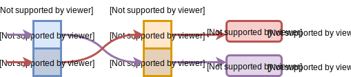

二进制翻译调研报告（FX!32 & Wine）

谢本壹2019.8.26-2019.8.29  Week2

目录

[TOC]

---

# FX!32 @1993

|              | 运行平台（Host）                    | 被模拟平台（Guest） |
| ------------ | ----------------------------------- | ------------------- |
| **制造商**   | Digital Equipment Corporation (DEC) | Intel               |
| **指令集**   | Alpha                               | x86                 |
| **操作系统** | WinNT                               | Win32               |

DEC Alpha Win死于性能不高应用不多。参考[Why did the DEC Alpha line of CPUs bomb so badly in the PC market in the 1990s?](https://www.quora.com/Why-did-the-DEC-Alpha-line-of-CPUs-bomb-so-badly-in-the-PC-market-in-the-1990s)

## [FX!32 A Profile-Directed Binary Translator](../../../Essays/BT/Alpha/1998.fx32.chernoff.micro.pdf) @1998

<table>
    <tr>
    	<td>
            <ul>
                <li>首次执行某个x86程序时，完全用仿真的方式进行；</li>
                <li>尽可能利用空闲时间把x86代码翻译成Alpha代码；</li>
                <li>运行中收集数据(profile)指导优化。</li>
            </ul>
             
            🤔JAVA虚拟机和FX!32设计的联系？
        </td>
        <td>
            
        </td>
    </tr>
</table>

**注**：Transparency agent用于处理x86和alpha各种小细节的不同，诸如调用习惯（x86参数偏向放栈里，Alpha参数偏向放寄存器里）。

在网上搜索`JVM`，`FX!32`这俩关键词，找到[Welcome to the Opportunities of Binary Translation](https://ieeexplore.ieee.org/stamp/stamp.jsp?tp=&arnumber=825694)的一张图The universe of binary translators，

当年的JVM还是纯动态翻译，所以看来JVM和FX!32相似，只是技术互相“借用”。当代的JVM更具有借鉴意义。

# [Wine](https://www.winehq.org/) @1993

Wine: Wine Is Not an Emulator, WINdows Emulator.

Wine让Windows-x86的软件能够在类Unix-x86系统上运行。

**我的观点**：Wine的[历程](https://wiki.winehq.org/Wine_History)很曲折，不过现在很成功。用户：Wine + Vulkan + Steam。开发：社区+企业支持。（我觉得我们的目标：把MIPS deepin的软件补全。）

## 刘奇的博士论文第五章&[Wine Architecture Overview]([https://wiki.winehq.org/Wine_Developer%27s_Guide/Architecture_Overview](https://wiki.winehq.org/Wine_Developer's_Guide/Architecture_Overview))

左：Win NT的架构 | 右：Wine的架构

Wine对DLL库的模拟：

1. Wine内建的自己实现的DLL库，有源码，通过Unix共享库形式提供，
2. Windows的DLL库。

**刘奇把Wine主要模块集成到了二进制翻译和优化系统中。**加上Wine比不加Wine的总体性能提升~14.52%。

## [Wine的文档](https://www.winehq.org/documentation)

### Winelib

Winelib是一系列开发工具，将Windows程序的源码编译成Unix的可执行文件。Winelib程序在**非intel架构**上可以相对容易进行重新编译，免去软件仿真的开销。

#### Winemaker

解决跨平台的兼容性问题（比如大小写，路径名中的`/`和`\`等），生成makefile。

#### Winegcc, Wineg++, Winedump, Winebuild...

## Wine的源码

参考Wine官方文档的[Source Tree Structure](https://wiki.winehq.org/Source_Tree_Structure)，调用[SLOCCount](https://dwheeler.com/sloccount/)工具（现代工具[scc](https://github.com/boyter/scc)），**注**：Source Lines Of Code Count，（挺想把这个结果用程序自动生产图形的），

| SLOC    | Directory     | 注                  | SLOC-by-Language (Sorted)                                    |
| ------- | ------------- | ------------------- | ------------------------------------------------------------ |
| 2621337 | dlls          | Win dll的Wine实现   | ansic=2592592, yacc=9022, javascript=8588, objc=6543, python=1786, lex=918, java=742, perl=574, xml=485, awk=69, cs=17, sh=1 |
| 167259  | include       | Win库函数的Wine实现 | ansic=166217, cpp=1042                                       |
| 100891  | programs      | 很多Win程序的源码   | ansic=99736, lex=627, yacc=491, javascript=37                |
| 76730   | tools         | 用来编译Wine的工具  | ansic=48257, perl=18262, yacc=5517, sh=3454, lex=1240        |
| 38521   | server        | Wineserver          | ansic=38521                                                  |
| 9446    | libs          | libwine的源码       | ansic=7317, lex=1530, yacc=599                               |
| 1672    | loader        | Wine的源码          | ansic=1672                                                   |
| 0       | documentation | 文档                |                                                              |
| 0       | fonts         | Win字体的Wine实现   |                                                              |
| 0       | po            | 本地化              |                                                              |

🤔写Wine的这些人是如何知道Windows这些库的功能的？Windows提供的开发者文档？

对Wine源码的COCOMO（Constructive Cost Model构造性成本模型，对我们有参考价值）分析，

| 源码（行） | 开发时间（年） | 开发人数（人） | 开发成本（亿美元） |
| ---------- | -------------- | -------------- | ------------------ |
| 4059991    | 8.00           | 153.79         | 1.66               |

