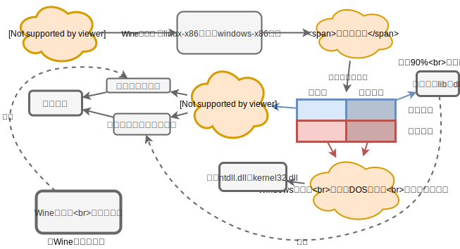

二进制翻译调研报告（Wine）

谢本壹2019.8.30-2019.9.5  Week3

---

目录

[TOC]

---

## Wine工作原理的思考

Windows和Wine的架构对比图，

左：Win NT的架构 | 右：Wine的架构

### Wine加载器的工作

**注**：以下实验结果用**Wine64**得到

#### 内存分布

Windows：`0x0 ~ 0x7fffffff`(2GB)给用户空间，exe程序一般来说装载到`0x400000`(4MB)。

##### 从linux启动Wine

Wine把自己放在了`0x7c000000`(1.9375GB)，Wine启动时调用的linux的库在`0x7ffff71f0000`(~128TB)以上的地方。

##### Wine运行起来后

linux的`mmap`是随机分配的。为了不让保留空间被mmap分配，wine自己写了自己的mmap。会把要预留出来的位置以参数的形式告诉`wine_mmap`，之后`wine_mmap`不会分配这一部分内存。

#### 模拟Windows内核

Wine会把ntdll.dll.so和kernel32.dll.so加载进内存，这俩so里包含了Windows内核的函数。

* Wine通过这些函数来模拟初始化Windows的一个进程的各种环境（比如建立PEB和TEB，Process Environment Block，Thread Environment Block）。
* Wine会启动wineserver。wineserver是一个独立的linux进程，它负责
  * 管理wine模拟的进程和线程（比如记录进程的状态(suspend)），
  * 提供进程同步和进程间通讯的功能。

#### 初始化用户进程

Wine按照Windows的方式加载用户程序到内存里，并加载用户程序需要的动态链接库（dll）（超过90%的代码量），完成其他的很多进程初始化的内容。

然后跳转到用户程序的入口地址，开始执行用户程序！

## Wine64加载器的程序执行流程

