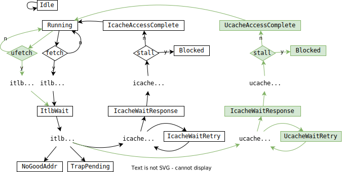

<div style="text-align:right; font-size:3em;">2022.07.23</div>

# Fetch in Gem5

Fetch state machine



## Next PC

* src/cpu/o3/fetch.cc:

  ```cpp
  void Fetch::fetch(bool &status_change) {
    ...
    while (numInst < fetchWidth && fetchQueue[tid].size() < fetchQueueSize
      && !predictedBranch && !quiesce) {
      ...
      do {
        ...
        predictedBranch |= lookupAndUpdateNextPC(instruction, *next_pc);
        ...
      } while ((curMacroop || dec_ptr->instReady()) &&
        numInst < fetchWidth &&
        fetchQueue[tid].size() < fetchQueueSize
      );
      ...
    }
    ...
  }
  ```

  * src/cpu/o3/fetch.cc:

    ```cpp
    Fetch::lookupAndUpdateNextPC(const DynInstPtr &inst, PCStateBase &next_pc) {
      ...
      if (!inst->isControl()) {
        inst->staticInst->advancePC(next_pc);
        ...
      }
      ...
    }
    ```

    * src/arch/x86/insts/microop.hh:

      ```cpp
      void advancePC(PCStateBase &pcState) const override {
        auto &xpc = pcState.as<PCState>();
          if (flags[IsLastMicroop])
              xpc.uEnd();
          else
              xpc.uAdvance();
      }
      ```

      * 
