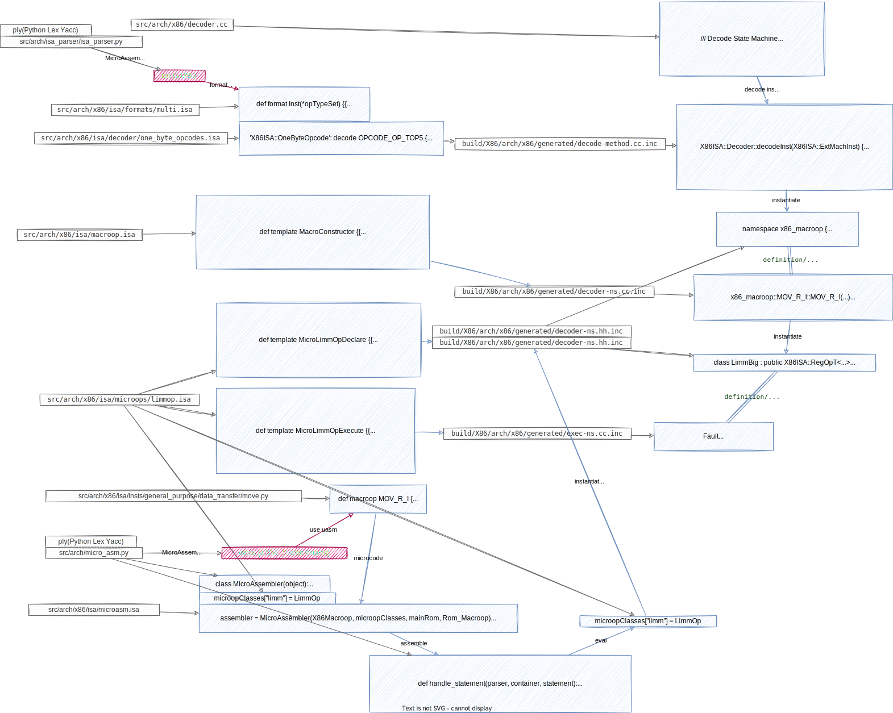
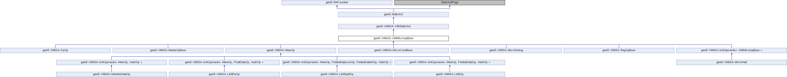

# microop in gem5

<div style="text-align:right; font-size:3em;">2022.07.14</div>

## instantiate a microop

* Q: What is need to instantiate a microop?
* A:

<div style="text-align:right; font-size:3em;">2022.07.13</div>

## all microops

* add a breakpoint to micro_asm.py: MicroAssembler: `__init__`
* print the value of microops
* sort

{
'absfp': <class 'absfp'>,
'adc': <class 'Adc'>,
'adci': <class 'Adc'>,
'add': <class 'Add'>,
'addfp': <class 'Addfp'>,
'addi': <class 'Add'>,
'and': <class 'And'>,
'andi': <class 'And'>,
'br': <class 'Br'>,
'cda': <class 'StoreOp'>,
'chks': <class 'Chks'>,
'chsfp': <class 'chsfp'>,
'clflushopt': <class 'StoreOp'>,
'clwb': <class 'StoreOp'>,
'compfp': <class 'Compfp'>,
'cosfp': <class 'Cosfp'>,
'cvtf2f': <class 'Cvtf2f'>,
'cvtf2i': <class 'Cvtf2i'>,
'cvtf_d2i': <class 'Cvtf_d2i'>,
'cvtf_i2d': <class 'Cvtf_i2d'>,
'cvtf_i2d_hi': <class 'Cvtf_i2d_hi'>,
'cvtfp80h_int': <class 'Cvtfp80h_int'>,
'cvtfp80l_int': <class 'Cvtfp80l_int'>,
'cvti2f': <class 'Cvti2f'>,
'cvtint_fp80': <class 'Cvtint_fp80'>,
'div1': <class 'Div1'>,
'div1i': <class 'Div1'>,
'div2': <class 'Div2'>,
'div2i': <class 'Div2'>,
'divfp': <class 'Divfp'>,
'divq': <class 'Divq'>,
'divr': <class 'Divr'>,
'emms': <class 'Emms'>,
'eret': <class 'Eret'>,
'fatal': <class 'MicroDebugChild'>,
'fault': <class 'Fault'>,
'hack': <class 'MicroDebugChild'>,
'hack_once': <class 'MicroDebugOnceChild'>,
'halt': <class 'Halt'>,
'inform': <class 'MicroDebugChild'>,
'inform_once': <class 'MicroDebugOnceChild'>,
'ld': <class 'LoadOp'>,
'ldfp87': <class 'LoadOp'>,
'ldfp': <class 'LoadOp'>,
'ldifp87': <class 'LoadOp'>,
'ldis': <class 'LoadOp'>,
'ldsplit': <class 'LoadOp'>,
'ldsplitl': <class 'LoadOp'>,
'ldst': <class 'LoadOp'>,
'ldstl': <class 'LoadOp'>,
'lea': <class 'LeaOp'>,
'lfpimm': <class 'LfpimmOp'>,
'limm': <class 'LimmOp'>,
'maddf': <class 'Maddf'>,
'maddi': <class 'Maddi'>,
'mand': <class 'Mand'>,
'mandn': <class 'Mandn'>,
'maskmov': <class 'Maskmov'>,
'mavg': <class 'Mavg'>,
'mcmpf2r': <class 'Mcmpf2r'>,
'mcmpf2rf': <class 'Mcmpf2rf'>,
'mcmpi2r': <class 'Mcmpi2r'>,
'mdb': <class 'Mdb'>,
'mdbi': <class 'Mdb'>,
'mdivf': <class 'Mdivf'>,
'mfence': <class 'MfenceOp'>,
'mmaxf': <class 'Mmaxf'>,
'mmaxi': <class 'Mmaxi'>,
'mminf': <class 'Mminf'>,
'mmini': <class 'Mmini'>,
'mmulf': <class 'Mmulf'>,
'mmuli': <class 'Mmuli'>,
'mor': <class 'Mor'>,
'mov2fp': <class 'Mov2fp'>,
'mov2int': <class 'Mov2int'>,
'mov': <class 'Mov'>,
'movfp': <class 'Movfp'>,
'movi': <class 'Mov'>,
'movsign': <class 'Movsign'>,
'mrcp': <class 'Mrcp'>,
'msad': <class 'Msad'>,
'msll': <class 'Msll'>,
'mslli': <class 'Msll'>,
'msqrt': <class 'Msqrt'>,
'msra': <class 'Msra'>,
'msrai': <class 'Msra'>,
'msrl': <class 'Msrl'>,
'msrli': <class 'Msrl'>,
'msubf': <class 'Msubf'>,
'msubi': <class 'Msubi'>,
'mul1s': <class 'Mul1s'>,
'mul1si': <class 'Mul1s'>,
'mul1u': <class 'Mul1u'>,
'mul1ui': <class 'Mul1u'>,
'muleh': <class 'Muleh'>,
'mulel': <class 'Mulel'>,
'mulfp': <class 'Mulfp'>,
'mxor': <class 'Mxor'>,
'or': <class 'Or'>,
'ori': <class 'Or'>,
'pack': <class 'Pack'>,
'panic': <class 'MicroDebugChild'>,
'pop87': <class 'Pop87'>,
'popcnt': <class 'Popcnt'>,
'premfp': <class 'PremFp'>,
'rcl': <class 'Rcl'>,
'rcli': <class 'Rcl'>,
'rcr': <class 'Rcr'>,
'rcri': <class 'Rcr'>,
'rdattr': <class 'RdAttr'>,
'rdbase': <class 'Rdbase'>,
'rdcr': <class 'Rdcr'>,
'rddr': <class 'Rddr'>,
'rdip': <class 'Rdip'>,
'rdlimit': <class 'Rdlimit'>,
'rdm5reg': <class 'Rdm5reg'>,
'rdsel': <class 'Rdsel'>,
'rdtsc': <class 'Rdtsc'>,
'rdval': <class 'Rdval'>,
'rdxftw': <class 'Rdxftw'>,
'rflag': <class 'Rflag'>,
'rflags': <class 'Rflags'>,
'rol': <class 'Rol'>,
'roli': <class 'Rol'>,
'ror': <class 'Ror'>,
'rori': <class 'Ror'>,
'ruflag': <class 'Ruflag'>,
'ruflags': <class 'Ruflags'>,
'sbb': <class 'Sbb'>,
'sbbi': <class 'Sbb'>,
'sext': <class 'Sext'>,
'sexti': <class 'Sext'>,
'shuffle': <class 'shuffle'>,
'sinfp': <class 'Sinfp'>,
'sld': <class 'Sld'>,
'sldi': <class 'Sld'>,
'sll': <class 'Sll'>,
'slli': <class 'Sll'>,
'sqrtfp': <class 'Sqrtfp'>,
'sra': <class 'Sra'>,
'srai': <class 'Sra'>,
'srd': <class 'Srd'>,
'srdi': <class 'Srd'>,
'srl': <class 'Srl'>,
'srli': <class 'Srl'>,
'st': <class 'StoreOp'>,
'stfp87': <class 'StoreOp'>,
'stfp': <class 'StoreOp'>,
'stis': <class 'StoreOp'>,
'stsplit': <class 'StoreOp'>,
'stsplitul': <class 'StoreOp'>,
'stul': <class 'StoreOp'>,
'sub': <class 'Sub'>,
'subfp': <class 'Subfp'>,
'subi': <class 'Sub'>,
'tanfp': <class 'Tanfp'>,
'tia': <class 'TiaOp'>,
'unpack': <class 'Unpack'>,
'warn': <class 'MicroDebugChild'>,
'warn_once': <class 'MicroDebugOnceChild'>
'wrattr': <class 'WrAttr'>,
'wrbase': <class 'Wrbase'>,
'wrcr': <class 'Wrcr'>,
'wrdh': <class 'Wrdh'>,
'wrdl': <class 'Wrdl'>,
'wrdr': <class 'Wrdr'>,
'wrflags': <class 'Wrflags'>,
'wrflagsi': <class 'Wrflags'>,
'wrip': <class 'Wrip'>,
'wripi': <class 'Wrip'>,
'wrlimit': <class 'Wrlimit'>,
'wrsel': <class 'Wrsel'>,
'wrtsc': <class 'Wrtsc'>,
'wruflags': <class 'Wruflags'>,
'wruflagsi': <class 'Wruflags'>,
'wrval': <class 'Wrval'>,
'wrxftw': <class 'Wrxftw'>,
'xamovi': <class 'XamoviOp'>,
'xor': <class 'Xor'>,
'xorfp': <class 'Xorfp'>,
'xori': <class 'Xor'>,
'yl2xfp': <class 'Yl2xFp'>,
'zext': <class 'Zext'>,
'zexti': <class 'Zext'>,
}

<div style="text-align:right; font-size:3em;">2022.06.25</div>

## microop definition

Take x86 `movl $4, %eax` for an example.
Depict how a macroop is translated to microops.



## microop instantiation

* src/arch/x86/isa/microasm.isa:

  ```isa
  assembler = MicroAssembler(X86Macroop, microopClasses, mainRom, Rom_Macroop)
  ```

  Here `microopClasses` is included from src/arch/x86/isa/microops/limmop.isa.
  For example, `microopClasses["limm"] = LimmOp`.

  `MicroAssembler` is defined in src/arch/micro_asm.py.

* src/arch/x86/isa/microasm.isa:

  ```isa
  macroopDict = assembler.assemble(microcode)
  ```

  `microcode` is import from src/arch/x86/isa/insts/.

  * src/arch/x86/isa/insts/general_purpose/data_transfer/move.py:

    ```isa
    def macroop MOV_R_I {
        limm reg, imm
    };
    ```

  When `assembler.assemble(microcode)` is called,
  every microcode(statement) is parsed,

  * src/arch/micro_asm.py:

    ```python
    def handle_statement(parser, container, statement):
      ...
      parser.symbols["__microopClassFromInsideTheAssembler"] = \
        parser.microops[statement.mnemonic]
      ...
      microop = eval('__microopClassFromInsideTheAssembler(%s)' %
        statement.params, {}, parser.symbols)
    ```

    `parser.microops` is `microopClasses`.
    Therefore,
    Here means `microopClasses["limm"](parser.symbols.reg, parser.symbols.imm)` is called.

    `parser.symbols` are defined in src/arch/x86/isa/microasm.isa

    ```isa
    symbols = {
      "reg" : gpRegIdx("env.reg"),
      ...
      "imm": "adjustedImm",
      ...
    }
    ```

### eflags (flags)

flags symbols are defined in src/arch/x86/isa/microasm.isa:

```isa
for flag in ('CF', 'PF', 'ECF', 'AF', 'EZF', 'ZF', 'SF', 'OF', \
             'TF', 'IF', 'NT', 'RF', 'VM', 'AC', 'VIF', 'VIP', 'ID'                     ):
    assembler.symbols[flag] = flag + "Bit"

for cond in ('True', 'False', 'ECF', 'EZF', 'SZnZF',
             'MSTRZ', 'STRZ', 'MSTRC',
             'OF', 'CF', 'ZF', 'CvZF',
             'SF', 'PF', 'SxOF', 'SxOvZF'):
    assembler.symbols["C%s" % cond] = "condition_tests::%s" % cond
    assembler.symbols["nC%s" % cond] = "condition_tests::Not%s" % c            ond
```

## macroop => microops

This chapter describes how
build/X86/arch/x86/generated/decoder-ns.cc.inc
is generated.
Code in decoder-ns.cc.inc decodes x86 macroop to microops during gem5 runtime.

### involved codes

./arch/x86/isa/microasm.isa:

```python
from insts import microcode
...
assembler = MicroAssembler(X86Macroop, microopClasses, mainRom, Rom_Macroop)
...
macroopDict = assembler.assemble(microcode)
```

src/arch/x86/isa/macroop.isa:

```python
class X86Macroop(Combinational_Macroop):
  ...
```

src/arch/x86/isa/microops/limmop.isa:

```python
class LimmOp(X86Microop):
  ...
  def getAllocator(self, microFlags):
    allocString = '''
      (%(dataSize)s >= 4) ?
        ...
    ...
    '''
microopClasses["limm"] = LimmOp
```

<div style="text-align:right; font-size:3em;">2022.06.23</div>

## fetch rom microop not impl

src/cpu/simple/base.cc:

```cpp
BaseSimpleCPU::preExecute() {
...
if (isRomMicroPC(pc_state.microPC())) {
  t_info.stayAtPC = false;
  /// fetchRomMicroop is not implemented yet!
  curStaticInst = decoder->fetchRomMicroop(pc_state.microPC(), curMacroStaticInst);
} else if (!curMacroStaticInst) {

} else {

}
...
}
```

## [TODO]decode cache

src/arch/x86/decoder.cc:

```cpp
Decoder::decode(ExtMachInst mach_inst, Addr addr) {
  ...
  auto iter = instMap->find(mach_inst);
  if (iter != instMap->end()) {
    /// if find mach_inst in instMap
    si = iter->second;
  } else {
    /// if not find mach_inst in instMap
    si = decodeInst(mach_inst);
    (*instMap)[mach_inst] = si;
  }
  ...
}
```

Function `decodeInst()`'s signature is

```cpp
StaticInstPtr X86ISA::Decoder::decodeInst(X86ISA::ExtMachInst machInst)
```

`decodeInst()` recieves `ExtMachInst`, outputs `StaticInstPtr`.

<details>
<summary>Class `StaticInst`'s heritage is interesting.</summary>

</details>

`StaticInst` seems to be the base class for every gem5 instructions in every architecture.
However, `X86StaticInst` is special, only has two derived class `MacroopBase` and `X86MicroopBase`.

`MacroopBase`'s derived classes are all generated by .isa file.

* `MacroopBase`
  * ./isa/macroop.isa => ./arch/x86/generated/decoder-ns.hh.inc:

    `Macroop`

    * ./build/X86/arch/x86/generated/decoder-ns.hh.inc:

      tons of `x86_macroop::` classes derives from `Macroop`

      * build/X86/arch/x86/generated/decoder.hh

        `x86_macroop::` is in namespace `X86ISAInst::`

`X86MicroopBase`'s derived class

<details>
<summary>`X86MicroopBase`'s derived class heritage</summary>

</details>

* src/arch/x86/insts/microregop.hh:

  `X86MicroopBase`

  * Becomes a template arg in `InstOperands`, alias as `RegOpT`

  ```cpp
  class RegOpBase : public X86MicroopBase {...};
  /// This is a C++11 syntax, called type alias or alias template, see cppreference.com
  template <typename ...Operands>
  using RegOpT = InstOperands<RegOpBase, Operands...>;
  ```

    * src/arch/x86/insts/microop_args.hh:

      `InstOperands` uses template parameter pack tricks quite a lot, see cppreference.com

    * src/arch/x86/isa/microops/{limmop.isa & regop.isa} => ./arch/x86/generated/decoder-ns.hh.inc:

      tons of classes class derives from `X86ISA::RegOpT`

      * build/X86/arch/x86/generated/decoder.hh

        all these classes is in namespace `X86ISAInst::`

## uslot/uop

### init

Xa_mov_i recieves op_ext

#### uop

##### Declare

Uop is declared in X86MicroopBase.

##### Definition

* uop.ex

  * src/arch/x86/insts/microop.hh:

    ```cpp
    class X86MicroopBase : public X86StaticInst {
      X86MicroopBase(..., OpExt op_ext=OpExt_Zero) : ... {
        ...
        uop.ex = op_ext;
    }}
    ```
* uop.sz

  * src/arch/x86/insts/microregop.hh:

    ```cpp
    class RegOpBase : public X86MicroopBase {
      RegOpBase(...) :
        X86MicroopBase(mach_inst, mnem, inst_mnem,
            set_flags, op_class, op_ext), ...
      {
        switch (data_size) {
          case 1: uop.sz = 0; break;
          case 2: uop.sz = 1; break;
          case 4: uop.sz = 2; break;
          case 8: uop.sz = 3; break;
          default: panic("%s data_size %d", inst_mnem, data_size);
    }}}
    ```

* uop.opcx, uop.oprx

  * build/X86/arch/x86/generated/bt/decoder-ns.hh.inc:

    ```cpp
    class Xa_mov_i : ... {
      Xa_mov_i(...) : ... {
        uop.opc2 = XA64ISA::opc2_mov_i;
        uop.opr0 = dest;
        uop.opr1 = XA64ISA::USlot::generateIIMM(_used, _iimm, data_size, _imm);
    }}
    ```

#### TODO: uslot

XA64USlot

## Specific microops

### cda

cda is add by commit 2eff46f9a682b8dc7f36fef5d287bb8163dffb0b,

> X86: Implement the cda microop which checks if an address is legal to write to.

Take POP_M for example,

src/arch/x86/isa/insts/general_purpose/data_transfer/stack_operations.py:

```isa
def macroop POP_M {
    # Make the default data size of pops 64 bits in 64 bit mode
    .adjust_env oszIn64Override

    ldis t1, ss, [1, t0, rsp], dataSize=ssz
    cda seg, sib, disp, dataSize=ssz
    addi rsp, rsp, ssz, dataSize=asz
    st t1, seg, sib, disp, dataSize=ssz
};
```

Before add rsp, the to-be-stored memory address is checked by cda.

#### TODO:

* How gem5 implement precise exception?

  See commit.md

* Is cda redundant here?

