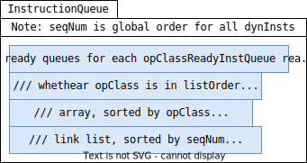

<div style="text-align:right; font-size:3em;">2022.06.28</div>

# O3 CPU in Gem5

## Q

* TODO: Is renameing arch specific or general?
* TODO: rename related with thread?
  I guess CPU thread, not OS thread

## CPU Stages

build/X86/cpu/o3/cpu.cc:

* fetch
* decode
* rename
* iew(issue, execute, writeback)
* commit

### Fetch (Actual Decode)

* Q: DONE: why fetch stage contains decode? src/cpu/o3/fetch.cc: 1199 `auto *dec_ptr = decoder[tid];`
* A: src/cpu/o3/decode.hh:

  Decode class handles both single threaded and SMT
  decode. Its width is specified by the parameters; each cycles it
  tries to decode that many instructions. Because instructions are
  actually decoded when the StaticInst is created, this stage does
  not do much other than check any PC-relative branches.

* src/cpu/o3/fetch.cc

  `fetch.tick()`

  * `fetch()`
    * `staticInst = dec_ptr->decode(this_pc);`
      * src/arch/x86/decoder.cc:

        ```cpp
        StaticInstPtr Decoder::decode(PCStateBase &next_pc);
        StaticInstPtr Decoder::decode(ExtMachInst mach_inst, Addr addr);
        ```

        * `si = decodeInst(mach_inst);`

          * build/X86/arch/x86/generated/decoder-ns.cc.inc:

            ```cpp
            x86_macroop::MOV_R_I::MOV_R_I
            ```
    * This is where `DynInst` and `StaticInst` connect!

      `DynInstPtr instruction = buildInst(tid, staticInst, curMacroop, this_pc, *next_pc, true);`

      * `DynInstPtr instruction = new (arrays) DynInst(arrays, staticInst, curMacroop, this_pc, next_pc, seq, cpu);`

### Rename

* src/cpu/o3/dyn_inst.hh:

  `setIntRegOperand`

  * `renamedDestIdx`

### IEW

* src/cpu/o3/cpu.cc:

  `gem5::o3::CPU::tick`

  * src/cpu/o3/iew.cc:

    `gem5::o3::IEW::tick`

    * `dispatch(tid);`

    * `executeInsts()`

    * schedule inst will be executed next cycle

      TODO: no thread here?

      `instQueue.scheduleReadyInsts();`

      * src/cpu/o3/dyn_inst.cc:

        `gem5::o3::DynInst::execute`

         * build/X86/arch/x86/generated/exec-ns.cc.inc:

           `gem5::X86ISAInst::LimmBig::execute`

TODO: DynInst diff StaticInst?

#### Issue

* Q: DONE: What is src/cpu/o3/inst_queue.hh: `listOrder`?
* A: one of internal data structures for `InstructionQueue`.

  

> List that contains the age order of the oldest instruction of each
> ready queue.  Used to select the oldest instruction available
> among op classes.

```cpp
/** List of ready instructions, per op class.  They are separated by op
*  class to allow for easy mapping to FUs.
*/
ReadyInstQueue readyInsts[Num_OpClasses];
```

This is a global order for all dynamic inst.

```cpp
// inst sequence type, used to order instructions in the ready list,
// if this rolls over the ready list order temporarily will get messed
// up, but execution will continue and complete correctly
typedef uint64_t InstSeqNum;
```

## FU (Function Unit?)

* Q: inst latency?
* A: lyw: src/cpu/o3/inst_queue.cc: `void InstructionQueue::scheduleReadyInsts()`

* Q: DONE: how microop & opClass is related?
* A: x86 microop constructor, e.g. 

  ```cpp
  LimmBig::LimmBig(...) :
    X86ISA::RegOpT<...> (..., IntAluOp, ...)
  ```

Initialized by python, see m5out/config.ini,

### Example

```bash
./build/X86/gem5.debug --debug-flags Exec,IntRegs configs/example/se.py --cpu-type O3CPU --caches -c ~/Gist/hello/hello
```

system.cpu.fuPool:

| FUList | opList | opClass            | opLat | pipelined |
|--------|--------|--------------------|-------|-----------|
| 0      | -      | IntAlu             | 1     | true      |
| 1      | 0      | IntMult            | 3     | true      |
| 1      | 1      | IntDiv             | 1     | false     |
| 2      | 0      | FloatAdd           | 2     | true      |
| 2      | 1      | FloatCmp           | 2     | true      |
| 3      | 0      | FloatMult          | 4     | true      |
| 3      | 1      | FloatMultAcc       | 5     | true      |
| 3      | 2      | FloatMisc          | 3     | true      |
| 3      | 3      | FloatDiv           | 12    | false     |
| 3      | 4      | FloatSqrt          | 24    | false     |
| 4      | 0      | MemRead            | 1     | true      |
| 4      | 1      | FloatMemRead       | 1     | true      |
| 7      | 0      | MemWrite           | 1     | true      |
| 7      | 1      | FloatMemWrite      | 1     | true      |
| 8      | 0      | MemRead            | 1     | true      |
| 8      | 1      | MemWrite           | 1     | true      |
| 8      | 2      | FloatMemRead       | 1     | true      |
| 8      | 3      | FloatMemWrite      | 1     | true      |
| 9      | -      | IprAccess          | 3     | false     |

#### Simd FU seems un-initialized

| FUList | opList | opClass            | opLat | pipelined |
|--------|--------|--------------------|-------|-----------|
| 5      | 00     | SimdAdd            | 1     | true      |
| 5      | 01     | SimdAddAcc         | 1     | true      |
| 5      | 02     | SimdAlu            | 1     | true      |
| 5      | 03     | SimdCmp            | 1     | true      |
| 5      | 04     | SimdCvt            | 1     | true      |
| 5      | 05     | SimdMisc           | 1     | true      |
| 5      | 06     | SimdMult           | 1     | true      |
| 5      | 07     | SimdMultAcc        | 1     | true      |
| 5      | 08     | SimdShift          | 1     | true      |
| 5      | 09     | SimdShiftAcc       | 1     | true      |
| 5      | 10     | SimdDiv            | 1     | true      |
| 5      | 11     | SimdSqrt           | 1     | true      |
| 5      | 12     | SimdFloatAdd       | 1     | true      |
| 5      | 13     | SimdFloatAlu       | 1     | true      |
| 5      | 14     | SimdFloatCmp       | 1     | true      |
| 5      | 15     | SimdFloatCvt       | 1     | true      |
| 5      | 16     | SimdFloatDiv       | 1     | true      |
| 5      | 17     | SimdFloatMisc      | 1     | true      |
| 5      | 18     | SimdFloatMult      | 1     | true      |
| 5      | 19     | SimdFloatMultAcc   | 1     | true      |
| 5      | 20     | SimdFloatSqrt      | 1     | true      |
| 5      | 21     | SimdReduceAdd      | 1     | true      |
| 5      | 22     | SimdReduceAlu      | 1     | true      |
| 5      | 23     | SimdReduceCmp      | 1     | true      |
| 5      | 24     | SimdFloatReduceAdd | 1     | true      |
| 5      | 25     | SimdFloatReduceCmp | 1     | true      |
| 6      | -      | SimdPredAlu        | 1     | true      |

## Memory Model

TODO: `needsTSO`
