<div style="text-align:right; font-size:3em;">2021.11.10</div>

* 用iso的内核和/etc/init.d替换硬盘里的

  * 破案了sshd会卡死，/etc/init.d/sshd启动sshd就卡死了。

  * 使用dropbear

    ```shell
    apk add dropbear
    # Start it:
    rc-service dropbear start
    # Add it to the default runlevel:
    rc-update add dropbear
    ```

* http://alpine.loongnix.cn/v3.11/main/mips64el/APKINDEX.tar.gz不包含linux-lts-dev-4.19.90-r5.apk的索引

  * 但是http://10.2.5.28/os/Alpine/v3.11/main/mips64el/直接下载linux-lts-dev-4.19.90-r5.apk即可

<div style="text-align:right; font-size:3em;">2021.09.24</div>

# QEMU的LA全系统模拟

软件包位于`Softwares/LX/`

* qemu-la
  * [内网：系统研发-源码库: kernel/qemu](http://rd.loongson.cn:8081/#/admin/projects/kernel/qemu)的uos-dev-3.1.0分支<kbd>qemu-la.zip</kbd>
  * configure脚本<kbd>Gist/qemu/configure/la_tcg.sh</kbd>
* 系统镜像[选择1]，准备好的文件见<kbd>Loongnix-20.mini.loongarch64.rc1.b2.xieby1.qcow2</kbd>
  * [pkg.loongson.cn: loongnix/isos](http://pkg.loongnix.cn:8080/loongnix/isos/)的qcow2，测试使用的<kbd>Loongnix-20.mini.loongarch64.rc1.b2.qcow2</kbd>
  * 用户名和密码：loongson, Loongson20
  * 替换镜像里的内核和模块，编译过程间下“内核编译”，生成方式参考<kbd>my_cheatsheet.md</kbd>
    * 模块目录`lib/modules/4.19.190+/`有`build/`和`source/`链接向linux-headers或者la-linux源码<kbd>linux-4.19-loongson.tar.gz</kbd>，参考[Tech/Kernel/Linux/QnA.md](./QnA.md) 2021.09.22，
      * linux-headers暂时不知道怎么生成
      * 干净的la-linux源码需要`Module.symvers`和`scripts/`
    * 以上文件位于<kbd>linux-4.19-loongson-install.zip</kbd>
* 系统镜像[[选择2](http://10.2.5.28/os/Alpine/v3.11/releases/loongarch64/alpine-standard-v3.11.11-loongarch64.iso)]，<kbd>alpine-standard-v3.11.11-loongarch64.iso</kbd>
  * 若装好LA的alpine网络不行，则重新执行一下setup-alpine配置成dhpc。
  * qemu的append似乎不起作用，在bootloader里<kbd>e</kbd>添加console=ttyS0，否则可能看不到命令行输出。
  * 安装好后，修改alpine硬盘/boot/grub/grub.cfg，添加linux启动`console=ttyS0`

## 内核编译

<div style="text-align:right; font-size:3em;">2021.09.07</div>

来自李存

> 1. 用系统/boot下的config文件替换 arch/loongarch/configs/loongson3_defconfig
> 2. 打开 Kernel type -> Support for Loongson Binary Translation
> 3. 打开 Bus options -> PCI controller drivers -> Loongson pcie controller
> 4. 快乐编译
>
> 注意：
>
> 1. 我的机子原装loongnix /boot 下 config 版本是：config-4.19.0-12-loongson-3
> 2. 曾路说代码不要外传
> 3. 编译内核、make install、make modules_install 之后，update-grub 命令不起作用，开机还是只有原先的内核版本。原因是 /boot 下 有两个 grub.cfg，一个是 /boot/boot/EFI/grub.cfg，另外一个是 /boot/grub/grub.cfg。pdate-grub 更新的是 /boot/grub/grub.cfg，但是系统使用的是 /boot/boot/EFI/grub.cfg。我没尝试出来正确的解决办法，我当前是直接将 /boot/grub/grub.cfg 拷贝到 /boot/boot/EFI 下

注释`arch/loongarch/Makefile` 252行安装vmlinux，
可以节省空间！

---


<div style="text-align:right; font-size:3em;">2020.07.22</div>

# LX-MIPS 4K页内核

第一次给龙芯的机器编译内核

## 前言

启动过程中内核开始运行的时机&内核所扮演的角色，参考`man boot`，如下，



**编译**并**替换**内核即对应修改上面框图里蓝色的部分。

**编译**便是对应下面[编译](#编译)这一小节；**替换**便是对应下面[配置grub](#配置grub)这一小节。

## 编译

目前我用的机器使用的loongnix采用的是linux-3.10.84的内核。

### 代码来源

* [龙芯开源社区](http://www.loongnix.org/index.php/首页)->[所有开源项目](http://www.loongnix.org/index.php/项目)->[Kernel](http://www.loongnix.org/index.php/内核)；
* 实验室的gitlab上的[kernel-xqm](http://172.17.103.58/binarytranslation/kernel_xqm.git)，[kernel-xqm-外网访问](http://foxsen.3322.org:33336/binarytranslation/kernel_xqm)，使用的hspt分支的`cda69d6ac77493da3443f68e0c33e02219bfd1ba`commit。

### 编译流程


<div style="text-align:right; font-size:3em;">2020.07.21</div>

✅🤔将kernel_xqm源码放到了/usr/src/下，可以直接make install？按照kernel源码里的`README`示例的放在了这里。

```shell
# README的示例操作
cd /usr/src/linux-3.X
make O=/home/name/build/kernel menuconfig # 这一步需要详细确认一些参数见下面的注
make O=/home/name/build/kernel
sudo make O=/home/name/build/kernel modules_install install
# README的示例操作到此为止，可以看出来必须要编译modules且install
# 下面是黄科乐的过程和上面等价(除了没指明编译的目录，而是直接在源码的目录里编译)
sudo bash
make menuconfig # 这一步需要详细确认一些参数见下面的注
make
make modules
make modules_install
make install
```

**注**：`make menuconfig`里有诸多参数需要注意，

* Kernel type -> Kernel page size：确认为4kB；
* File System：确认ext4相关的选项为built-in；
* Device Drivers -> Graphics support ATI Radeon：确认为built-in（我用的龙芯机器使用的是Radeon显卡）；
* General setup -> Local version：和别的内核区分，以`.`开头。

## 配置grub

```shell
grub2-mkconfig -o /boot/efi/EFI/BOOT/grub.cfg # /etc/grub2-efi.cfg的链接目标
vim /boot/efi/EFI/BOOT/grub.cfg # 给新增的启动项添加initrd，改启动项的名字（便于区分）
```

## 调试

将内核启动参数`quiet`和`splash`去掉，即开头的图片里的OS loader传给kernel的参数，kernel在运行时将输出很多信息。🤔内核的启动参数在哪有说明文档？

* 在`/boot/efi/EFI/BOOT/grub.cfg # /etc/grub2-efi.cfg`里修改启动参数；
* 在grub运行是按<kbd>e</kbd>可**临时**修改启动参数。

若启动内核时进入了emergency mode，密码是root的密码，可以根据提示打开`journalctl -xb`输出日志（详细关注报错，红字）。