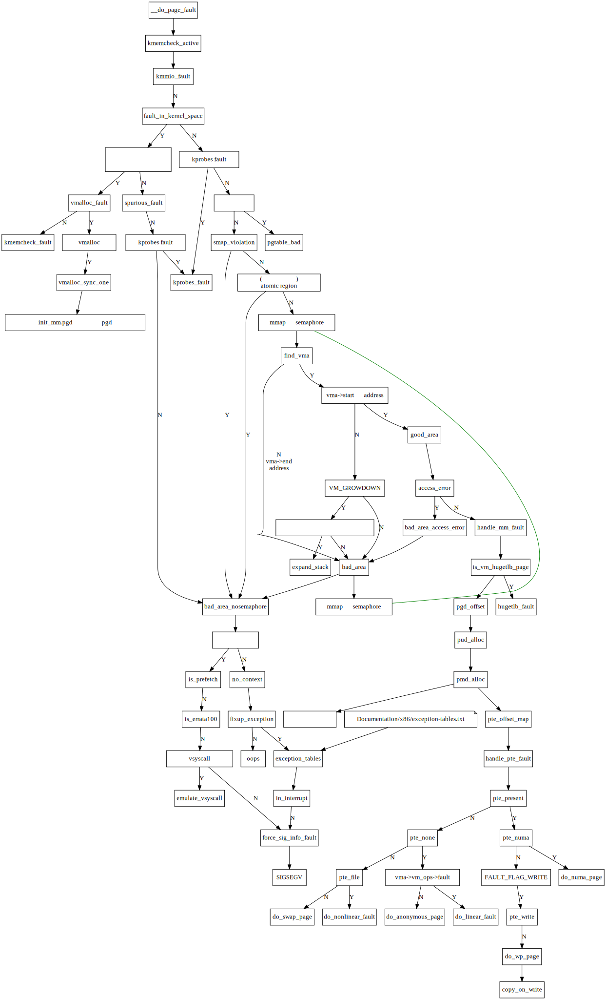

<div style="text-align:right; font-size:3em;">2021.12.25</div>

# `do_page_fault`源码分析

* 源码：Linux 3.18
* 编译平台：ubuntu16 x64默认编译环境
* 编译参数：defconfig
  * `scripts/config --set-val DEBUG_INFO y --set-val DEBUG y  --set-val GDB_SCRIPTS y --set-val DEBUG_DRIVER y`
* 批注注释用`///`符号

源码`arch/x86/mm/fault.c`:

```c
do_page_fault(struct pt_regs *regs, unsigned long error_code)
{
	unsigned long address = read_cr2(); /* Get the faulting address */
	enum ctx_state prev_state;

	/*
	 * We must have this function tagged with __kprobes, notrace and call
	 * read_cr2() before calling anything else. To avoid calling any kind
	 * of tracing machinery before we've observed the CR2 value.
	 *
	 * exception_{enter,exit}() contain all sorts of tracepoints.
	 */

	prev_state = exception_enter();
	__do_page_fault(regs, error_code, address);
	exception_exit(prev_state);
}
```

`__do_page_fault`是处理page fault的函数。

首先是检测出错的访存是否是在访问内核空间。

```c
...
	if (unlikely(fault_in_kernel_space(address))) {
		if (!(error_code & (PF_RSVD | PF_USER | PF_PROT))) {
			if (vmalloc_fault(address) >= 0)
				return;

			if (kmemcheck_fault(regs, address, error_code))
				return;
		}

		/* Can handle a stale RO->RW TLB: */
		if (spurious_fault(error_code, address))
			return;

		/* kprobes don't want to hook the spurious faults: */
		if (kprobes_fault(regs))
			return;
		/*
		 * Don't take the mm semaphore here. If we fixup a prefetch
		 * fault we could otherwise deadlock:
		 */
		bad_area_nosemaphore(regs, error_code, address);

		return;
	}
...
```

<div style="text-align:right; font-size:3em;">2022.01.03</div>

`__do_page_fault`开始的函数执行流程如下：


