2021.01.14

## [ABORT] Memory DC和DC的区别

**背景**：[bitmapPrint](https://www.dreamincode.net/forums/topic/261009-bitmap-printing-tutorial-in-c-win32/)示例程序的流程创建了俩DC，

* `HDC prn = GetPrinterDC(hwnd)`
* ``HDC hdcMem = CreateCompatibleDC(prn)`

有啥区别吗？

**注**：Memory DC又叫Compatible DC，下边Microsoft Docs有提及。

**参考**：

* Microsoft Docs: [Memory Device Contexts](https://docs.microsoft.com/en-us/windows/win32/gdi/memory-device-contexts)
* Stack Overflow: [Understanding Device Contexts](https://stackoverflow.com/questions/2777793/understanding-device-contexts)

**猜测**：DC是设备映射到内存的，memory DC是真实驻留在内存的？

2020.12.11

## 所有已安装打印在哪里被找到

详细参考[logs.md](logs.md)**所有打印机**这一节。

Windows有维护特殊的文件夹，可以通过`shell:PrintersFolder`打开。

## 打印机的graphics dll和interface dll的路径如何得到？

2021.01.05

通过读取注册表。打印机的graphics dll和interface dll的信息存在注册表`HKEY_LOCAL_MACHINE\SYSTEM\CurrentControlSet\Control\Print\Environments\Windows NT x86\Drivers\Version-3\`里。

* `Driver`是graphics dll，
* `Configuration File`是interface dll

相关信息：`HKEY_LOCAL_MACHINE\SYSTEM\CurrentControlSet\Control\Print`

### WINE

WINE本身（WINEPS.DRV）**似乎**没有支持加载graphics dll和interface dll，不过ddiwarpper是支持的，从注册表读取。

* CreateICW

  * CreateDCW

    * DRIVER_GetDriverName

      从C:/windows/win.ini读取的驱动dll名字。

    * DRIVER_load_driver

      在可能的路径中去寻找驱动dll。

    2020.1.6:

    **对于DDIWrapper的驱动**， 

    * funcs->pCreateDC=驱动相关！WINGDIDRV_CreateDC

      * WINGDIDRV_FindPrinterInfo

        * WINGDIDRV_load_driver

          加载interface dll和graphics dll

    **对于WINEPS.DRV**，

    * funcs->pCreateDC=驱动相关！PSDRV_CreateDC
      * PSDRV_FindPrinterInfo
        * OpenPrinterW
        * get_ppd_filename

### Windows

2021.01.08

读注册表的流程如下，主要是两个函数，`OpenPrinterW`加载打印机（加载了写啥？），`LoadUserModePrinterDriver`读注册表加载驱动（graphics dll），

