发布记录

2021.3.5：发布

# [WINE打印机方案](http://172.17.103.58/loongsonlab/notes/-/tree/master/xiebenyi/Kernel/Windows/driver/README.md)

本文档记录龙芯实验室的基于WINE的打印方案。本文档尽可能地记录下设计思路和调试经验，尽可能避免代码细节和调试细节。代码细节主要蕴含在源码和注释之中，调试细节主要蕴含在各个调试软件的手册之中。附件尽可能包含了所有WINE打印机方案的资料。其目录结构如下，

* `docs/`：各类相关文献，关键内容已添加到尾注
* `nt5/`：WinNT5源码和编译结果，内容已全添加到尾注
* `src/`：WINE打印机方案的源码，源码也可以从[实验室的gitlab](http://172.17.103.58/loongsonlab/)获取，内容已全添加到尾注
* `utils/`：各类工具

`docs/`内容较多，直接和本文档相关的文献已添加到尾注，其他文献作为必要时的研究参考。另外3个文件夹`nt5/`、`src/`、`utils/`的内容已全数添加到尾注。

## 目录

[toc]

## 设计思路

提出WINE打印机方案的主要目的是提速。因为用Win虚拟机运行Win打印机驱动的方案虽然简单稳定，但是速度慢。

WINE是能够在Linux等系统上运行Win用户程序的兼容层。WINE不是像虚拟机或者模拟器一样运行Win操作系统，而是将Win API翻译为Linux调用，因此WINE能够高效地运行Win用户程序（用gcc-9.3以同样的参数编译32位版本的Coremark，WINE-5.2-13的效率比Linux原生效率高4.11%。）。Win打印机驱动是用户态的，因此理论上WINE可以运行Win打印机驱动。

官方的WINE支持打印机，前提是安装了相应的Linux打印机驱动。WINE将Linux打印机驱动包装给了Win用户程序。我们称这个打印方案为“官方打印方案”。官方打印方案使用的是Linux打印机驱动，而非Win打印机驱动。因此需要对WINE做扩展，让其能够使用Win打印机驱动。目前基于这个目的，实验室给WINE官方打印方案做了修改和扩展，我们称之为“扩展打印方案”。因为是修改和拓展，则存在诸多不高效的设计。但因为修改和拓展对WINE本身的影响相对是小的，这能够使实验阶段的扩展打印方案更稳定，能够我们能够更快地验证猜想——“在WINE上可以运行Win打印机驱动”。下面简介WINE的官方打印方案和扩展打印方案。而关于更高效更具挑战的打印方案，将会在文末的“未来工作”中简介。



* 官方打印方案

  WINE启动时扫描Linux中安装的打印机，在Win系统内生成对应的打印机信息（注册表、c:\windows\win.ini等），添加可用的打印机选项。在打印时调用wineps.drv驱动。wineps.drv可以看做是一个虚拟打印机。该虚拟打印机将Win用户程序的打印请求转换成一个ps（Post Script）文件，然后将打印任务重定向到Linux的打印系统——CUPS（Common UNIX Printing System）。

* 扩展打印方案

  总体和官方打印方案流程相似。为了减少实验阶段的工作量，扩展打印方案仅支持位图（bitmap, bmp）格式的打印。将其他格式的打印请求转换为位图，即可满足所有打印格式需求。新增一个和wineps.drv地位相同的驱动，称之为wingdi.drv，来包装Win打印机驱动。位图打印程序的输入为bmp格式的文件，然后通过wingdi.drv输出raw数据，最后通过USB发送给打印机。

wingdi.drv是扩展打印方案的关键。它详细涉及Win打印机驱动的原理。获取Win原理的路径主要来自**官方文档**（[在线文档](https://docs.microsoft.com/en-us/)或开发包中的离线文档[^wdk][^ddk][^sdk]）和**Win源码**[^nt5src]。

通过**官方文档**可以了解到在WinXP时期，打印机厂商广泛使用GDI类型的打印驱动。因为在Win里，该类型打印机和显示设备有相同处理流程，所以被称作GDI（Graphics Device Interface）类型。这类打印机驱动由两部分构成：

1. printer graphics DLL及其附属DLL，

   负责图形计算，是打印机实际打印功能的承担者。因此在相关文档和代码中，该DLL会被称作graphics DLL、driver DLL。

2. printer interface DLL及其附属DLL，

   负责打印机参数设置，即负责印机属性的对话框、打印机任务队列的任务属性对话框等。因此在相关文档和代码中，该DLL会被称作interface DLL、UI DLL、configuration DLL。

有些打印机可以只依赖graphics DLL，便能进行基础打印，比如目前实验选用的佳能i80。因此实验思路是先实现WINE调用graphics DLL。阶段目标是用i80打印机打印bmp图片。然后再实现WINE调用interface DLL。阶段目标是用惠普1020打印机打印bmp图片。（这两个阶段目标均一达成。）

通过调试对比**Win源码**和WINE源码，可以明确WINE缺失的功能。通过增补这些功能，来让打印机驱动运作起来。调试过程中还参考了其他项目的思路和代码。调试graphics DLL参考了DDIWrapper项目[^ddiwrapper]和软件所同行的工作[^linux_win_printer]。DDIWrapper项目用WINE包装打印机驱动，并嵌入到CUPS打印系统里。它只支持graphics dll的调用。且它和WINE是分离开的，这给调试带来一些不便。扩展打印方案弥补了这两个不足。调试Win源码也同时参考了[ReactOS](https://reactos.org/)和OpenNT项目。这两个项目是Win内核的开源实现。因为其设计相对简单，且功能和Win保持兼容，所以可以辅助理解Win晦涩难懂的代码。在“调试”这一章节，将更详细的介绍我们所使用的调试经验。

## 安装&使用

按照扩展打印方案的图所示，需要安装3部分内容——位图打印程序、Win打印机驱动（wingdi.drv包装的内容）、WINE。

首先安装WINE。扩展打印方案中WINE的wgf分支已经添加wingdi.drv，

```shell
# 从实验室的gitlab获取，或是从wine.zip中获取
git clone --single-branch --branch wgf http://172.17.103.58/loongsonlab/wine.git
# 和正常编译WINE一样
cd wine
./configure
make
```

然后编译[位图打印程序](https://www.dreamincode.net/forums/topic/261009-bitmap-printing-tutorial-in-c-win32/)（bmprnt或bmprnt-cli），

```shell
# 图形界面bmp打印程序，从实验室的gitlab获取如下，或是从bmprnt.zip中获取
git clone http://172.17.103.58/printer/bmprnt.git
cd bmprnt
winemaker --wine32 && make

# 命令行bmp打印程序，从实验室的gitlab获取，或是从bmprnt-cli.zip中获取
git clone http://172.17.103.58/printer/bmprnt-cli.git
cd bmprnt-cli
make
```

最后安装Win打印机驱动。目前这个过程还没做到自动化，均为手动完成。其宗旨是把Win系统的相关设置和文件复制到WINE中。因此这个过程要借助装有Win的虚拟机的帮助。以佳能[i80打印机驱动](https://www.canon-europe.com/support/consumer_products/products/printers/inkjet/i_series/bubble_jet_i80.html?type=drivers&language=en&os=windows%20xp%20(32-bit))为例。

* 在Win虚拟机中安装打印机驱动：
  * 若有i80打印机，则连上Win虚拟机后可以直接安装驱动
  * 若没有i80打印机，
    *  用解压软件把驱动的安装文件解压到一个目录
    * 从控制面板添加打印机的界面出发，手工添加驱动，端口选择`file://`，选择对应的驱动目
* 复制打印机相关注册表：
  * `HKEY_LOCAL_MACHINE\SYSTEM\CurrentControlSet\Control\Print\Printers\Canon i80`
  * `HKEY_LOCAL_MACHINE\SYSTEM\CurrentControlSet\Control\Print\Environments\Windows NT x86\Drivers\Version-3\Canon i80`
* 复制打印机驱动到`~/.wine/drive_c/windows/system32/spool/drivers/w32x86/3/`
* 修改WINE打印机配置`~/.wine/drive_c/windows/win.ini`，

  * [devices]下面添加`Canon i80=wingdi.drv,GDI:Canon i80,15,45`
  * [PrinterPorts]下面添加`Canon i80=wingdi.drv,GDI:Canon i80,15,45`

安装完WINE、位图打印程序和打印机驱动后。如下，用WINE运行位图打印程序即可。

```shell
wine bmprnt # 或是wine bmprnt-cli
```

## 调试

目前已经调通两款打印机——佳能i80和惠普1020。根据调试环境的不同，可以把调试手段分为2部分——调试Win和调试WINE。每种调试手段分为3部分进行说明，**准备**、**操作**、**技巧**。

### Win

根据编译工具链的不同，在Win中调试器可以分为2类。

1. GNU的工具链（gcc）

   以winedbg为代表。它使用的调试信息附加在PE文件中，格式为dwarf。

2. 微软的工具链（vc）

   以windbg为代表。它使用的调试信息是独立的pdb文件。

尽管有2种调试信息的转换工具，比如[cv2pdb](https://github.com/rainers/cv2pdb)，但做不到完美转换。因此应该根据不同的需求选择不同的调试器进行调试。比如，要想了解Win内核工作原理，则需要用windbg进行内核调试。再比如，想要对比同一用户程序在WINE和Win中运行的异同，则需要用gdb在Linux和Win中调试对比。

#### windbg

windbg既可以调试Win用户程序，又可以调试Win内核，功能强大且稳健。windbg通常是Win开发包中的附属工具。任意安装一个开发包即可，比如WDK[^wdk]、DDK[^ddk]和SDK[^sdk]。

**准备**：

首先编译待调试的程序——Win操作系统（Win内核+用户程序）[^nt5src]。参考[编译WinXP源码的文档](https://rentry.co/build-win2k3)。编译出的WinXP有2个版本chk版[^winxp-chk]和fre版[^winxp-fre]（微软工具链的术语check、free和GNU工具链的术语debug、release等价）。chk版本无法正常运行，其原因还去未探明，fre版本可以正常运行。尽管使用的是fre版本，但是调试没有遇到本质性的障碍。因此接下来都围绕fre版本展开。

然后需要做如下设置和替换操作。这些步骤不分先后顺序：

* 设置源码的路径

  windbg菜单File->Source File Path设置为`<根路径>\srv03rtm`。

  `srv03rtm\`[^srv03rtm]中是经过预处理的源文件（.c, .h, .res, ...）和编译中间文件（.o, ...）。需要强调的是这里的源文件已经经过Win编译器预处理，和源码中的源文件略有不同。调试信息中（.pdb）所含的行号信息匹配这些源文件。

* 设置调试信息的路径

  windbg菜单File->Symbol File Path设置为`<根路径>\binaries.x86fre\symbols.pri\retail;<根路径>\binaries.x86fre\symbols\retail`。前者既包含函数信息也包含源码信息，后者只包含函数信息。

  `binaries.x86fre\`[^binaries.x86fre]文件夹内存放的是各类二进制文件（.exe, .dl, ...）和调试信息文件(.pdb)。windbg在寻找pdb文件时，会根据模块的类型依次在上述2个路径中寻找。比如尝试加载gdi32.dll的调试信息时，windbg则会在`dll\`中寻找gdi32.pdb。
  
* 替换二进制文件

  `binaries.x86fre\`中的.pdb文件并不匹配fre版操作系统里的.exe文件和.dll文件。.pdb文件匹配`binaries.x86fre\`中的.exe文件和.dll文件。因此需要将调试目标.exe和.dll替换为`binaries.x86fre\`中对应文件。例如，需要把`notepad.exe`替换为`binaries.x86fre\notepad.exe`，把`C:\WINDOWS\system32\gdi32.dll`替换为`binaries.x86fre\gdi32.dll`。

**操作**：

上述步骤完成后，用windbg开始调试。根据调试对象的不同，大致可以分为下面3类。详细调试操作参阅windbg附带的手册[^windbg_man]，[Common WinDbg Commands](http://windbg.info/doc/1-common-cmds.html)[^windbg_cmds]也可作为入门速查手册。

1. 调试用户程序

   直接打开待调试程序即可。

2. 调试Win内核

   需要两个运行2个Win内核，一个充当调试内核，另一充当被调试内核，两个内核可以版本不一致。上面的准备工作在调试内核中完成，即调试内核需要大磁盘空间容纳源码和调试信息，被调试内核不需要太大磁盘空间。虚拟机VirtualBox和QEMU-kvm中都可以正常使用windbg调试Win用户程序，但是目前只在QEMU-kvm中成功使用windbg调试Win内核，VirtualBox参考[Debugging Windows Kernel from Linux](https://stackoverflow.com/questions/12696825/debugging-windows-kernel-from-linux)。

3. 在调试Win内核中，调试用户程序

   参考[Debug user mode application with kernel debugger](https://mike.melnyk.org/post/windbg_debug_user_mode/)->[How to do hybrid user-mode/kernel-mode debugging?](https://stackoverflow.com/questions/42776503/how-to-do-hybrid-user-mode-kernel-mode-debugging)。

**技巧**：

* 打开调试符号信息的报错通道`!sym noisy`。
* 强制重新加载某模块的符号信息`.reload /f <module>`。
* 除了设置位置断点（例如`bp`），还可以设置事件触发断点。比如加载某模块时中断程序执行，`sxe ld:<module>`。

#### gdb

在Win上使用GNU工具链有2套方案——MinGW和CygWin。MinGW是使用微软C库，只能编译专门写给Win运行的代码。CygWin使用Win版GNU的C库。其目的是在Win上，尽可能模拟Linux的各种C库函数特性，以便在Win上编译且运行Linux程序。因此，为了探究Win底层工作原理，即使用微软C库，我们应该使用MinGW提供的GNU工具链。

**准备**：

MinGW编译器既可以在Win上运行，也可以在Linux上运行。我们更倾向在Linux上运行编译任务。i686-w64-mingw32-gcc-win32是在64位Linux上编译32位Win程序的mingw-gcc。编译出来的程序既可以用WINE运行，也可以在Win上直接运行。在Win上，使用与MinGW搭配的gdb[^gdb-mingw]进行调试。

**操作**：

和普通的gdb一致。

**技巧**：

和普通的gdb一致。

### WINE

WINE提供给我们的调试工具有两套，一个是WINE自身的调试通道（Debug Channels），另一个是调试器winedbg。

#### 调试通道

调试通道是WINE输出消息的机制。WINE的调试通道本质上是利用stdout和stderr输出各种信息。这些stdout和stderr受环境变量`WINEDEBUG`的控制。

**准备**：

宏函数`WINE_DEFAULT_DEBUG_CHANNEL()`被用来划分调试模块。宏函数`TRACE()`被来输出调试信息。所以在源代码按需调用这些函数即可。编译之后，这些函数便能在运行时给我们提供需要的信息。在扩展打印方案中引入如下模块：

* `winspool`模拟Win打印缓冲池模块。对应dlls/winspool.drv/。打印作业送到winspool缓存后winspool选择合适的后端实施打印。
* `localspl`本地打印后端。对应dlls/localspl/。
* `wingdidrv`我们新增的Win gdi驱动 for wine，把Win .dll驱动包装成wine需要的接口。对应dlls/wingdi.drv
* `print`gdi32中打印模块，对应dlls/gdi32/printdrv.c
* `driver`gdi32中驱动加载模块，对应dlls/gdi32/driver.c
* `eng`我们新增的对应Win GRE模块的engine实现（即EngXXX函数，会被Win驱动回调）

**操作**：

参考WINE官方文档[Debug channels](https://wiki.winehq.org/Debug_Channels)。

#### winedbg (gdb)

**准备**：

在Win的部分已经说明winedbg和windbg属于不同的工具链，因此需要用GNU的编译器来编译待调试程序。使用winegcc和MinGW-gcc均可。二者略有区别。winegcc编译出来的是Linux的.so文件，只能在WINE上运行。MinGW-gcc编译出来的是Win的PE文件既可以在WINE上也可以在Win上运行。

在编译时添加`-gdwarf-2 -gstrict-dwarf`参数，以免winedbg不识别调试信息。

**操作**：

和普通的gdb一致，可参考`man winedbg`。

**技巧**：

* 用winegcc编译Win程序时，可以使用winemaker脚本自动生成Makefile。比如上文编译位图打印程序bmprnt时就用到了winemaker。

* winedbg可以用gdb当前端，命令行`winedbg --gdb`可以启用。

  gdb前端需要手动跳过一些合法的SIGSEGV，需要用`symbol-file`命令手动加载部分模块的调试信息。

* 协助调试通道展示错误现场。

  比如，调试通道能够展示SetLastError的错误号，但是没法知道何时何地出现的设置的错误号。可以借助winedbg的watch功能查看。

### 其他

二进制分析相关工具：

[**仅Win**] depends[^depends]分析.exe文件和.dll文件所依赖的库。

[**仅Win**] IDA-pro[^ida-pro]反编译工具。用于反编译打印机的驱动。反编译出来的C文件用来辅助调试。

[**仅Linux**] pev[^pev]工具集用于分析.exe文件和.dll文件。比如该工具集中的readpe是类似readelf工具。

源码相关工具：

[**Win&Linux**] cvdump[^cvdump]分析Win的.pdb文件，比如可以`cvdump -sf <pdb file>`输出相关的源文件。尽管cvdump是Win程序，但是经测试可以用WINE在Linux上稳定运行。

[**Win&WINE**] reshacker[^reshacker]分析Win资源文件（.rec和.rc）。

调试相关工具:

[**Win&Linux**] 编译器去掉优化选项-O2，方便更精确的打断点。

[**Win&Linux**] 在调试器不能准确打断点的情况下，可以在源码中添加`asm ("int $3");`辅助调试。

除了上述调试工具，还可以参考如下网站：

* Github上的[windows-syscalls](https://github.com/j00ru/windows-syscalls)项目记录了历代Win的系统调用号，可以用于辅助调试Win内核。
* 一个逆向工程师的关于Win的博客[Geoff Chappell, Software Analyst](http://www.geoffchappell.com/index.htm)。
* 龙芯实验室张福新关于[windbg的笔记](http://172.17.103.58/loongsonlab/notes/-/blob/master/zhangfuxin/windbg.md)和[winedbg的笔记](http://172.17.103.58/loongsonlab/notes/-/blob/master/zhangfuxin/winedbg.md)。
* 龙芯实验室谢本壹关于[调试Win驱动的笔记](http://172.17.103.58/loongsonlab/notes/-/tree/master/xiebenyi/Kernel/Windows/driver)。

## 未来工作

**扩展打印方案**：

* WINE和二进制翻译结合
  * 给二进制翻译器添加WINE兼容模块[^qemu_opt_wine]
  * 给WINE添加二进制翻译模块[^wine_bochs]
* 完善打印机接口即printer interface DLL对应的打印机配置窗口
* 适配更多打印机
* 集成到Linux的CUPS打印系统中
* 性能瓶颈分析

**高效打印方案**：

* 改造Win代码来替换WINE中的打印模块，

  比如现有的gdi32、winspool、localspl模块都用Win代码来改造。这样能够使得扩展打印方案更加稳定。增加非GDI打印机的支持也更加简单。

## 尾注

* [Win软件] Adobe PDF阅读器，附件名7.0_AdbeRdr70_enu.exe

[^nt5src]: [Win内核] WinNT5源码及编译工具，附件名`nt5src.7z`
[^winxp-fre]: [Win内核] free版本，附件名`3790.x86fre.srckit.201111-1534_pro.iso`
[^winxp-chk]: [Win内核] check版本，附件名`3790.x86chk.srckit.201111-0902_pro.iso`
[^binaries.x86fre]: [Win内核] binaries.x86fre文件夹压缩包，附件名`binaries.x86fre.zip`
[^srv03rtm]: [Win内核] srv03rtm文件夹压缩包，附件名`srv03rtm.zip`
[^ddk]: [Win软件] Device Development Kit，附件名`1830_usa_ddk.iso`
[^cvdump]: [Win软件] cvdump，提取pdb文件的信息，附件名`cvdump.exe`
[^depends]: [Win软件] depends，解析DLL依赖，附件名`depends22_x86.zip`
[^gdb-mingw]: [Win软件] gdb-MinGW，Win的gdb，附件名`gdb-9.2-1-MinGW32-bin.zip`
[^sdk]: [Win软件] Software Development Kit，附件名`GRMSDK_EN_DVD.iso`
[^wdk]: [Win软件] Windows Driver Kit，附件名`GRMWDK_EN_7600_1.iso`
[^reshacker]: [Win软件] reshacker，Win资源文件（.rc和.res）解析器，附件名`reshacker_setup.exe`
[^ida-pro]: [Win软件] IDA-pro，附件名`IDA-pro.tar.xz`
[^ddiwrapper]: [Linux软件] DDIWrapper，佳能打印机驱动包装层，在其README中有详细列举支持的打印机，附件名`ddiwrapper_0.3-rc1.tgz`，**注**：修改过后的WINE中自带，位于programs/printer/
[^wine_bochs]: [Linux软件] wine+bochs，附件名`wine-bochs.李文刚.zip`
[^pev]: [Linux软件] pev，PE文件分析工具包，主页https://github.com/merces/pev

[^windbg_cmds]: [Win手册] windbg常用指令，附件名`WinDbg_cmds.pdf`
[^windbg_man]: [Win手册] windbg手册，来源DDK，附件名`winddk.debugger.chm`
[^linux_win_printer]: [论文] Linux平台下Windows打印设备驱动兼容框架设计与实现，附件名`2019.linux_win_printer.金融通.软件所硕士.pdf`

[^qemu_opt_wine]: [论文] 二进制兼容系统的设计实现与性能优化，附件名`2010.qemu_opt_wine.刘奇.计算所博士.pdf`

