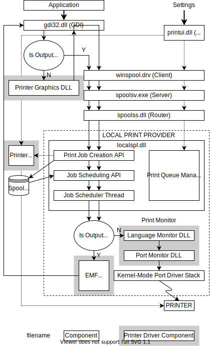

**术语**

| Windows | Linux   | 注        |
| ------- | ------- | --------- |
| checked | debug   | build类型 |
| free    | release | build类型 |
|         |         |           |

<div style="text-align:right; font-size:3em;">2020.10.30</div>

## Windows驱动发展

参考[【hyddd驱动开发学习】DDK与WDK](https://www.cnblogs.com/hyddd/archive/2009/03/15/1412684.html)，

| 系统         | 驱动模型                        | 驱动后缀 | 开发包 |
| ------------ | ------------------------------- | -------- | ------ |
| 95/98/ME     | Vxd                             | .vxd     | 无     |
| 2000/XP/2003 | WDM (Windows Driver Model)      | .sys     | DDK    |
| Vista和之后  | WDF (Windows Driver Frameworks) | .sys     | WDK    |

WDK兼容DDK。

<div style="text-align:right; font-size:3em;">2020.10.27</div>

## 安装

安装包来自微软官方[Other WDK downloads](https://docs.microsoft.com/en-us/windows-hardware/drivers/other-wdk-downloads)的Windows XP Windows Server 2003的[WDK 7.1.0](https://www.microsoft.com/download/confirmation.aspx?id=11800)。

在windows XP虚拟机（virtual box）里安装。

装好了发现就是DDK！位于`C:\WinDDK\`！

<div style="text-align:right; font-size:3em;">2020.10.26</div>

## 编译程序

在winXP里编译了打印机驱动的示例程序——msplot（在`C:\WinDDK\版本\src\print\msplot\`里），运行`x86 Checked Build Environment`然后去msplot目录里运行`build`就可以了。更想了解windows的编译系统了。

2020.10.28

**[Use the Microsoft C++ toolset from the command line](https://docs.microsoft.com/en-us/cpp/build/building-on-the-command-line?view=vs-2019)**

[CL](https://docs.microsoft.com/en-us/cpp/build/reference/compiling-a-c-cpp-program?view=vs-2019)
Use the compiler (cl.exe) to compile and link source code files into apps, libraries, and DLLs.

[Link](https://docs.microsoft.com/en-us/cpp/build/reference/linking?view=vs-2019)
Use the linker (link.exe) to link compiled object files and libraries into apps and DLLs.

[NMAKE](https://docs.microsoft.com/en-us/cpp/build/reference/nmake-reference?view=vs-2019)
Use NMAKE (nmake.exe) on Windows to build C++ projects based on a traditional makefile.

**[Plotter Driver Components](https://docs.microsoft.com/en-us/windows-hardware/drivers/print/plotter-driver-components)**

msplot的编译过程应该不是由namek+makefile完成的，而是`plotter/sources`和`plotui/sources`这俩文件指导某个程序完成的。

2020.10.29

通过搜索sources里的关键词`TARGETNAME=`，搜索到了source文件相关的历史文档：

* [TARGETTYPE](https://docs.microsoft.com/en-us/previous-versions/ff552920(v=vs.85))
  * [Sources file](https://docs.microsoft.com/en-us/previous-versions/ff551804(v=vs.85))
    * [Using Macros and Environment Variables](https://docs.microsoft.com/en-us/previous-versions/ff554126(v=vs.85))
      * [Macros and NMAKE](http://go.microsoft.com/fwlink/?linkid=153241)：可以下载到Visual Studio 2003 Retired Technical documentation。**注**：这些pdf就是网页文档一模一样的格式，链接非常多。
    * [Utilizing a Sources file Template](https://docs.microsoft.com/en-us/previous-versions/ff556072(v=vs.85))：说明了sources文件的使用方法。模板里对TARGETNAME的注释“It is the name of the target (component) that is being built by this makefile”说明了sources文件的本质是makefile！

`build`在运行时输出信息显示会去读取Winddk根目录里的`build.dat`文件，这个文件的用途是？

<div style="text-align:right; font-size:3em;">2020.10.30</div>

找到编译相关的文档了，安装DDK时就同时安装了开发文档在开始菜单找找DDK的help子目录，找到这个文档的过程有点曲折，总的来说还是不熟悉windows开发流程，

* stack overflow [How to start writing DDK code ?](https://stackoverflow.com/questions/10197148/how-to-start-writing-ddk-code) quasoft的回答提到xp编程可以参考，
  * guide from Donald D. Burn can be a good start - [Getting Started with Windows Driver Development](https://msdn.microsoft.com/en-us/library/windows/hardware/dn613923(v=vs.85).aspx)，下载到了Books里[drv_dev_intro.docx](../../../../../Books/Kernel/Windows/drivers/drv_dev_intro.docx)；这个文档在讲Build Commandl Line时提到了“The Build utility has many options, which are all documented in the WDK.”，我当时惊呆了，WDK有文档？！仔细想想，当时只搜索了`C:\WinDDK`目录，没有找到文档，文档可能在别的地方放着！
    * 果然DDK的开发者文档在开始菜单里的DDK-help子目录下有！（在安装时要选择安装帮助文档才会有！）

<div style="text-align:right; font-size:3em;">2020.11.06</div>

**注**：很多程序在Z盘安装失败，在C盘安装成功。

---

HP 1020 plus windows xp 32驱动（在HP官网下载）

* Windows XP：一切正常，可以直接驱动USB打印机
* ReactOS：安装程序卡死
* WINE：安装程序无法找到USB设备

---

PDF虚拟打印机TinyPDF

* Windows XP：一切正常，可以打印出PDF文件
* ReactOS：安装正常，但打印机列表没有出现虚拟打印机
* WINE：安装正常，打印机列表里有虚拟打印机，但是打印会卡死

---

<div style="text-align:right; font-size:3em;">2020.11.19</div>

## 调试notepad+TinyPDF

总路线

* WINE

  * winedbg: 调试notepad打印过程winedbg总是乱跳，很多变量无法显示。猜测是winedbg对内核的debug支持的不好。直接用gdb调试吧。
  * 🌱gdb: 

* winxp

  * windbg/ollydbg：参考[how to generate pdb files while building library using mingw?](https://stackoverflow.com/questions/19269350/how-to-generate-pdb-files-while-building-library-using-mingw)，需要pdb符号文件和gnu(mingw)的`-g`不一样，需要用vc编译，但notepad源码是用mingw的Makefile写的。

    * 把mingw编译出来的notepad中的debug信息转换成windbg可以识别的pdb文件

  * gdb

    * 直接下载bin文件缺各种依赖无法运行

      * 🌟缺啥dll装啥dll，添加了9个dll最终可以运行gdb了🌟

    * 用mingw-get（命令行）安装网络完全连不上，[Where can I find “system proxy settings”?](https://superuser.com/questions/434686/where-can-i-find-system-proxy-settings)

      [Ask Question](https://superuser.com/questions/ask)，winxp的系统代理（IE里设置）似乎不管用，IE可以正常访问google。**注**：virtualbox网络设置为NAT，winxp的ipconfig命令可以看到宿主机ip应该是10.0.2.2。

    * 用mingw-get-setup（图形界面）和命令行报错一模一样

<div style="text-align:right; font-size:3em;">2020.11.20</div>

## Win内核debug

参考[Debugging Windows Kernel from Linux](https://stackoverflow.com/questions/12696825/debugging-windows-kernel-from-linux)，**注**：debugger创建pipe，debuggee连接pipe。

<div style="text-align:right; font-size:3em;">2020.11.30</div>

### dll内部函数

* 用户态调调试用户态

  因为看不到dll内部的函数（和export相对立），以为需要内核态才能看到哦，所以尝试去用内核态调试。

* 内核态调试用户态

  **注**：参考[用windbg内核模式调试用户态程序](https://blog.csdn.net/lixiangminghate/article/details/52847658)发现：诸多内核debug指令在[Common WinDbg Commands](http://windbg.info/doc/1-common-cmds.html)里没有。

  内核态结果一样看不到。强制重新加载不行，`.reload /f <module>`。

参考[手动加载PDB符号文件](https://blog.csdn.net/cssxn/article/details/101371417)可以用`!sym noisy`提示加载符号的很多错误信息！报错信息是`mismatched pdb`。由此发现的问题是<span style="background:red; color:white; font-weight: bold;">dll和pdb不匹配！</span>

依稀记得之前在某个地方看到过，为了保证调试信息（pdb）和二进制文件（dll和exe）对应，存在一个pdb匹配机制的。

大概需要自己编译一遍windows才好吧。编译windows这个坎始终得迈过去。

<div style="text-align:right; font-size:3em;">2020.12.01</div>

`binaries.x86fre/`文件夹里的dll和`WINDOWS/system32/`里的dll的大小一模一样，我以为文件是一样的。但是用`diff -s`比较竟然不一样，尝试着用前者覆盖后者，pdb文件就可以加载上了！大概目前可以不用重新编译windows！直接用`binaries.x86fre/`的dll覆盖`WINDOWS/system32/`就好了。

所以不是内核调试和用户调试的问题，而是加载符号信息的问题。

## 加载comdlg符号

comdlg32的`g_hinst`来自于`init.c`的`LibMain`，在`sources.inc`里声明为dll的入口函数。入口函数的参数是运行环境给的，见[DllMain entry point](https://docs.microsoft.com/en-us/windows/win32/dlls/dllmain)。

<div style="text-align:right; font-size:3em;">2020.12.02</div>

comctl32有点特殊，用的是`C:\WINDOWS\WinSxS\x86_Microsoft.Windows.Common-Controls_6595b64144ccf1df_6.0.100.0_x-ww_8417450B\comctl32.dll`，没有对应的pdb文件。

用`binaries.x86fre/winsxs/x86_Microsoft.Windows.Common-Controls_6595b64144ccf1df_6.0.100.0_x-ww_8417450B/comctl32.dll`替换就好了！！！

很有意思！！！原因不明，为啥同一个comctl32会有这么多版本？很多dll都有很多版本。

命令`sxe ld:tinypdf.dll`和`sxe ld:tinypdf2.dll`当加载tinypdf.dll和tinypdf2.dll时停下来。

✅<span style="background: green; color: white; font-weight: bold;">打印出加载tinypdf.dll时候的调用栈，里边完全没有出现notepad。这是为什么？此时只有一个进程和一个线程。</span>

**猜测**：

* notepad走系统调用完成的工作，所以在用户调用栈里看不到。
* windbg不可靠，它自己报错为`Stack unwind information not available. Following frames may be wrong`

**已解决**：把所有相关的dll的符号信息添加上就好了。（把dll替换成有pdb对应的版本）

<div style="text-align:right; font-size:3em;">2020.12.03</div>

## tinypdf

~~通过`sxe ld:tinypdf.dll`和`sxe ld:tinypdf2.dll`停在加载这俩dll时，调用栈如下，~~

通过`sxe ld`发现还会加载tinypdf1.dll，在**同一次windbg环境里（调用栈相同）**顺序依次为tinypdf2, tinypdf, tinypdf1，如下，

### tinypdf2.dll

```
ChildEBP RetAddr  
0006e2d0 77f4be04 SharedUserData!SystemCallStub+0x4
0006e2d4 77f57b8e ntdll!ZwMapViewOfSection(void)+0xc [c:\srv03rtm\base\ntdll\daytona\obj\i386\usrstubs.asm @ 1027]
0006e3c4 77f511df ntdll!LdrpMapDll(
			unsigned short * DllPath = 0x0009a960, 
			unsigned short * DllName = 0x0006e3f0, 
			unsigned long * DllCharacteristics = 0x0006e904, 
			unsigned char StaticLink = 0x00 '', 
			unsigned char Redirected = 0x00 '', 
			struct _LDR_DATA_TABLE_ENTRY ** LdrDataTableEntry = 0x0006e634)+0x75a [c:\srv03rtm\base\ntdll\ldrsnap.c @ 2781]
0006e650 77f472df ntdll!LdrpLoadDll(
			unsigned long Flags = 0, 
			unsigned short * DllPath = 0x0009a960, 
			unsigned long * DllCharacteristics = 0x0006e904, 
			struct _UNICODE_STRING * DllName = 0x0006e8e4 "C:\WINDOWS\system32\spool\DRIVERS\W32X86\3\tinypdf2.dll", 
			void ** DllHandle = 0x0006e900, 
			unsigned char RunInitRoutines = 0x01 '')+0x16f [c:\srv03rtm\base\ntdll\ldrapi.c @ 385]
0006e8b8 77e7439f ntdll!LdrLoadDll(
			unsigned short * DllPath = 0x0009a960, 
			unsigned long * DllCharacteristics = 0x0006e904, 
			struct _UNICODE_STRING * DllName = 0x0006e8e4 "C:\WINDOWS\system32\spool\DRIVERS\W32X86\3\tinypdf2.dll", 
			void ** DllHandle = 0x0006e900)+0x133 [c:\srv03rtm\base\ntdll\ldrapi.c @ 219]
0006e920 73159904 kernel32!LoadLibraryExW(
			unsigned short * lpwLibFileName = 0x0006ec0a, 
			void * hFile = 0x00000000, 
			unsigned long dwFlags = 8)+0x1af [c:\srv03rtm\base\win32\client\module.c @ 506]
0006e940 7315c83b WINSPOOL!LoadNewCopy(
			unsigned short * pConfigFile = 0x0006ec0a, 
			unsigned long dwFlags = 8, 
			unsigned long dwVersion = 0)+0x27 [c:\srv03rtm\printscan\print\spooler\spoolss\client\winspool.c @ 5452]
0006e95c 7315c92e WINSPOOL!RefCntLoadDriver(
			unsigned short * pConfigFile = 0x0006ec0a, 
			unsigned long dwFlags = 8, 
			unsigned long dwVersion = 0, 
			int bUseVersion = 0n1)+0x42 [c:\srv03rtm\printscan\print\spooler\spoolss\client\winspool.c @ 5578]
0006ed88 73156a44 WINSPOOL!LoadPrinterDriver(
			void * hPrinter = 0x0009632c)+0x88 [c:\srv03rtm\printscan\print\spooler\spoolss\client\winspool.c @ 5722]
0006eda4 7315ca3a WINSPOOL!DocumentPropertySheets(
			struct _PROPSHEETUI_INFO * pCPSUIInfo = 0x00000000, 
			long lParam = 0n454072)+0x11e [c:\srv03rtm\printscan\print\spooler\spoolss\client\prop.c @ 591]
0006eddc 76339ccc WINSPOOL!DocumentPropertiesWNative(
			void * hWnd = 0x000700f2, 
			void * hPrinter = 0x0009632c, 
			unsigned short * pDeviceName = 0x0009c1dc, 
			struct _devicemodeW * pDevModeOutput = 0x00000000, 
			struct _devicemodeW * pDevModeInput = 0x00000000, 
			unsigned long fMode = 0)+0xe4 [c:\srv03rtm\printscan\print\spooler\spoolss\client\winspool.c @ 5892]
0006f244 7633a0d9 comdlg32!PrintDlgX(
			struct PRINTINFO * pPI = 0x00096200)+0x2f7 [c:\srv03rtm\shell\comdlg32\prnsetup.c @ 525]
0006f28c 7633ad01 comdlg32!PageSetupDlgX(
			struct PRINTINFO * pPI = 0x0006f2a0)+0x1af [c:\srv03rtm\shell\comdlg32\prnsetup.c @ 1031]
0006f740 01005c41 comdlg32!PageSetupDlgW(
			struct tagPSDW * pPSD = 0x0100a4a0)+0x41 [c:\srv03rtm\shell\comdlg32\prnsetup.c @ 835]
0006f7ac 01006ab9 notepad!GetPrinterDCviaDialog(void)+0x2e [c:\srv03rtm\shell\osshell\accesory\notepad\npprint.c @ 283]
0006f7b4 01006aee notepad!NpPrint(
			_PRINT_DIALOG_TYPE type = 0n16788912 (No matching enumerant))+0x2f [c:\srv03rtm\shell\osshell\accesory\notepad\npprint.c @ 381]
0006fae8 01002db0 notepad!PrintIt(
			_PRINT_DIALOG_TYPE type = UseDialog (0n0))+0x1a [c:\srv03rtm\shell\osshell\accesory\notepad\npprint.c @ 1218]
0006fd58 010037e1 notepad!NPCommand(
			struct HWND__ * hwnd = 0x000700f2, 
			unsigned int wParam = 0x10006, 
			long lParam = 0n0)+0x308 [c:\srv03rtm\shell\osshell\accesory\notepad\notepad.c @ 907]
0006fd7c 77d38403 notepad!NPWndProc(
			struct HWND__ * hwnd = 0x000700f2, 
			unsigned int message = 0x111, 
			unsigned int wParam = 0x10006, 
			long lParam = 0n0)+0x4fc [c:\srv03rtm\shell\osshell\accesory\notepad\notepad.c @ 1348]
0006fda8 77d3ddde USER32!InternalCallWinProc(void)+0x1b [C:\srv03rtm\windows\core\ntuser\client\i386\callproc.asm @ 102]
0006fe20 77d1470f USER32!UserCallWinProcCheckWow(
			struct _ACTIVATION_CONTEXT * pActCtx = 0x00000000, 
			<function> * pfn = 0x010032e5, 
			struct HWND__ * hwnd = 0x000700f2, 
			unsigned int msg = 0x111, 
			unsigned int wParam = 0x10006, 
			long lParam = 0n0, 
			void * pww = 0x0046d05c, 
			int fEnableLiteHooks = 0n1)+0x151 [c:\srv03rtm\windows\core\ntuser\client\clmsg.c @ 165]
0006fe7c 77d14924 USER32!DispatchClientMessage(
			struct tagWND * pwnd = 0x0046d048, 
			unsigned int message = 0x111, 
			unsigned int wParam = 0x10006, 
			long lParam = 0n0, 
			unsigned long pfn = 0x10032e5)+0xd9 [c:\srv03rtm\windows\core\ntuser\client\client.c @ 3037]
0006fea4 77f66dbf USER32!__fnDWORD(
			struct _FNDWORDMSG * pmsg = 0x0006feb4)+0x22 [c:\srv03rtm\windows\core\ntuser\inc\ntcb.h @ 639]
0006fec8 77d5c2ec ntdll!KiUserCallbackDispatcher(void)+0x13 [C:\srv03rtm\base\ntos\rtl\i386\userdisp.asm @ 153]
0006fecc 77d19845 USER32!NtUserTranslateAccelerator(
			int a1 = 0n16777216, 
			int a2 = 0n0, 
			int a3 = 0n597750)+0xc [c:\srv03rtm\windows\core\umode\daytona\obj\i386\usrstubs.c @ 4619]
0006fedc 01002927 USER32!TranslateAcceleratorW(
			struct HWND__ * hwnd = 0x010070f0, 
			struct HACCEL__ * hAccel = 0x01000000, 
			struct tagMSG * lpMsg = 0x00000000)+0x33 [c:\srv03rtm\windows\core\ntuser\client\client.c @ 236]
0006ff1c 010070f0 notepad!WinMain(
			struct HINSTANCE__ * hInstance = 0x01000000, 
			struct HINSTANCE__ * hPrevInstance = 0x00000000, 
			char * lpAnsiCmdLine = 0x00091ef6 "", 
			int cmdShow = 0n10)+0xc2 [c:\srv03rtm\shell\osshell\accesory\notepad\notepad.c @ 1522]
0006ffc0 77e7d5ba notepad!WinMainCRTStartup(void)+0x182 [c:\srv03rtm\base\crts\crtw32\dllstuff\crtexe.c @ 493]
0006fff0 00000000 kernel32!BaseProcessStart(
			<function> * lpStartAddress = 0x01006f6e)+0x23 [c:\srv03rtm\base\win32\client\support.c @ 580]
```

### tinypdf.dll & tinypdf1.dll

tinypdf.dll

```
ChildEBP RetAddr  
0006d6ec 77f4be04 SharedUserData!SystemCallStub+0x4
0006d6f0 77f57767 ntdll!ZwMapViewOfSection(void)+0xc [c:\srv03rtm\base\ntdll\daytona\obj\i386\usrstubs.asm @ 1027]
0006d7e0 77f57fd7 ntdll!LdrpMapDll(
			unsigned short * DllPath = 0x0009be08, 
			unsigned short * DllName = 0x7ffdec00, 
			unsigned long * DllCharacteristics = 0x00000000, 
			unsigned char StaticLink = 0x01 '', 
			unsigned char Redirected = 0x00 '', 
			struct _LDR_DATA_TABLE_ENTRY ** LdrDataTableEntry = 0x0006da58)+0x333 [c:\srv03rtm\base\ntdll\ldrsnap.c @ 2290]
0006da34 77f58635 ntdll!LdrpLoadImportModule(
			unsigned short * DllPath = 0x0009be08, 
			char * ImportName = 0x008e7fbc "tinypdf1.dll", 
			struct _LDR_DATA_TABLE_ENTRY ** DataTableEntry = 0x0006da58, 
			unsigned char * AlreadyLoaded = 0x0006da5f "")+0x10f [c:\srv03rtm\base\ntdll\ldrsnap.c @ 254]
0006da60 77f586f2 ntdll!LdrpHandleOneOldFormatImportDescriptor(
			unsigned short * DllPath = 0x0009be08, 
			struct _LDR_DATA_TABLE_ENTRY * LdrDataTableEntry = 0x00192b70, 
			struct _IMAGE_IMPORT_DESCRIPTOR ** ImportDescriptorInOut = 0x0006da84)+0x59 [c:\srv03rtm\base\ntdll\ldrsnap.c @ 530]
0006da74 77f46427 ntdll!LdrpHandleOldFormatImportDescriptors(
			unsigned short * DllPath = 0x0009be08, 
			struct _LDR_DATA_TABLE_ENTRY * LdrDataTableEntry = 0x00192b70, 
			struct _IMAGE_IMPORT_DESCRIPTOR * ImportDescriptor = 0x008e7938)+0x1a [c:\srv03rtm\base\ntdll\ldrsnap.c @ 601]
0006dafc 77f5122f ntdll!LdrpWalkImportDescriptor(
			unsigned short * DllPath = 0x0009be08, 
			struct _LDR_DATA_TABLE_ENTRY * LdrDataTableEntry = 0x00192b70)+0x1a5 [c:\srv03rtm\base\ntdll\ldrsnap.c @ 848]
0006dd78 77f472df ntdll!LdrpLoadDll(
			unsigned long Flags = 0, 
			unsigned short * DllPath = 0x0009be08, 
			unsigned long * DllCharacteristics = 0x0006e02c, 
			struct _UNICODE_STRING * DllName = 0x0006e00c "C:\WINDOWS\system32\spool\DRIVERS\W32X86\3\tinypdf.dll", 
			void ** DllHandle = 0x0006e028, 
			unsigned char RunInitRoutines = 0x01 '')+0x1bf [c:\srv03rtm\base\ntdll\ldrapi.c @ 426]
0006dfe0 77e7439f ntdll!LdrLoadDll(
			unsigned short * DllPath = 0x0009be08, 
			unsigned long * DllCharacteristics = 0x0006e02c, 
			struct _UNICODE_STRING * DllName = 0x0006e00c "C:\WINDOWS\system32\spool\DRIVERS\W32X86\3\tinypdf.dll", 
			void ** DllHandle = 0x0006e028)+0x133 [c:\srv03rtm\base\ntdll\ldrapi.c @ 219]
0006e048 77c6374d kernel32!LoadLibraryExW(
			unsigned short * lpwLibFileName = 0x0009aeea, 
			void * hFile = 0x00000000, 
			unsigned long dwFlags = 8)+0x1af [c:\srv03rtm\base\win32\client\module.c @ 506]
0006e080 77c63890 GDI32!LoadUserModePrinterDriverEx(
			struct _DRIVER_INFO_5W * pDriverInfo5 = 0x0009b8f8, 
			unsigned short * pwstrPrinterName = 0x0009bfe8, 
			struct _UMPD ** ppUMPD = 0x0006e0f8, 
			struct _PRINTER_DEFAULTSW * pdefaults = 0x0006e0dc, 
			void * hPrinter = 0x00099474)+0xff [c:\srv03rtm\windows\core\ntgdi\client\umpd.cxx @ 429]
0006e0a8 77c3bf56 GDI32!LoadUserModePrinterDriver(
			void * hPrinter = 0x00099474, 
			unsigned short * pwstrPrinterName = 0x0009bfe8, 
			struct _UMPD ** ppUMPD = 0x0006e0f8, 
			struct _PRINTER_DEFAULTSW * pdefaults = 0x0006e0dc)+0x3f [c:\srv03rtm\windows\core\ntgdi\client\umpd.cxx @ 544]
0006e108 77c3ccbf GDI32!hdcCreateDCW(
			struct _UNICODE_STRING * pustrDevice = 0x0006e12c "TinyPDF", 
			struct _UNICODE_STRING * pustrPort = 0x00000000, 
			struct _devicemodeW * pdm = 0x0009bfe8, 
			int bDisplay = 0n0, 
			int bIC = 0n1)+0x8b [c:\srv03rtm\windows\core\ntgdi\client\object.c @ 392]
0006e140 77c3ccda GDI32!bCreateDCW(
			unsigned short * pszDriver = 0x00000000, 
			unsigned short * pszDevice = 0x0009bfe8, 
			unsigned short * pszPort = 0x00000000, 
			struct _devicemodeW * pdm = 0x0009bfe8, 
			int bIC = 0n1)+0xb4 [c:\srv03rtm\windows\core\ntgdi\client\object.c @ 739]
0006e158 76333eed GDI32!CreateICW(
			unsigned short * pwszDriver = 0x76337777, 
			unsigned short * pwszDevice = 0x000600de, 
			unsigned short * pwszPort = 0x0006f2a0, 
			struct _devicemodeW * pdm = 0x0009bfe8)+0x17 [c:\srv03rtm\windows\core\ntgdi\client\object.c @ 931]
0006e1a4 76337777 comdlg32!PrintSetMinMargins(
			struct HWND__ * hDlg = 0x000600de, 
			struct PRINTINFO * pPI = 0x0006f2a0, 
			struct _devicemodeW * pDM = 0x0009bfe8)+0xd7 [c:\srv03rtm\shell\comdlg32\prnsetup.c @ 4490]
0006e240 76337d32 comdlg32!PrintUpdatePageSetup(
			struct HWND__ * hDlg = 0x000600de, 
			struct PRINTINFO * pPI = 0x0000002a, 
			struct _devicemodeW * pDM = 0x0009bfe8, 
			unsigned int uiOldId = 0x420, 
			unsigned int uiNewId = 3)+0x401 [c:\srv03rtm\shell\comdlg32\prnsetup.c @ 7179]
0006e25c 7633820e comdlg32!PrintSetOrientation(
			struct HWND__ * hDlg = 0x000600de, 
			struct PRINTINFO * pPI = 0x0006f2a0, 
			struct _devicemodeW * pDM = 0x0009bfe8, 
			unsigned int uiOldId = 0x420, 
			unsigned int uiNewId = 0x420)+0x93 [c:\srv03rtm\shell\comdlg32\prnsetup.c @ 6893]
0006ea94 7633aa12 comdlg32!PrintInitSetupDlg(
			struct HWND__ * hDlg = 0x00096200, 
			unsigned int wParam = 0x100a4a0, 
			struct PRINTINFO * pPI = 0x00000002)+0xd0 [c:\srv03rtm\shell\comdlg32\prnsetup.c @ 3916]
0006eac8 77d38403 comdlg32!PrintSetupDlgProc(
			struct HWND__ * hDlg = 0x000600de, 
			unsigned int wMsg = 0x110, 
			unsigned int wParam = 0x1015a, 
			long lParam = 0n0)+0x8eb [c:\srv03rtm\shell\comdlg32\prnsetup.c @ 2268]
0006eaf4 77d3deef USER32!InternalCallWinProc(void)+0x1b [C:\srv03rtm\windows\core\ntuser\client\i386\callproc.asm @ 102]
0006eb70 77d273b3 USER32!UserCallDlgProcCheckWow(
			struct _ACTIVATION_CONTEXT * pActCtx = 0x00000000, 
			<function> * pfn = 0x7633a127, 
			struct HWND__ * hwnd = 0x000600de, 
			unsigned int msg = 0x110, 
			unsigned int wParam = 0x1015a, 
			long lParam = 0n455328, 
			void * pww = 0x0046f114, 
			int * pret = 0x0006ebc0)+0xf1 [c:\srv03rtm\windows\core\ntuser\client\clmsg.c @ 218]
0006ebb8 77d375c2 USER32!DefDlgProcWorker(
			struct tagWND * pwnd = 0x00000000, 
			unsigned int message = 0x110, 
			unsigned int wParam = 0x1015a, 
			long lParam = 0n455328, 
			unsigned long fAnsi = 0)+0xa6 [c:\srv03rtm\windows\core\ntuser\client\dlgmgr.c @ 511]
0006ebd0 77d38403 USER32!DefDlgProcW(
			struct HWND__ * hwnd = 0x77d3ddde, 
			unsigned int message = 0x77d375a1, 
			unsigned int wParam = 0x600de, 
			long lParam = 0n272)+0x21 [c:\srv03rtm\windows\core\ntuser\client\dlgmgr.c @ 1021]
0006ebfc 77d3ddde USER32!InternalCallWinProc(void)+0x1b [C:\srv03rtm\windows\core\ntuser\client\i386\callproc.asm @ 102]
0006ec74 77d157f6 USER32!UserCallWinProcCheckWow(
			struct _ACTIVATION_CONTEXT * pActCtx = 0x00000000, 
			<function> * pfn = 0x77d375a1, 
			struct HWND__ * hwnd = 0x000600de, 
			unsigned int msg = 0x110, 
			unsigned int wParam = 0x1015a, 
			long lParam = 0n455328, 
			void * pww = 0x0046f114, 
			int fEnableLiteHooks = 0n1)+0x151 [c:\srv03rtm\windows\core\ntuser\client\clmsg.c @ 165]
0006ecb0 77d28481 USER32!SendMessageWorker(
			struct tagWND * pwnd = 0x0046f100, 
			unsigned int message = 0x46be80, 
			unsigned int wParam = 0x1015a, 
			long lParam = 0n455328, 
			int fAnsi = 0n0)+0x4bb [c:\srv03rtm\windows\core\ntuser\client\clmsg.c @ 697]
0006ed68 77d45834 USER32!InternalCreateDialog(
			void * hmod = 0x01000000, 
			struct DLGTEMPLATE * lpdt = 0x0046f100, 
			unsigned long cb = 0, 
			struct HWND__ * hwndOwner = 0x000600de, 
			<function> * lpfnDialog = 0x7633a127, 
			long lParam = 0n455328, 
			unsigned int fSCDLGFlags = 1)+0x9c9 [c:\srv03rtm\windows\core\ntuser\client\dlgbegin.c @ 1309]
0006ed9c 77d369db USER32!InternalDialogBox(
			void * hModule = 0x01000000, 
			struct DLGTEMPLATE * lpdt = 0x01012088, 
			struct HWND__ * hwndOwner = 0x00050138, 
			<function> * pfnDialog = 0x7633a127, 
			long lParam = 0n455328, 
			unsigned int fSCDLGFlags = 1)+0xa7 [c:\srv03rtm\windows\core\ntuser\client\dlgmgr.c @ 1339]
0006edbc 76335352 USER32!DialogBoxIndirectParamAorW(
			struct HINSTANCE__ * hmod = 0x01000000, 
			struct DLGTEMPLATE * lpDlgTemplate = 0x01012088, 
			struct HWND__ * hwndOwner = 0x00050138, 
			<function> * lpDialogFunc = 0x7633a127, 
			long dwInitParam = 0n455328, 
			unsigned int fAnsiFlags = 0)+0x35 [c:\srv03rtm\windows\core\ntuser\client\clres.c @ 806]
0006edf0 76339e97 comdlg32!PrintDisplaySetupDlg(
			struct PRINTINFO * pPI = 0x01000000)+0xe1 [c:\srv03rtm\shell\comdlg32\prnsetup.c @ 1353]
0006f244 7633a0d9 comdlg32!PrintDlgX(
			struct PRINTINFO * pPI = 0x00096200)+0x4c2 [c:\srv03rtm\shell\comdlg32\prnsetup.c @ 620]
0006f28c 7633ad01 comdlg32!PageSetupDlgX(
			struct PRINTINFO * pPI = 0x0006f2a0)+0x1af [c:\srv03rtm\shell\comdlg32\prnsetup.c @ 1031]
0006f740 01005c41 comdlg32!PageSetupDlgW(
			struct tagPSDW * pPSD = 0x0100a4a0)+0x41 [c:\srv03rtm\shell\comdlg32\prnsetup.c @ 835]
0006f7ac 01006ab9 notepad!GetPrinterDCviaDialog(void)+0x2e [c:\srv03rtm\shell\osshell\accesory\notepad\npprint.c @ 283]
0006f7b4 01006aee notepad!NpPrint(
			_PRINT_DIALOG_TYPE type = 0n16788912 (No matching enumerant))+0x2f [c:\srv03rtm\shell\osshell\accesory\notepad\npprint.c @ 381]
0006fae8 01002db0 notepad!PrintIt(
			_PRINT_DIALOG_TYPE type = UseDialog (0n0))+0x1a [c:\srv03rtm\shell\osshell\accesory\notepad\npprint.c @ 1218]
0006fd58 010037e1 notepad!NPCommand(
			struct HWND__ * hwnd = 0x00050138, 
			unsigned int wParam = 0x10006, 
			long lParam = 0n0)+0x308 [c:\srv03rtm\shell\osshell\accesory\notepad\notepad.c @ 907]
0006fd7c 77d38403 notepad!NPWndProc(
			struct HWND__ * hwnd = 0x00050138, 
			unsigned int message = 0x111, 
			unsigned int wParam = 0x10006, 
			long lParam = 0n0)+0x4fc [c:\srv03rtm\shell\osshell\accesory\notepad\notepad.c @ 1348]
0006fda8 77d3ddde USER32!InternalCallWinProc(void)+0x1b [C:\srv03rtm\windows\core\ntuser\client\i386\callproc.asm @ 102]
0006fe20 77d1470f USER32!UserCallWinProcCheckWow(
			struct _ACTIVATION_CONTEXT * pActCtx = 0x00000000, 
			<function> * pfn = 0x010032e5, 
			struct HWND__ * hwnd = 0x00050138, 
			unsigned int msg = 0x111, 
			unsigned int wParam = 0x10006, 
			long lParam = 0n0, 
			void * pww = 0x0046c724, 
			int fEnableLiteHooks = 0n1)+0x151 [c:\srv03rtm\windows\core\ntuser\client\clmsg.c @ 165]
0006fe7c 77d14924 USER32!DispatchClientMessage(
			struct tagWND * pwnd = 0x0046c710, 
			unsigned int message = 0x111, 
			unsigned int wParam = 0x10006, 
			long lParam = 0n0, 
			unsigned long pfn = 0x10032e5)+0xd9 [c:\srv03rtm\windows\core\ntuser\client\client.c @ 3037]
0006fea4 77f66dbf USER32!__fnDWORD(
			struct _FNDWORDMSG * pmsg = 0x0006feb4)+0x22 [c:\srv03rtm\windows\core\ntuser\inc\ntcb.h @ 639]
0006fec8 77d5c2ec ntdll!KiUserCallbackDispatcher(void)+0x13 [C:\srv03rtm\base\ntos\rtl\i386\userdisp.asm @ 153]
0006fecc 77d19845 USER32!NtUserTranslateAccelerator(
			int a1 = 0n16777216, 
			int a2 = 0n0, 
			int a3 = 0n597750)+0xc [c:\srv03rtm\windows\core\umode\daytona\obj\i386\usrstubs.c @ 4619]
0006fedc 01002927 USER32!TranslateAcceleratorW(
			struct HWND__ * hwnd = 0x010070f0, 
			struct HACCEL__ * hAccel = 0x01000000, 
			struct tagMSG * lpMsg = 0x00000000)+0x33 [c:\srv03rtm\windows\core\ntuser\client\client.c @ 236]
0006ff1c 010070f0 notepad!WinMain(
			struct HINSTANCE__ * hInstance = 0x01000000, 
			struct HINSTANCE__ * hPrevInstance = 0x00000000, 
			char * lpAnsiCmdLine = 0x00091ef6 "", 
			int cmdShow = 0n10)+0xc2 [c:\srv03rtm\shell\osshell\accesory\notepad\notepad.c @ 1522]
0006ffc0 77e7d5ba notepad!WinMainCRTStartup(void)+0x182 [c:\srv03rtm\base\crts\crtw32\dllstuff\crtexe.c @ 493]
0006fff0 00000000 kernel32!BaseProcessStart(
			<function> * lpStartAddress = 0x01006f6e)+0x23 [c:\srv03rtm\base\win32\client\support.c @ 580]
```

tinypdf1.dll

```
ChildEBP RetAddr  
0006d6ec 77f4be04 SharedUserData!SystemCallStub+0x4
0006d6f0 77f57767 ntdll!ZwMapViewOfSection(void)+0xc [c:\srv03rtm\base\ntdll\daytona\obj\i386\usrstubs.asm @ 1027]
0006d7e0 77f57fd7 ntdll!LdrpMapDll(
			unsigned short * DllPath = 0x0009b950, 
			unsigned short * DllName = 0x7ffdec00, 
			unsigned long * DllCharacteristics = 0x00000000, 
			unsigned char StaticLink = 0x01 '', 
			unsigned char Redirected = 0x00 '', 
			struct _LDR_DATA_TABLE_ENTRY ** LdrDataTableEntry = 0x0006da58)+0x333 [c:\srv03rtm\base\ntdll\ldrsnap.c @ 2290]
0006da34 77f58635 ntdll!LdrpLoadImportModule(
			unsigned short * DllPath = 0x0009b950, 
			char * ImportName = 0x008e7fbc "tinypdf1.dll", 
			struct _LDR_DATA_TABLE_ENTRY ** DataTableEntry = 0x0006da58, 
			unsigned char * AlreadyLoaded = 0x0006da5f "")+0x10f [c:\srv03rtm\base\ntdll\ldrsnap.c @ 254]
0006da60 77f586f2 ntdll!LdrpHandleOneOldFormatImportDescriptor(
			unsigned short * DllPath = 0x0009b950, 
			struct _LDR_DATA_TABLE_ENTRY * LdrDataTableEntry = 0x00192b70, 
			struct _IMAGE_IMPORT_DESCRIPTOR ** ImportDescriptorInOut = 0x0006da84)+0x59 [c:\srv03rtm\base\ntdll\ldrsnap.c @ 530]
0006da74 77f46427 ntdll!LdrpHandleOldFormatImportDescriptors(
			unsigned short * DllPath = 0x0009b950, 
			struct _LDR_DATA_TABLE_ENTRY * LdrDataTableEntry = 0x00192b70, 
			struct _IMAGE_IMPORT_DESCRIPTOR * ImportDescriptor = 0x008e7938)+0x1a [c:\srv03rtm\base\ntdll\ldrsnap.c @ 601]
0006dafc 77f5122f ntdll!LdrpWalkImportDescriptor(
			unsigned short * DllPath = 0x0009b950, 
			struct _LDR_DATA_TABLE_ENTRY * LdrDataTableEntry = 0x00192b70)+0x1a5 [c:\srv03rtm\base\ntdll\ldrsnap.c @ 848]
0006dd78 77f472df ntdll!LdrpLoadDll(
			unsigned long Flags = 0, 
			unsigned short * DllPath = 0x0009b950, 
			unsigned long * DllCharacteristics = 0x0006e02c, 
			struct _UNICODE_STRING * DllName = 0x0006e00c "C:\WINDOWS\system32\spool\DRIVERS\W32X86\3\tinypdf.dll", 
			void ** DllHandle = 0x0006e028, 
			unsigned char RunInitRoutines = 0x01 '')+0x1bf [c:\srv03rtm\base\ntdll\ldrapi.c @ 426]
0006dfe0 77e7439f ntdll!LdrLoadDll(
			unsigned short * DllPath = 0x0009b950, 
			unsigned long * DllCharacteristics = 0x0006e02c, 
			struct _UNICODE_STRING * DllName = 0x0006e00c "C:\WINDOWS\system32\spool\DRIVERS\W32X86\3\tinypdf.dll", 
			void ** DllHandle = 0x0006e028)+0x133 [c:\srv03rtm\base\ntdll\ldrapi.c @ 219]
0006e048 77c6374d kernel32!LoadLibraryExW(
			unsigned short * lpwLibFileName = 0x0009f012, 
			void * hFile = 0x00000000, 
			unsigned long dwFlags = 8)+0x1af [c:\srv03rtm\base\win32\client\module.c @ 506]
0006e080 77c63890 GDI32!LoadUserModePrinterDriverEx(
			struct _DRIVER_INFO_5W * pDriverInfo5 = 0x0009b440, 
			unsigned short * pwstrPrinterName = 0x0009c208, 
			struct _UMPD ** ppUMPD = 0x0006e0f8, 
			struct _PRINTER_DEFAULTSW * pdefaults = 0x0006e0dc, 
			void * hPrinter = 0x00099694)+0xff [c:\srv03rtm\windows\core\ntgdi\client\umpd.cxx @ 429]
0006e0a8 77c3bf56 GDI32!LoadUserModePrinterDriver(
			void * hPrinter = 0x00099694, 
			unsigned short * pwstrPrinterName = 0x0009c208, 
			struct _UMPD ** ppUMPD = 0x0006e0f8, 
			struct _PRINTER_DEFAULTSW * pdefaults = 0x0006e0dc)+0x3f [c:\srv03rtm\windows\core\ntgdi\client\umpd.cxx @ 544]
0006e108 77c3ccbf GDI32!hdcCreateDCW(
			struct _UNICODE_STRING * pustrDevice = 0x0006e12c "TinyPDF", 
			struct _UNICODE_STRING * pustrPort = 0x00000000, 
			struct _devicemodeW * pdm = 0x0009c208, 
			int bDisplay = 0n0, 
			int bIC = 0n1)+0x8b [c:\srv03rtm\windows\core\ntgdi\client\object.c @ 392]
0006e140 77c3ccda GDI32!bCreateDCW(
			unsigned short * pszDriver = 0x00000000, 
			unsigned short * pszDevice = 0x0009c208, 
			unsigned short * pszPort = 0x00000000, 
			struct _devicemodeW * pdm = 0x0009c208, 
			int bIC = 0n1)+0xb4 [c:\srv03rtm\windows\core\ntgdi\client\object.c @ 739]
0006e158 76333eed GDI32!CreateICW(
			unsigned short * pwszDriver = 0x76337777, 
			unsigned short * pwszDevice = 0x000d00a0, 
			unsigned short * pwszPort = 0x0006f2a0, 
			struct _devicemodeW * pdm = 0x0009c208)+0x17 [c:\srv03rtm\windows\core\ntgdi\client\object.c @ 931]
0006e1a4 76337777 comdlg32!PrintSetMinMargins(
			struct HWND__ * hDlg = 0x000d00a0, 
			struct PRINTINFO * pPI = 0x0006f2a0, 
			struct _devicemodeW * pDM = 0x0009c208)+0xd7 [c:\srv03rtm\shell\comdlg32\prnsetup.c @ 4490]
0006e240 76337d32 comdlg32!PrintUpdatePageSetup(
			struct HWND__ * hDlg = 0x000d00a0, 
			struct PRINTINFO * pPI = 0x0000002a, 
			struct _devicemodeW * pDM = 0x0009c208, 
			unsigned int uiOldId = 0x420, 
			unsigned int uiNewId = 3)+0x401 [c:\srv03rtm\shell\comdlg32\prnsetup.c @ 7179]
0006e25c 7633820e comdlg32!PrintSetOrientation(
			struct HWND__ * hDlg = 0x000d00a0, 
			struct PRINTINFO * pPI = 0x0006f2a0, 
			struct _devicemodeW * pDM = 0x0009c208, 
			unsigned int uiOldId = 0x420, 
			unsigned int uiNewId = 0x420)+0x93 [c:\srv03rtm\shell\comdlg32\prnsetup.c @ 6893]
0006ea94 7633aa12 comdlg32!PrintInitSetupDlg(
			struct HWND__ * hDlg = 0x00096200, 
			unsigned int wParam = 0x100a4a0, 
			struct PRINTINFO * pPI = 0x00000002)+0xd0 [c:\srv03rtm\shell\comdlg32\prnsetup.c @ 3916]
0006eac8 77d38403 comdlg32!PrintSetupDlgProc(
			struct HWND__ * hDlg = 0x000d00a0, 
			unsigned int wMsg = 0x110, 
			unsigned int wParam = 0x600c0, 
			long lParam = 0n0)+0x8eb [c:\srv03rtm\shell\comdlg32\prnsetup.c @ 2268]
0006eaf4 77d3deef USER32!InternalCallWinProc(void)+0x1b [C:\srv03rtm\windows\core\ntuser\client\i386\callproc.asm @ 102]
0006eb70 77d273b3 USER32!UserCallDlgProcCheckWow(
			struct _ACTIVATION_CONTEXT * pActCtx = 0x00000000, 
			<function> * pfn = 0x7633a127, 
			struct HWND__ * hwnd = 0x000d00a0, 
			unsigned int msg = 0x110, 
			unsigned int wParam = 0x600c0, 
			long lParam = 0n455328, 
			void * pww = 0x00483ea4, 
			int * pret = 0x0006ebc0)+0xf1 [c:\srv03rtm\windows\core\ntuser\client\clmsg.c @ 218]
0006ebb8 77d375c2 USER32!DefDlgProcWorker(
			struct tagWND * pwnd = 0x00000000, 
			unsigned int message = 0x110, 
			unsigned int wParam = 0x600c0, 
			long lParam = 0n455328, 
			unsigned long fAnsi = 0)+0xa6 [c:\srv03rtm\windows\core\ntuser\client\dlgmgr.c @ 511]
0006ebd0 77d38403 USER32!DefDlgProcW(
			struct HWND__ * hwnd = 0x77d3ddde, 
			unsigned int message = 0x77d375a1, 
			unsigned int wParam = 0xd00a0, 
			long lParam = 0n272)+0x21 [c:\srv03rtm\windows\core\ntuser\client\dlgmgr.c @ 1021]
0006ebfc 77d3ddde USER32!InternalCallWinProc(void)+0x1b [C:\srv03rtm\windows\core\ntuser\client\i386\callproc.asm @ 102]
0006ec74 77d157f6 USER32!UserCallWinProcCheckWow(
			struct _ACTIVATION_CONTEXT * pActCtx = 0x00000000, 
			<function> * pfn = 0x77d375a1, 
			struct HWND__ * hwnd = 0x000d00a0, 
			unsigned int msg = 0x110, 
			unsigned int wParam = 0x600c0, 
			long lParam = 0n455328, 
			void * pww = 0x00483ea4, 
			int fEnableLiteHooks = 0n1)+0x151 [c:\srv03rtm\windows\core\ntuser\client\clmsg.c @ 165]
0006ecb0 77d28481 USER32!SendMessageWorker(
			struct tagWND * pwnd = 0x00483e90, 
			unsigned int message = 0x46d920, 
			unsigned int wParam = 0x600c0, 
			long lParam = 0n455328, 
			int fAnsi = 0n0)+0x4bb [c:\srv03rtm\windows\core\ntuser\client\clmsg.c @ 697]
0006ed68 77d45834 USER32!InternalCreateDialog(
			void * hmod = 0x01000000, 
			struct DLGTEMPLATE * lpdt = 0x00483e90, 
			unsigned long cb = 0, 
			struct HWND__ * hwndOwner = 0x000d00a0, 
			<function> * lpfnDialog = 0x7633a127, 
			long lParam = 0n455328, 
			unsigned int fSCDLGFlags = 1)+0x9c9 [c:\srv03rtm\windows\core\ntuser\client\dlgbegin.c @ 1309]
0006ed9c 77d369db USER32!InternalDialogBox(
			void * hModule = 0x01000000, 
			struct DLGTEMPLATE * lpdt = 0x01012088, 
			struct HWND__ * hwndOwner = 0x000700f2, 
			<function> * pfnDialog = 0x7633a127, 
			long lParam = 0n455328, 
			unsigned int fSCDLGFlags = 1)+0xa7 [c:\srv03rtm\windows\core\ntuser\client\dlgmgr.c @ 1339]
0006edbc 76335352 USER32!DialogBoxIndirectParamAorW(
			struct HINSTANCE__ * hmod = 0x01000000, 
			struct DLGTEMPLATE * lpDlgTemplate = 0x01012088, 
			struct HWND__ * hwndOwner = 0x000700f2, 
			<function> * lpDialogFunc = 0x7633a127, 
			long dwInitParam = 0n455328, 
			unsigned int fAnsiFlags = 0)+0x35 [c:\srv03rtm\windows\core\ntuser\client\clres.c @ 806]
0006edf0 76339e97 comdlg32!PrintDisplaySetupDlg(
			struct PRINTINFO * pPI = 0x01000000)+0xe1 [c:\srv03rtm\shell\comdlg32\prnsetup.c @ 1353]
0006f244 7633a0d9 comdlg32!PrintDlgX(
			struct PRINTINFO * pPI = 0x00096200)+0x4c2 [c:\srv03rtm\shell\comdlg32\prnsetup.c @ 620]
0006f28c 7633ad01 comdlg32!PageSetupDlgX(
			struct PRINTINFO * pPI = 0x0006f2a0)+0x1af [c:\srv03rtm\shell\comdlg32\prnsetup.c @ 1031]
0006f740 01005c41 comdlg32!PageSetupDlgW(
			struct tagPSDW * pPSD = 0x0100a4a0)+0x41 [c:\srv03rtm\shell\comdlg32\prnsetup.c @ 835]
0006f7ac 01006ab9 notepad!GetPrinterDCviaDialog(void)+0x2e [c:\srv03rtm\shell\osshell\accesory\notepad\npprint.c @ 283]
0006f7b4 01006aee notepad!NpPrint(
			_PRINT_DIALOG_TYPE type = 0n16788912 (No matching enumerant))+0x2f [c:\srv03rtm\shell\osshell\accesory\notepad\npprint.c @ 381]
0006fae8 01002db0 notepad!PrintIt(
			_PRINT_DIALOG_TYPE type = UseDialog (0n0))+0x1a [c:\srv03rtm\shell\osshell\accesory\notepad\npprint.c @ 1218]
0006fd58 010037e1 notepad!NPCommand(
			struct HWND__ * hwnd = 0x000700f2, 
			unsigned int wParam = 0x10006, 
			long lParam = 0n0)+0x308 [c:\srv03rtm\shell\osshell\accesory\notepad\notepad.c @ 907]
0006fd7c 77d38403 notepad!NPWndProc(
			struct HWND__ * hwnd = 0x000700f2, 
			unsigned int message = 0x111, 
			unsigned int wParam = 0x10006, 
			long lParam = 0n0)+0x4fc [c:\srv03rtm\shell\osshell\accesory\notepad\notepad.c @ 1348]
0006fda8 77d3ddde USER32!InternalCallWinProc(void)+0x1b [C:\srv03rtm\windows\core\ntuser\client\i386\callproc.asm @ 102]
0006fe20 77d1470f USER32!UserCallWinProcCheckWow(
			struct _ACTIVATION_CONTEXT * pActCtx = 0x00000000, 
			<function> * pfn = 0x010032e5, 
			struct HWND__ * hwnd = 0x000700f2, 
			unsigned int msg = 0x111, 
			unsigned int wParam = 0x10006, 
			long lParam = 0n0, 
			void * pww = 0x0046d05c, 
			int fEnableLiteHooks = 0n1)+0x151 [c:\srv03rtm\windows\core\ntuser\client\clmsg.c @ 165]
0006fe7c 77d14924 USER32!DispatchClientMessage(
			struct tagWND * pwnd = 0x0046d048, 
			unsigned int message = 0x111, 
			unsigned int wParam = 0x10006, 
			long lParam = 0n0, 
			unsigned long pfn = 0x10032e5)+0xd9 [c:\srv03rtm\windows\core\ntuser\client\client.c @ 3037]
0006fea4 77f66dbf USER32!__fnDWORD(
			struct _FNDWORDMSG * pmsg = 0x0006feb4)+0x22 [c:\srv03rtm\windows\core\ntuser\inc\ntcb.h @ 639]
0006fec8 77d5c2ec ntdll!KiUserCallbackDispatcher(void)+0x13 [C:\srv03rtm\base\ntos\rtl\i386\userdisp.asm @ 153]
0006fecc 77d19845 USER32!NtUserTranslateAccelerator(
			int a1 = 0n16777216, 
			int a2 = 0n0, 
			int a3 = 0n597750)+0xc [c:\srv03rtm\windows\core\umode\daytona\obj\i386\usrstubs.c @ 4619]
0006fedc 01002927 USER32!TranslateAcceleratorW(
			struct HWND__ * hwnd = 0x010070f0, 
			struct HACCEL__ * hAccel = 0x01000000, 
			struct tagMSG * lpMsg = 0x00000000)+0x33 [c:\srv03rtm\windows\core\ntuser\client\client.c @ 236]
0006ff1c 010070f0 notepad!WinMain(
			struct HINSTANCE__ * hInstance = 0x01000000, 
			struct HINSTANCE__ * hPrevInstance = 0x00000000, 
			char * lpAnsiCmdLine = 0x00091ef6 "", 
			int cmdShow = 0n10)+0xc2 [c:\srv03rtm\shell\osshell\accesory\notepad\notepad.c @ 1522]
0006ffc0 77e7d5ba notepad!WinMainCRTStartup(void)+0x182 [c:\srv03rtm\base\crts\crtw32\dllstuff\crtexe.c @ 493]
0006fff0 00000000 kernel32!BaseProcessStart(
			<function> * lpStartAddress = 0x01006f6e)+0x23 [c:\srv03rtm\base\win32\client\support.c @ 580]
```

2020.12.04：通过比较（meld）上面tinypdf.dll和tinypdf1.dll的调用栈，大概推测在`GDI!hdcCreateDCW`分叉。用windbg`sxn ld`发现这个函数执行完确实加载了这俩dll。大致调用路径如下，

* `LoadUserModePrinterDriver(...)` @srv03rtm/windows/core/ntgdi/client/umpd.cxx
  * `LoadUserModePrinterDriverEx(...)`
    * `LoadLibraryExW(DriverPath, ...)`，DriverPath字符串用`dW`指令打出来（有没有更好的方法打印字符串？）是`C:\WINDOWS\system32\spool\DRIVERS\W32X86\3\tinypdf.dll`。参考[LoadLibraryExA function (libloaderapi.h)](https://docs.microsoft.com/en-us/windows/win32/api/libloaderapi/nf-libloaderapi-loadlibraryexa)，同时会加载它相关的dll，因此加载了`tingpdf1.dll`。

✅<span style="background: green; color:white; font-weight: bold;">哪里循环调用的？</span>再装一个打印驱动，看两次调用栈在哪里分叉的就好！

2020.12.04：**答**：没有循环调用装载所有打印驱动。用`sxe ld`追踪所有加载dll的事件能够看的很清晰。上一次使用的打印机会成为默认打印机，只会加载默认打印机。当选择其他打印机图时才会去加载对应的打印驱动。

切换调用栈帧用`.frame <frame index>`指令。

windbg输出变量信息参考[Some WinDbg commands for memory dump analysis](https://www.bojankomazec.com/2011/08/some-windbg-commands-for-memory-dump.html)，使用`dt`指令，详细见windbg附带的手册。

<div style="text-align:right; font-size:3em;">2020.12.04</div>

## 所有打印机

既然只装了默认打印机驱动和所有打印机的图标，那么所有打印机的信息是集中存放在哪里的？

### 从第一次加载驱动入手

`bp PageSetupDlgW`看其参数`dt LPPAGESETUPDLG (tagPSDW) pPSD`，第一次调用PageSetupDlgW是不显示打印窗口的，如下黑底白字的那个变量，

* `Flags: 0xa486`
  * `0x8000`: **PSD_ENABLEPAGESETUPTEMPLATE**: Indicates that the **hInstance** and **lpPageSetupTemplateName** members specify a dialog box template to use in place of the default template.
  * `0x2000`: **PSD_ENABLEPAGESETUPHOOK**: Enables the hook procedure specified in the **lpfnPageSetupHook** member.
  * `0x0400`: <span style="background: black; color: white;">**PSD_RETURNDEFAULT**</span>: [PageSetupDlg](https://docs.microsoft.com/en-us/previous-versions/windows/desktop/legacy/ms646937(v=vs.85)) does not display the dialog box. Instead, it sets the **hDevNames** and **hDevMode** members to handles to [DEVMODE](https://docs.microsoft.com/en-us/windows/win32/api/wingdi/ns-wingdi-devmodea) and [DEVNAMES](https://docs.microsoft.com/en-us/windows/desktop/api/commdlg/ns-commdlg-devnames) structures that are initialized for the system default printer. **PageSetupDlg** returns an error if either **hDevNames** or **hDevMode** is not **NULL**.
  * `0x0080`: **PSD_NOWARNING**: Prevents the system from displaying a warning message when there is no default printer.
  * `0x0004`: **PSD_INTHOUSANDTHSOFINCHES**: Indicates that thousandths of inches are the unit of measurement for margins and paper size. The values in the **rtMargin**, **rtMinMargin**, and **ptPaperSize** members are in thousandths of inches. You can set this flag on input to override the default unit of measurement for the user's locale. When the function returns, the dialog box sets this flag to indicate the units used.
  * `0x0002`: **PSD_MARGINS**: Causes the system to use the values specified in the **rtMargin** member as the initial widths for the left, top, right, and bottom margins. If **PSD_MARGINS** is not set, the system sets the initial widths to one inch for all margins.
* `lpfnPageSetupHook`指向`notepad!PageSetupHookProc` 

### 从界面绘制入手(找到了)

搜索打印机选择页面的用词”Select Printer“，找到了`srv03rtm/shell/comdlg32/printnew.dlg`文件。

虽然不是很懂dlg文件的语法，不过大概猜到了dlg文件由编译器处理后可供C语言直接调用。`printnew.dlg`文件定义了两个页面`IDD_PRINT_GENERAL`和`IDD_PRINT_GENERAL_LARGE`。且看dlg文件很明显这俩页面就是打印机选择页面的模板，剩下的就是找到在运行时是在哪里把内容填入模板的。

顺着这个找`IDD_PRINT_GENERAL`找，如下，

`printnew.cpp: Print_GeneralDlgProc(...)`，参考[Dialog Box Programming Considerations](https://docs.microsoft.com/en-us/windows/win32/dlgbox/dlgbox-programming-considerations)，打印机选择页面窗口的任何操作会交给这个函数处理（感觉之前写打铺机积累的GUI编程经验，让我一下明白这个函数的功能）

`WM_INITDIALOG`的case

`printnew.cpp: Print_InitDialog(...)`

通过windbg找到`pDlgStruct->OnInitDialog`指向`printnew.cpp: CPrintBrowser::OnInitDialog(...)`

`CPrintBrowser::CreatePrinterShellView`

`shell/shell32/folder.cpp: SHCloneSpecialIDList(... ,CSIDL_PRINTERS ,...)`，参考[CSIDL](https://docs.microsoft.com/en-us/windows/win32/shell/csidl)，其中CSIDL_PRINTERS表示要寻找The virtual folder than contains installed printers.所有特殊文件夹信息在`shell/shell32/folder.cpp: 114~463`

在cmd里输入`shell:<特殊文件夹名字>`可以打开这些特殊文件夹，参考[Shell Shortcuts in Windows OS](https://superuser.com/questions/673960/shell-shortcuts-in-windows-os)。**注**：没能在regedit里找到`HKEY_LOCAL_MACHINE\SOFTWARE\Microsoft\Windows\CurrentVersion\explorer\FolderDescriptions`这个表项。

<div style="text-align:right; font-size:3em;">2020.12.07</div>

## 调用打印机驱动

### 打印

`printnew.cpp: 4910: GetWindowRect(hWnd, lpRect)`参考[GetWindowRect function (winuser.h)](https://docs.microsoft.com/en-us/windows/win32/api/winuser/nf-winuser-getwindowrect)，

`4911: MapWindowRect(hwndFrom, hwndTo, lprc)`没有直接收录的官方文档，HWND_DESKTOP的使用十分tricky，其实是NULL，表示按照屏幕坐标，参考[difference between GetDesktopWindow() and HWND_DESKTOP](https://stackoverflow.com/questions/26696093/difference-between-getdesktopwindow-and-hwnd-desktop)，指向了类似的函数[MapWindowPoints function (winuser.h)](https://docs.microsoft.com/en-us/windows/win32/api/winuser/nf-winuser-mapwindowpoints?redirectedfrom=MSDN)。

在printnew.h里声明的`IShellView`, `IShellFolderView`, `IShellFolder2`, `IPrinterFolder`，在上面提到的过程中多次使用。<span style="background: red; color: white; font-weight: bold;">这一套的编程模型，直接看代码看不出来，挺乱的。有必要理一理。</span>

### 页面设置

打印页面<button>P<u>r</u>eferences</button>是对各个打印驱动的设置。通过printnew.dlg可以知道，<button>P<u>r</u>eferences</button>对应的WM_COMMAND处理case的调用的`CPrintBrowser::OnCommandMessage()`的IDC_DRIVER的case。

<div style="text-align:right; font-size:3em;">2020.12.08</div>

`winspool!OpenPrinter(pPrinterName, phPrinter, pDefault)`，打印机名字为TinyPDF。参考[OpenPrinter Function](https://docs.microsoft.com/en-us/windows/win32/printdocs/openprinter)。

`printui!DocumentPropertiesWrap(hwnd, hPrinter, pDeviceName, pDevModeOutput, pDevModeInput, fMode, fExclusionFlags)`**注**：wine的printui.dll没有export任何函数！和windows的printui.dll不一样。位于`srv03rtm/printscan/ui/printui/docprop.cxx: 1557`

`propmgr.cxx: TPropertySheetManager::bDispalyPages(hWnd, pResult)`

加载`COMMON_UI`即`compstui.dll`和函数`COMMON_PROPERTY_SHEETUI`即`CommonPropertySheetUIW`，define在propmgr.hxx。

调用tinypdf2的DrvDocumentPropertySheets绘制设置界面的代码框架图如下，



<div style="text-align:right; font-size:3em;">2020.12.14</div>

## unidrv

今天才发现（在姚长力的提醒下）winxp里有编译unidrv，但是没有放到系统的镜像里边！将binaries.x86fre的`unidrv.dll`、`unidrv.hlp`、`unidrvui.dll`放到虚拟机的`c/WINDOWS/system32/spool/drivers/w32x86/3/`里。

试了之后才想起，装驱动不仅仅是把文件复制到上边那个目录里！

<div style="text-align:right; font-size:3em;">2020.12.15</div>

## graphics_dll

tinypdf

在看GDI32!GdiPrinterThunk - UMPDDrvEnableDriver时发现，windbg显示的值并不准，pDriverDllName字符串不正常，用`dS`命令，这个字符串的地址和版本号iEngineVersion就会变正确？！

调用NtGdiOpenDCW，

```c
// srv03rtm/windows/core/umode/daytona/obj/i386/usrstubs.c
void __declspec(naked) NtGdiOpenDCW(ARGS7)
{
    __asm mov eax, 1000h + 232 // ServiceNumber
    __asm mov edx, call_func
    __asm call edx
    __asm ret 7*4 // NumArgs*4
}

call_func = SharedUserData!SystemCallStub // get by windbg

// call_func指向的代码位于KUSER_SHAERD_DATA结构体的ULONGLONG SystemCall[4]中，64*4字节
// KUSER_SHARED_DATA在多个文件中都有定义，似乎是一样的，用ctags随意看一个即可。
// base/ntos/ke/i386/misc.c: 655~657将KiFastSystemCallCode复制到SystemCall[4]中
// 猜测编译器会给C语言函数加上_，_KiFastSystemCallCode能够在base/ntos/ke/i386/trap.asm被找到。
call_func:
    mov edx, esp
    sysenter
    ret
```

这是个很明显的汇编级别的系统调用，参考[github上的windows-syscalls项目](https://github.com/j00ru/windows-syscalls.git)。尽管这个表说winxp的NtGdiOpenDCW调用号是0x1000+233，win2000的调用号才是0x1000+232。

<div style="text-align:right; font-size:3em;">2020.12.16</div>

### 内核调试

内核windbg调试用户程序，参考

* [How to do hybrid user-mode/kernel-mode debugging?](https://stackoverflow.com/questions/42776503/how-to-do-hybrid-user-mode-kernel-mode-debugging)
  * [Debug user mode application with kernel debugger](https://mike.melnyk.org/post/windbg_debug_user_mode/)

简述如下

```powershell
# stackoverflow的conio回答建议添加这个
# In order for the kernel debugger to work well with user-mode modules you have to enable the Enable loading of kernel debugger symbols GlobalFlag.
!gflag +ksl
# 原问题和conio提到的链接的流程
!process 0 0 <myproc.exe> # 打印出myproc.exe进程号
.process /i /r /p <myproc-process-id> # 切换到myproc.exe进程
g
.reload /user # 重新加载用户进程的模块的符号信息
lm u # 打印用户进程加载的模块，可以写在一起即lmu
```

内核调用GdiPrinterThunk的调用栈，栈根部并不完整

* GDI3!GdiPrinterThunk
* ...
* win32k!NtGdiOpenDCW
* ...
* comdlg32!PrintSetOrientation

发现有意思的是`binaries.x86fre`的符号文件夹`symbol/`只有和`symbol.pri/`的区别，前者包含函数信息但没有源码信息，后者都有。这个可以通过交换windbg的symbol path里的两个目录的顺序测试出来。

### GdiPrinterThunk纵

由此得到调用一个驱动的函数的流程，由GdiPrinterThunk集束，以DrvEnableDriver为例，**注**：2021.1.13：CreateDCW似乎最后也会调用到这个函数，



<div style="text-align:right; font-size:3em;">2020.12.17</div>

### GdiPrinterThunk横

依次调用的Drv函数为，位于srv03rtm/windows/core/ntgdi/client/umpddrv.c

首次调用

* 529: UMPDDrvEnableDriver，间接调用驱动
* 367: INDEX_UMDrverFN，并未直接或间接调用驱动，而是将打印驱动支持的函数地址导入pbDrvFn数组里
* 559: DrvEnablePDEV
* 641: DrvCompletePDEV
* 772: DrvDisableDriver
* 675: DrvDisablePDEV

打印

2020.12.29: 用tesseract识别

```
GDI32!GdiPrinterThunk
USER32!__ClientPrinterThunk+0x26
ntd1l1l!KiUserCallbackDispatcher+0x13
nt !KiCal lUserMode+0x4
nt ! KeUserModeCal lback+0x85
win32k! pppUserModeCal lback+0x23
win32k!ClientPrinterThunk+0*40
win32k!UMPDDrvEnableDriver+0x54
win32k!UMPD_ldevLoadDriver+0x30
win32k!hdcOpenDCW+0x1cc
win32k!NtGdiOpenDCW+0*121
nt !KiSystemService+0xd0
SharedUserData! SystemCallStub+0x4
ntd1ll!KiUserCallbackDispatcher+0x13
GDI32!NtGdiOpenDCW+0xc
GDI32!bCreateDCW+0xb4
GDI32!CreateICU+0x17
comdlg32!PrintSetMinMargins+0xd?
comd1g32!PrintUpdatePageSetup+0#401
comdlg32!PrintSetOrientation+0x93
```

`bp gdi32!GdiPrinterThunk`可以看到



<div style="text-align:right; font-size:3em;">2020.12.19</div>

## ~~猜测：~~GDI用户态维稳状态机

~~猜测：~~已大致确认：GDI设备是Client-server模式，用户态-内核态，为了稳定性，在用户态有容忍度高的状态机。

证据参考windows/core/ntgdi/client/output.c: 2911, 2944, 2955, 2999, 3019，StartPage函数会调整状态。

状态机的状态是ldc.fl变量(Local Device Context flags)，状态的值@`windows/core/ntgdi/client/local.h: 313~336`。

<div style="text-align:right; font-size:3em;">2020.12.22</div>

## graphics_dll回调GDI

### WDK Documentation

* 搜索`surface`，找到index为surface device-managed [WDK Unidrv]题目为Handling Device-Managed Surfaces

  * Rendering a Print Job

    讲述了CreateDC进行的操作，包含我已看到的GDI调graphics_dll的`DrvEnableDriver`, `DrvEnablePDEV`, `DrvCompletePDEV`, `DrvEnableSurface`，和我没看到的graphics_dll回调GDI的`EngCreateBitmap`or`EngCreateDeviceSurface`, `EngMarkBandingSurface`, `EngAssociateSurface`。

    * GDI Support Services：GDI提供的函数
    * EngWritePrinter：graphics_dll向spooler发数据，spooler向print monitor发数据。
      * print monitor：用户态dll，通过内核向硬件执行IO。

回调gdi32!Eng*函数

* 3: EngGetCurrentCodePage

<div style="text-align:right; font-size:3em;">2020.12.23</div>

昨晚跟踪notepad通过i80打印一行字（第一次是在PrintHeaderFooter里）的过程，发现和tinypdf不一样，

* i80调用TextOutW [srv03rtm\windows\core\ntgdi\client\output.c @ 1997]后，调用MF_ExtTextOut [c:\srv03rtm\windows\core\ntgdi\client\metarec.cxx @ 3801]，其中MF是Metadata File，我猜测是在生产EMF文件给spooler，由spooler渲染后，再调用打印机驱动。
* tinypdf调用TextOutW [c:\srv03rtm\windows\core\ntgdi\client\output.c @ 2011]后调用StartPage [c:\srv03rtm\windows\core\ntgdi\client\output.c @ 3030]。

**猜测**：因为渲染和调用打印机驱动是由spooler完成的，所以在notepad里看不到对i80 graphics dll的调用。应该去调试spooler。

## spooler

**WDK Documentation: Print Spooler Architecture页面**

enhanced metafile (EMF): 在我看来就是异步打印。
同步打印（用户程序直接调用打印机驱动graphics dll）会阻塞很久；
异步打印生成EMF便能返回程序继续执行，EMF交由spooler（另一个进程）异步完成渲染（time-consuming execution of these stored GDI functions）、打印。
异步打印从原理上看，对打印机驱动透明。

**WDK Documentation: Introduction to Print Providers页面**

有层次流程图，临摹如下，


以`OpenPrinter`函数为例用户程序通过`winspool.drv`调用spoolsv.exe的`OpenPrinter`函数（应该是进程间调用，RPC），spoolsv.exe再通过`spoolss.dll`（spooler's router）调用合适的print provider的`OpenPrinter`函数。

print provider有4个，

1. 本地`localspl.dll`，
2. 网络机器的本地`win32spl.dll`，
3. Novel NetWare的`nwprovau.dll`，
4. http的`inetpp.dll`。

此页面能够找到Local print provider页面，即目前我关注的直接连接在电脑usb上的打印机。

**WDK Documentation: Local print provider页面**（即`localspl.dll`）

Local print provider控制流图临摹如下，



* functions defined by print providers页面

* printer driver architecture页面

  如下3个驱动能够支持市面上大部分打印机，

  * Microsoft Universal Printer Driver页面
  * Microsoft PostScript Printer Driver页面
  * Microsoft Plotter Driver页面

Local print provider需要支持

* vendor-supplied print processors（Writing a Print Processor页面）
* vendor-supplied print monitors（Writing a Print Monitor页面）

<div style="text-align:right; font-size:3em;">2020.12.24</div>

在windbg里通过指令`x GDI32!MF*`可以打印出和生成Metadata File相关的函数，`MFP`我猜测是Metadata File Printer的简写。

### 调试spooler

notepad.exe是一个进程，spoolsv.exe是另一个进程，这俩配合完成异步打印，（中间通过metadata file传递打印信息。2021.4.19：打印处理器设置页面选的是RAW，看来并没有用metadata file，但依旧是异步打印）

* notepad.exe执行WINSPOOL!RpcCommitSpoolData2之前，即会让spoolsv.exe开始打印，
* spoolsv.exe在GDI32!GdiPrinterThunk打断点即可，

spoolsv.exe调用的DrvXxx函数如下，

1.  UMPDDrvEnableDriver
2.  INDEX_UMDriverFN
3.  DrvEnablePDEV (1)

--- 出现Canon的打印UI界面显示Collecting printer status ---

4. DrvCompletePDEV (1)
5. DrvEscape@srv03rtm/windows/core/ntgdi/client/object.c: 518从打印机获取信息，看是否是metafile打印机
6. DrvEnableSurface (1)
7. DrvStartDoc (1)
8. UMPDDrvEnableDriver
9. 
10. 554: DrvEnablePDEV (2)
11. 641: DrvCompletePDEV (2)
12. 665: DrvResetPDEV
13. 702: DrvDisableSurface (0)
14. 675: DrvDisablePDEV (1)
15. 692: DrvEnableSurface (1)
16. 720: DrvStartDoc (2)
17. 529: UMPDDrvEnableDriver
18. 
19. 554: DrvEnablePDEV (2)
20. 641: DrvCompletePDEV (2)
21. 665: DrvResetPDEV
22. 702: DrvDisableSurface (0)
23. 675: DrvDisablePDEV (1)
24. 692: DrvEnableSurface (1)
25. 720: DrvStartDoc (3)
26. 745: DrvStartPage

--- 加载cnmd55u.dll和cnmop5u.dll --- 

27. 734: DrvEndDoc 
28. 734: DrvEndDoc
29. 1161: DrvTextOut
30. 1161: DrvTextOut

--- 已经显示Printer is online了，在这之前变化的 --- 

31. 1161: DrvTextOut
32. 734: DrvEndDoc
33. 734: DrvEndDoc
34. 734: DrvEndDoc
35. 734: DrvEndDoc
36. 734: DrvEndDoc
37. 734:
38. 734:
39. 734:
40. 734:
41. 734:
42. 734:
43. 1161: DrvTextOut
44. 734:
45. 734:

--- 打印 ---

--- 打印完成后开始闪灯 ---

46. 734:
47. 702: DrvDisableSurface (0)

--- 打印机已经不闪灯了 ---

48. 675: DrvDisbalePDEV (0)

<div style="text-align:right; font-size:3em;">2020.12.25</div>

要是能够把打印机驱动的过程也看清楚就好了

参考[Installing a Unidrv Minidriver](https://docs.microsoft.com/en-us/windows-hardware/drivers/print/installing-a-unidrv-minidriver)，

winxp中ntprint.dll和ntprint.inf里包含各种打印机的驱动？

中间文件，打印栈调研

## graphics_dll回调GRE函数

按照[2019 - Linux 平台下 Windows 打印设备驱动兼容框架设计与实现](../../../../../Essays/Kernel/Driver/2019.linux_win_printer.金融通.软件所硕士.pdf)论文的说法，DDI函数（驱动中Drv开头的函数）会回调GRE函数（Eng开头），帮助驱动进行绘制。
我猜测这是和驱动选择实现DDI函数相关，没实现的DDI函数需要以来GRE转换成已实现的DDI进行绘制（有最基础的必须要实现的DDI集合，所以理论上一定能够转换）。
因此需要测试复杂的图形打印才有机会看到GRE回调，notepad仅仅输出文字（驱动一定会实现DrvTextOut），所以12.22的没能看不到GRE函数回调。
DDI函数参考

* [Using the Graphics DDI](https://docs.microsoft.com/en-us/windows-hardware/drivers/display/using-the-graphics-ddi)，
  * [Supporting Graphics Output](https://docs.microsoft.com/en-us/windows-hardware/drivers/display/supporting-graphics-output)包含DrvTextOut为必须实现的说明。

<div style="text-align:right; font-size:3em;">2020.12.28</div>

srv03rtm/public/oak/inc/winddi.h ClientPrinterThunk各种DrvXxx函数的index的宏定义

## [小插曲] 激活winxp

已过30天，开机按F8进入安全模式，删除Hkey_Local_Machine\Software\Microsoft\WindowsNT\CurrentVersion\ WPAEvents\lastWPAEventLoged（若有的话）和OOBETimer

未过30天，参考https://blog.csdn.net/wangyaqi123/article/details/24743605，

> 3. 找到主键Hkey_Local_Machine\Software\Microsoft\WindowsNT\CurrentVersion\ WPAEvents\ 
> 4. 删除子键lastWPAEventLoged (如果有的话） 
> 5. 修改子键OOBETimer键值为：ff d5 71 d6 8b 6a 8d 6f d5 33 93 fd 
> 6. 右击注册表中“WPAEvents”键→“权限”→“高级”→“所有者”→你的用户名→“应用”→“确定” 
> 7. 回到“安全”标签→“高级”→选择列表中的“system”→“编辑” 
> 8. 把“拒绝”列下的方框全部打勾即可 

重启提示激活点联网激活后会显示已激活。

其他可能的参考，

* https://www.cnblogs.com/albertfg/p/10032006.html
  * https://www.reddit.com/r/sysadmin/comments/5m9240/activating_windows_xp_in_2017_still_possible/
    * https://www.wikihow.com/Make-Windows-XP-Genuine-Forever

---

## DrvTextOut

截图用tesseract识别

13.

```
GDI32!GdiPrinterThunk+0x460 [c:\srv03rtm\windows\core\ntgdi\client\umpddrv.c @ 1161]
USER32!__ClientPrinterThunk+0x26
ntd1ll!KiUserCallbackDispatcher+0x13 [C:\srv03rtm\base\ntos\rt1\i386\userdisp.asn @ 153]
nt!KiCallUserMode+0x4 [C:\srv03rtm\base\ntos\ke\i386\callout.asm @ 109]
nt! KeUserModeCallback+0x85 [c:\srv03rtm\base\ntos\ke\i386\callback.c @ 127]
win32k! pppUserModeCallback+0x23 [c:\srv03rtm\windows\core\ntuser\ine\ntcb.h @ 6375]
win32k!ClientPrinterThunk+0x40 [c:\srv03rtm\windows\core\ntuser\inc\ntcb.h @ 6458]
win32k!UMPDDrvTextOut+0x1f1 [c:\srv03rtm\windows\core\ntgdi\gre\umpddrv.cxx @ 3466]
win32k!GreExtTextOutWLocked+0xf56 [c:\srv03rtm\windows\core\ntgdi\gre\textgdi.cxx @ 2114]
win32k!GreBatchTextOut+0x34a [c:\srv03rtm\windows\core\ntgdi\gre\textgdi.cxx @ 724
win32k!NtGdiFlushUserBatch+0#119 [c:\srv03rtm\windows\core\ntgdi\gre\maskblt.cxx @ 1018]
nt!_KiSystemService+Oxal [C:\srv03rtm\base\ntos\ke\i386\trap.asm @ 1239]
SharedUserData!SystemCallStub+0x4
ntd1ll!KiUserCallbackDispatcher+0x13 [C:\srv03rtm\base\ntos\rt1\i386\userdisp.asm @ 153]
GDI32!NtGdiGetTextCharsetInfo+0xc [c:\srv03rtm\windows\core\umode\daytona\obj\i386\usrstub
USER32!DrawTextExWorker+0x62 [c:\srv03rtm\windows\core\ntuser\rt l\dravtext.c @ 1795]
USER32!DrawTextExW+0x1lc [c:\srv03rtm\windows\core\ntuser\rtl\drawtext.c @ 1718]
notepad! NpPrintGivenDC+0x4al [c:\srv03rtm\shell\osshell\accesory\notepad\npprint .c @ 784]
notepad! NpPrint+0x46 [c:\srv03rtm\shell\osshell\accesory\notepad\npprint.c @ 387]
notepad! PrintIt+0zla [c:\srv03rtm\shell\osshell\accesory\notepad\npprint.c @ 1218]
```

14.

```
GDI32!GdiPrinterThunk+0x460 [c:\srv03rtm\windows\core\ntgdi\client\umpddrv.c @ 1161]
USER32!__ClientPrinterThunk+0x26
ntd1ll!KiUserCallbackDispatcher+0x13 [C:\srv03rtm\base\ntos\rt1\i386\userdisp.asm @ 153]
nt !KiCallUserMode+0x4 [C:\srv03rtm\base\ntos\ke\i386\callout.asm @ 109]
nt !KeUserModeCallback+0x85 [c:\srv03rtm\base\ntos\ke\i386\callback.c @ 127]
win32k! pppUserModeCallback+0x23 [c:\srv03rtm\windows\core\ntuser\inc\ntcb.h @ 6375]
win32k!ClientPrinterThunk+0x40 [c:\srv03rtm\windows\core\ntuser\inc\ntcb.h @ 6458]
win32k!UMPDDrvTextOut+0x1f1 [c:\srv03rtm\windows\core\ntgdi\gre\umpddrv.cxx @ 3466]
win32k!GreExtTextOutWLocked+0xf56 [c:\srv03rtm\windows\core\ntgdi\gre\textgdi.cxx @ 2114]
win32k!GreBatchTextOut+0x34a [c:\srv03rtm\windows\core\ntgdi\gre\textgdi.cxx @ 724]
win32k!NtGdiFlushUserBatch+0#119 [c:\srv03rtm\windows\core\ntgdi\gre\maskblt .cxx @ 1018]
nt!_KiSystemServicetOxal [C:\srv03rtm\base\ntos\ke\i386\trap.asm @ 1239]
SharedUserData! SystemCallStubt+0x4
ntdll!KiUserCallbackDispatcher+0x13 [C:\srv03rtm\base\ntos\rt1\i386\userdisp.asm @ 153]
GDI32!NtGdiExtSelectClipRgn+0xc [c:\srv03rtm\windows\core\umode\daytona\obj\i386\usrstubs.c @ 1267]
USER32!DrawTextExWorker+0x31d [c:\srv03rtm\windows\core\ntuser\rtl\drawtext.c @ 1984]
USER32!DrawTextExW+0xle [c:\srv03rtm\windows\core\ntuser\rt l\dravtext .c 8
notepad! NpPrintGivenDC+0x4al [c:\srv03rtm\shell\osshell\accesory\notepad\npprint.c @ 784]
notepad!NpPrint+0x46 [c:\srv03rtm\shel1l\osshell\accesory\notepad\npprint .c 387
notepad!PrintIt+0xla [srv03rtm\shell\osshell\accesory\notepad\npprint.c @ 1218]
```

15.

```
GDI32!GdiPrinterThunk+0x460 [c:\srv03rtm\windows\core\ntgdi\client\umpddrv.c @ 1161]
USER32!__ClientPrinterThunk+0x26
ntd1l1l!KiUserCallbackDispatcher+0x13 [C:\srv03rtm\base\ntos\rt1\i386\userdisp.asm @ 153]
nt !KiCallUserMode+0x4 [C:\srv03rtm\base\ntos\ke\i386\callout.asm @ 109)
nt !KeUserModeCallback+0x85 [c:\srv03rtm\base\ntos\ke\i386\callback.c @ 127]
win32k! pppUserModeCallback+0x23 [c:\srv03rtm\windows\core\ntuser\inc\ntcb.h @ 6375]
win32k!ClientPrinterThunk+0#40 [c:\srv03rtm\windows\core\ntuser\inc\ntcb.h @ 6458]
win32k!UMPDDrvTextOut+0x1f1 [c:\srv03rtm\windows\core\ntgdi\gre\umpddrv.cxx @ 3466]
win32k!GreExtTextOutWLocked+0xf56 [c:\srv03rtm\windows\core\ntgdi\gre\textgdi.cxx @ 2114]
win32k!GreBatchTextOut+0x34a [c:\srv03rtm\windows\core\ntgdi\gre\textgdi.cxx @ 724]
win32k!NtGdiFlushUserBatch+0x119 [c:\srv03rtm\windows\core\ntgdi\gre\maskblt .czx @ 1018]
nt!_KiSystemServicetOxal [C:\srv03rtm\base\ntos\ke\i386\trap.asm @ 1239]
SharedUserData! SystemCallStub+0x4
ntd1ll!KiUserCallbackDispatcher+0x13 [C:\srv03rtm\base\ntos\rt1\i386\userdisp.asm @ 153]
GDI32'!NtGdiExtSelectClipRgn+0xc [c:\srv03rtm\windows\core\umode\daytona\obj\i386N\usrstubs.c @ 1267]
USER32! DrawTextExWorker+0x31d [c:\srv03rtm\windows\core\ntuser\rtl\dravtext.c @ 1984]
USER32!DrawTextExW+0xle [c:\srv03rtm\windows\core\ntuser\rtl\drawtext .c @ 1718]
notepad! NpPrintGivenDC+0x4al [c:\srv03rtm\shell\osshell\accesory\notepad\npprint.c @ 784]
notepad!NpPrint+0x46 [c:\srv03rtm\shell\osshell\accesory\notepad\npprint.c @ 387]
notepad! PrintIt+0xla [c:\srv03rtm\shell\osshell\accesory\notepad\npprint.c @ 1218]
```

16.

```
GDI32!GdiPrinterThunk+0#460 [c:\srv03rtm\windows\core\ntgdi\client\umpddrv.c @ 1161]
USER32!__ClientPrinterThunk+0x26
ntd1ll!KiUserCallbackDispatcher+0#13 [C:\srv03rtm\base\ntos\rt1\i386\userdisp.asm @ 153]
nt !KiCallUserMode+0x4 [C:\srv03rtm\base\ntos\ke\i386\callout.asm @ 109]
nt !KeUserModeCallback+0x85 [c:\srv03rtm\base\ntos\ke\i386\callback.c @ 127]
win32k! pppUserModeCallback+0x23 [c:\srv03rtm\windows\core\ntuser\inc\ntcb.h @ 6375]
win32k!ClientPrinterThunk+0x40 [c:\srv03rtm\windows\core\ntuser\inc\ntcb.h @ 6458]
win32k!UMPDDrvTextOut+0x1f1 [c:\srv03rtm\windows\core\ntgdi\gre\umpddrv.cxx @ 3466]
win32k!GreExtTextOutWLocked+0xf56 [c:\srv03rtm\windows\core\ntgdi\gre\textgdi.cxx @ 2114]
win32k!GreBatchTextOut+0x34a [c:\srv03rtm\windows\core\ntgdi\gre\textgdi.cxx @ 724]
win32k!NtGdiFlushUserBatch+0*119 [c:\srv03rtm\windows\core\ntgdi\gre\maskblt .cxx @ 1018]
nt!_KiSystemService+Oxal [C:\srv03rtm\base\ntos\ke\i386\trap.asm @ 1239]
SharedUserData! SystemCallStubt+0x4
ntd1ll!KiUserCallbackDispatcher+0x13 [C:\srv03rtm\base\ntos\rt1\i386\userdisp.asm @ 153]
GDI32!NtGdiEndPagetOxc [c:\srv03rtm\windows\core\umode\daytona\obj\i386\usrstubs.c @ 1155]
GDI32!EndPage+O0xb [c:\srv03rtm\windows\core\ntgdi\clientNoutput.c @ 2958]
notepad!NpPrintGivenDC+0x4af [c:\srv03rtm\shell\osshell\accesory\notepad\npprint.c @ 786]
notepad! NpPrint+0x46 [c:\srv03rtm\shell\osshell\accesory\notepad\npprint.c @ 387]
notepad! PrintIt+0xla_ [c:\srv03rtm\shell\Nosshell\accesory\notepad\npprint.c @ 1218]
notepad! NPCommand+0x308 [c:\srv03rtm\shell\osshell\accesory\notepad\notepad.c @ 907]
```

<div style="text-align:right; font-size:3em;">2020.12.29</div>

参考《Windows内核原理与实现》5.2章，windows中断例程入口的表是`base/ntos/ke/i386/trap.asm`的`_IDT`，在`base/ntos/ke/i386/newsysbg.asm`中被复制到idt寄存器（大概是KissIdt?）所指的位置。
参考第8章系统调用的中断例程为`_KiSystemService`。

系统调用会看是否是图形的系统用，若是则会先调用`_KeGdiFlushUserBatch`。这一段内容见`srv03rtm/base/ntos/ke/i386/trap.asm: 1222~1240`的代码和注释。

参考[GdiFlush function (wingdi.h)](https://docs.microsoft.com/en-us/windows/win32/api/wingdi/nf-wingdi-gdiflush)，GDI drawing函数会累计，然后当

* Calling the GdiFlush function.
* Reaching or exceeding the batch limit set by the GdiSetBatchLimit function.
* Filling the batching buffers.
* Calling any GDI function that does not return a Boolean value.

时才会执行。

### Batch

绘图会倾向延迟操作，堆在一个系统调用中完成，这个上面已经提到了。之前在`GdiPrinterThunk`打断看到的`DrvXxx`函数的调用栈总觉得有问题，是因为绘图操作被延迟到另一个不相关的系统调用中了。

会实际调用写入batch的函数，比如`TextOutW`会调用`bBatchTextOut`，若成功的话就不会调用系统调用`NtGdiExtTextOutW`了。

比如Notepad的写字的调用栈实际为，

PrintHeaderFooter:

```
ChildEBP RetAddr  
0006f398 01006462 GDI32!TextOutW [c:\srv03rtm\windows\core\ntgdi\client\output.c @ 1970]
0006f3c8 01006959 notepad!PrintHeaderFooter+0xce [c:\srv03rtm\shell\osshell\accesory\notepad\npprint.c @ 167]
0006f7a8 01006ad0 notepad!NpPrintGivenDC+0x4a8 [c:\srv03rtm\shell\osshell\accesory\notepad\npprint.c @ 786]
0006f7b4 01006aee notepad!NpPrint+0x46 [c:\srv03rtm\shell\osshell\accesory\notepad\npprint.c @ 387]
0006fae8 01002db0 notepad!PrintIt+0x1a [c:\srv03rtm\shell\osshell\accesory\notepad\npprint.c @ 1218]
0006fd58 010037e1 notepad!NPCommand+0x308 [c:\srv03rtm\shell\osshell\accesory\notepad\notepad.c @ 907]
0006fd7c 77d38403 notepad!NPWndProc+0x4fc [c:\srv03rtm\shell\osshell\accesory\notepad\notepad.c @ 1348]
0006fda8 77d3ddde USER32!InternalCallWinProc+0x1b [C:\srv03rtm\windows\core\ntuser\client\i386\callproc.asm @ 102]
0006fe20 77d1470f USER32!UserCallWinProcCheckWow+0x151 [c:\srv03rtm\windows\core\ntuser\client\clmsg.c @ 165]
0006fe7c 77d14924 USER32!DispatchClientMessage+0xd9 [c:\srv03rtm\windows\core\ntuser\client\client.c @ 3037]
0006fea4 77f66dbf USER32!__fnDWORD+0x22 [c:\srv03rtm\windows\core\ntuser\inc\ntcb.h @ 639]
0006fec8 77d5c2ec ntdll!KiUserCallbackDispatcher+0x13 [C:\srv03rtm\base\ntos\rtl\i386\userdisp.asm @ 153]
0006fecc 77d19845 USER32!NtUserTranslateAccelerator+0xc [c:\srv03rtm\windows\core\umode\daytona\obj\i386\usrstubs.c @ 4619]
0006fedc 01002927 USER32!TranslateAcceleratorW+0x33 [c:\srv03rtm\windows\core\ntuser\client\client.c @ 236]
0006ff1c 010070f0 notepad!WinMain+0xc2 [c:\srv03rtm\shell\osshell\accesory\notepad\notepad.c @ 1522]
0006ffc0 77e7d5ba notepad!WinMainCRTStartup+0x182 [c:\srv03rtm\base\crts\crtw32\dllstuff\crtexe.c @ 493]
0006fff0 00000000 kernel32!BaseProcessStart+0x23 [c:\srv03rtm\base\win32\client\support.c @ 580]
```

DrawTextEx:

```
ChildEBP RetAddr  
0006f264 77d5d12d GDI32!TextOutW [c:\srv03rtm\windows\core\ntgdi\client\output.c @ 1970]
0006f280 77d5d440 USER32!UserTextOutWInternal+0x18 [c:\srv03rtm\windows\core\ntuser\rtl\drawtext.c @ 591]
0006f2b4 77d5d528 USER32!DT_DrawStr+0xaf [c:\srv03rtm\windows\core\ntuser\rtl\drawtext.c @ 1031]
0006f2e8 77d5dcc0 USER32!DT_DrawJustifiedLine+0x5d [c:\srv03rtm\windows\core\ntuser\rtl\drawtext.c @ 1089]
0006f394 77d20f3c USER32!DrawTextExWorker+0x268 [c:\srv03rtm\windows\core\ntuser\rtl\drawtext.c @ 1936]
0006f3b8 01006952 USER32!DrawTextExW+0x1c [c:\srv03rtm\windows\core\ntuser\rtl\drawtext.c @ 1718]
0006f7a8 01006ad0 notepad!NpPrintGivenDC+0x4a1 [c:\srv03rtm\shell\osshell\accesory\notepad\npprint.c @ 784]
0006f7b4 01006aee notepad!NpPrint+0x46 [c:\srv03rtm\shell\osshell\accesory\notepad\npprint.c @ 387]
0006fae8 01002db0 notepad!PrintIt+0x1a [c:\srv03rtm\shell\osshell\accesory\notepad\npprint.c @ 1218]
0006fd58 010037e1 notepad!NPCommand+0x308 [c:\srv03rtm\shell\osshell\accesory\notepad\notepad.c @ 907]
0006fd7c 77d38403 notepad!NPWndProc+0x4fc [c:\srv03rtm\shell\osshell\accesory\notepad\notepad.c @ 1348]
0006fda8 77d3ddde USER32!InternalCallWinProc+0x1b [C:\srv03rtm\windows\core\ntuser\client\i386\callproc.asm @ 102]
0006fe20 77d1470f USER32!UserCallWinProcCheckWow+0x151 [c:\srv03rtm\windows\core\ntuser\client\clmsg.c @ 165]
0006fe7c 77d14924 USER32!DispatchClientMessage+0xd9 [c:\srv03rtm\windows\core\ntuser\client\client.c @ 3037]
0006fea4 77f66dbf USER32!__fnDWORD+0x22 [c:\srv03rtm\windows\core\ntuser\inc\ntcb.h @ 639]
0006fec8 77d5c2ec ntdll!KiUserCallbackDispatcher+0x13 [C:\srv03rtm\base\ntos\rtl\i386\userdisp.asm @ 153]
0006fecc 77d19845 USER32!NtUserTranslateAccelerator+0xc [c:\srv03rtm\windows\core\umode\daytona\obj\i386\usrstubs.c @ 4619]
0006fedc 01002927 USER32!TranslateAcceleratorW+0x33 [c:\srv03rtm\windows\core\ntuser\client\client.c @ 236]
0006ff1c 010070f0 notepad!WinMain+0xc2 [c:\srv03rtm\shell\osshell\accesory\notepad\notepad.c @ 1522]
0006ffc0 77e7d5ba notepad!WinMainCRTStartup+0x182 [c:\srv03rtm\base\crts\crtw32\dllstuff\crtexe.c @ 493]
0006fff0 00000000 kernel32!BaseProcessStart+0x23 [c:\srv03rtm\base\win32\client\support.c @ 580]
```

<div style="text-align:right; font-size:3em;">2021.01.11</div>

## WINE的physdev stack

创建DC时会生成DC的成员变量physdev栈，grep搜索`"gdi_dc_funcs.*="`就能搜到很多physdev对应的函数。

DIB：Device-Independent Bitmaps

<div style="text-align:right; font-size:3em;">2021.01.12</div>

### WINE notepad打印的CreateDC调用栈

仅分析源码（运行打断点到PRINTDLG_CreateDCW总是运行起来崩溃），

* PrintDlgW

  * PRINTDLG_CreateDCW

    * CreateDCW/CreateICW

      读取设备对应的驱动，调用设备驱动提供的CreateDC

      * pCreateDC（设备驱动提供的函数），例如PSDRV_CreateDC

### WINE的设备栈（physdev stack）设计的猜测

windows各个GDI函数内部做各个设备的multiplexer机制是不公开的，wine通过设备栈做multiplexer。

**问题**：WINE的DC定义和Windows的DC定义不一致，怎么处理？

应用程序员完全看不见DC的定义，能看见的HDC仅仅只是个指针！所以没问题。

---

## 补全一个驱动函数，以GetTextExtentExPoint为例

参考wineps.drv进行补全wingdi.drv，

CreateDC时DC驱动栈里只有一个wineps.drv设备驱动，font的驱动何时被压入驱动栈？

<div style="text-align:right; font-size:3em;">2021.01.18</div>

## bitmapPrint+WINE

这是上周做的事情，现在详细记录下来。

总体思路：

* Linux打印流程输出bmp文件
* bitmapPrint（Windows程序，WINE运行）调用打印机驱动打印bmp文件
  * bitmapPrint来自[Printing a Bitmap to Screen and Printer in C++ Win32](https://www.dreamincode.net/forums/topic/261009-bitmap-printing-tutorial-in-c-win32/)，
  * WINE打印逻辑来自ddiwrapper。

2021.1.27：bitmapPrint+ddiwrapper框架图：



目前的问题出现在调用`DrvNextBand`失败，错误编号1813。
Windows的错误编号在`winerror.h`中定义，
描述在[微软文档System Error Codes](https://docs.microsoft.com/en-us/windows/win32/debug/system-error-codes)中可查阅。

ERROR_RESOURCE_TYPE_NOT_FOUND
1813 (0x715)
The specified resource type cannot be found in the image file.

### DrvNextBand err1813

打断点SetLastError，看SetLastError的调用者。
SetLastError是内联函数（改变SetLastError，要重新完全编译WINE），
不过通过设置特殊的值可以找到SetLastError所设定的内存地址，
比如SetLastError(0xcafe)然后运行时gdb去逐条汇编寻找，
便能看到存储错误编号的内存地址为`0x7ffd8034`，
在gdb里watch该内存地址即可。

出错的SetLastError的调用栈为
`0x6640dbc0@cnmdr5u`->`FindResourceW+0x23`->`FindResourceExW+0x205`

FindResourceEXW隶属module，WINEDEBUG=+module运行，
找到执行DrvNextBand过程的module相关的trace信息，
可以看到驱动cnmdr5u在尝试加载wingdi.drv，
我猜测是注册表里`.../Print/Environments/.../Canon i80`里
原本Driver=CNMDR5u.DLL，
被改为了Driver=wingdi.drv，新增DriverWin=CNMDR5u.DLL有密切关系。

打开了WINE=+reg，和注册表相关的访问，
在DrvNextBand之间并没有TRACE信息输出，也就是说DrvNextBand并没有访问读取注册表，应该是之前客户程序读取的或者驱动读取的。

尝试去看CNMDR5u.DLL如何调用FindResourceExW的，
来源张福新提供的CNMDR5u反汇编并提升到C的文件（用IDA Pro搞的），
调用框架图如下，可以看到"wingdi.drv"字符串的来源是dhpdev，是驱动自定义数据结构PDEV，



PDEV的生成来自DrvEnablePDEV，
最有可能的是pi->Devmode（第1个参数）里和pi->devname（倒数第2个参数）会直接/间接地提供"wingdi.drv"，而

* pi->Devmode只设置了打印纸张色彩的参数，
* 查看DrvEnablePDEV的反汇编发现并没有直接用device name，

这边有点棘手了，应该从其他角度入手。

从全局来说，应该不影响所有windows的程序的正常行为，
所以注册表中打印机Environments的Driver变量不应该更改，
可以尝试从这个角度出发。

### 可以打印到文件！

成功输出到文件！

将注册表的Driver变量还原成驱动的graphics dll（CNMDR5u.DLL），
且将WINE中load.c的DriverW的Key的名字还原即可。

<div style="text-align:right; font-size:3em;">2021.01.27</div>

### DrvCopyBits or DrvBitBlt

DrvBitBlt会回调EngEraseSurface和EngBitBlt。

DrvBitBlt会回调EngEraseSurface和EngCopyBits，（EngCopyBits返回失败，所以之后还会调用其他的EngXxx还不知道）。

打印机坏掉

---

在winxp里测试bitmapPrint，用mingw在linux里交叉编译出win32程序，
在winemaker生成的Makefile基础上，

* winegcc换为i686-w64-mingw32-gcc
* wineg++换为i686-w64-mingw32-g++
* ar换为i686-w64-mingw32-ar
* wrc换为i686-w64-mingw32-windres
  * wrc生成.res换为i686-w64-mingw32-windres生成.coff文件

<div style="text-align:right; font-size:3em;">2021.01.28</div>

## 龙芯+WINE+bitmapPrint

在龙芯上测试QEMU-i386 + WINE-printer + bitmapPrint，wineg++编译的无法运行，mingw32-g++可以运行但是打印页面出错。

<div style="text-align:right; font-size:3em;">2021.01.29</div>

出错在0xb7b02e586，lppd->lpPrintDlg->hDevNames为-1，
在x86平台winedbg跟踪（龙芯平台的winedbg暂时没有去修）如下图：


龙芯上对照着notepad打印，打印窗口不会出错。
notepad使用的是unicode版本的调用，
bitmapPrint使用的是ascii版本的调用，
尝试换成unicode版本还是有有问题。

<div style="text-align:right; font-size:3em;">2021.02.01</div>

### 找到问题！

是共享可写页修补还不完全导致的，
看GlobalLock确实是要去尝试访问0地址，然后自己捕获错误！
所以我的处理里方式也是刻意去访问0地址，应该修正一下用其他方式。

选择文件路径的窗口会用到共享可写页，
所以把bitmapPrint改成全命令行就可以避开这个问题。

## winxp打印到文件

winxp打印到文件，记事本和图片查看器可以成功，
但是bitmapPrint总是生成很小的文件？

---

<div style="text-align:center;">新年</div>

---

<div style="text-align:right; font-size:3em;">2021.02.25</div>

## PrintProcessor

根据WDK的文档，

* **PrintProcessor**有俩Localspl.dll（EMF、RAW、TEXT格式）和Sfmpsprt.dll（PSCRIPT1格式）。转换出来的RAW格式数据发给PrintMonitor。
* **PrintMonitor**将PrintProcessor发来的RAW数据发给**PortDriver**。PrintMonitor包含两类，LanguageMonitor和PortMonitor。

### 配置信息

通过Localspl.dll的函数InitializaPrintProcessor（srv03rtm/printscan/print/spooler/localspl/init.c），看出Print Processor来源于读注册表，看开头注释大致确认是HKEY_LOCAL_MACHINE\SYSTEM\CurrentControlSet\Control\Print\Environments\Windows NT x86\Print Processors\，不过为啥Localspl.dll自己即为Print Processor还需要初始化Print Processor？

<div style="text-align:right; font-size:3em;">2021.04.14</div>

## printui.dll

printui.dll负责打印机目录。commdlg.dll也是调用它的。参考srv03rtm/printscan/ui/printui/base/obj/i386/printui.res，用Resource Hacker (WINE)打开，在WinXP上操作，对比两者的窗口得出下表。Dialog包含如下，

| 编号  | 窗口名字                        | 打开方式&注                            |
| ----- | ------------------------------- | -------------------------------------- |
| 501   | Driver Properties               | 右键->服务器属性->驱动程序->属性       |
| 502   | Printer User Interface          |                                        |
| 503   | Connecting to printer           |                                        |
| 504   | Additional Drivers              |                                        |
| 505   |                                 | 注：测试页说明                         |
| 506   | **General（打印队列里的任务）** | 右键打印机->打开->右键任务->属性->常规 |
| 507   | General                         | 右键打印机->属性->常规                 |
| 508   | Ports                           | 右键打印机->属性->端口                 |
| 509   | Advanced                        | 右键打印机->属性->高级                 |
| 510   | Sharing                         | 右键打印机->属性->共享？               |
| 511   | Printer Ports                   | 右键打印机->属性->端口->添加端口       |
| 512   | Separator Page                  | 右键打印机->属性->高级->分隔页         |
| 513   | Print Processor                 | 右键打印机->属性->高级->打印处理器     |
| 516   | Forms                           | 右键->服务器属性->格式                 |
| 517   | Advanced (Server name)          | 右键->服务器属性->高级                 |
| 518   | Ports (Server name)             | 右键->服务器属性->端口                 |
| 519   | Drivers (Server name)           | 右键->服务器属性->驱动程序             |
| 520   | 添加打印机驱动程序向导          | 右键打印机->属性->高级->新驱动程序     |
| 521   |                                 | 注：添加打印机，改名字，设默认         |
| 522   |                                 | 注：是否分享打印机                     |
| 523   |                                 | 注：是否打印测试页                     |
| 524   |                                 | 注：是否设置默认                       |
| 525   | 添加打印机向导                  | 右键->添加打印机->下一步               |
| 526   | 添加打印机向导                  | 右键->添加打印机                       |
| 527   | 添加打印机向导                  | 右键->添加打印机->下一步-网络下一步    |
| 528   |                                 | 注：给驱动选择处理器和操作系统         |
| 529   |                                 | 注：选择端口                           |
| 530   |                                 | 注：替换驱动                           |
| 531   |                                 | 注：添加打印机驱动完成                 |
| 532   |                                 | 注：添加打印机完成                     |
| 533   |                                 | 注：打印机描述                         |
| 534   | Settings                        | 注：设备类型打印机，打开Printer Folder |
| 535   | Message Box Dialog              | 注：没有内容                           |
| 536   | Connect to Printer              |                                        |
| 537   | Location                        |                                        |
| 538   | Browse For Location             |                                        |
| 4591  | Enable Printer Sharing          |                                        |
| 10000 |                                 |                                        |
| 10001 |                                 |                                        |
| 10002 |                                 |                                        |
| 10003 |                                 | 注：共享打印机列表                     |
| 10004 | Location                        |                                        |
| 10005 |                                 | 注：正在搜索PnP打印机                  |
| 10006 |                                 | 注：指导连接端口                       |

506，507常规并行的有打印机驱动提供的设置，应该就是Print Interface DLL提供的。

打印机队列的菜单是Menu 403

<div style="text-align:right; font-size:3em;">2021.04.16</div>

## 打印框架新增内容总结

```shell
$ git diff wine-5.2 wgf --compact-summary
 configure                             |    4 +
 configure.ac                          |    2 +
 dlls/gdi32/Makefile.in                |    3 +-
 dlls/gdi32/eng.c (new)                |  226 +++
 dlls/gdi32/gdi32.spec                 |   55 +
 # winspool import localspl
 dlls/localspl/Makefile.in             |    2 +
 dlls/localspl/localspl.spec           |   12 +-
 # 直接调用驱动提供的print processor提供的函数，比如
 ## PrintDocumentOnPrintProcessor
 dlls/localspl/printprocessor.c (new)  |  301 +++ 
 ## 添加了CallPrintProcessor()、EnumForms()、readPrinter()
 ### ScheduleJob将调用CallPrintProcessor
 dlls/winspool.drv/Makefile.in         |    2 +-
 dlls/winspool.drv/info.c              |  120 +-
 
 dlls/wingdi.drv/Makefile.in (new)     |   12 +
 dlls/wingdi.drv/driver.c (new)        |  536 +++++
 dlls/wingdi.drv/graphics.c (new)      |  490 +++++
 dlls/wingdi.drv/init.c (new)          |  720 +++++++
 dlls/wingdi.drv/load.c (new)          |  270 +++
 dlls/wingdi.drv/wingdi.drv.spec (new) |    1 +
 dlls/wingdi.drv/wingdi.rc (new)       |   58 +
 dlls/wingdi.drv/wingdidlg.h (new)     |   37 +
 dlls/wingdi.drv/wingdidrv.h (new)     |  279 +++
 include/winddi.h (new)                | 4188 +++++++++++++++++++++++++++++++++++++++
 programs/printer/Makefile.in (new)    |    8 +
 programs/printer/common.h (new)       |   98 +
 programs/printer/getopt.c (new)       | 1224 ++++++++++++
 programs/printer/getopt.h (new)       |  193 ++
 programs/printer/load.c (new)         |  216 ++
 programs/printer/main.c (new)         |  129 ++
 programs/printer/options.c (new)      |  524 +++++
 programs/printer/render.c (new)       |  293 +++
 programs/printer/util.c (new)         |   36 +
 29 files changed, 10024 insertions(+), 15 deletions(-)

$ git diff i80-work wgf --compact-summary
 # 添加DrvDocumentEvent支持
 dlls/gdi32/eng.c                     |  11 +-
 dlls/localspl/Makefile.in            |   2 +
 dlls/localspl/localspl.spec          |  12 +-
 dlls/localspl/printprocessor.c (new) | 301 +++++++++++++++++++++++++++++++++++++++++
 dlls/winspool.drv/Makefile.in        |   2 +-
 dlls/winspool.drv/info.c             |  92 ++++++++++++-
 # 新增WINGDIDRV_DocumentEvent，对应interface的DrvDocumentEvent
 # 在WINGDI_{Start/End}{Doc/Page}、WINGDIDRV_CreateDC中调用
 dlls/wingdi.drv/driver.c             |  52 ++++++-
 # 重写渲染函数，不用复制了，而是直接调用DrvStretchBlt()，
 # 调用DrvSendPage
 dlls/wingdi.drv/graphics.c           | 230 ++++++++++++++++++++++---------
 dlls/wingdi.drv/init.c               |  87 +++++++++---
 dlls/wingdi.drv/load.c               |  82 ++++++-----
 dlls/wingdi.drv/wingdidrv.h          |  67 ++++++++-
 11 files changed, 799 insertions(+), 139 deletions(-)
 
 $ git diff (wgf)582eec2 (loongson)84796c0 --compact-summary
 dlls/gdi32/eng.c               |  81 ++++++++++-----
 dlls/localspl/printprocessor.c | 254 +++++++++++++++++++++++++++++++++++++++--------
 dlls/spoolss/spoolss.spec      |  22 ++--
 dlls/spoolss/spoolss_main.c    | 143 ++++++++++++++++++++++++++
 dlls/wingdi.drv/driver.c       |  26 +++--
 dlls/wingdi.drv/graphics.c     |  27 +++--
 dlls/wingdi.drv/init.c         | 207 +++++++++++++++++++++++++++++++-------
 dlls/wingdi.drv/load.c         |  51 ++++++++--
 dlls/wingdi.drv/wingdidrv.h    |   2 +-
 dlls/winspool.drv/info.c       | 238 ++++++++++++++++++++++++++++++++++++++++----
 10 files changed, 889 insertions(+), 162 deletions(-)
```

### localspl和print processor

其中调用DrvSendPage大概和localspl联系上，参考[DrvSendPage function (winddi.h)](https://docs.microsoft.com/en-us/windows/win32/api/winddi/nf-winddi-drvsendpage)，说device-managed surface用着个函数就好，DrvNextBand是给GDI-managed用的，所以我之前需要跑去实现EngCopyBits（在printer分支，忘记合进主分支了）。用device-managed的就好。DrvSendPage会调用EngWritePrinter？

> 来自[EngWritePrinter function (winddi.h)](https://docs.microsoft.com/en-us/windows/win32/api/winddi/nf-winddi-engwriteprinter):
>
> [Printer graphics DLLs](https://docs.microsoft.com/en-us/windows-hardware/drivers/print/printer-graphics-dll) call **EngWritePrinter** to send data streams (either control sequences or image data) to the print spooler, which in turn sends the data to the printer hardware by calling the appropriate [print monitor](https://docs.microsoft.com/en-us/windows-hardware/drivers/). The function returns after the spooler receives the data.

看WINE代码没看到EngWritePrinter？应该是WritPrinter，参见9fc0474be7bebf3bccd9cab18db17917b30e5018。

搞清楚WritePrinter怎么被调用的，为什么没有EngWritePrinter。金融通的论文很清楚了。就是调用WritePrinter，而不是EngWritePrinter深层原因未知。

<div style="text-align:right; font-size:3em;">2021.04.17</div>

WINE流程，在ScheduleJob中打int $3得到

* EndDoc
  * WINGDIDRV_EndDoc
    * EndDocPrinter@winspool
      * winspool.drv: ScheduleJob
        * winspool.drv: CallPrintProcessor
          * print processor: PrintDocumentOnPrintProcessor
            * print processor: WritePrinter


Windows中EMF print processor流程

* printscan/print/spooler/prtprocs/winprint/winprint.c: PrintDocumentOnPrintProcessor
  * emf.c: PrintEMFJob
    * GdiStartDocEMF

Windows中RAW print processor流程

* （同上）printscan/print/spooler/prtprocs/winprint/winprint.c: PrintDocumentOnPrintProcessor
  * raw.c: PrintRawJob
    * 应该就是直接传给打印机了
    * OpenPrinter
    * WritePrinter
    * ClosePrinter

<div style="text-align:right; font-size:3em;">2021.04.19</div>

DrvDocumentEvent是Print Interface DLL的函数！

要想实现图形界面的设置窗口，就去看看DrvDocumentPropertySheets

WINE OpenPrinter的backtrace，在InitializePrintProvidor中int $3

* WINGDIDRV_FindPrinterInfo @wingdi
  * OpenPrinterW @winspool
    * ?get_opened_printer_entry @winspool
      * load_backend  @winspool
        * InitializePrintProvidor @localspl