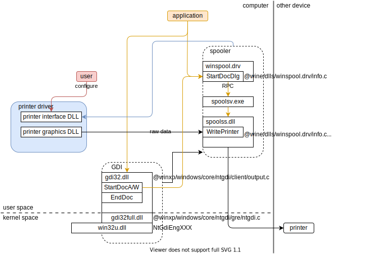

# 驱动安装包构成

参考ddk手册-Providing a Driver Package

* 驱动文件，`.dll`, `.sys`之类
* 指导安装的文件
  * `.inf`（information）
  * `.cat`（catalog）
  * co-installers
* 其他文件

# 打印驱动内部运作原理

2020.10.23

## GDI

windows vista and earlier version

GDI驱动运作原理图如下，

[GDI Printer Drivers](https://docs.microsoft.com/en-us/windows-hardware/drivers/print/gdi-printer-drivers)

All Windows 2000 and later printer drivers consist of the following components:

* A [printer graphics DLL](https://docs.microsoft.com/en-us/windows-hardware/drivers/print/printer-graphics-dll) that assists GDI in rendering a print job, and sends the rendered data stream to the print spooler.

  

  

* A [printer interface DLL](https://docs.microsoft.com/en-us/windows-hardware/drivers/print/printer-interface-dll) that provides both a user interface to the driver's configuration parameters, and an interface the spooler can call to notify the driver of print-related system events.

2020.11.19

### Notepad打印

## XPS

windows 7 and later version

2020.10.26

# TEMP

## 关键文件路径

**注**：我的windows10系统里的路径（因为是挂载到Linux访问的，所以采用的是Linux的路径风格）。

`C/Windows/System32/`

* `winspool.drv`
* `spoolss.dll`
* `spoolsv.exe`
* `gdi32.dll`

## [Print Spooler](https://docs.microsoft.com/en-us/windows/win32/printdocs/print-spooler)

A print job is defined (or bracketed) by the [**StartDoc**](https://docs.microsoft.com/en-us/windows/desktop/api/Wingdi/nf-wingdi-startdoca) and [**EndDoc**](https://docs.microsoft.com/en-us/windows/desktop/api/Wingdi/nf-wingdi-enddoc) functions.

数据类型

* EMF
* ASCII
* Raw

StartDoc EndDoc大概是很重要的API是EMF专用的？

### [Print Spooler API](https://docs.microsoft.com/en-us/windows/win32/printdocs/print-spooler-api)

**注**：临时图片，不保存进git仓库，最后将总结到总的原理图中，

分为3类API

#### [Print Spooler API Reference](https://docs.microsoft.com/en-us/windows/win32/printdocs/printing-and-print-spooler-reference)

#### [Asynchronous Printing Notification Reference](https://docs.microsoft.com/en-us/windows/win32/printdocs/asynchronous-printing-notification)

#### [Printer Driver Installation Reference](https://docs.microsoft.com/en-us/windows/win32/printdocs/printer-driver-installation-reference)

## GDI

### [About the GDI Print API](https://docs.microsoft.com/en-us/windows/win32/printdocs/about-the-gdi-print-api)

GDI => printer driver(DLL which support DDI (D))