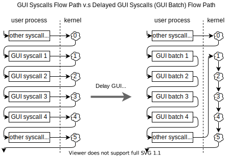

2020.12.29

## 延迟GUI系统调用

用户态在调用GUI系统调用前可以检测是否可以延迟这个GUI系统调用。
若可以延迟的话，可以将这个系统调用所要涉及的操作暂存。
等到某个合适的时机，在某个系统调用中顺带执行这些暂存的操作。

以绘制文字的函数`TextOut(W)`（位于srv03rtm/windows/core/ntgdi/client/output.c: 1970~2049）为例，
用户程序试图使用绘制文字的系统调用时有两个选择：

1. `GDI32!bBatchTextOut`

   延迟执行，

2. `GDI32!NtGdiExtTextOut(W)`

   立刻执行系统调用

延迟GUI系统调用是用户态和系统态配合完成的，其是否使用的决定权在用户态程序上。

TEB的。Windows内核在执行系统调用前会检查是否有积累的GUI“系统调用”，若有的话则先执行。

在`srv0rtm/base/ntos/ke/i386/trap.asm`

