<div style="text-align:right; font-size:3em;">2020.07.23</div>

## 编译

为了在gdb调试时能够查看glibc的源码，所以需要重新编译带符号(symbol)的glibc。

### x86-64上编译x86的glibc

编译的参数参考：[How to compile glibc 32bit on an x86_64 machine](https://stackoverflow.com/questions/8004241/how-to-compile-glibc-32bit-on-an-x86-64-machine)，

```shell
../../src/glibc-2.6/configure --prefix=$HOME/glibc32-2.6 \
     --host=i686-linux-gnu \
     --build=i686-linux-gnu \
     CC="gcc -m32" CXX="g++ -m32" \
     CFLAGS="-O2 -march=i686" \
     CXXFLAGS="-O2 -march=i686"
```

### mips上编译不使用延迟槽的glibc

2020.9.15

```shell
../glibc-2.20/configure --prefix=XXX \
     CFLAGS="-O2 -mabi=64 -fno-delayed-branch" \
     CXXFLAGS="-O2 -mabi=64 -fno-delayed-branch"
```

## 配置

这里的“配置”，即指，如何指定程序运行时使用的glibc库？包括动态链接器（ld.so）和诸多动态链接文件（.so）。

### 最直接的办法

单纯地将`/lib`里的文件符号链接到我需要的文件。

**注1**：动态链接器（ld.so或ld-linux.so）当需要加载动态链接库（.so）时按照`man ld.so`里的列举的目录的顺序进行搜索（😃`man ld.so`这个文档很有意思，描述了动态链接器的功能、运作方式、相关参数）。**经过实验发现**，尽管所需的.so文件名没有包含`/`，但是动态链接还会把所需的文件名当作相对路径，在自己的同级目录（真实目录，若动态链接器用了符号链接，即为符号链接的目标路径）下寻找这个.so文件。而linux里为了支持多个体系结构的libc库，都在`/lib`文件夹下建立了各个体系结构（各个ABI）的子文件夹。因此，动态链接器在搜索动态链接库的在搜索glibc的动态链接库时都无法在约定的`/lib`文件下找到需要的文件。而是在动态链接器自身所在的目录下以相对路径的方式找到需要的文件。**结论**：若要修改动态链接器的符号链接目标，需要确保新的动态链接器能找到动态链接库，要么按照`man ld.so`提及的目录设置（比如设置`LD_LIBRARY_PATH`环境变量），要么让动态链接器和动态链接库在同一目录，且确保动态链接库名字正确。

**注2**：`ld.so`搜索路径的顺序在glibc源码`elf/dl-load.c`文件中的`_dl_map_object`函数中清晰可见。（目前使用的glibc版本2.31）

### 系统性的方法

🤔🤔🤔有没有能够切换glibc库的软件？大概是`ldconfig`？怎么用？

## 库函数详细

### dlopen

dlopen的代码框架图如下，



上面dlopen的代码并没有直接完成任何`dlopen`的工作而是经过一层层包装，然后调用动态链接器`ld.so`提供的`dl_open_worker`函数。仔细一想，这样很有道理，因为`dlopen`要提供的功能是动态加载一个文件到内存了，这个和`ld.so`的目标完全一致，所以复用`ld.so`完完全全在情理之中。

接下来就是看`dlopen`实际工作的承担者——`dl_open_worker`，其代码框架图如下，

