<div style="text-align:right; font-size:3em;">2024.06.05</div>

# Decode

## PC?

### 初始化



...
* cpu/rtl/openC910.v:
  *   .pad_core_rst_b(core0_rst_b), ...   .pad_cpu_rst_b(cpurst_b),
* cpu/rtl/ct_top.v:
* rst/rtl/ct_rst_top.v:
  * assign async_corerst_b = pad_core_rst_b & pad_cpu_rst_b & !pad_yy_mbist_mode;
  * async_corerst_b
  * assign corerst_b =  pad_yy_scan_mode ? pad_yy_scan_rst_b : core_rst_ff_3rd;
  * TODO：为啥不直接写... begin ifurst_b <= corerst_b end ??? chatgpt没给我讲清楚。
    但它提到了同步复位和异步复位就该这么写。
    ```
    always @(posedge forever_coreclk or negedge corerst_b)
    begin
      if (!corerst_b)
        ifurst_b <= 1'b0;
      else 
        ifurst_b <= corerst_b;
    end
    ```
  * assign ifu_rst_b = pad_yy_scan_mode ? pad_yy_scan_rst_b : ifurst_b; 
    TODO：学习扫描链验证
...
* cpurst_b置0（后缀_b表示低电平有效：玄铁C910集成手册.pdf：命名规则）

### 生成PC
* ifu/rtl/ct_ifu_pcgen.v: output [62:0] ifu_mmu_va; output ifu_mmu_va_vld;
  * ifu_mmu_va[62:0]      = {ifu_mmu_va_high[23:0],if_pc[PC_WIDTH-2:0]};

