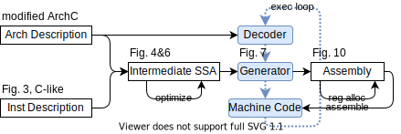
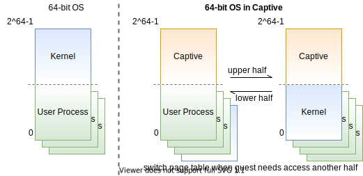

2021.01.19

硬件描述用的ArchC，是个独立的学术项目。
这极大增加了Captive的可信度！

2021.01.21

## 总体框架

## guest和host页大小

2.4章节提到了host guest页大小不匹配的问题。
这个问题的处理系统级模拟比用户级模拟方便得多。
不过为了调用硬件机制，还是非常有挑战！

## Captive虚拟地址空间

2.7.5章节

captive一直驻留在guest虚拟地址空间的高半部分。
guest操作系统若需要高半部分的访存需求，则切换专用页表应对高半部分。
在高半部分的虚拟页表中，guest高半部分的虚拟内存被映射到低半部分
（guest virtual address is masked before the memory instruction continues to keep it in the lower half of address space），
原理如下图，

为此需要付出的代价是，

* 在guest访存前要检测是否为高半部分，
* 高低半部分切换需要且页表需要刷tlb，
  利用PCID减少高低半部分的页表切换带来的刷TLB损失。

切到高半部分专用页表时，关于移动guest半还是captive半有两个方案，

1. guest高半部分映射到高半部分，captive挪到低半部分，
2. guest高半部分挪到第半部分，captive不做变化。

我觉得方案2（即captive采用的）更好。
因为host执行的代码都在captive的半部分
（包含captive的可执行代码和从guest翻译出来的代码），
这些代码的位置无关性无法保证。

2021.01.23

## 性能评估

## 相关工作

表6列了非常多二进制翻译工作和其亮点贡献。

表7列了和Captive相关的工作（应该是一个团队的）。
其中有一个Kernel-level DBT看起来让我感兴趣，

* Fast Dynamic Binary Translation for the Kernel
  
  提到了DBT用于Virtual Machine Monitor和instrumentation in the OS kernel，
  后者我不太懂，引用的文献如下，

  * Comprehensive kernel instrumentation via dynamic binary translation