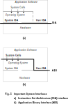

2019.11.20

难易程度：1/10

推荐：10/10

关键词：虚拟机，综述

特点：图示表意精准明确

Standord EE392C Reading List: 

# *(B)* J. Smith. [An Overview of Virtual Machine Architectures](../../../Essays/Stanford-Advanced_Topics_in_Computer_Architecture-Reading_List/2001.vm_intro.smith.pdf). University of Wisconsin, October 2001.

如题，这篇文章是对虚拟机的一个综述。

这篇文章的图画的很能够快速清晰的理解大段文字想要表达的内容。我觉得这是一篇优秀的综述文章需要具备的特质之一。

## 基础知识介绍

文章**清晰地**定义了ISA和ABI，

## “经典”虚拟机：复制

* **ABI级别的复制** - 至少不晚于ISA级别的复制

  即现在已经深入人心的多程序分时复用硬件资源（multiprogramming/multitasking）。

* **ISA级别的复制** - 1960s到1970s初期

  这种技术被称作Virtual Machine Monitor (VMM)。多个操作系统在VMM的管理下同时运行。

  **优势**：最浅显的即是在一套物理设备上能够支持诸多不同系统的应用程序。重要的一个优势，安全、隔离。

  **劣势**：当时（1970s初期）的技术还没能做到完全透明的虚拟化，需要许多体系结构特性来支持虚拟化。

## ABI虚拟机：翻译和优化

操作系统相同，但ISA不同。历史上典型的例子是Compaq FX!32 让x86 Windows程序跑在Alpha Windows上。

* 最直接的方式是**解释执行**（interpretation）。

* 为了更高性能的方式是**二进制翻译**（binary translation）。

## 全系统虚拟机：翻译

操作系统和ISA都不同。

## 高层次虚拟机：完全硬件平台无关

让应用程序独立于硬件平台。需要一个独立于硬件平台的虚拟机与配套的高级编程语言。

* Pascal
* Java

## Co-Designed VMs：Optimization

不知道怎么翻译这个标题。从本节内容看来是**设计专门用于运行虚拟机的硬件**，包括但不限于针对虚拟机的ISA、guest系统不可见的专用内存。典型的例子，

* IBM Daisy processor - guest ISA PowerPC
* Transmeta Crusoe - guest ISA Intel x86（正好斯坦福高级体系结构阅读清单里有一片关于Transmeta Crusoe的文章，*(F)* A. Klaiber. [The Technology Behind Crusoe Processors](2000.code_morphing.transmeta.pdf). Transmeta Technical Brief, 2000 ，下次就看这篇文章吧！）