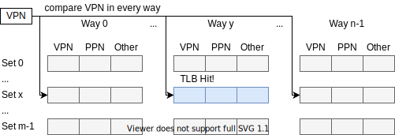

2021.07.26

## JTLB是啥

2015.mips32_3.pdf中多次提及的JTLB是啥？

## [DONE] MIPS的VTLB需要页表做何种调整？

TLB是页表的子集。页表分级确定后，页大小也就确定了。页表如何支持VTLB的变长页大小？

VTLB（或dual tlb）可参考：

* 2015.mips32_3.pdf
* 2015.dual_tlb.wang.master_thesis..pdf

2021.11.17：mips是以tlb为mmu的。页表只是辅助结构。调整装填tlb的代码即可。`ISA/mips/mips_mmu.drawio`

### 超大页（少一级也表）

VTLB的设计初衷：

> The existence of a VTLB retains the capability of using large pages to map large sections of physical memory
> without consuming a large number of entries in the FTLB.
>
> ...
>
> Most implementations would choose to build a VTLB with a smaller number of entries and a FTLB with a larger
> number of entries. This combination allows for many on-demand fixed-sized pages as well as for a small number of
> large address blocks to be simultaneously mapped by the MMU.

我理解的就是少用一级，变成超大页。

那VTLB如何和MMU合作的？（大概能猜到，超大页只能缓存进VTLB，普通页只能缓存进FTLB）

### [DONE] 16K页

内核维护一个小的大页页表，缺页异常时，内核去填VTLB。

2021.11.17：qemu的vtlb方案。

## TLB的组和路指啥

set, way

参考：

* http://www.cs.uni.edu/~diesburg/courses/cs3430_sp14/sessions/s14/s14_caching_and_tlbs.pdf
* 2020.amd64.pdf

